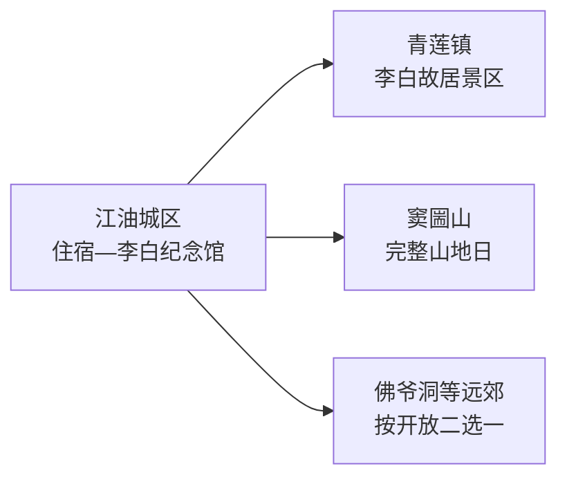
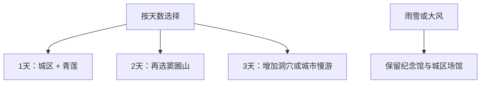

# 江油旅行指南

江油适合按“城区李白文化、青莲故里、山地景区”三层来选。第一次来可住江油城区：一天串联李白纪念馆与青莲，第二天在窦圌山、佛爷洞等远郊中选一处。这样既能读懂李白文化，也给山路和接驳留出余量。

> 建议停留：2–3 天  
> 旅行关键词：李白、青莲、诗歌、窦圌山、涪江、江油肥肠  
> 主要体力：城区低至中等；山地景区中至高  
> 最近研究：2026-08-13

## 城市速览

| 项目 | 旅行信息 |
|---|---|
| 主要旅行价值 | 用城区纪念馆与青莲故居理解李白文化，再选择一处龙门山前缘景区 |
| 建议停留 | 1 天李白文化；2 天加山地；3 天可增加博物馆、洞穴或乡村慢游 |
| 较舒适季节 | 春秋适合城区与山地；夏季注意雷雨，冬季关注结冰和索道运行 |
| 预算特点 | 城区场馆较友好；景区门票、索道、往返车辆和住宿是主要变量 |
| 步行强度 | 城区园林平缓；青莲有分散步行；窦圌山台阶与爬升明显 |
| 主要天气风险 | 高温、强降雨、山洪、滑坡、低温结冰和大风停运 |
| 独行旅行 | 城区与青莲可自行组合；山地日先确认返程和通信 |
| 亲子旅行 | 诗歌展陈与园林适合亲子；洞穴、索道和山地按年龄体力选择 |
| 长者与低体力旅行 | 以纪念馆、城区园林和车辆接驳为主，山地只走短线 |
| 无障碍信息 | 纪念馆可咨询场馆服务；古建、故居和山地设施连续性需向官方确认 |

## 城市格局与游览区域

GeoNames `1885823` 是江油城区居民点，关联薄聚居点实体 `Q29621992`；法定县级江油市采用 Wikidata `Q1359300` 与行政代码 `510781`，其 `P1566` 指向行政记录 `1784469`。本页保留固定城市点作为队列键，并按法定江油市域组织旅行内容。

| 区域 | 核心内容 | 怎么安排 | 取舍 |
|---|---|---|---|
| 江油城区 | 李白纪念馆、昌明河园林、餐饮与交通 | 住一晚，以步行和短途车为主 | 最适合作为多日基地 |
| 青莲镇 | 李白故居旅游景区与诗歌文化环境 | 与城区组成文化整日 | 两处是独立物理单位，分别核开放 |
| 窦圌山方向 | 山体、古建、索道与视野 | 单独整日 | 天气和索道决定路线长度 |
| 佛爷洞等远郊 | 洞穴、山水和经营项目 | 从一处正式开放景区中选择 | 不与窦圌山强拼同日 |
| 龙门山生态与生产空间 | 林地、河谷、矿产和乡村道路 | 使用公开景区与乡村接待点 | 保护地、矿区、施工便道保留明确限制 |

## 主要景点

### 李白文化

| 景点 | 所在片区 | 类型 | 核心看点 | 建议用时 | 室内/室外 | 体力 | 预约 | 天气影响 | 优先级 |
|---|---|---|---|---|---|---|---|---|---|
| 江油市李白纪念馆 | 城区昌明河畔 | 纪念馆与园林 | 诗集版本、书画、碑刻、研究展陈和园林 | 2–3 小时 | 混合 | 低至中 | 中 | 中 | A |
| 江油李白故居旅游景区 | 青莲镇 | 故居遗迹与文化景区 | 陇西院、太白祠等遗迹及青莲文化环境 | 3–4 小时 | 混合 | 中 | 中至高 | 中 | A |
| 江油市博物馆或当期城市展馆 | 城区 | 综合博物馆 | 地方历史、文物与城市发展 | 1.5–2 小时 | 室内 | 低 | 中 | 低 | B |

### 山地与远郊

| 景点 | 所在片区 | 类型 | 核心看点 | 建议用时 | 室内/室外 | 体力 | 预约 | 天气影响 | 优先级 |
|---|---|---|---|---|---|---|---|---|---|
| 窦圌山景区 | 武都方向 | 山地与古建 | 山体、古建、步道和高处视野 | 5–7 小时 | 室外为主 | 高 | 高 | 很高 | A |
| 佛爷洞景区 | 大康方向 | 溶洞与山水 | 洞穴地貌、经营游线与周边山水 | 4–6 小时 | 混合 | 中至高 | 高 | 高 | B |
| 养马峡等季节性山地景区 | 远郊山地 | 山水与休闲 | 河谷、林地和季节活动 | 4–6 小时 | 室外 | 中 | 高 | 很高 | C |

李白纪念馆与青莲故居可以同日串联，但各自按完整单位参观。山地景区按一日一处安排，优先确认天气、索道、洞穴项目、森林防火和返程。

## 美食与餐饮

| 类型 | 适合场景 | 份量 | 过敏原与注意 | 怎么选 |
|---|---|---|---|---|
| 江油红烧肥肠 | 城区午晚餐 | 小份配饭适合一人，多菜适合共享 | 猪内脏、油脂、豆瓣、辣椒和花椒 | 先问肥瘦、辣度和小份 |
| 江油米粉 | 早餐 | 一人一碗 | 骨汤、肉臊、辣椒、花生或芝麻 | 清汤与红汤分开选，调料可另放 |
| 川北家常菜 | 多人正餐 | 2–4 人按人数点菜 | 猪油、豆瓣、花椒、坚果和酱油 | 用一荤一素一汤起步 |
| 青莲镇简餐 | 文化路线中段 | 以补给为主 | 营业时间与选择少于城区 | 先确认营业，再把晚餐留回城区 |

## 经典行程

### 一日经典：李白文化双点线

- **路线**：李白纪念馆 → 城区午餐 → 青莲镇李白故居旅游景区 → 江油城区。
- **串联逻辑**：从收藏研究走向故居环境，形成完整主题。
- **预约锚点**：以两处场馆中规则较严格者为准，并确认青莲接驳。
- **休息安排**：城区午餐坐席休息，青莲游览中段补水。
- **时间不足时**：保留李白纪念馆，青莲顺延。

### 两日组合：文化加窦圌山

- **路线**：第 1 天李白文化；第 2 天江油城区 → 窦圌山 → 返回城区。
- **串联逻辑**：城市人文与山地景观分日完成。
- **预约锚点**：核对窦圌山门票、索道、天气和末班交通。
- **休息安排**：山地日使用景区服务区长休息，返程后再用晚餐。
- **时间不足时**：走景区核心短线，取消额外远点。

### 三日深度

- **路线**：前两日按上；第 3 天城区博物馆 → 午餐 → 佛爷洞或城市河岸慢游二选一。
- **适用条件**：有完整第三天并已确认远郊开放者。
- **预约锚点**：佛爷洞项目和接驳优先，城市慢游则核场馆开放。
- **休息安排**：远郊日安排坐席午餐；城区方案留午休。
- **时间不足时**：第三天只做城区博物馆和餐饮。

### 雨天路线

- **路线**：李白纪念馆 → 午餐 → 市博物馆或室内文化空间。
- **适用条件**：城区交通正常的普通降雨。
- **预约锚点**：确认闭馆日与临时活动。
- **休息安排**：两馆之间车辆接驳并留午休。
- **时间不足时**：只留李白纪念馆。

### 亲子路线

- **路线**：李白纪念馆亲子讲解 → 午餐 → 青莲故居核心区。
- **串联逻辑**：用诗歌故事和实地环境建立联系。
- **预约锚点**：询问亲子讲解、活动年龄和团队预约。
- **休息安排**：午后先休息，再进入青莲。
- **时间不足时**：只选纪念馆园林与核心展。

### 长者与低体力路线

- **路线**：李白纪念馆核心展 → 城区午餐 → 昌明河平缓短段。
- **适用与减负**：车辆直达场馆附近，删去山地和长距离故居步行。
- **预约锚点**：询问轮椅、座椅、卫生间和最近落客点。
- **休息安排**：每 60–90 分钟安排坐席休息。
- **时间不足时**：单点慢游纪念馆。

### 远郊山地一日

- **路线**：窦圌山、佛爷洞或养马峡中选择一处完整游览。
- **适用条件**：天气稳定、景区开放并已落实返程。
- **预约锚点**：核对索道、洞穴项目、林区防火和道路。
- **休息安排**：在正式服务区补水和用餐。
- **时间不足时**：走运营方推荐短线，不跨景区赶点。

## 住宿区域

| 区域 | 优点 | 取舍 | 适合人群 | 预订建议 |
|---|---|---|---|---|
| 江油城区 | 餐饮、纪念馆、铁路和叫车集中 | 去山地仍需接驳 | 首次到访、无车旅行 | 优先安静街区与稳定前台 |
| 江油站或高铁交通片区 | 抵离方便 | 夜间体验较弱 | 晚到早走 | 核对完整站名和夜间交通 |
| 山地景区周边 | 便于早入园 | 选择和退改更受季节影响 | 自驾、摄影、慢游 | 核实资质、供餐、供暖与停车 |

## 市内交通

江油有铁路门户，城区到青莲、窦圌山和佛爷洞分别是不同方向。先到城区再分线，比从绵阳主城连续往返多个江油远点更从容。

| 场景 | 怎么走 | 核对事项 |
|---|---|---|
| 铁路抵达 | 按票面完整站名抵达江油，再转城区交通 | 车次、站点、重点旅客服务和夜间接驳 |
| 城区—青莲 | 公交、出租车、网约车或正规包车 | 往返班次、最晚返程、故居入口 |
| 城区—山地 | 自驾、正规包车或景区当期接驳 | 路况、停车、索道、返程和天气 |
| 绵阳联程 | 铁路或公路换城，住宿按次日目的地选择 | 不把江油景区当作绵阳主城短途通勤 |

## 不同旅行者须知

| 旅行者 | 推荐做法 | 需要留意 | 行前确认 |
|---|---|---|---|
| 独行 | 住城区，文化线自行走，山地用正规交通 | 远郊返程和信号 | 车辆、末班、保险和紧急联系人 |
| 亲子 | 诗歌文化线加短段园林 | 山地护栏、洞穴湿滑和索道规则 | 年龄、身高、讲解、卫生间 |
| 长者或低体力 | 城区场馆和河岸短线 | 古建台阶与山地爬升 | 落客点、轮椅、座椅和电梯 |
| 山地旅行 | 一日一景区，按天气选长短线 | 地灾、雷电、结冰和森林防火 | 气象、道路、索道和救援 |
| 摄影 | 园林、青莲和山地晨昏 | 文物、无人机和林区规定 | 拍摄、禁飞、开放与日落返程 |

## 行前核对

| 事项 | 为什么重查 | 时间 | 官方入口 |
|---|---|---|---|
| 李白纪念馆 | 开放、展览、预约和讲解会调整 | 确定日期后及前一日 | [江油市李白纪念馆](https://www.lbjng.cn/) |
| 青莲故居与山地景区 | 票务、项目、索道和接驳变化 | 订房前及当天 | [江油市人民政府](https://www.jiangyou.gov.cn/) |
| 铁路 | 车次与重点旅客服务动态变化 | 购票时及出发前 | [中国铁路12306](https://www.12306.cn/) |
| 强降雨与地灾 | 影响龙门山前缘道路和景区 | 出发前三日及当天 | [四川省气象局](https://sc.cma.gov.cn/) |

## 来源与更新记录

### 主要来源

| 来源 | 类型 | 支持内容 | 核验日期 |
|---|---|---|---|
| [江油市李白纪念馆](https://www.lbjng.cn/) | 场馆官网 | 开放公告、展陈、收藏和服务 | 2026-08-13 |
| [李白纪念馆概况](https://lbjng.cn/gk/) | 场馆官网 | 馆园性质、等级和收藏主题 | 2026-08-13 |
| [四川省情网：江油风景名胜](https://www.scsqw.cn/scdqs/sxdq/mys/jys1) | 省级地方志 | 青莲、窦圌山等属地与历史线索 | 2026-08-13 |
| [江油全域旅游与民宿规划](https://mysjys.sczwfw.gov.cn/module/download/downfile.jsp?classid=0&filename=b5212878e0db488fb41a329850e16c09.pdf) | 官方规划 | 市域旅游空间、住宿与乡村发展 | 2026-08-13 |
| [民政部行政区划代码查询](https://dmfw.mca.gov.cn/xzqh/getList?code=510781&trimCode=false&maxLevel=3) | 国家行政区划数据 | 法定代码 `510781` | 2026-08-13 |
| [GeoNames 1885823](https://www.geonames.org/1885823/) | 开放地理数据 | 固定江油城市点 | 2026-08-13 |
| [Wikidata Q1359300](https://www.wikidata.org/wiki/Q1359300) | 开放结构化数据 | 法定江油市与行政记录粒度 | 2026-08-13 |

### 更新记录

| 日期 | 更新内容 |
|---|---|
| 2026-08-13 | 首次完成江油独立旅行研究；按城区李白文化、青莲故居和山地整日组织路线，并补充父景区去重、地灾、林区、交通与无障碍边界。 |
