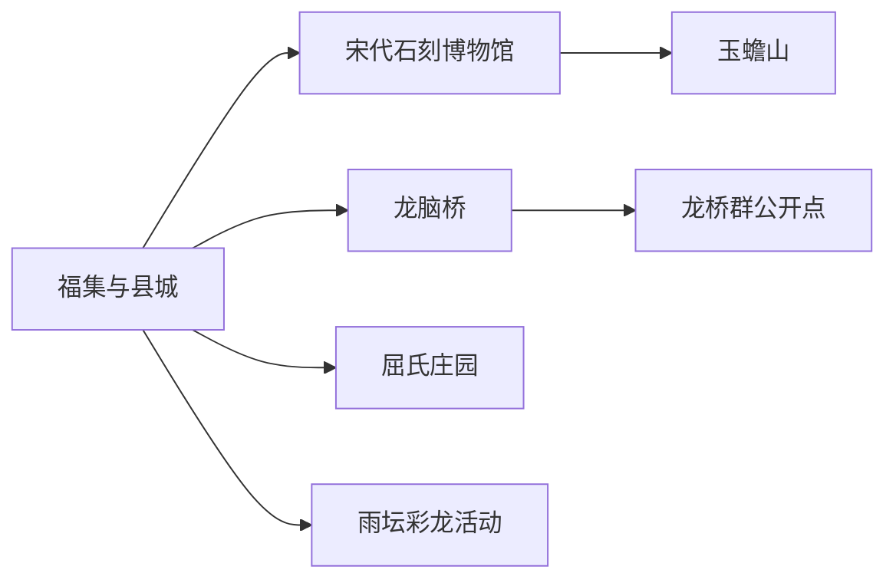
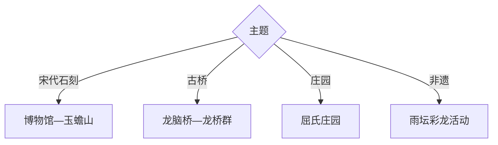

# 泸县旅行指南

泸县以宋代石刻和遍布乡野的龙桥群形成鲜明主题，玉蟾山把摩崖造像、县城休闲和石刻博物馆连接起来。首访可用一天走县城—玉蟾山，第二天选择龙脑桥与龙桥群、屈氏庄园或乡村非遗。

## 城市速览

| 项目 | 信息 |
|---|---|
| 主线 | 福集县城—宋代石刻博物馆—玉蟾山—龙脑桥—龙桥群 |
| 停留 | 石刻核心1天；乡野古桥再加1天 |
| 住宿 | 福集县城便于交通，泸州主城适合跨市域联程 |
| 交通 | 从泸州或铁路站点转公路，乡村文物点用预约车或自驾 |
| 风险 | 暴雨地灾、石阶湿滑、乡村窄路、文物开放和白酒生产交通 |
| 边界 | 石刻保护区、酒窖生产区、庄园非开放房间、农田和桥下河道按管理范围进入 |

## 城市格局与游览区域

固定 `Fuji / GeoNames 1811028` 对应原福集镇、现县城片区，本页以法定泸县 `Q1341978` 组织。玉蟾山靠近县城，龙桥群散布多个乡镇，适合先锁定一至两座开放文物点再排车辆。

## 主要景点

| 景点 | 区域 | 类型 | 核心体验 | 用时 | 环境 | 体力 | 预约风险 | 天气影响 | 优先级 |
|---|---|---|---|---:|---|---|---|---|---|
| 泸县宋代石刻博物馆 | 县城 | 专题博物馆 | 宋墓石刻、社会生活与地方艺术 | 2–4小时 | 室内 | 低 | 很高 | 低 | A |
| 玉蟾山景区 | 县城近郊 | 山地石刻 | 明代摩崖造像、山林与县城视野 | 3–6小时 | 室外 | 中高 | 很高 | 极高 | A |
| 龙脑桥 | 奇峰方向 | 古桥文物 | 明代石梁桥、龙雕与水利交通 | 1–2小时 | 室外 | 低中 | 很高 | 极高 | A |
| 泸县龙桥群当期开放点 | 多乡镇 | 古桥群 | 明清石桥、雕刻与乡村水系 | 半日至1天 | 室外 | 中 | 极高 | 极高 | A |
| 屈氏庄园 | 方洞方向 | 庄园建筑 | 川南庄园、乡绅生活与建筑防御 | 2–4小时 | 室内外 | 低中 | 极高 | 中 | B |
| 罗盘嘴宋墓群相关展陈 | 县内 | 墓葬考古 | 宋代墓葬、石刻与区域文化 | 1–3小时 | 室内外 | 中 | 极高 | 高 | B |
| 雨坛彩龙正规展演 | 雨坛方向 | 非遗 | 彩龙表演、仪式与地方社区 | 1–3小时 | 室内外 | 低中 | 极高 | 中 | B |
| 泸县酒文化公开展陈 | 县内 | 产业文化 | 川南白酒、窖池历史与酿造知识 | 2–3小时 | 室内 | 低 | 极高 | 低 | C |

## 美食与餐饮

可尝泸县豆花、烧白、白糕、川南河鲜和家常菜。点鱼先确认来源、重量和价格；白酒品鉴控制量，并与驾驶和山地活动分开。乡村线路提前确认午餐，避免临时进入生产酒厂或私人农家。

## 经典行程

### 一日经典线
**路线**：宋代石刻博物馆—玉蟾山。**逻辑**：先看系统展陈，再到山中观察石刻环境。**预约锚点**：博物馆与景区。**休息**：县城。**删除条件**：雨天石阶湿滑时只留博物馆。

### 两日龙文化线
**路线**：首日石刻核心；次日龙脑桥—另一座正式开放龙桥。**逻辑**：博物馆石刻与乡野桥梁分日。**预约锚点**：文物开放、讲解和车辆。**休息**：沿线镇区。**删除条件**：河流水位异常时只留龙脑桥外围安全点。

### 三日庄园非遗线
**路线**：前两日基础线；第三日屈氏庄园—雨坛彩龙当期活动。**逻辑**：建筑与非遗围绕实际开放组织。**预约锚点**：庄园、演出日期和车辆。**休息**：县城。**删除条件**：无演出时只留庄园。

### 雨天博物线
**路线**：宋代石刻博物馆—县级公共文化场馆—正规酒文化展陈。**逻辑**：室内内容保持石刻与地方产业主线。**预约锚点**：三处开放。**休息**：县城。**删除条件**：暴雨预警时减少跨乡镇移动。

### 亲子龙桥线
**路线**：石刻博物馆—龙脑桥安全观景点—县城公园。**逻辑**：用雕刻细节和桥梁结构做直观科普。**预约锚点**：讲解、道路和儿童安全。**休息**：县城。**删除条件**：河岸湿滑时只留博物馆。

### 乡野文物线
**路线**：县城—龙桥群一至两处开放点—屈氏庄园。**逻辑**：同日点位按实际道路就近组合。**预约锚点**：文保管理、车辆与返程。**休息**：沿线镇区。**删除条件**：无法确认开放时不进入文物本体。

### 低体力线
**路线**：宋代石刻博物馆—车辆到玉蟾山近入口公开点—午休。**逻辑**：以展馆和短距离观景控制爬升。**预约锚点**：落客、座椅和无障碍。**休息**：县城。**删除条件**：山地段负担较大时只留博物馆。

## 住宿区域

福集县城适合博物馆、玉蟾山和次日乡村换线；泸州主城适合铁路航空与其他县区联程；龙桥群沿线住宿只在正规接待确认后选择。自驾预订关注停车、夜间道路和酒后交通安排。

## 市内交通

泸县站、泸州站与县城之间需按实际车次接驳。县城核心可公交和出租车，龙桥群分散，预约车或自驾更合适。导航目的地应核对文物全名、乡镇和正式入口，雨季避开低洼桥下及河道。

## 不同旅行者须知

石刻爱好者优先博物馆与玉蟾山；建筑爱好者预约龙桥群和屈氏庄园；亲子家庭选择一桥一馆；低体力旅行者留在县城。文物保护范围、墓葬工作区、酒窖生产线、农田和河道保留明确限制。

## 行前核对

- 核对石刻博物馆、玉蟾山、龙脑桥、其他龙桥、屈氏庄园与非遗活动。
- 核对暴雨地灾、河流水位、乡村道路、客运和返程车辆。
- 文物点沿正式入口参观，酒文化只选择公开展厅和接待线路。

## 来源与更新记录

| 来源 | 支持内容 | 核验日期 |
|---|---|---|
| [四川省地方志：泸县玉蟾山与龙脑桥](http://scdfz.sc.gov.cn/upload/main/contentmanage/article/file/201701161152091833.pdf) | 玉蟾山石刻、龙脑桥与县域文化 | 2026-09-01 |
| [四川省文旅厅：A级景区名录入口](https://wlt.sc.gov.cn/scwlt/c100297/introduce.shtml) | 泸县景区身份与主管部门核对入口 | 2026-09-01 |
| [GeoNames 1811028](https://www.geonames.org/1811028/) | Fuji 固定城市点 | 2026-09-01 |
| [Wikidata Q1341978](https://www.wikidata.org/wiki/Q1341978) | 泸县实体与跨库标识 | 2026-09-01 |

| 日期 | 更新 |
|---|---|
| 2026-09-01 | 首次完成泸县旅行研究，按宋代石刻、龙桥群、庄园与非遗组织。 |
