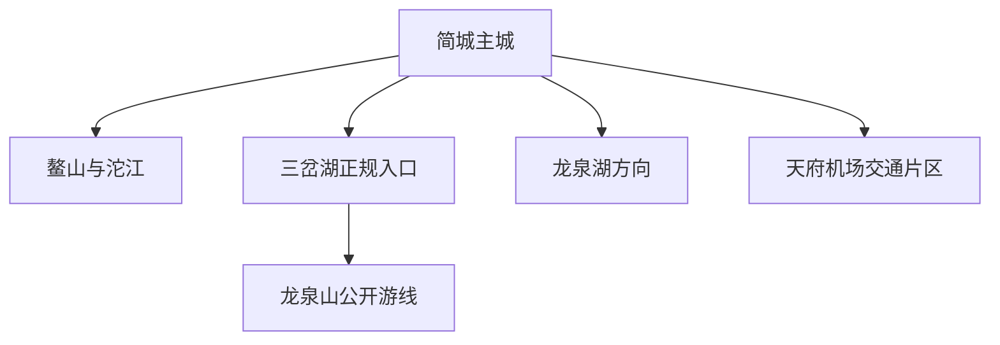
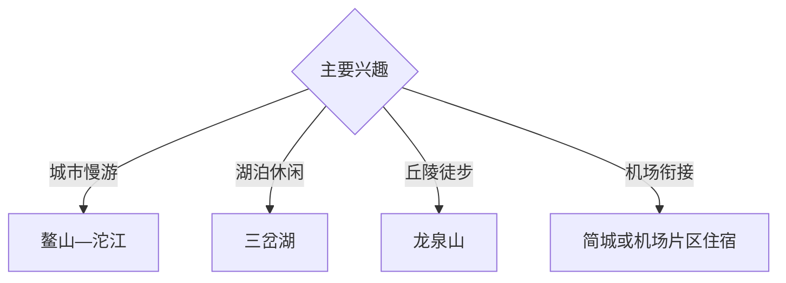

# 简阳旅行指南

简阳位于成都东部、沱江中游，以简城主城、鳌山公园、沱江城市生活、三岔湖与龙泉山丘陵形成湖城与成都东部门户旅行体系。固定快照中的 **Jiancheng / GeoNames 1806124** 锚定简城主城；三岔湖、龙泉湖和天府机场周边属于不同管理与交通片区，按实际入口分别核对。

## 城市速览

| 项目 | 信息 |
|---|---|
| 主线 | 简城主城—鳌山—沱江—三岔湖—龙泉山乡村 |
| 停留 | 简城1天；三岔湖或山地另留1天 |
| 住宿 | 简城适合城市体验；机场与湖区按次日交通选择 |
| 交通 | 高铁、公路和航空门户齐全，跨片区预留接驳时间 |
| 季节 | 春秋适合湖区丘陵；夏季关注雷雨、水位和高温 |
| 预算 | 主城灵活，湖区车辆、正规船务和机场住宿增加预算 |

## 城市格局与游览区域

简城承担传统主城、铁路和餐饮；三岔湖位于西南方向，部分周边空间纳入成都东部新区管理，导航时以具体入口和运营主体为准；机场是交通设施而非连续景区。水库水源保护范围、岛屿非开放区、航道、机场净空与施工区按正式管理边界进入。

## 主要景点

| 景点 | 区域 | 类型 | 核心体验 | 用时 | 环境 | 体力 | 研究价值 | 拥挤 | 优先级 |
|---|---|---|---|---:|---|---|---|---|---|
| 鳌山公园公开区 | 简城 | 城市山体与休闲 | 登高、城市视野和本地生活 | 半天 | 室外 | 中 | 中高 | 周末中 | A |
| 沱江公共滨水空间 | 简城 | 河流与城市 | 江景、桥梁和城市慢行 | 2–3小时 | 室外 | 低 | 中高 | 晚间中 | A |
| 简阳公共文化场馆 | 简城 | 文博与城市 | 地方史、公共文化和城市发展 | 2小时 | 室内 | 低 | 高 | 中 | A |
| 三岔湖正规游览区 | 三岔方向 | 湖泊与水库 | 岛屿湖景、水库地貌和休闲观景 | 半天至1天 | 室外 | 低中 | 高 | 节假日中高 | A |
| 龙泉山城市森林公园开放点 | 西部丘陵 | 山地与生态 | 丘陵、观景和郊野步道 | 半天 | 室外 | 中 | 高 | 周末中 | B |
| 龙泉湖正规公共游览点 | 石盘方向 | 湖泊与生态 | 湖岸、丘陵和低强度休闲 | 半天 | 室外 | 低 | 中高 | 周末中 | B |
| 正规羊肉饮食体验 | 简城 | 饮食与城市文化 | 简阳羊肉汤、市场与季节饮食 | 1–2小时 | 室内 | 低 | 中高 | 冬季高 | B |

## 美食与餐饮

简阳羊肉汤是主要饮食主题，也可搭配川中小吃、河鲜和家常川菜。选择明码标价的正规门店；湖区水产核对合法来源，冬至等高峰期提前错峰。

## 经典行程

### 简城经典线
**路线**：公共文化场馆—主城餐饮—鳌山—沱江岸线。**逻辑**：用一天理解传统主城与河流格局。**预约锚点**：场馆开放。**休息**：简城。**删除条件**：高温时将户外段移至傍晚。

### 三岔湖一日线
**路线**：简城—正规游客入口—开放湖岸—返程。**逻辑**：独立一天处理跨片区交通和湖区尺度。**预约锚点**：入口、停车和船务。**休息**：游客服务点。**删除条件**：大风、雷雨、高水位或管制时取消水上段。

### 龙泉山半日线
**路线**：主城—公园正式入口—开放步道—返程。**逻辑**：以半天体验成都东部丘陵。**预约锚点**：入口和防火公告。**休息**：公园服务点。**删除条件**：雷雨、山火风险或步道关闭时改主城。

### 龙泉湖轻松线
**路线**：简城—正规湖岸公共点—石盘方向餐饮—返程。**逻辑**：选择平缓岸线完成低体力湖景体验。**预约锚点**：具体入口。**休息**：正规服务点。**删除条件**：岸线施工或水源管理调整时顺延。

### 羊肉饮食线
**路线**：主城市场观察—正规羊肉汤门店—沱江散步。**逻辑**：用半天连接城市饮食与日常生活。**预约锚点**：高峰营业和排队。**休息**：主城。**删除条件**：饮食偏好不合时改川中小吃。

### 机场过渡线
**路线**：天府机场—住宿片区—简城或附近公共空间。**逻辑**：按抵离时刻选择低风险短线。**预约锚点**：航班与接驳。**休息**：机场或酒店。**删除条件**：转机时间短时只保留机场内活动。

### 两日组合线
**路线**：首日简城；次日三岔湖或龙泉山。**逻辑**：城市与湖山分日。**预约锚点**：次日入口和天气。**休息**：简城连续住宿。**删除条件**：一天时保留主城或三岔湖其一。

## 住宿区域

简城适合城市游览和铁路接驳；天府机场周边适合早晚航班；三岔湖正规住宿适合湖区慢游。订房核对行政地址、实际车程、停车、消防、早餐和航班变更退改。

## 市内交通

简阳南站、简阳站与天府机场分处不同片区，购票时核对完整站名。三岔湖和龙泉湖使用具体入口导航；水上活动选择合规码头、持证船舶与救生设施齐备的运营方。

## 不同旅行者须知

亲子和长者选择简城、湖岸平缓段与公共场馆；徒步者按天气进入龙泉山；转机旅客以交通冗余为先；摄影者提前核对湖区开放。水源保护范围、非开放岛屿、机场净空与运行区、航道和建设工地保留明确限制。

## 行前核对

- 核对三岔湖、龙泉湖和龙泉山具体入口及管理主体。
- 核对铁路站点、机场接驳、返程和住宿实际位置。
- 核对正规船务、救生设施、水位和风浪公告。
- 核对雷雨、山洪、森林防火、高温与航班动态。

## 来源与更新记录

| 来源 | 支持内容 | 核验日期 |
|---|---|---|
| [三岔湖旅游度假区](https://www.sanchahu.cn/) | 三岔湖当前旅游服务与开放动态入口 | 2026-09-03 |
| [四川省政府驻重庆办：简阳湖区项目](https://www.sczyb.com/newsshow235.html) | 三岔湖、龙泉湖与滨湖空间关系 | 2026-09-03 |
| [GeoNames 1806124](https://www.geonames.org/1806124/) | Jiancheng 固定人口点与简阳主城位置 | 2026-09-03 |

