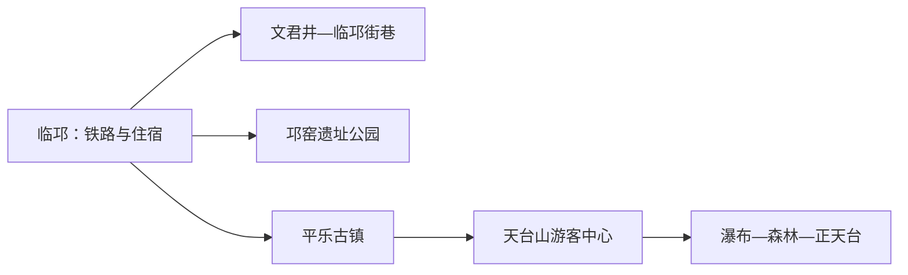
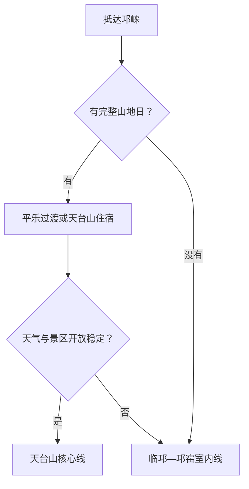

# 邛崃旅行指南

邛崃从临邛古城、文君文化和邛窑遗址向西南延伸至平乐古镇，再进入天台山森林与瀑布。主城、古镇和山地不是连续步行区，最稳妥的节奏是主城半日至一日、平乐一日、天台山一至两日。

## 城市速览

| 项目 | 信息 |
|---|---|
| 旅行主线 | 临邛古城—文君井、邛窑遗址公园、平乐古镇、天台山 |
| 建议停留 | 1 天选主城或平乐；2 天加入天台山；深度山地 3 天 |
| 住宿基地 | 临邛便于铁路与城市服务；平乐适合古镇慢游；天台山用于早晚山景 |
| 步行强度 | 主城低至中；古镇石板路中等；天台山中至高 |
| 主要天气 | 暴雨、山洪、地质灾害、森林火险、暑热与冬季湿冷结冰 |
| 预约核心 | 天台山开放与景交、古镇活动、场馆和返程 |
| 边界重点 | 世界遗产地、森林、河道、古窑址和农业生产区按管理范围进入 |
| 无障碍 | 主城较易减步行；古镇和山地需先问落客、台阶与接驳 |

## 城市格局与游览区域

邛崃是成都市代管的县级市，法定代码 `510183`。固定 GeoNames `1803365` 名为 Linqiong，代表临邛主城；Wikidata `Q1209143` 对应邛崃市。铁路和公共服务集中在临邛，平乐位于西南，天台山更深处，适合顺方向推进而非当天反复折返成都。

| 区域 | 旅行价值 | 怎么安排 |
|---|---|---|
| 临邛主城 | 文君文化、城市历史、餐饮与交通 | 半日至一日 |
| 邛窑方向 | 古窑址、考古与陶瓷文化 | 与主城同日 |
| 平乐古镇 | 川西水乡、古街、古桥与茶马古道线索 | 留半日至一日 |
| 天台山 | 森林、瀑布、步道、季节花卉与萤火虫活动 | 独立一至两日 |

## 主要景点

| 景点 | 所在区域 | 类型 | 核心看点 | 建议用时 | 室内/室外 | 体力 | 预约难度 | 天气敏感度 | 适合旅程 |
|---|---|---|---|---|---|---|---|---|---|
| 文君井与临邛街巷 | 主城 | 历史街区与文化 | 卓文君、司马相如叙事与古城生活 | 2–3 小时 | 混合 | 低至中 | 低 | 中 | A |
| 邛窑考古遗址公园 | 主城近郊 | 考古与陶瓷 | 邛窑遗址、彩瓷发展与考古展示 | 2–4 小时 | 混合 | 中 | 中高 | 中 | A |
| 平乐古镇 | 平乐镇 | 古镇与水乡 | 白沫江、古街、乐善桥与川西聚落 | 3–6 小时 | 室外为主 | 中 | 中 | 高 | A |
| 天台山景区 | 天台山镇 | 山地与森林 | 三级台地、瀑布、森林栈道与溪谷 | 6–10 小时 | 室外 | 中至高 | 高 | 极高 | A |
| 红军长征邛崃纪念馆开放区 | 高何方向 | 历史与纪念地 | 长征史、石塔寺及地方红色文化 | 2–4 小时 | 混合 | 中 | 中高 | 高 | B |
| 竹溪湖等正式开放项目 | 市域西部 | 湖泊与休闲 | 湖山景观与当期运营活动 | 半日至一日 | 室外为主 | 中 | 高 | 极高 | B |

天台山是受保护的森林与世界遗产组成区域，萤火虫观赏以官方开放点和当期活动为准，使用低干扰照明并服从夜间游线。河道涨水、森林防火或地质预警出现时，山地段按公告调整。

## 美食与餐饮

| 类型 | 适合场景 | 份量 | 过敏与饮食提示 | 怎么选 |
|---|---|---|---|---|
| 奶汤面 | 临邛早餐 | 一人份 | 麸质、猪肉、骨汤和葱花 | 先问汤底与浇头 |
| 钵钵鸡与川味小吃 | 主城简餐 | 可一人少量选串 | 辣椒、芝麻、花生、大豆和禽肉 | 选择明码计价、可分辣度的店 |
| 邛崃黑茶与茶点 | 古镇休息 | 可分享 | 咖啡因、糖和坚果 | 选能说明茶种与冲泡方式的茶馆 |
| 山地农家菜 | 平乐或天台山 | 多人共享更合适 | 腊肉、菌类、野菜来源和共锅 | 选景区内或证照清楚的经营点 |

## 经典行程

### 一日古城与邛窑路线

**路线**：文君井—临邛街巷 → 午餐 → 邛窑考古遗址公园

- **串联逻辑**：从城市传说进入有物证支撑的陶瓷史。
- **预约锚点**：邛窑展陈、讲解与闭馆日。
- **休息安排**：主城午餐后再前往遗址。
- **时间不足时**：保留邛窑核心展线与文君井短段。

### 两日古镇山水路线

**第 1 天**：临邛—邛窑—平乐入住 
**第 2 天**：天台山一日—原住宿地返程

- **串联逻辑**：沿主城、古镇、山地方向顺行。
- **预约锚点**：天台山门票、景交、住宿与返程。
- **休息安排**：平乐承担过夜和节奏转换。
- **时间不足时**：删除主城补充点，保留平乐与天台山。

### 平乐慢游路线

**路线**：古镇入口 → 白沫江公共游线 → 古街与乐善桥 → 午休 → 茶马古道正式开放短段

- **适用条件**：河流水位和古道开放稳定。
- **预约锚点**：活动、古道入口与返程。
- **休息安排**：午后在正规茶馆避热避雨。
- **时间不足时**：保留古街、河岸公共段与古桥。

### 雨天路线

**路线**：邛窑室内展陈 → 午餐 → 临邛一处室内文化空间

- **适用条件**：普通降雨且城区交通正常；地质预警时取消山地与古道。
- **预约锚点**：场馆开放和道路公告。
- **休息安排**：两处之间安排完整午休。
- **时间不足时**：只保留邛窑展陈。

### 亲子路线

**路线**：邛窑考古遗址公园 → 午休 → 平乐古镇平缓短段

- **串联逻辑**：陶瓷学习与水乡观察兼顾，户外强度可控。
- **预约锚点**：儿童活动、推车路线与卫生间。
- **休息安排**：正午转室内或茶馆。
- **时间不足时**：保留邛窑。

### 低体力路线

**路线**：车辆到达文君井附近 → 主城短段 → 午餐长休 → 平乐近入口公共空间

- **适用条件**：门到门车辆和落客位置已落实。
- **预约锚点**：古镇石板、轮椅、座椅与返程。
- **休息安排**：每段控制在一小时左右。
- **时间不足时**：主城和平乐二选一。

### 天台山延伸路线

**路线**：景区住宿或早到游客中心 → 景交与开放步道 → 瀑布森林核心段 → 原路返回

- **适用条件**：天气、地质风险、防火和最晚景交稳定。
- **预约锚点**：准确入口、景交、步道、住宿与夜间活动。
- **休息安排**：在正式服务点补给并减少连续爬升。
- **时间不足时**：只走官方半日线，或整段顺延。

## 住宿区域

| 区域 | 优点 | 取舍 | 适合人群 | 核对项 |
|---|---|---|---|---|
| 临邛主城 | 铁路、餐饮和城市服务完整 | 去天台山仍有较长接驳 | 首访、公共交通旅行 | 车站接驳、隔音、早餐与夜间入住 |
| 平乐古镇 | 古镇早晚安静，便于继续向山地 | 节假日客流和噪声波动 | 古镇慢游、亲子 | 合法经营、停车、防潮和退改 |
| 天台山正规住宿 | 接近早晚山景和步道 | 天气、供给与道路敏感 | 徒步、摄影 | 景区位置、景交、消防、供暖与最晚入住 |

## 市内交通

| 场景 | 怎么做 | 行前核对 |
|---|---|---|
| 铁路到达 | 邛崃站转公交、出租或住宿接驳 | 车次、站前接驳与末班 |
| 主城—平乐—天台山 | 顺方向使用旅游客运、公交或正规包车 | 班次、停靠点、行李与返程 |
| 山地内部 | 按景区景交和开放步道移动 | 景交末班、步道关闭与夜间规则 |
| 成都联游 | 预留完整邛崃日，山地过夜更稳妥 | 往返车次、成都到发站与末段接驳 |

## 不同旅行者须知

| 旅行者 | 推荐做法 | 重点核对 |
|---|---|---|
| 独行 | 住临邛或平乐，先锁定天台山返程 | 山地通信、夜间活动和车辆资质 |
| 亲子 | 邛窑加平乐，天台山选择短线 | 亲水规则、推车、护栏和卫生间 |
| 长者与低体力 | 主城与古镇分段，山地使用景交 | 石板、台阶、轮椅和落客 |
| 摄影 | 古镇早晚与山地分日 | 三脚架、无人机、萤火虫照明和返程 |
| 自驾 | 顺方向行驶并白天完成山路 | 雨雾、落石、停车和充电 |

## 行前核对

- 邛崃市政府、景区与文旅渠道：场馆、古镇活动、天台山开放和景交。
- 气象、自然资源、林业和应急信息：暴雨、地质灾害、防火与道路。
- 中国铁路 12306：邛崃站车次、成都到发站与退改。
- 住宿经营方：准确位置、景区内外、接驳和最晚入住。

## 来源与更新记录

| 来源 | 支持内容 | 核验日期 |
|---|---|---|
| [邛崃市发展规划](https://aimg8.dlssyht.cn/u/2196971/ueditor/file/1099/2196971/1659687431796267.pdf) | 临邛、文君井、邛窑、非遗与文旅空间 | 2026-09-01 |
| [邛崃融媒体：天台山游览路线](https://www.qlxww.cn/web/xinwen/lvyouxinwen/20240904/16892.html) | 天台山瀑布、步道与核心线路 | 2026-09-01 |
| [四川省人民政府：邛崃乡村文旅线路](https://www.sc.gov.cn/10462/lqyghd/2022/6/12/e79b5cfa26504529b0b2ca7c779561ab.shtml) | 平乐、天台山与邛崃文旅关系 | 2026-09-01 |
| [Wikidata Q1209143](https://www.wikidata.org/wiki/Q1209143) | 邛崃市实体对齐 | 2026-09-01 |
| [GeoNames 1803365](https://www.geonames.org/1803365/) | 固定临邛城市点 | 2026-09-01 |
| [四川省气象局](http://sc.cma.gov.cn/) | 气象预警 | 2026-09-01 |

| 日期 | 更新 |
|---|---|
| 2026-09-01 | 首次完成临邛、邛窑、平乐与天台山研究，并明确森林、河道和遗产地开放边界。 |
