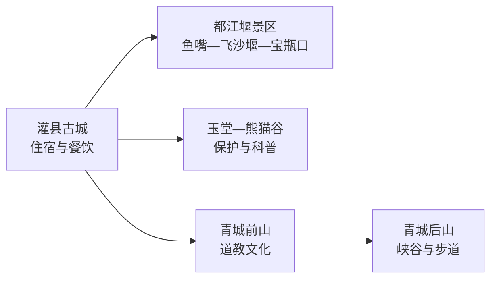
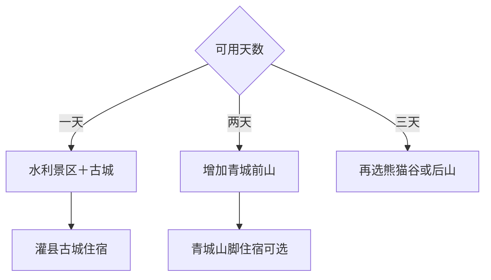

# 都江堰旅行指南

都江堰适合用 2–3 天分别理解水利工程、青城山道教文化、灌县古城生活和大熊猫保护。都江堰景区—灌县古城可同日，青城前山或后山各需完整一天，熊猫谷适合独立半日；先按主题分日，再选择住古城或青城山脚。

本页绑定都江堰同名城市点 **GeoNames 1809831**。该点未进入项目固定 `cities500` 快照，只用于法定县级市覆盖，不改变固定 GeoNames 进度。

## 城市速览

| 项目 | 信息 |
|---|---|
| 主线 | 世界遗产水利工程—青城山—灌县古城—熊猫保护 |
| 停留 | 2 天完成水利与青城前山；3 天加入熊猫谷或后山 |
| 住宿 | 灌县古城方便水利景区与餐饮；青城山脚适合山地日 |
| 交通 | 成灌铁路与市域旅游交通连接成都、古城、熊猫谷和青城山 |
| 季节 | 春秋舒适；夏季清凉但汛期地质风险上升；冬季山路湿滑 |
| 预算 | 景区门票、索道、观光交通与换宿是主要增量 |

## 城市格局与游览区域

水利景区内部是一套连续工程系统，鱼嘴、飞沙堰和宝瓶口共同理解；青城前山与后山入口、票务和体力要求不同。成都中心城区、街子古镇和汶川方向属于跨城或跨县联程，安排时另算交通。

## 主要景点

| 景点 | 区域 | 类型 | 核心体验 | 用时 | 环境 | 体力 | 预约风险 | 天气影响 | 优先级 |
|---|---|---|---|---:|---|---|---|---|---|
| 都江堰景区 | 灌口—离堆 | 世界遗产与水利 | 鱼嘴、飞沙堰、宝瓶口和治水体系 | 半天至1天 | 室外为主 | 中 | 很高 | 高 | A |
| 青城前山 | 青城山镇 | 世界遗产与道教名山 | 道观、林木、山道和道教文化 | 1天 | 混合 | 中高 | 很高 | 很高 | A |
| 青城后山 | 泰安方向 | 峡谷与山地 | 溪谷、瀑布、栈道和山村 | 1天 | 室外 | 高 | 高 | 很高 | B |
| 灌县古城 | 都江堰城区 | 历史街区 | 城市生活、南桥、文庙与夜间餐饮 | 2–4小时 | 混合 | 低 | 节假日中 | 中 | A |
| 熊猫谷 | 玉堂街道 | 动物保护与科普 | 大熊猫、小熊猫和野化保护知识 | 半天 | 室外为主 | 中 | 很高 | 高 | A |
| 南桥与岷江公开岸线 | 古城边 | 桥梁与河流 | 岷江水势、夜景与城市公共空间 | 1小时 | 室外 | 低 | 低 | 很高 | B |
| 都江堰文庙 | 灌县古城 | 古建与文化 | 文庙空间、地方教育史与古城关系 | 1–2小时 | 混合 | 低中 | 高 | 中 | B |
| 灵岩山依法开放段 | 城区北部 | 山地与寺院 | 山林、古建和城市近郊 | 2–4小时 | 混合 | 中高 | 高 | 高 | B |
| 成都融创文旅城当期项目 | 玉堂片区 | 现代文旅 | 室内外娱乐和家庭活动 | 半天至1天 | 混合 | 低中 | 节假日高 | 中 | C |
| 赵公山或龙池正式开放线 | 山地区域 | 山地与生态 | 高强度徒步或生态观察 | 1天 | 室外 | 高 | 很高 | 很高 | C |

## 美食与餐饮

古城可寻找葱葱卷、尤兔头、渣渣面、青城老腊肉、白果炖鸡和川西小吃。一人适合面食与小吃，腊肉和炖鸡适合共享；辣度、花椒、兔肉、坚果、麸质和油盐需求可直接说明。

## 经典行程

### 水利古城一日线
**路线**：都江堰景区—灌县古城—南桥。**逻辑**：从工程系统走到受水利塑造的城市。**预约锚点**：景区入场。**休息**：古城。**删除条件**：汛情或高温时缩短岸线和登高段。

### 青城前山一日线
**路线**：青城山脚—前山道观与山道—返程。**逻辑**：单独留足世界遗产山地时间。**预约锚点**：门票、索道和交通。**休息**：正式服务点。**删除条件**：雷雨、地灾或体力不足时采用短线。

### 熊猫谷半日线
**路线**：城区—熊猫谷—玉堂午餐—返城。**逻辑**：以动物作息和科普为中心。**预约锚点**：实名时段。**休息**：园区。**删除条件**：高温时优先早场。

### 青城后山一日线
**路线**：泰安入口—峡谷步道—按体力折返。**逻辑**：后山作为独立自然线。**预约锚点**：开放、索道和返程。**休息**：泰安镇。**删除条件**：强降雨、地灾预警或步道关闭时取消。

### 雨天文化线
**路线**：文庙—古城室内展陈—地方餐饮。**逻辑**：缩短山地和河岸暴露。**预约锚点**：场馆开放。**休息**：古城。**删除条件**：暴雨红色预警时按属地安排暂停出行。

### 亲子低体力线
**路线**：熊猫谷短线—午餐—都江堰景区车辆近达游线。**逻辑**：科普与水利相间。**预约锚点**：两处实名预约。**休息**：玉堂和离堆公园。**删除条件**：疲劳时只保留熊猫谷。

### 三日完整线
**路线**：首日水利—古城，次日青城前山，第三日熊猫谷或后山。**逻辑**：文化、山地和生态分日。**预约锚点**：三日核心时段。**休息**：按行程选择古城或山脚。**删除条件**：压缩时先删第三日选修线。

## 住宿区域

灌县古城适合水利景区、夜间餐饮和铁路抵离；青城山脚适合早进山和减少山地日接驳；玉堂适合熊猫谷与现代文旅。节假日优先锁定可退改住宿，并比较车站、入口和行李寄存。

## 市内交通

离堆公园、都江堰、青城山等铁路站服务不同片区，按票面站名接驳。旅游客运和公交可连接核心景区，末班时间需当天核对。岷江行洪区、山地地灾封控区、熊猫野化训练区和水利工程作业区执行明确限制。

## 不同旅行者须知

水利爱好者为景区讲解留足时间；亲子家庭优先熊猫谷和水利短线；低体力旅行者使用景区交通并减少青城登高；徒步者在地灾和天气条件适合时选择后山。宗教场所、动物保护、世界遗产和水工程安全规则按现场执行。

## 行前核对

- 核对青城山—都江堰景区、熊猫谷的实名预约、索道和开放。
- 通过 12306 核对成灌铁路站点，并确认各入口末班接驳。
- 出发前三日和当天核对暴雨、山洪、地质灾害、雷电与步道状态。
- 古城活动、文庙和现代文旅项目按当期公告选择。

## 来源与更新记录

| 来源 | 支持内容 | 核验日期 |
|---|---|---|
| [联合国教科文组织：青城山和都江堰](https://whc.unesco.org/en/list/1001/) | 世界遗产价值和组成 | 2026-09-04 |
| [成都大熊猫繁育研究基地：熊猫谷](https://www.panda.org.cn/yd/about/) | 熊猫谷位置、保护与科普属性 | 2026-09-04 |
| [四川省林草局：景区中部规划](https://lcj.sc.gov.cn/scslyt/c1055/2025/8/28/f7bef53fa5fc48a4b92d9bdc85b4eed2/files/%E9%9D%92%E5%9F%8E%E5%B1%B1%E2%80%94%E9%83%BD%E6%B1%9F%E5%A0%B0%E9%A3%8E%E6%99%AF%E5%90%8D%E8%83%9C%E5%8C%BA%E4%B8%AD%E9%83%A8%E7%89%87%E5%8C%BA%E8%AF%A6%E7%BB%86%E8%A7%84%E5%88%92%EF%BC%88%E8%AF%B4%E6%98%8E%E4%B9%A6%EF%BC%89.pdf) | 熊猫谷与青城山—都江堰空间关系 | 2026-09-04 |
| [GeoNames 1809831](https://www.geonames.org/1809831/) | 都江堰同名城市点与坐标 | 2026-09-04 |

