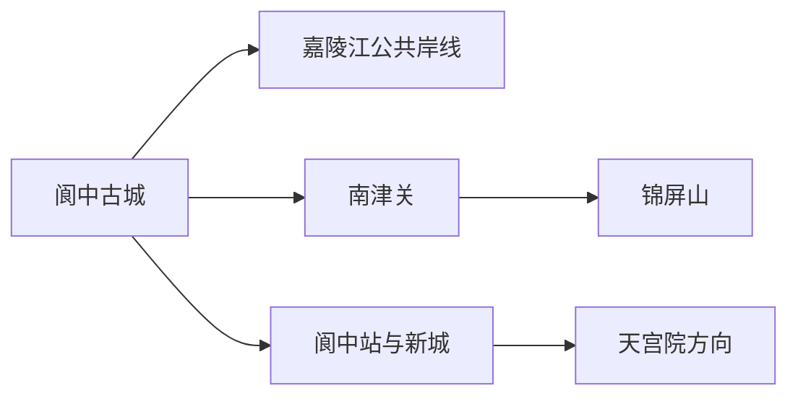
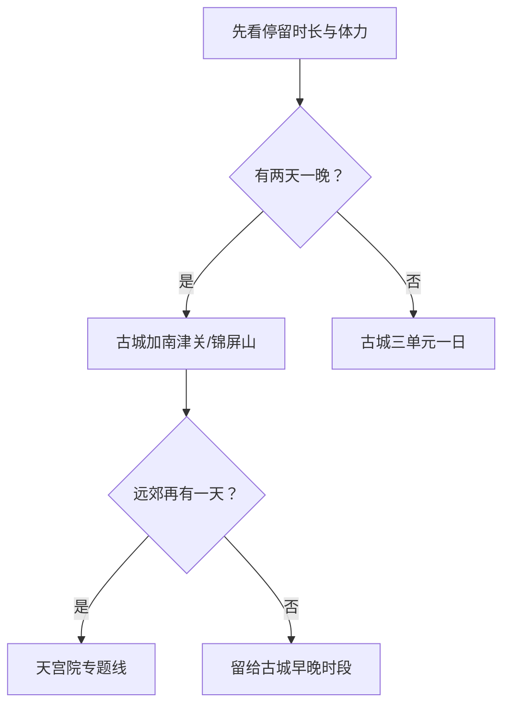

# 阆中旅行指南

阆中的核心体验是住进嘉陵江畔的古城节奏：白天分段看街巷、院落与科举文化，傍晚从江岸或南津关方向理解山水格局。第一次到访宜留两天一晚，把古城内部景点拆开，并按体力选择锦屏山或天宫院方向。

## 城市速览

| 项目 | 信息 |
|---|---|
| 旅行主线 | 阆中古城、嘉陵江、春节文化、锦屏山—南津关、天宫院 |
| 建议停留 | 1 天古城核心；2 天加入江岸与锦屏山；3 天再选天宫院方向 |
| 住宿基地 | 古城外围兼顾行李与交通；古城内适合重视早晚街巷氛围者 |
| 步行强度 | 古城中等；登楼、石板路和锦屏山中至高；车辆可降低转场 |
| 主要天气 | 夏季高温、暴雨与嘉陵江汛情；冬季湿冷、大雾和石板路湿滑 |
| 预约核心 | 古城内部景点、讲解、节庆客流、天宫院车辆和返程 |
| 边界重点 | 古城文保建筑、居民院落、宗教空间和嘉陵江水域按管理要求使用 |
| 标识说明 | GeoNames `1816924` 与 Wikidata 法定阆中市标识一致 |

## 城市格局与游览区域

阆中市是南充市代管的县级市，法定代码 `511381`。古城只是法定市域中的核心旅行片区，锦屏山与南津关位于嘉陵江另一侧，天宫院则需独立公路行程。住宿和路线按入口、桥梁与车站接驳组织，比只看“距古城多远”更实用。

| 区域 | 旅行价值 | 怎么安排 |
|---|---|---|
| 阆中古城 | 街巷、院落、科举文化、春节文化与地方生活 | 拆成上午和傍晚两段，内部景点择优 |
| 嘉陵江—南津关 | 山水格局、古城外观与夜间公共空间 | 与古城错峰组合，核对活动和江岸管理 |
| 锦屏山方向 | 登高看古城与嘉陵江关系 | 天气舒适时留半日，按体力选择短线 |
| 新城与阆中站 | 到达、现代住宿、公共服务和行李转移 | 晚到、早走或重视电梯停车时作为基地 |
| 天宫院方向 | 风水文化、乡村与远郊历史 | 车辆和开放稳定时单列半日至一日 |

## 主要景点

| 景点 | 所在区域 | 类型 | 核心看点 | 建议用时 | 室内/室外 | 体力 | 预约难度 | 天气敏感度 | 适合旅程 |
|---|---|---|---|---|---|---|---|---|---|
| 阆中古城公共街巷 | 古城 | 历史街区 | 街巷肌理、院落外观与城市生活 | 2–4 小时 | 室外为主 | 中 | 中 | 高 | A |
| 汉桓侯祠 | 古城 | 文保与三国文化 | 张飞相关历史、祠庙建筑与地方记忆 | 1–2 小时 | 混合 | 低至中 | 高 | 中 | A |
| 川北道贡院 | 古城 | 科举文化 | 科举制度、考场建筑与地方教育史 | 1–2 小时 | 混合 | 低至中 | 高 | 中 | A |
| 华光楼或中天楼开放单元 | 古城 | 历史建筑与登高 | 古城屋脊、街巷轴线与空间尺度 | 0.5–1 小时 | 混合 | 中至高 | 高 | 高 | B |
| 南津关古镇公共区 | 嘉陵江南岸 | 历史街区与江景 | 古城对岸视角、滨江与当期演艺 | 1–2 小时 | 室外为主 | 中 | 中 | 高 | B |
| 锦屏山正式开放区 | 江南方向 | 山地与城市观景 | 嘉陵江环抱与古城整体格局 | 2–3 小时 | 室外 | 中至高 | 高 | 极高 | B |
| 天宫院风水文化景区 | 远郊 | 历史与乡村 | 古建筑、地方风水文化与丘陵景观 | 3–5 小时 | 混合 | 中 | 高 | 高 | C |

古城是活态居民区，公共街巷与收费院落分别按开放规则参观。文保建筑、宗教空间和居民院门尊重现场边界；嘉陵江游船、水上项目与临江步道根据水位、天气和运营公告使用。

## 美食与餐饮

| 类型 | 适合场景 | 份量 | 过敏与饮食提示 | 怎么选 |
|---|---|---|---|---|
| 阆中牛肉与张飞牛肉 | 正餐、简餐或伴手礼 | 易分装 | 牛肉、卤料、钠与包装保存 | 堂食先试小份，伴手礼看生产信息 |
| 保宁醋相关菜品 | 地方风味体验 | 味型突出 | 酸度、糖分与复合调味 | 先尝后加，按胃部耐受选择 |
| 川北凉粉与地方小吃 | 古城简餐 | 单人友好 | 豆类、花生、芝麻与辣椒 | 逐项确认浇头和辣度 |
| 嘉陵江鱼与川北家常菜 | 多人正餐 | 多为共享 | 鱼刺、水产过敏与高油盐 | 询问鱼种、重量、来源和做法 |

## 经典行程

### 一日经典路线

**路线**：古城公共街巷 → 汉桓侯祠 → 午餐 → 川北道贡院 → 嘉陵江公共岸线

- **串联逻辑**：用街巷、三国与科举三个单元建立古城认识。
- **预约锚点**：内部景点票务、讲解和最晚入场。
- **休息安排**：午餐长休，下午在院落和茶馆间歇。
- **时间不足时**：保留街巷、汉桓侯祠与一处江景。

### 两日城市路线

**第 1 天**：古城核心院落与街巷 
**第 2 天**：南津关 → 锦屏山短线 → 嘉陵江傍晚

- **串联逻辑**：第一天看城内，第二天从对岸和高处理解山水格局。
- **预约锚点**：锦屏山开放、车辆、节庆活动和返程。
- **休息安排**：第二日午间回到南津关或新城室内休息。
- **时间不足时**：删除登山，只留南津关短段。

### 三日深度路线

**第 1 天**：阆中古城 
**第 2 天**：南津关与锦屏山 
**第 3 天**：天宫院正式开放线

- **串联逻辑**：城内、山水与远郊文化分日，避免同日频繁跨江和长途。
- **预约锚点**：天宫院开放、车辆、讲解和返程。
- **休息安排**：第三日午间在正规服务点休息。
- **时间不足时**：优先删除第三日。

### 雨天与高温路线

**路线**：汉桓侯祠 → 午餐长休 → 川北道贡院 → 短段有廊檐街巷

- **适用条件**：普通降雨或高温；暴雨、雷电和嘉陵江汛情按公告调整。
- **预约锚点**：院落开放、古城客流和交通。
- **休息安排**：中午完整留在室内，户外段控制在半小时级别。
- **时间不足时**：只留一座院落。

### 亲子路线

**路线**：川北道贡院 → 午餐 → 古城街巷寻访 → 嘉陵江护栏完善短段

- **适用条件**：讲解适龄，江岸和街巷客流可控。
- **预约锚点**：亲子讲解、卫生间、推车和内部台阶。
- **休息安排**：每个室内单元后安排饮水与座椅休息。
- **时间不足时**：保留贡院和短街巷。

### 低体力路线

**路线**：车辆落客 → 古城平缓街巷短段 → 午餐长休 → 一座可达院落

- **适用条件**：落客点、石板路、电梯或坡道和轮椅条件已确认。
- **预约锚点**：无障碍入口、轮椅、卫生间和陪同。
- **休息安排**：每段不超过一小时，下午随时返回住宿。
- **时间不足时**：只留一段街巷和午餐。

### 天宫院远郊路线

**路线**：阆中主城出发 → 天宫院正式入口 → 核心开放单元 → 午餐 → 原路返回

- **适用条件**：景区、天气、车辆和返程均明确。
- **预约锚点**：门票、讲解、停车或包车与最晚返程。
- **休息安排**：在游客服务点和正规餐饮点完成补给。
- **时间不足时**：整段删除，完整保留古城线。

## 住宿区域

| 区域 | 优点 | 取舍 | 适合人群 | 核对项 |
|---|---|---|---|---|
| 古城外围 | 兼顾步行、车辆、行李和夜间安静 | 到部分院落仍需石板路步行 | 首访、带行李、重视交通者 | 实际入口、电梯、停车、隔音与早餐 |
| 古城内部 | 便于体验清晨与夜晚街巷 | 石板路、噪声、消防和车辆落客差异大 | 摄影、慢游、轻行李者 | 合法经营、消防、行李接送、隔音与退改 |
| 新城与阆中站方向 | 电梯、停车和铁路衔接通常更直接 | 往返古城需公交或车辆 | 晚到早走、自驾、低体力旅行者 | 到站接驳、末班、叫车和实际距离 |

## 市内交通

阆中可通过铁路和公路抵达，阆中站与古城入口之间需地面接驳。古城内部以步行为主，跨嘉陵江前往南津关、锦屏山以及远赴天宫院适合公交、出租车、正规包车或自驾。节庆和周末按客流、停车与临时交通组织预留时间。

| 场景 | 怎么做 | 行前核对 |
|---|---|---|
| 铁路抵达 | 按票面抵达阆中站，再转住宿或古城入口 | 车次、站前接驳、夜间到店 |
| 古城内部 | 按片区步行，车辆停在允许落客或停车区域 | 石板路、行李、客流与临时管制 |
| 跨江与远郊 | 每天只选南津关/锦屏山或天宫院一个方向 | 公交、车辆、停车、开放和返程 |

## 不同旅行者须知

| 旅行者 | 推荐做法 | 重点核对 |
|---|---|---|
| 独行 | 住古城外围，内部景点分上午和傍晚 | 夜间到店、末班、正规车辆 |
| 亲子 | 贡院、街巷短线和有护栏江岸交替 | 推车、台阶、卫生间与客流 |
| 长者与低体力 | 住新城或古城外围，车辆串联并减少登楼登山 | 石板路、落客、座椅、轮椅与医疗点 |
| 摄影 | 留宿一晚，使用公共街巷和江岸拍摄位 | 无人机、文保、居民生活与三脚架规则 |
| 节庆旅行 | 提前锁定可退改住宿和交通 | 客流预约、限行、活动区与返程 |

## 行前核对

- 阆中市政府与景区运营方：古城内部景点、票务、活动和临时交通。
- 四川省文旅部门：景区名录、节庆与文旅动态。
- 中国铁路 12306：阆中站车次、完整站名和退改。
- 四川省气象、水利与应急部门：高温、暴雨、大雾和嘉陵江汛情。
- 文物主管部门：古城保护、建筑维修、摄影与开放边界。

## 来源与更新记录

| 来源 | 支持内容 | 核验日期 |
|---|---|---|
| [阆中市人民政府](https://www.langzhong.gov.cn/) | 市情、交通、古城管理与当期动态入口 | 2026-08-30 |
| [四川省文旅厅：阆中春节文化](https://wlt.sc.gov.cn/scwlt/szjl/2024/12/11/3269eac477bc412a89b9f297eae0d1f6.shtml) | 春节文化、锦屏山、南津关与城市旅行线索 | 2026-08-30 |
| [四川省人大：阆中古城保护条例](https://www.scspc.gov.cn/1311/201905/167233.html) | 古城文保、居民空间与管理边界 | 2026-08-30 |
| [四川省人民政府：阆中旅游信息](https://www.sc.gov.cn/10462/10778/10876/2016/10/17/10399315.shtml) | 古城、天宫院与相关景区线索 | 2026-08-30 |
| [Wikidata Q1200170](https://www.wikidata.org/wiki/Q1200170) | 法定阆中市、代码与 GeoNames 对应 | 2026-08-30 |
| [GeoNames 1816924](https://www.geonames.org/1816924/) | 固定清单阆中城市点 | 2026-08-30 |
| [中国铁路 12306](https://www.12306.cn/) | 列车、站名与购票动态 | 2026-08-30 |

| 日期 | 更新 |
|---|---|
| 2026-08-30 | 首次完成阆中古城、南津关、锦屏山、天宫院与节庆旅行研究。 |
