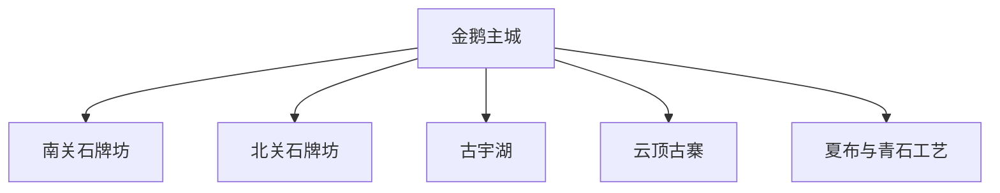
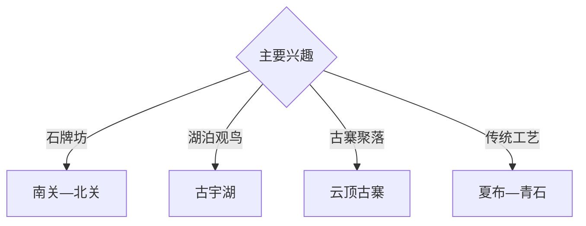

# 隆昌旅行指南

隆昌位于川南丘陵，以金鹅主城的石牌坊群、古宇湖、云顶古寨、夏布与青石文化形成遗产、湖泊和传统工艺组合。固定快照中的 **Jin’e / GeoNames 1805709** 锚定金鹅主城；古宇湖和云顶方向分别安排，避免把市域景点压缩成连续步行区。

## 城市速览

| 项目 | 信息 |
|---|---|
| 主线 | 金鹅主城—南北关石牌坊—古宇湖—云顶古寨—夏布工艺 |
| 停留 | 主城与牌坊1天；湖区或古寨另留1天 |
| 住宿 | 金鹅主城交通餐饮便利；湖区选择正规住宿 |
| 交通 | 高铁、铁路、公路抵达，远郊宜约车或自驾 |
| 季节 | 春秋舒适；夏季关注高温、雷雨和水域安全 |
| 预算 | 主城灵活，远郊车辆、讲解和工艺体验增加预算 |

## 城市格局与游览区域

金鹅主城集中牌坊、住宿和工艺展示；古宇湖是独立湖区，云顶古寨位于乡镇方向。文物本体、水库管理区、湿地保护范围、采石与加工生产区按正式开放和接待边界进入。

## 主要景点

| 景点 | 区域 | 类型 | 核心体验 | 用时 | 环境 | 体力 | 研究价值 | 拥挤 | 优先级 |
|---|---|---|---|---:|---|---|---|---|---|
| 南关石牌坊古镇公开区 | 金鹅 | 石刻与街区 | 清代牌坊、石刻叙事与城市街巷 | 半天 | 混合 | 低 | 很高 | 节假日中 | A |
| 北关石牌坊公开区 | 金鹅 | 文物与城市 | 牌坊群、古驿道记忆和社区生活 | 2–3小时 | 室外 | 低 | 很高 | 中 | A |
| 隆昌博物馆等公共展陈 | 主城 | 文博 | 地方史、牌坊、青石与民俗 | 2小时 | 室内 | 低 | 高 | 中 | A |
| 古宇湖正规游览区 | 古湖方向 | 湖泊与湿地 | 湖岸、候鸟、丘陵和休闲步道 | 半天至1天 | 室外 | 低中 | 高 | 周末中 | A |
| 云顶古寨公开区 | 云顶方向 | 古寨与乡村 | 寨堡格局、古建与丘陵聚落 | 半天 | 混合 | 中 | 高 | 节假日中 | B |
| 夏布正规展示体验点 | 主城及乡镇 | 非遗与工艺 | 苎麻、织造流程与传统产品 | 2–3小时 | 室内 | 低 | 高 | 预约制 | B |
| 青石文化正规展示点 | 主城 | 石作与产业 | 石材工艺、雕刻传统与城市建设 | 1–2小时 | 室内 | 低 | 中高 | 预约制 | B |

## 美食与餐饮

隆昌羊肉汤、豆花、川南小吃和家常菜适合在金鹅主城体验。古宇湖周边水产选择正规餐馆并核对合法来源；工艺体验按接待方安全流程进行。

## 经典行程

### 石牌坊经典线
**路线**：南关—博物馆—北关—主城餐饮。**逻辑**：从实物、展陈到街区完整理解牌坊文化。**预约锚点**：场馆开放。**休息**：金鹅主城。**删除条件**：高温时减少正午户外段。

### 牌坊细读线
**路线**：南关核心牌坊—石刻释读—北关公开区。**逻辑**：为建筑与题刻研究留足时间。**预约锚点**：讲解。**休息**：游客服务点。**删除条件**：文物维护时按围挡调整。

### 古宇湖一日线
**路线**：主城—湖区正式入口—开放步道—正规观鸟点—返程。**逻辑**：独立半天至一天体验丘陵湖泊。**预约锚点**：水位和开放。**休息**：湖区服务点。**删除条件**：暴雨、雷电或水域管制时取消。

### 云顶古寨线
**路线**：主城—云顶古寨公开区—村落公共空间—返城。**逻辑**：把寨堡遗产与乡村格局连接。**预约锚点**：古建开放和车辆。**休息**：正规乡村接待点。**删除条件**：雨后道路受限时顺延。

### 夏布工艺线
**路线**：主城—正规夏布展厅—预约织造体验—工艺产品观察。**逻辑**：从材料到成品理解非遗。**预约锚点**：传承人或展厅接待。**休息**：主城。**删除条件**：无接待时改博物馆。

### 亲子低体力线
**路线**：博物馆—南关短线—古宇湖平缓段。**逻辑**：文博与自然观察结合。**预约锚点**：亲子活动。**休息**：主城或湖区。**删除条件**：雨天保留室内展陈。

### 两日组合线
**路线**：首日牌坊与工艺；次日古宇湖或云顶古寨。**逻辑**：主城遗产与远郊分日。**预约锚点**：第二日天气和接待。**休息**：金鹅主城连续住宿。**删除条件**：一天时只保留牌坊主线。

## 住宿区域

金鹅主城适合高铁、铁路、公路接驳和夜间餐饮；古宇湖正规住宿适合湖区慢游。订房核对停车、消防、早餐、返程车辆和天气退改。

## 市内交通

隆昌北站、隆昌站和公路客运点位置不同，购票后核对。南北关位于主城不同片区，古宇湖与云顶古寨需另行接驳；乡村道路按雨雾与临时管制通行。

## 不同旅行者须知

文物旅行者给牌坊群半天以上；亲子和长者选择博物馆、南关及湖区平缓段；观鸟者保持距离并降低噪声；工艺旅行者提前预约。牌坊本体、水库管理设施、湿地核心范围、采石场和加工生产线保留明确限制。

## 行前核对

- 核对南北关、博物馆、古宇湖与云顶古寨开放。
- 核对夏布、青石工艺接待与讲解安排。
- 核对高铁站点、公路班次、返程车辆和住宿。
- 核对暴雨、雷电、水位、地质灾害与高温预警。

## 来源与更新记录

| 来源 | 支持内容 | 核验日期 |
|---|---|---|
| [隆昌市人民政府](https://www.longchang.gov.cn/) | 属地文化旅游、交通和开放动态入口 | 2026-09-03 |
| [内江市文化广播电视和旅游局](https://wltj.neijiang.gov.cn/) | 隆昌景区、文物与文旅活动核对入口 | 2026-09-03 |
| [GeoNames 1805709](https://www.geonames.org/1805709/) | Jin'e 固定人口点与隆昌主城位置 | 2026-09-03 |

