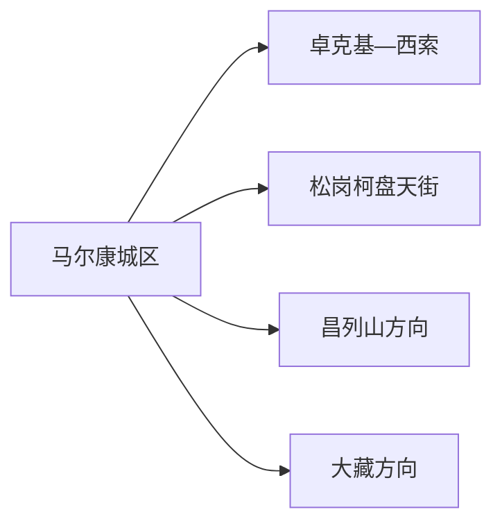
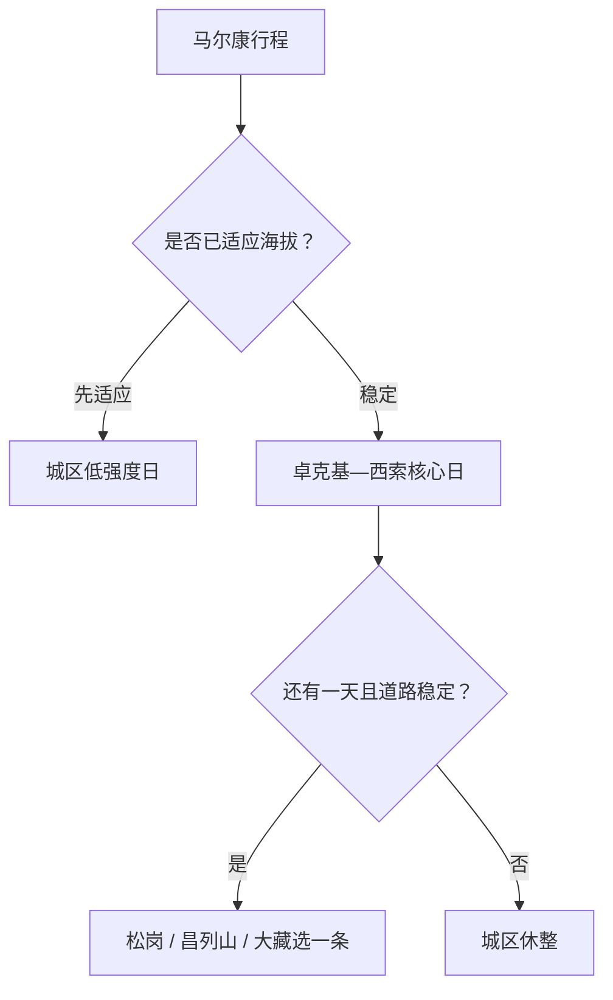

# 马尔康旅行指南

马尔康是阿坝藏族羌族自治州州府，梭磨河谷中的城区适合作为高原适应和交通基地。卓克基土司官寨、西索民居、松岗柯盘天街等分布在河谷公路不同节点；昌列山、大藏等方向需要单独车辆日。先完成卓克基—西索主线，再按海拔、天气和道路决定远线。

## 城市速览

| 项目 | 信息 |
|---|---|
| 旅行主线 | 马尔康城区、卓克基土司官寨—西索民居、松岗柯盘天街、昌列山与大藏方向 |
| 建议停留 | 城区与卓克基 1–2 天；松岗或山地方向各加 1 天 |
| 住宿基地 | 马尔康城区便于州府服务、医疗、餐饮与高原适应 |
| 步行强度 | 河谷城区中等；官寨台阶中等；山地高，海拔增加负荷 |
| 主要天气 | 强紫外线、昼夜温差、雨雪冰冻、落石滑坡、山洪与冬季道路结冰 |
| 预约核心 | 官寨与村落开放、讲解、道路、县域车辆、宗教活动和返程 |
| 边界重点 | 居民村寨、宗教空间、林牧区、矿业生产区与地灾管制路段按属地规则活动 |
| 无障碍 | 城区逐点确认；官寨、村巷和山地准备短线或车览替代 |

## 城市格局与游览区域

马尔康市是阿坝藏族羌族自治州所辖县级市和州府，法定代码 `513201`。本页绑定固定城市点 GeoNames `1816868 Barkam`；Wikidata `Q808243` 同时列有 `1816868` 与行政记录 `1816867`，代表城市点与法定实体粒度并存。阿坝州其他县各自独立规划。

| 区域 | 旅行价值 | 怎么安排 |
|---|---|---|
| 马尔康城区 | 州府服务、公共文化、住宿与高原适应 | 抵达日低强度游览 |
| 卓克基—西索 | 土司官寨、嘉绒藏族民居与河谷聚落 | 留半日至一日 |
| 松岗方向 | 柯盘天街、碉楼与河谷历史景观 | 独立半日至一日 |
| 昌列山方向 | 高山景观与当期开放项目 | 天气和体力稳定时安排 |
| 大藏方向 | 宗教文化、山谷与远线公路 | 预留完整一天并尊重宗教规则 |

## 主要景点

| 景点 | 所在区域 | 类型 | 核心看点 | 建议用时 | 室内/室外 | 体力 | 预约难度 | 天气敏感度 | 适合旅程 |
|---|---|---|---|---|---|---|---|---|---|
| 卓克基土司官寨 | 卓克基镇 | 历史建筑与地方史 | 土司建筑、嘉绒文化与红色历史线索 | 2–3 小时 | 混合 | 中 | 中高 | 中 | A |
| 西索民居公开街巷 | 卓克基镇 | 传统村落 | 嘉绒藏族民居、寨落格局与河谷生活 | 1–2 小时 | 室外为主 | 中 | 中 | 高 | A |
| 马尔康城市公共文化 | 城区 | 地方文化 | 州情、民族文化与当期展览 | 1–2 小时 | 室内 | 低 | 中 | 低 | A |
| 松岗柯盘天街公开区 | 松岗方向 | 碉楼与历史聚落 | 碉楼、古道与河谷防御聚落 | 3–5 小时 | 室外为主 | 中 | 高 | 高 | B |
| 昌列山正式开放项目 | 城区山地方向 | 高山与生态 | 山地视野、森林与季节景观 | 4–7 小时 | 室外 | 中至高 | 高 | 极高 | B |
| 大藏方向正式开放点 | 远线山谷 | 宗教与山谷文化 | 宗教文化、村落与高原山谷 | 6–9 小时 | 混合 | 中 | 高 | 极高 | B |

西索等传统村落是居民生活空间，旅行使用公共街巷和正式接待点。宗教场所按现场引导处理行走方向、着装与摄影。林牧区、矿业生产区、施工便道和地质灾害封控路段保持管理用途，远线只走公开道路与正式入口。

## 美食与餐饮

| 类型 | 适合场景 | 份量 | 过敏与饮食提示 | 怎么选 |
|---|---|---|---|---|
| 嘉绒藏式家常菜 | 城区正餐 | 多适合分享 | 肉类、乳制品、青稞和共锅 | 先问份量、辣度与素食选择 |
| 牦牛肉菜肴 | 城区正餐 | 可单人或分享 | 牛肉、油脂、香料 | 选择来源、重量和价格清楚的熟制菜 |
| 酥油茶与奶茶 | 正规餐饮 | 小杯先试 | 乳制品、盐、油脂和咖啡因 | 先问甜咸与奶源 |
| 青稞与土豆 | 早餐或配菜 | 可小份 | 可能与小麦、乳制品混用 | 让经营者说明配料和做法 |
| 川西面食与汤锅 | 城区简餐 | 一人份方便 | 小麦、肉汤、花椒与大豆调味 | 调味分开并询问汤底 |

## 经典行程

### 一日经典路线

**路线**：城区出发 → 卓克基土司官寨 → 西索民居公开街巷 → 午餐长休 → 返回城区

- **串联逻辑**：官寨与村落相邻，适合形成完整的嘉绒文化主线。
- **预约锚点**：官寨开放、讲解与道路。
- **休息安排**：午餐后缩短村巷步行。
- **时间不足时**：保留官寨与一段西索街巷。

### 两日首次到访路线

**第 1 天**：城区适应与公共文化 
**第 2 天**：卓克基—西索

- **串联逻辑**：先适应海拔，再完成核心远点。
- **预约锚点**：两日天气、官寨与车辆。
- **休息安排**：第一天早回住宿，第二天午休充足。
- **时间不足时**：第一日压缩为抵达半日。

### 松岗路线

**路线**：城区 → 松岗柯盘天街公开区 → 午餐与休息 → 同方向开放点 → 返回

- **适用条件**：道路、开放与返程稳定。
- **预约锚点**：准确入口、讲解、停车与最晚返程。
- **休息安排**：减少连续爬坡和久站。
- **时间不足时**：只留柯盘天街核心段。

### 雨雪路线

**路线**：城区公共文化 → 午餐 → 住宿休息

- **适用条件**：城市道路正常；雨雪、山洪或地质灾害预警时取消村寨与山地远线。
- **预约锚点**：天气、道路与场馆开放。
- **休息安排**：室内为主。
- **时间不足时**：只留一处场馆。

### 亲子路线

**路线**：卓克基土司官寨 → 午休 → 西索近入口短段

- **串联逻辑**：建筑与村落观察集中在一个方向。
- **预约锚点**：儿童讲解、台阶、防晒与卫生间。
- **休息安排**：户外慢走，随时返回车辆。
- **时间不足时**：只留官寨。

### 低体力路线

**路线**：车辆到达城区公共文化 → 午餐长休 → 卓克基近入口核心展线

- **适用条件**：落客、台阶和身体状态已确认。
- **预约锚点**：轮椅、座椅、供氧与医疗距离。
- **休息安排**：每处只看核心内容。
- **时间不足时**：只留城区。

### 山地远线

**路线**：城区早出发 → 昌列山或大藏方向二选一 → 正式服务点休息 → 返回

- **适用条件**：高原适应良好，天气、道路与开放稳定。
- **预约锚点**：车辆、入口、宗教活动、通信和返程。
- **休息安排**：降低日里程与连续户外时间。
- **时间不足时**：整段改为卓克基—西索。

## 住宿区域

| 区域 | 优点 | 取舍 | 适合人群 | 核对项 |
|---|---|---|---|---|
| 马尔康城区 | 餐饮、医疗、交通与补给集中 | 去各远线仍需车辆 | 首访、高原适应、无车旅行 | 供氧、供暖、电梯、停车与夜间医疗 |
| 卓克基正规住宿 | 接近官寨与西索 | 服务选择少于城区 | 嘉绒文化、摄影 | 合法经营、消防、供暖、隔音与返程 |
| 远线正规住宿 | 减少单日往返 | 医疗、通信和天气风险更高 | 深度自驾 | 路况、供电、供暖、餐食和退改 |

## 市内交通

马尔康以高原公路交通为主，城区承担州府换乘。卓克基、松岗、昌列山和大藏分属不同方向或距离，按一天一个主轴安排。

| 场景 | 怎么做 | 行前核对 |
|---|---|---|
| 到达马尔康 | 选择正规客运、自驾或包车进入城区 | 班次、天气、夜间到达与高原适应 |
| 城区—卓克基 | 出租、正规包车或自驾短程接驳 | 官寨开放、停车与返程 |
| 松岗与山地 | 整日正规车辆行程 | 路况、油量、通信、落石与司机资质 |
| 阿坝州联游 | 各县分别确定住宿和交通 | 长距离、海拔、道路与加油 |

## 不同旅行者须知

| 旅行者 | 推荐做法 | 重点核对 |
|---|---|---|
| 独行 | 先住城区，远线使用正规车辆 | 资质、返程、通信和医疗 |
| 亲子 | 官寨加西索短线 | 高反、防晒、保暖和台阶 |
| 长者与低体力 | 城区为主，卓克基短线 | 心肺状况、供氧、轮椅与医疗 |
| 摄影 | 村落与山地分日 | 居民与宗教摄影、无人机和日落返程 |
| 自驾 | 降低日里程，白天完成山路 | 雨雪、落石、加油、结冰和疲劳 |

## 行前核对

- 马尔康市政府与阿坝州文旅信息：官寨、村落、景区与活动。
- 景区和宗教场所：开放、讲解、摄影、停车与现场礼仪。
- 四川气象、交通、自然资源、林草与应急信息：雨雪、地灾、火险和道路。
- 个人健康：高原反应预案、既往心肺疾病、常用药与旅行保险。

## 来源与更新记录

| 来源 | 支持内容 | 核验日期 |
|---|---|---|
| [马尔康市 2025 年政府工作报告](https://maerkang.gov.cn/maerkang/c100056/202603/33f74f0edfa4459b8a530cc8f151f9f6.shtml) | 卓克基、松岗柯盘天街、昌列山与大藏文旅方向 | 2026-09-01 |
| [马尔康市政府：旅游路线概览](https://www.maerkang.gov.cn/maerkang/c100050/202012/94bd5ab865c14b50940cfd2ce740ff27.shtml) | 城区与主要旅行方向 | 2026-09-01 |
| [马尔康市政府：城市概况](https://www.maerkang.gov.cn/maerkang/c100125/201905/a03549c876b246138bd1246f10aaccf1.shtml) | 州府位置、自然与文化背景 | 2026-09-01 |
| [马尔康市政府：一至三日线路](https://www.maerkang.gov.cn/maerkang/c100133/202404/66633861b7a8459fa7d70077d1ecc20e.shtml) | 卓克基、松岗等组合方式 | 2026-09-01 |
| [马尔康市政府：卓克基](https://www.maerkang.gov.cn/maerkang/c100134/201909/2ce749fa15b744a1a0748bdaf9e31727.shtml) | 卓克基土司官寨与西索民居 | 2026-09-01 |
| [Wikidata Q808243](https://www.wikidata.org/wiki/Q808243) | 马尔康市及城市点、行政记录粒度 | 2026-09-01 |
| [GeoNames 1816868](https://www.geonames.org/1816868/) | 固定 Barkam 城市点 | 2026-09-01 |
| [四川省气象局](http://sc.cma.gov.cn/) | 气象预警 | 2026-09-01 |

| 日期 | 更新 |
|---|---|
| 2026-09-01 | 首次完成城区、卓克基—西索、松岗与山地远线研究。 |
