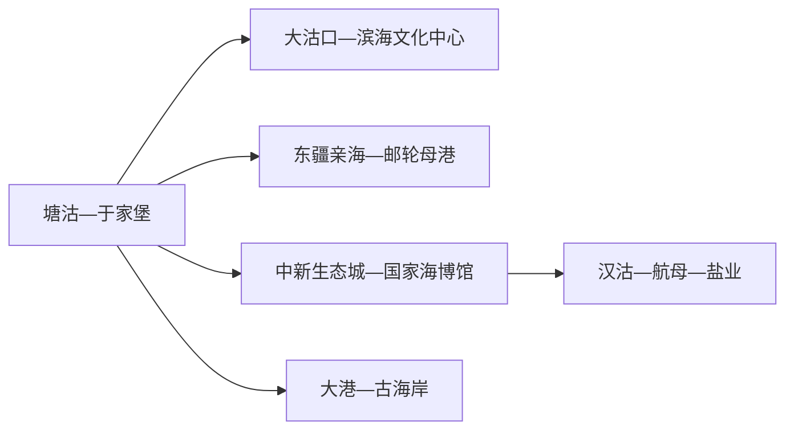
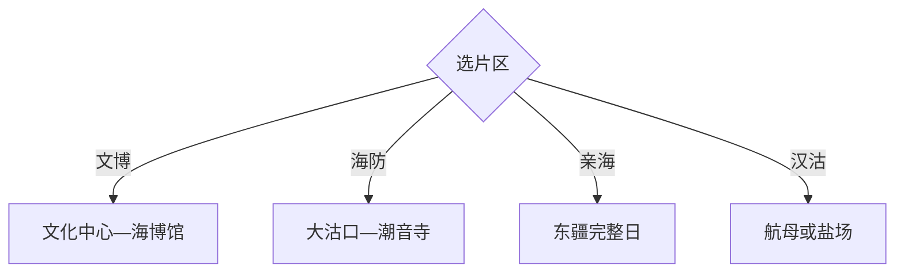

# 滨海新区旅行指南

天津滨海新区不是一条连续海岸步道，而是塘沽文化中心、大沽海防、东疆亲海、生态城海博馆、汉沽航母与盐业、大港古海岸等分散片区。两天选择海洋文博与海防核心，三天再加航母或东疆完整日。

## 城市速览

| 项目 | 信息 |
|---|---|
| 主线 | 塘沽—大沽口—滨海文化中心—东疆—生态城—汉沽航母 |
| 停留 | 核心2天；增加东疆、航母或大港共3–4天 |
| 住宿 | 塘沽和于家堡换线方便，生态城适合海博馆，东疆适合邮轮或看海 |
| 交通 | 国铁、津滨轻轨、公交与当期旅游专线组合，跨片区时间长 |
| 风险 | 海风风暴潮、潮汐、高温严寒、港区重车、场馆预约和大型活动 |
| 边界 | 港口、盐场、保税区、军事主题设施、湿地与海岸保护区按正式开放边界进入 |

## 城市格局与游览区域

固定 `Hangu / GeoNames 1808931` 对应原汉沽城区，2009年塘沽、汉沽和大港整合为滨海新区；本页以现行区级实体 `Q708605` 承接。汉沽仍是新区北部片区，不等同全部滨海，旅行时需分别安排塘沽、生态城、东疆和大港。

## 主要景点

| 景点 | 区域 | 类型 | 核心体验 | 用时 | 环境 | 体力 | 预约风险 | 天气影响 | 优先级 |
|---|---|---|---|---:|---|---|---|---|---|
| 国家海洋博物馆 | 中新生态城 | 国家级博物馆 | 海洋自然、人文与生态综合展陈 | 半日至1天 | 室内 | 中 | 很高 | 低 | A |
| 滨海文化中心与新区博物馆 | 塘沽核心区 | 公共文化 | 建筑、图书馆与地方展陈 | 3–6小时 | 室内 | 低 | 高 | 低 | A |
| 大沽口炮台遗址博物馆 | 大沽 | 海防遗址 | 近代海防、炮台遗址与海河口 | 2–4小时 | 混合 | 中 | 高 | 高 | A |
| 东疆亲海公园与沙滩公开区 | 东疆 | 海岸休闲 | 日出、公共海岸与季节活动 | 半日至1天 | 室外 | 中 | 高 | 很高 | A |
| 天津泰达航母主题公园 | 汉沽北部 | 主题公园 | 航母参观、国防科普与演艺 | 1天 | 混合 | 中 | 很高 | 高 | A |
| 天津长芦汉沽盐场公开旅游区 | 汉沽 | 工业与盐文化 | 海盐生产史与获准体验 | 半日 | 混合 | 中 | 高 | 很高 | B |
| 古林古海岸遗迹博物馆 | 大港方向 | 地质与考古 | 贝壳堤、古海岸与环境变迁 | 2–4小时 | 混合 | 低中 | 高 | 中 | B |
| 潮音寺及大沽公共街区 | 大沽 | 宗教与地方史 | 寺院、渔盐文化与老街线索 | 2–4小时 | 混合 | 低中 | 中 | 中 | B |

## 美食与餐饮

塘沽、生态城和汉沽可选海鲜、八大碗、贴饽饽熬小鱼、盐焗或津味家常菜。海鲜先确认时价、重量和加工费，贝类过敏者主动说明；亲海和盐场日自备饮水，生产盐田按参观线路体验。

## 经典行程

### 两日基础线
**路线**：滨海文化中心—大沽口—次日国家海洋博物馆。**逻辑**：城市与海防史、国家级海洋展陈分日。**预约锚点**：三馆。**休息**：塘沽与生态城。**删除条件**：时间不足时删潮音寺。

### 塘沽海防线
**路线**：新区博物馆—午餐—大沽口炮台—潮音寺。**逻辑**：先建地方史，再到海河口现场。**预约锚点**：两馆。**休息**：塘沽。**删除条件**：大风时缩短遗址室外段。

### 海洋文博线
**路线**：国家海洋博物馆完整日—东堤公园短段。**逻辑**：大型馆需要留足时间，公园只作收尾。**预约锚点**：海博馆。**休息**：馆内服务区。**删除条件**：闭馆时改滨海文化中心。

### 东疆亲海线
**路线**：亲海公园—沙滩公开区—邮轮母港公共观景区。**逻辑**：按潮汐和日出倒排一日。**预约锚点**：景区、海况和交通。**休息**：正式服务点。**删除条件**：风暴潮、强风或海岸关闭时取消。

### 汉沽主题线
**路线**：航母主题公园完整日，或盐文化旅游区半日二选一。**逻辑**：大型园区和生产参观各自需要预约。**预约锚点**：门票、表演、盐场接待。**休息**：园内。**删除条件**：项目停运时改海博馆。

### 大港古海岸线
**路线**：古林古海岸遗迹博物馆—大港城区—正规湿地外围观察点。**逻辑**：围绕海岸变迁与生态。**预约锚点**：博物馆和保护地开放。**休息**：大港城区。**删除条件**：湿地管控时只留博物馆。

### 低体力线
**路线**：滨海文化中心—车辆到国家海洋博物馆。**逻辑**：以两组室内场馆替代海岸长走。**预约锚点**：无障碍、落客和馆内轮椅。**休息**：两馆。**删除条件**：只保留预约成功的一馆。

## 住宿区域

塘沽—于家堡适合国铁、轻轨、文化中心和大沽线；生态城适合海博馆、方特与航母方向；东疆适合邮轮前后和海岸日；汉沽适合航母与盐业主题；大港适合南部古海岸。按次日片区选房，避免每日横跨新区。

## 市内交通

滨海站、滨海西站及津滨轻轨承担主要进入交通，公交和节假日旅游专线连接景区。东疆、生态城、汉沽和大港之间距离远，实时班次决定可组合性。港区重车多，生产道路、码头和保税区门禁不作为观光通道。

## 不同旅行者须知

海洋兴趣者优先海博馆；历史兴趣者选大沽口；亲子可选海博馆和成熟主题园；低体力者集中两组文化场馆。港口作业区、盐场生产区、湿地保护地、军事主题设施后台与封闭海岸保留明确限制。

## 行前核对

- 核对海博馆、文化中心、大沽口、东疆、航母、盐场和古海岸博物馆开放。
- 核对国铁轻轨、旅游专线、潮汐海况、风暴潮、邮轮与场馆预约。
- 亲海走开放岸线，港区和盐场按参观线路进入，湿地依保护地公告观察。

## 来源与更新记录

| 来源 | 支持内容 | 核验日期 |
|---|---|---|
| [天津文旅：滨海亲海旅游](https://whly.tj.gov.cn/TJSWHHLYJ/gabsycs/mtjjgh/202508/t20250821_7116460.html) | 海博馆、航母、盐场、东疆与文化场馆 | 2026-09-01 |
| [天津滨海旅游景点路线](https://whly.tj.gov.cn/tjswlzxw/lytj/lyjg/ztjzqyly/202101/t20210113_5322006.html) | 海博馆、文化中心、大沽口与区域交通 | 2026-09-01 |
| [天津滨海国家海洋公园规划](https://ghhzrzy.tj.gov.cn/zwgk_143/zcwj/jjzcwj/202407/W020240726539558241295.pdf) | 海岸、湿地、港口与旅游保护边界 | 2026-09-01 |
| [GeoNames 1808931](https://www.geonames.org/1808931/) | Hangu 固定人口点 | 2026-09-01 |
| [Wikidata Q708605](https://www.wikidata.org/wiki/Q708605) | 滨海新区实体与跨库标识 | 2026-09-01 |

| 日期 | 更新 |
|---|---|
| 2026-09-01 | 首次完成滨海新区旅行研究，以现行区级结构承接汉沽固定记录。 |
