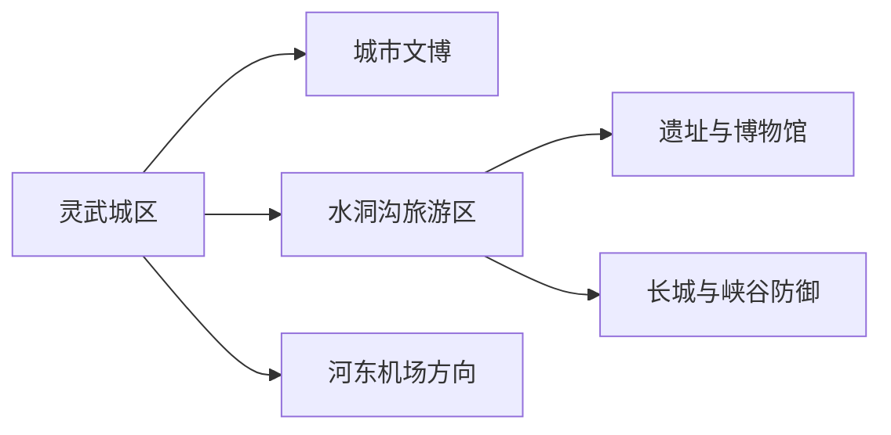
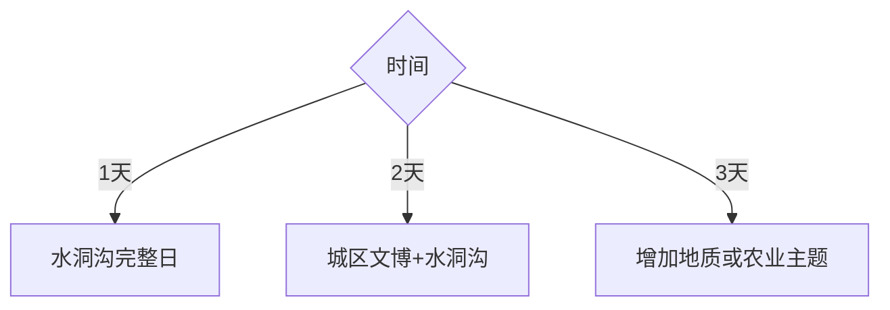

# 灵武旅行指南

灵武位于银川东南，城区适合用灵州历史、地方文博与长枣饮食建立框架，临河镇的水洞沟则是一座需要完整一天的大型史前考古与长城防御景区。机场虽在灵武市域，主要承担银川航空门户；住宿应围绕灵武城区、水洞沟早入园或航班需求选择。

## 城市速览

| 项目 | 信息 |
|---|---|
| 旅行主线 | 灵武城区历史—水洞沟史前遗址—长城与黄河东岸地貌 |
| 建议停留 | 城区 1 天，水洞沟另留 1 天 |
| 住宿 | 灵武城区适合城市线；机场周边适合早晚航班；景区住宿按运营核对 |
| 交通 | 铁路、公路和短途用车；水洞沟与机场分开安排 |
| 季节 | 春秋步行舒适，夏季炎热，冬季寒冷多风 |
| 边界 | 遗址保护区、长城、沙地、黄河岸线、机场净空与能源农业生产区按管理范围进入 |
| 亲子 | 水洞沟考古展示与城市文博适合科普，内部项目按年龄和体力选择 |
| 无障碍 | 城市场馆较易安排；水洞沟长距离、台阶与内部交通连续性需确认 |

## 城市格局与游览区域

| 区域 | 适合内容 | 安排 |
|---|---|---|
| 灵武城区 | 住宿、地方文化、餐饮与补给 | 1 天或抵离日 |
| 水洞沟临河镇方向 | 史前遗址、长城、峡谷与大型景区交通 | 完整 1 天 |
| 河东机场方向 | 航空抵离 | 只与航班或水洞沟顺路关系组合 |
| 黄河与乡镇方向 | 农业、湿地与长城线索 | 选择正式接待项目，按水情和道路进入 |

## 主要景点

| 景点 | 区域 | 类型 | 核心体验 | 用时 | 环境 | 体力 | 研究价值 | 拥挤 | 优先级 |
|---|---|---|---|---:|---|---|---|---|---|
| 水洞沟旅游区 | 临河镇 | 考古与长城景区 | 史前遗址、博物馆、明长城和峡谷防御体系 | 6–8 小时 | 混合 | 中高 | 高 | 高 | A |
| 灵武市博物馆与公共文化场馆 | 城区 | 文博 | 灵州历史、地方文物与城市发展 | 2–4 小时 | 室内 | 低 | 高 | 低 | A |
| 宁夏灵武恐龙地质公园当期开放区 | 市域 | 地质科普 | 恐龙化石与地层背景 | 2–4 小时 | 混合 | 中 | 高 | 中 | B |
| 灵武窑址正式展示点 | 市域 | 考古遗址 | 西夏瓷业与生产技术 | 2–3 小时 | 室外 | 中 | 高 | 低 | B |
| 镇河塔等城市文物 | 城区 | 古建 | 灵州城市历史线索 | 1–2 小时 | 室外 | 低 | 中 | 低 | B |
| 长枣与农业接待项目 | 乡镇 | 农业体验 | 季节果品与灌溉农业 | 半日 | 室外 | 低至中 | 中 | 中 | C |

水洞沟的博物馆、遗址点、长城、峡谷和内部交通共同构成一个大型景区，不按节点重复计数。考古工地、化石点、长城未开放段、机场设施、农田与能源生产区保留管理用途。

## 美食与餐饮

| 选择 | 怎么点 | 注意 |
|---|---|---|
| 羊肉、手抓与烩小吃 | 两人以上按小份组合，先问重量 | 尊重清真餐饮习惯，询问香菜、辣度与内脏 |
| 灵武长枣 | 选择正规门店或获准采摘园 | 以当季上市和果园接待为准 |
| 面食与盖饭 | 远线前后的一人餐 | 景区内选择少，提前确认供餐与饮水 |

## 经典行程

### 一日水洞沟线
**路线**：灵武或银川住宿 → 水洞沟 → 原路返程。**逻辑**：大型景区独占一天。**预约锚点**：门票、入口和内部交通。**休息**：博物馆与服务区分段。**删除条件**：高温、大风或景区关闭时改城区文博。

### 两日灵武基础线
**路线**：城区文博 → 城市文物 → 水洞沟。**逻辑**：先城市史后史前考古。**预约锚点**：场馆与景区。**休息**：首日下午轻量。**删除条件**：一天时保留水洞沟。

### 地质科普线
**路线**：城市文博 → 恐龙地质公园开放区。**逻辑**：从地方时间线转到地质时间。**预约锚点**：开放状态和讲解。**休息**：午后室内。**删除条件**：化石展示区未开放时保留博物馆。

### 灵州历史线
**路线**：市博物馆 → 镇河塔 → 灵武窑址正式展示点。**逻辑**：古城、古建与陶瓷生产串联。**预约锚点**：遗址开放与车辆。**休息**：城区午餐。**删除条件**：窑址接待未确认时删除远点。

### 亲子两日线
**路线**：市博物馆 → 水洞沟考古展示与体力适配段。**逻辑**：用两座科普单元降低赶路。**预约锚点**：儿童票、内部项目年龄。**休息**：景区服务区长休。**删除条件**：高温或儿童疲劳时缩短户外。

### 长枣季节线
**路线**：城区 → 合规农业接待点 → 城市晚餐。**逻辑**：把季节农业作为半日补充。**预约锚点**：采摘资格、成熟期与价格。**休息**：避开正午。**删除条件**：非产季或果园不接待时改城市线。

### 航班衔接线
**路线**：灵武城区或水洞沟 → 河东机场。**逻辑**：只用一个已确认项目衔接航班。**预约锚点**：航站楼、用车和最晚入园。**休息**：预留安检缓冲。**删除条件**：航班前余量不足时直接去机场。

## 住宿区域

| 区域 | 优点 | 适合 |
|---|---|---|
| 灵武城区 | 餐饮、补给与城市服务集中 | 两日城市线、晚到早走 |
| 河东机场周边 | 航班接驳方便 | 早班或深夜航班 |
| 水洞沟周边当期运营住宿 | 靠近景区入口 | 早入园、研学团队；先核对餐饮与返程 |

## 市内交通

城区使用公交、出租车或网约车；水洞沟、地质公园和乡镇方向提前落实完整往返。灵武站、灵武北站与河东机场是不同节点，购票时按票面站名和最终目的地选择。

## 不同旅行者须知

| 旅行者 | 怎么安排 |
|---|---|
| 独行者 | 选官方入口和完整返程交通，保存景区闭园与车辆联系方式 |
| 亲子 | 水洞沟内部项目按年龄、身高和体力取舍，先看博物馆再进户外 |
| 长者 | 询问景区内部交通、台阶、落客与休息点，保留半日版本 |
| 自驾者 | 长城、沙地与乡村道路按公开路线行驶，不跟随越野轨迹进入保护区 |

## 行前核对

- 水洞沟门票、内部交通、演出和开放范围向景区核对。
- 市博物馆、地质公园、窑址与农业项目分别确认开放和预约。
- 大风、沙尘、高温、黄河水情和冬季道路影响户外路线。
- 遗址、长城、化石、机场净空、农田与能源设施保持法定保护和生产边界。

## 来源与更新记录

| 来源 | 支持内容 | 核验日期 |
|---|---|---|
| [银川市政府：历史探秘线路](https://www.yinchuan.gov.cn/xwzx/mrdt/202404/t20240429_4526366.html) | 灵武恐龙、水洞沟、灵武博物馆与西夏磁窑的串联关系 | 2026-09-01 |
| [银川市政府：水洞沟旅游区](https://www.yinchuan.gov.cn/sshc/lyjd/zdlyjq/5ajjq/202303/t20230301_3980327.html) | 水洞沟位置、史前遗址与景区范围 | 2026-09-01 |
| [灵武市发展规划](https://fzggw.nx.gov.cn/fzzlhgh/202110/P020211015404890149731.pdf) | 恐龙地质、灵武窑、镇河塔与长城文旅结构 | 2026-09-01 |
| [民政部行政区划代码查询](https://dmfw.mca.gov.cn/xzqh/getList?code=64&trimCode=true&maxLevel=3) | 灵武市代码与层级 | 2026-09-01 |
| [GeoNames 1803449](https://www.geonames.org/1803449/) | 灵武规范居民点 | 2026-09-01 |
| [Wikidata Q609421](https://www.wikidata.org/wiki/Q609421) | 灵武市实体与 GeoNames 对齐 | 2026-09-01 |

| 日期 | 更新 |
|---|---|
| 2026-09-01 | 首次完成灵武旅行研究；将水洞沟作为完整景区并建立城区、地质与农业备选线 |
