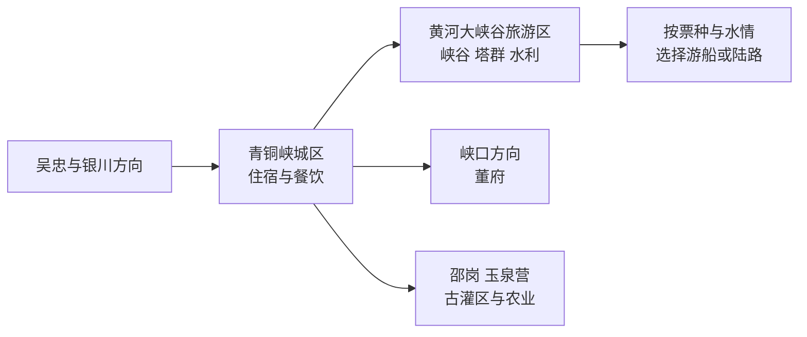
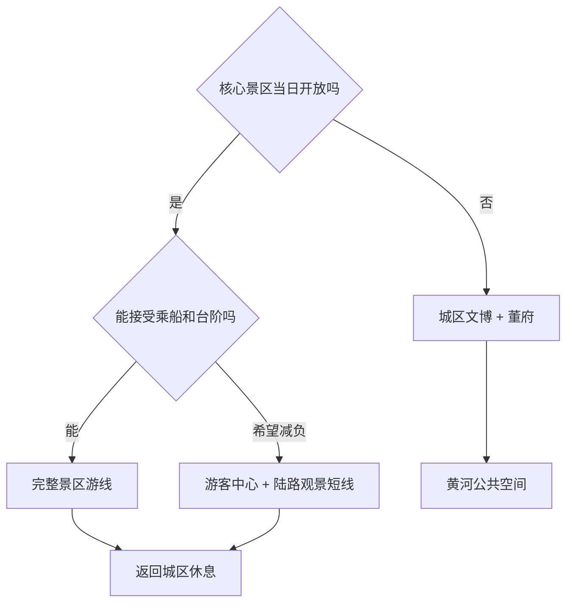

# 青铜峡旅行指南

青铜峡是吴忠市代管的县级市，旅行重点沿黄河、水利工程和古灌区展开。首访可把青铜峡黄河大峡谷旅游区作为整日核心，再用城区、黄河楼或董府补足城市与地方历史。固定快照中的 **Yuquanying / GeoNames 10188294** 对应青铜峡市邵岗镇玉泉营一带；地方区划资料、坐标与法定代码 `640381` 共同支持该记录映射到现行县级市。

> 建议停留：2 天；只看黄河大峡谷可安排 1 个完整日  
> 旅行关键词：黄河峡谷、古灌区、一百零八塔、水利工程、早茶  
> 主要体力：中等，景区游船、接驳和台阶会改变负担  
> 最近研究：2026-09-03

## 城市速览

| 项目 | 旅行信息 |
|---|---|
| 主要旅行价值 | 在黄河大峡谷的一套游览体系中理解峡谷、古塔、水利枢纽和引黄灌溉，再以董府、城市文博或黄河公共空间补充地方历史 |
| 建议停留 | 1 天留给黄河大峡谷；2 天增加城区与董府；3 天可加入古灌区或葡萄产区的正规接待项目 |
| 较舒适季节 | 春秋适合户外，但需关注大风和沙尘；夏季早出发并避开午后高温；冬季核对冰雪、结冰与淡季运营 |
| 预算特点 | 城区餐饮和公共空间较易控制；景区门票、游船或接驳、包车与跨城住宿是主要增量 |
| 步行强度 | 城区较低；黄河大峡谷内部可能有台阶、坡道、码头和上下船，体力按当日游线变化 |
| 主要天气风险 | 大风、沙尘、高温、雷暴、黄河水情和冬季结冰均可能改变户外与水上项目 |
| 独行旅行 | 城区用餐方便，景区日先锁定往返和末班接驳 |
| 亲子旅行 | 大峡谷适合自然与水利科普；儿童乘船、临水看护和防晒按运营规则准备 |
| 长者与低体力旅行 | 以游客中心、观景和短接驳为主，提前询问游船上下船、台阶与中途退出条件 |
| 无障碍信息 | 城区新建公共空间较易获取支持；古塔、码头和历史建筑的连续通行需向景区确认 |

## 城市格局与游览区域

青铜峡城区承担住宿、餐饮和基本补给；黄河大峡谷旅游区位于黄河沿线，是最需要完整时段的核心；董府在峡口方向，具有独立入口；邵岗—玉泉营一带属于灌区、村庄与农业生产空间，适合选择明确接待的项目认识渠系和葡萄产业。

| 区域 | 主要内容 | 游览特点 | 与其他区域的关系 |
|---|---|---|---|
| 青铜峡城区 | 住宿、早茶、城市服务、公共文化 | 适合作为基地和抵达日 | 去大峡谷、董府和农业方向均需车辆 |
| 黄河大峡谷旅游区 | 一百零八塔、水利枢纽、十里长峡及景区展陈 | 大型运营单元，内部路线由票种、船班、水位和接驳决定 | 宜单独留出大半天至一日 |
| 峡口方向 | 董府及周边历史聚落 | 具有独立开放与交通条件 | 可与城区组合，和大峡谷同日时需先确认时间余量 |
| 邵岗—玉泉营 | 古灌区、农田、葡萄生产与村落 | 以公开道路、展馆和预约接待点为主 | 适合产业与灌溉主题，避免临时穿越生产区 |
| 黄河城市公共空间 | 黄河楼及开放岸线 | 适合日落前后短停，风力影响明显 | 可作抵达日或景区日的弹性补充 |

## 主要景点

黄河大峡谷内部的一百零八塔、水利枢纽、峡谷、游船和相关展陈按一个完整景区计数，避免把内部节点拆成多个“景点”。

| 景点 | 区域 | 类型 | 主要看点 | 建议用时 | 室内外 | 体力 | 预约风险 | 天气影响 | 优先级 |
|---|---|---|---|---:|---|---|---|---|---|
| 青铜峡黄河大峡谷旅游区 | 黄河沿线 | 峡谷、水利、古塔群 | 一百零八塔、青铜峡水利枢纽、黄河峡谷与古灌区背景；实际覆盖内容按票种和运营线路选择 | 4–7 小时 | 混合 | 中至高 | 高 | 很高 | A |
| 董府 | 峡口镇方向 | 历史建筑 | 西北院落、砖木建筑与地方近代史 | 1.5–2.5 小时 | 混合 | 中 | 中 | 中 | B |
| 黄河楼及开放公共空间 | 城区近黄河方向 | 城市地标、展陈 | 黄河文化主题、城市与河流关系；登楼与展陈范围以当日公告为准 | 1.5–3 小时 | 混合 | 低至中 | 中 | 高 | B |
| 青铜峡市公共文化场馆 | 城区 | 文博、公共文化 | 地方历史、灌溉农业与城市发展线索；以当期开放场馆为准 | 1–2 小时 | 室内 | 低 | 中 | 低 | B |
| 玉泉营古灌区与公开接待项目 | 邵岗镇方向 | 灌溉、农业 | 渠系、村落与葡萄生产背景；选择官方活动、展馆或经营主体开放项目 | 2–4 小时 | 室外为主 | 低至中 | 高 | 高 | C |
| 鸽子山遗址相关公共展示 | 市域西部 | 考古、史前文化 | 史前人类活动与环境变迁；考古工作区和保护区只按主管部门开放范围参观 | 2–4 小时 | 视开放而定 | 中 | 高 | 很高 | C |

水利枢纽、闸坝、渠首和运行道路属于生产与安全管理空间，参观以景区或管理单位明确开放的入口、平台和线路为准。黄河岸线、考古遗址和农业地块也按围栏、公告与接待范围活动。

## 美食与餐饮

青铜峡与吴忠共享宁夏中部的早茶、牛羊肉和面食传统。独行可用牛肉面、小份凉菜和八宝茶组合；多人正餐再选择手抓羊肉、黄河鱼或地方炒菜。清真餐饮尊重门店标识和用餐习惯，外带食品进入前先询问。

| 菜品或餐饮类型 | 常见区域 | 一个人用餐与常见份量 | 风味、过敏原与饮食限制 | 排队风险与替代方法 |
|---|---|---|---|---|
| 吴忠早茶组合 | 城区 | 牛肉面可单点，小菜和面点按人数减量 | 面食含麸质，汤底含牛肉；八宝茶较甜并可能含干果、芝麻或坚果 | 周末早晨错峰，改选居民区菜单清楚的同类店 |
| 牛肉面与手工面 | 城区、景区外餐饮点 | 一人一碗方便，可调整面量和辣油 | 小麦、牛肉汤、香辛料；素食者需确认汤底 | 早餐午餐高峰选同街区普通面馆 |
| 手抓羊肉、烩羊杂 | 城区 | 多人共享更合适，独行先问小份 | 羊肉、内脏、盐油较高，蘸料可能含辣椒和蒜 | 正餐高峰先取号，按重量和计价单位点单 |
| 黄河鱼 | 城区正规餐馆 | 常为整鱼，独行先问重量 | 鱼刺、淡水鱼过敏和交叉接触；来源随生态管理变化 | 下单前确认品种、重量、加工费，也可换牛羊肉或蔬菜 |
| 葡萄与农产品 | 邵岗及正规销售点 | 适合购买小份鲜果或有标签产品 | 关注糖分、清洗和冷链；酒类产品按个人条件选择 | 采摘和体验先预约，非产季改选正规门店产品 |

## 经典行程

### 一日经典路线

**路线**：青铜峡城区出发 → 黄河大峡谷游客中心 → 按当日票种选择峡谷、塔群、水利与游船线路 → 返回城区。

- **串联逻辑**：把完整一天留给同一大型景区，内部节点随运营顺序连贯完成。
- **预约锚点**：入园、票种、游船或接驳时段，以及最后一班返程。
- **休息安排**：游客中心、候船区和景区明确设置的休息点。
- **时间不足时**：保留一百零八塔与一条主要观景线，按运营方建议删减水上或远端项目。

### 两日城市路线

**第 1 天**：黄河大峡谷旅游区完整游线  
**第 2 天**：城区早茶 → 董府 → 黄河楼或开放公共空间

- **串联逻辑**：第一天理解黄河与古灌区，第二天补充地方历史和城市生活。
- **预约锚点**：第一天景区票务；第二天董府和黄河楼开放。
- **休息安排**：第一天在景区服务点，第二天以城区餐饮和场馆座席为主。
- **时间不足时**：第二天保留早茶与董府，删除日落公共空间。

### 三日深度路线

**第 1 天**：黄河大峡谷旅游区  
**第 2 天**：董府 → 城区文博 → 黄河公共空间  
**第 3 天**：玉泉营方向预约接待项目 → 古灌区公开节点 → 返回城区

- **串联逻辑**：把景区、水利城市和农业灌区分成三种尺度。
- **预约锚点**：第三天接待主体、参观边界与交通。
- **休息安排**：第三天在预约接待点完成补给，午后高温时减少田野停留。
- **时间不足时**：先删第三天产业线，保持前两天完整。

### 大风、沙尘或降雨路线

**路线**：城区早茶 → 开放的公共文化场馆 → 董府或黄河楼室内展陈；天气转稳后再短停公共空间。

- **串联逻辑**：以室内场馆和短距离车辆移动替代水上与长时间岸线暴露。
- **预约锚点**：场馆临时开放、大峡谷停航和道路预警。
- **休息安排**：固定在城区餐饮与场馆内。
- **时间不足时**：保留早茶与一座室内场馆；气象预警期间取消乘船、临水和遗址野外段。

### 亲子或低体力路线

**亲子路线**：黄河大峡谷游客中心 → 水利与黄河科普展陈 → 符合年龄规则的短游线 → 城区休息。  
**低体力路线**：城区早茶 → 黄河楼或公共文化场馆 → 车辆抵达的景区观景短线。

- **串联逻辑**：亲子线突出科普，低体力线把上下船、长台阶和高温暴露降到最低。
- **预约锚点**：儿童乘船要求、无障碍通道、接驳车和可中途退出位置。
- **休息安排**：每段活动后回到游客中心、场馆或车辆休息。
- **时间不足时**：两条路线都保留一个科普场馆，删除第二处户外节点。

### 远郊一日路线

**路线**：城区出发 → 玉泉营方向预约接待项目 → 古渠或葡萄产业公开展示 → 返回城区。

- **串联逻辑**：用一条农业灌区线路理解水利如何连接村落与生产。
- **预约锚点**：接待单位、活动时段、采摘季、车辆和允许参观范围。
- **休息安排**：正规接待点完成饮水、用餐与防晒补给。
- **时间不足时**：整段取消，改为城区文博和黄河公共空间。

### 黄河灌溉遗产主题路线

**路线**：黄河大峡谷游客中心 → 当日开放的水利与塔群游线 → 城区展陈 → 次日预约玉泉营方向灌区项目。

- **串联逻辑**：第一段看黄河落差与工程，第二段再看渠系如何服务平原农业。
- **预约锚点**：景区线路、船班，以及第二天产业接待。
- **休息安排**：景区服务点与城区住宿分隔两段，避免同日长途赶场。
- **时间不足时**：只保留大峡谷景区内部主线，灌区项目留待下次。

## 住宿区域

| 区域 | 优点 | 缺点 | 适合人群 | 交通特点 |
|---|---|---|---|---|
| 青铜峡城区 | 餐饮、住宿和补给集中，方便分方向出发 | 去大峡谷仍有最后一段公路 | 首访、独行、两日行程 | 先确认车站、景区接驳和叫车范围 |
| 黄河大峡谷周边正规住宿 | 便于早入园或摄影时段 | 餐饮与晚间服务少于城区 | 景区深度游、自驾 | 预订前确认是否真实接近开放入口 |
| 吴忠利通主城 | 早茶和城际交通选择更多 | 每天往返会增加时间 | 把青铜峡作为吴忠联游者 | 城际交通未必直达景区入口 |
| 银川方向 | 航空和跨省铁路衔接方便 | 当日往返青铜峡的交通负担更高 | 以银川为全区基地者 | 宜提前锁定整日车辆与返程 |

## 市内交通

| 场景 | 建议与取舍 | 行前需要重查的内容 |
|---|---|---|
| 从银川或机场抵达 | 铁路、公路客运、自驾或合规包车均可，按到达时刻与住宿位置选择 | 车次、客运站、机场接驳和夜间到达方案 |
| 从吴忠抵达 | 两地联系较近，适合城际客运或车辆往返 | 实际上下车点、是否直达景区、末班和节假日调整 |
| 城区—黄河大峡谷 | 自驾或合规车辆最便于锁定往返；公共交通需确认最后一段 | 景区入口、停车、返程、道路施工和票务时段 |
| 景区内部 | 接驳车、步行、码头和游船按所购线路组合 | 船班、水位、风力、停航、台阶和中途退出规则 |
| 灌区与农业方向 | 预约项目配合自驾或合规车辆更稳妥 | 接待地址、公开道路、停车、生产季和返程 |

## 不同旅行者须知

| 旅行维度 | 可行条件 | 主要取舍 | 需额外核对 |
|---|---|---|---|
| 独行旅行 | 住城区，景区日先锁定往返 | 晚间和偏远农业方向叫车选择较少 | 末班、司机资质、通信和住宿登记 |
| 亲子旅行 | 以水利科普、塔群和短游线为主 | 乘船、临水、台阶与日晒增加看护负担 | 儿童年龄身高、救生设备、护栏和卫生间 |
| 长者或低体力旅行 | 选择陆路观景、接驳与城区场馆 | 上下船、古塔台阶和候车时间 | 无台阶入口、接驳、轮椅、座椅和最近下客点 |
| 无障碍需求 | 先向游客中心确认可达线路 | 历史建筑、码头和岸线通行连续性有限 | 坡道、电梯、无障碍卫生间和陪同政策 |
| 摄影旅行 | 峡谷、塔群与黄河日落题材集中 | 风沙、水汽、客流和器材负担 | 三脚架、无人机、商业拍摄和水利设施规则 |
| 预算有限 | 住城区，选择公共交通与公共空间 | 公交耗时会压缩景区游览 | 联票范围、优惠资格、末班和退改 |
| 晚出发或紧凑行程 | 保留城区早茶与一个公共场馆 | 午后启动完整大峡谷线路风险较高 | 最晚入园、最后船班与返程 |
| 特殊天气或自然条件 | 室内场馆作为明确替代 | 大风、沙尘、高温、水情和结冰影响户外 | 气象预警、水情、停航与道路公告 |

## 行前核对

| 核对事项 | 为什么需要重查 | 建议核对时间 | 官方入口 |
|---|---|---|---|
| 黄河大峡谷票务、游船与接驳 | 水情、风力、维护和客流会改变可走线路 | 订行程时、到访前三日及当天 | [青铜峡黄河大峡谷旅游区](https://www.qtxhhdxg.com/)；[宁夏文旅厅景区页](https://whhlyt.nx.gov.cn/jqjd/wzs_66582/qtxhhdxg/) |
| 董府、黄河楼和公共场馆 | 闭馆、维护、活动与入场方式会调整 | 到访前一周及前一日 | [青铜峡市人民政府](https://www.qtx.gov.cn/) |
| 城际与景区交通 | 班次、上下车点和末班具有时效性 | 出发前一周及当天 | [吴忠市人民政府](https://www.wuzhong.gov.cn/)；[中国铁路 12306](https://www.12306.cn/) |
| 天气、水情与道路 | 大风、沙尘、高温、雷暴和结冰影响户外 | 出发前三日及当天 | [宁夏气象服务](http://nx.cma.gov.cn/) |
| 灌区、遗址与产业接待 | 生产、考古和保护工作决定可参观范围 | 排入路线前 | 青铜峡市政府及接待主体官方渠道 |

## 来源与更新记录

### 主要来源

| 来源 | 类型 | 支持内容 | 核验日期 |
|---|---|---|---|
| [民政部行政区划查询](https://dmfw.mca.gov.cn/xzqh/getList?code=64&trimCode=true&maxLevel=3) | 国家行政区划 | 青铜峡市法定县级市身份与代码 `640381` | 2026-09-03 |
| [吴忠市人民政府：行政区划](https://www.wuzhong.gov.cn/sywz/wzgk/qhrk/) | 地级市政府 | 青铜峡市与吴忠市的行政关系 | 2026-09-03 |
| [宁夏文化和旅游厅：青铜峡黄河大峡谷](https://whhlyt.nx.gov.cn/jqjd/wzs_66582/qtxhhdxg/) | 自治区文旅部门 | 峡谷、水利枢纽、一百零八塔与古灌区整体关系 | 2026-09-03 |
| [青铜峡市人民政府：一百零八塔](https://www.qtx.gov.cn/zjqtx/yygx/202209/t20220914_3771023.html) | 县级市政府 | 一百零八塔位置及其与黄河大峡谷旅游区的关系 | 2026-09-03 |
| [宁夏气象服务](http://nx.cma.gov.cn/) | 气象部门 | 大风、沙尘、高温、强降雨与道路天气预警 | 2026-09-03 |
| [GeoNames 10188294](https://www.geonames.org/10188294/) | 固定开放数据 | Yuquanying／玉泉营名称、坐标与人口点类型 | 2026-09-03 |

### 更新记录

| 日期 | 更新内容 |
|---|---|
| 2026-09-03 | 首次完成资料研究；把黄河大峡谷内部节点合并为一个运营单元，并建立城区、董府、古灌区与农业方向的分层路线 |
