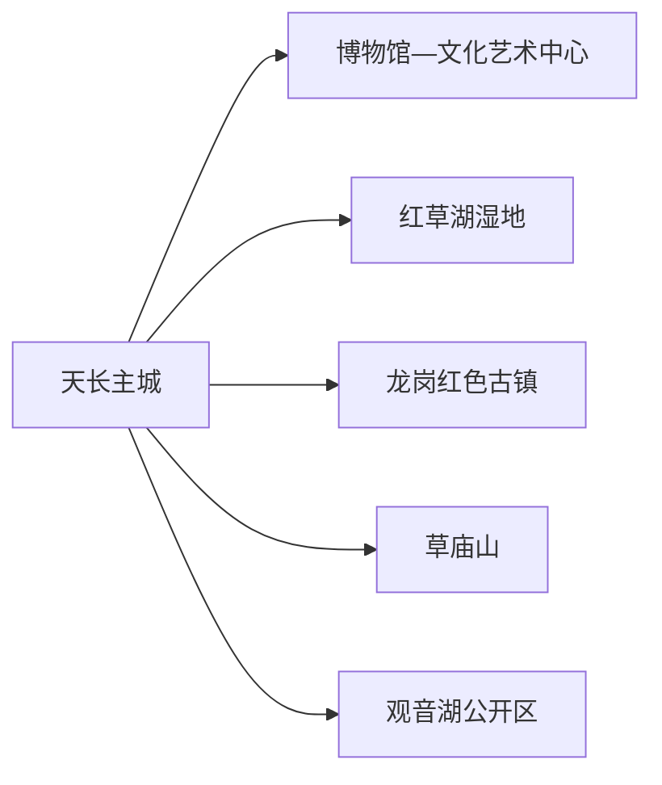
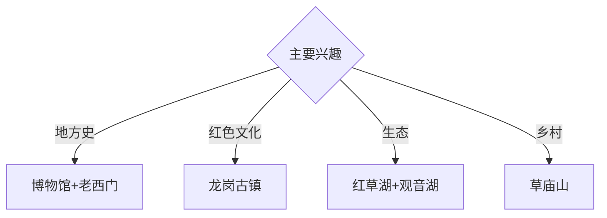

# 天长旅行指南

天长位于安徽省东部、三面邻接江苏，旅行主题以主城文博、龙岗红色古镇、红草湖湿地和草庙山乡村为主。固定快照中的 **Tianchang / GeoNames 1793015** 对应现行天长市，与河北井陉同名人口点分开管理。

## 城市速览

| 项目 | 信息 |
|---|---|
| 主线 | 天长博物馆—红草湖—龙岗红色古镇—草庙山 |
| 停留 | 主城1天；龙岗或草庙山各另加1天 |
| 住宿 | 天长主城便于综合换乘；龙岗方向按红色专题选择 |
| 交通 | 公路为主，跨省客运和远端线路需提前核对 |
| 风险 | 湿地水情、乡村道路、文物修缮、农业与工业生产边界 |

## 城市格局与游览区域

主城集中博物馆、文化艺术中心和红草湖城市湿地；龙岗红色古镇位于市域东部，草庙山与观音湖又是不同乡村方向。天长与南京、扬州、滁州联系紧密，但跨省到达不等于同一城市公共交通体系，返程班次要单独确认。

## 主要景点

| 景点 | 区域 | 类型 | 核心体验 | 用时 | 环境 | 体力 | 研究价值 | 拥挤 | 优先级 |
|---|---|---|---|---:|---|---|---|---|---|
| 天长市博物馆 | 主城 | 博物馆 | 地方史、文物、孝文化与城市发展 | 2–3小时 | 室内 | 低 | 很高 | 团体时中 | A |
| 红草湖湿地公园公开区 | 主城 | 城市湿地 | 水网、鸟类、城市生态与慢行 | 2小时 | 室外 | 低 | 高 | 傍晚中 | A |
| 老西门历史街区公开段 | 主城 | 历史街区 | 城市记忆、传统街巷与更新 | 1–2小时 | 混合 | 低 | 高 | 周末中 | B |
| 龙岗红色古镇景区 | 龙岗方向 | 红色与古镇 | 抗大八分校记忆、古镇街巷与教育史 | 半天至1天 | 混合 | 中 | 很高 | 团体时中 | A |
| 草庙山正式游览区 | 金集镇 | 山地乡村 | 丘陵、田园与乡村文化 | 半天至1天 | 室外 | 中高 | 高 | 旺季中 | B |
| 观音湖公开康养与滨水区 | 市域乡村 | 湖泊 | 湖岸休闲、乡村环境与低体力慢游 | 半天 | 室外 | 低中 | 中 | 周末中 | B |
| 天长文化艺术中心当期展陈 | 主城 | 公共文化 | 美术、非遗、演出与城市文化 | 2小时 | 室内 | 低 | 中 | 活动时中高 | B |

## 美食与餐饮

芡实、秦栏卤鹅、甘露饼和皖东家常菜具有地方辨识度。水产与芡实制品选择正规经营渠道；乡村餐饮提前确认营业和返程。跨省线路日保留简餐与饮水，避免因班次延误压缩用餐时间。

## 经典行程

### 一日主城线
**路线**：天长市博物馆—午餐—老西门公开段—红草湖。**逻辑**：从地方史进入城市街巷和生态更新。**预约锚点**：博物馆与街区开放。**休息**：主城商业区。**删除条件**：高温或强对流时缩短湿地段。

### 龙岗红色线
**路线**：主城—龙岗红色古镇—纪念展陈—古镇公开街区—返城。**逻辑**：把教育史与古镇空间放在同一方向。**预约锚点**：讲解、场馆和车辆。**休息**：龙岗公共服务点。**删除条件**：展馆闭馆时保留正式开放街区。

### 草庙山乡村线
**路线**：主城—金集镇—草庙山正式入口—田园公开体验—返城。**逻辑**：给丘陵乡村完整半天至一天。**预约锚点**：接待、道路和返程。**休息**：游客服务点。**删除条件**：雷雨、农忙封闭或道路泥泞时取消。

### 湿地湖泊线
**路线**：红草湖—午餐—观音湖公开区—返城。**逻辑**：比较城市湿地与乡村湖岸。**预约锚点**：水情和交通。**休息**：主城与正规服务区。**删除条件**：洪水、大风或生态管控时只留城市公园开放段。

### 公共文化线
**路线**：市博物馆—文化艺术中心—午餐—老西门文化活动。**逻辑**：用室内场馆观察地方文化的当代表达。**预约锚点**：展览和演出。**休息**：主城。**删除条件**：活动撤展时改红草湖短线。

### 亲子低体力线
**路线**：市博物馆—午休—红草湖近入口段—文化艺术中心。**逻辑**：室内知识配平缓湿地。**预约锚点**：亲子活动。**休息**：馆内和公园座椅。**删除条件**：蚊虫或高温明显时只留室内。

### 雨天线
**路线**：市博物馆—午餐—文化艺术中心—主城室内活动。**逻辑**：压缩移动并保留地方史。**预约锚点**：馆舍开放。**休息**：主城。**删除条件**：道路积水时就近返宿。

## 住宿区域

天长主城适合跨省客运、餐饮和多方向换乘；龙岗方向住宿适合红色专题。乡村住宿按合法经营、消防、夜间交通与天气响应能力选择。

## 市内交通

天长以公路交通为主，可从滁州、南京、扬州等方向组合抵达。市内用公交、出租车和网约车；龙岗、草庙山与观音湖提前核对城乡公交末班或预约返程，跨省车次按实际到发站确认。

## 不同旅行者须知

历史兴趣者优先市博物馆与龙岗；生态旅行者选择红草湖和观音湖；亲子家庭优先主城场馆；行动不便者确认古镇石板路、湿地步道、车辆上下客和无障碍卫生间。

## 行前核对

- 核对博物馆、龙岗、老西门、文化艺术中心与乡村景点开放。
- 核对跨省客运、城乡公交、水情、天气和远端返程。
- 湿地保护区、文物修缮区、农田、村庄生产空间和工业园区按正式开放边界进入。

## 来源与更新记录

| 来源 | 支持内容 | 核验日期 |
|---|---|---|
| [滁州市政府：天长市十四五规划](https://www.chuzhou.gov.cn/group1/M00/10/10/CpYI8mEkPRGAGHSbAA0jOwLmB-s049.pdf) | 龙岗、红草湖、老西门、草庙山、观音湖与文化设施 | 2026-09-01 |
| [GeoNames 1793015](https://www.geonames.org/1793015/) | Tianchang 固定人口点与位置 | 2026-09-01 |

| 日期 | 更新 |
|---|---|
| 2026-09-01 | 首次完成天长旅行研究；建立主城、龙岗、湿地湖泊与乡村路线。 |
