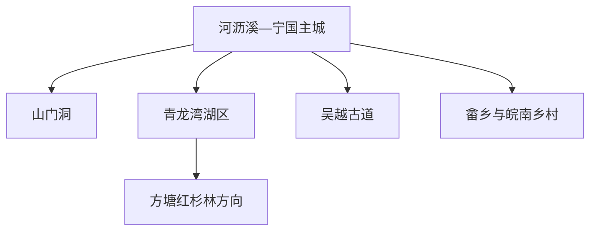
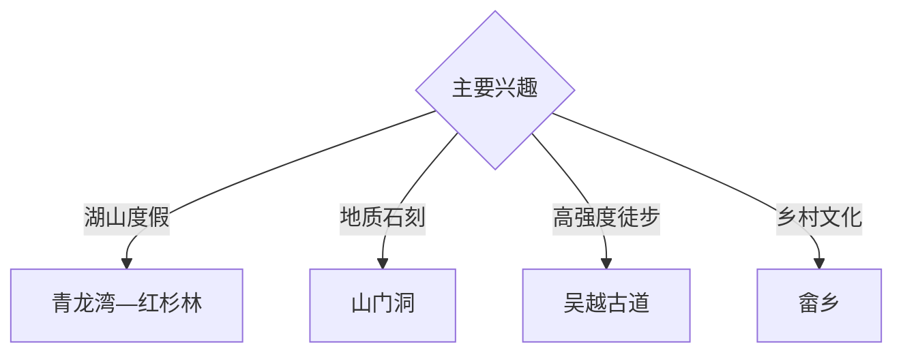

# 宁国旅行指南

宁国位于皖东南山地，以青龙湾湖山、山门洞石刻、吴越古道、红杉林、畲乡与自驾风景道形成独立旅行体系。固定快照中的 **Helixi / GeoNames 1808535** 锚定河沥溪—主城一带；湖区、洞穴和皖浙边古道分别需要独立安排。

## 城市速览

| 项目 | 信息 |
|---|---|
| 主线 | 主城—山门洞—青龙湾—红杉林—吴越古道与畲乡 |
| 停留 | 主城与山门洞 1 天；青龙湾或古道方向各另留 1 天 |
| 住宿 | 主城便于综合接驳；青龙湾与乡村正规住宿适合慢游 |
| 交通 | 公路与铁路抵达，山湖远点宜约车或自驾 |
| 季节 | 春秋适合古道，秋冬适合红杉林；梅雨期关注山洪水位 |
| 预算 | 主城灵活，湖区船览、远线车辆和乡村住宿增加预算 |

## 城市格局与游览区域

主城承担交通、住宿与地方生活；山门洞靠近城北，青龙湾湖面广阔，方塘红杉林和吴越古道分别位于更远山地。水源保护区、库岸工程、未开放洞段、古道封控段和村落生活空间按公告进入。

## 主要景点

| 景点 | 区域 | 类型 | 核心体验 | 用时 | 环境 | 体力 | 研究价值 | 拥挤 | 优先级 |
|---|---|---|---|---:|---|---|---|---|---|
| 山门洞 | 城北 | 岩溶与石刻 | 天然石门、洞穴地貌与摩崖石刻 | 半天 | 混合 | 中 | 很高 | 节假日中 | A |
| 青龙湾依法开放区 | 西部湖区 | 湖泊与山地 | 库湾、群山、游船与生态景观 | 1 天 | 室外 | 低中 | 高 | 旺季中高 | A |
| 方塘红杉林公开游览区 | 方塘方向 | 湿地与森林 | 水上红杉、季节色彩与乡村 | 半天至 1 天 | 室外 | 低中 | 高 | 秋冬高 | A |
| 吴越古道正式开放段 | 皖浙边山地 | 古道与徒步 | 山岭通道、历史交通与森林 | 1 天 | 室外 | 高 | 很高 | 周末中 | A |
| 宁国地方文博场馆 | 主城 | 博物馆 | 地方史、山地社会与产业 | 2 小时 | 室内 | 低 | 中高 | 低 | B |
| 畲乡公开文化体验点 | 云梯等方向 | 民族与乡村 | 畲族文化、村落与山地生活 | 半天至 1 天 | 混合 | 低中 | 高 | 活动时中 | B |
| 夏霖等依法开放山水点 | 皖南山地 | 瀑布与峡谷 | 溪谷、瀑布与森林 | 1 天 | 室外 | 中高 | 中高 | 旺季中 | B |

## 美食与餐饮

宁国山核桃、笋干、山蔬、腊味和皖南土菜适合在主城与乡村分顿体验。山地驾驶日减少饮酒；野生动植物以保护为主，农产品按正规商户和产地标识购买。

## 经典行程

### 主城山门洞线
**路线**：地方文博—午餐—山门洞正式游线—返城。**逻辑**：先建立地方背景，再读地貌与石刻。**预约锚点**：景区开放。**休息**：主城。**删除条件**：暴雨或洞段封闭时保留文博。

### 青龙湾一日线
**路线**：主城—湖区正规入口—公开水岸或游船—返程。**逻辑**：用完整一天适应库区尺度。**预约锚点**：船班与水位。**休息**：游客服务区。**删除条件**：大风、浓雾或停航时改岸上游线。

### 红杉林季节线
**路线**：主城—方塘公开区—红杉林观察—乡村午餐。**逻辑**：围绕物候和光线安排。**预约锚点**：季节、交通和承载量。**休息**：方塘正规服务点。**删除条件**：非观赏期时改青龙湾常规线。

### 吴越古道线
**路线**：主城—正式入口—开放古道段—原路或公告路线返回。**逻辑**：独立安排体力、补给和返程。**预约锚点**：天气、接驳和步道。**休息**：沿线正规驿站。**删除条件**：雷雨、冰雪、山洪或封控时取消。

### 畲乡文化线
**路线**：主城—畲乡公开文化点—村落午餐—返程。**逻辑**：以正式展演和社区接待理解文化。**预约锚点**：活动与接待。**休息**：乡镇。**删除条件**：无活动时改山门洞。

### 亲子低体力线
**路线**：地方文博—午餐—青龙湾低坡公共岸段。**逻辑**：室内外切换且步行可控。**预约锚点**：场馆与湖区开放。**休息**：主城或湖区。**删除条件**：风雨时只留室内。

### 三日组合线
**路线**：首日主城与山门洞；次日青龙湾与红杉林；第三日吴越古道或畲乡。**逻辑**：地质、湖山、徒步文化分日。**预约锚点**：第二三日交通。**休息**：主城与湖区分段住宿。**删除条件**：两天时删第三日。

## 住宿区域

宁国主城适合铁路、公路、餐饮与多方向出发；青龙湾、方塘及乡村正规住宿适合湖山慢游。订房核对夜间接驳、消防、停车、供暖和恶劣天气退改。

## 市内交通

主城用公交、出租车和步行；青龙湾、方塘、吴越古道、夏霖与畲乡方向分散，提前确认城乡班次或包车返程。山路自驾按弯道、临水、落石和临时管制行驶。

## 不同旅行者须知

摄影者围绕红杉物候安排；徒步者给吴越古道完整一天；亲子与长者优先山门洞低坡段、湖区和文博；文化旅行者通过社区正式接待了解畲乡。库区水工设施、饮用水源保护区、未开放洞段、林地封控区与村民私宅保留明确限制。

## 行前核对

- 核对山门洞、青龙湾、红杉林、吴越古道与夏霖开放。
- 核对游船、水位、大风、浓雾、暴雨、冰雪和防火公告。
- 核对铁路接驳、山区车辆、返程和乡村住宿。
- 核对畲乡活动、社区接待与摄影礼仪。

## 来源与更新记录

| 来源 | 支持内容 | 核验日期 |
|---|---|---|
| [宁国市人民政府](https://www.ningguo.gov.cn/) | 城市概况、公共服务与旅游动态核对入口 | 2026-09-03 |
| [宁国市“十四五”文化和旅游发展规划](https://www.ningguo.gov.cn/file_xc/3/202112/202112218552d0d86d6442ce82eaf90d571dee01.pdf) | 青龙湾、红杉林、吴越古道与全域旅游结构 | 2026-09-03 |
| [GeoNames 1808535](https://www.geonames.org/1808535/) | Helixi 固定人口点与宁国主城位置 | 2026-09-03 |
