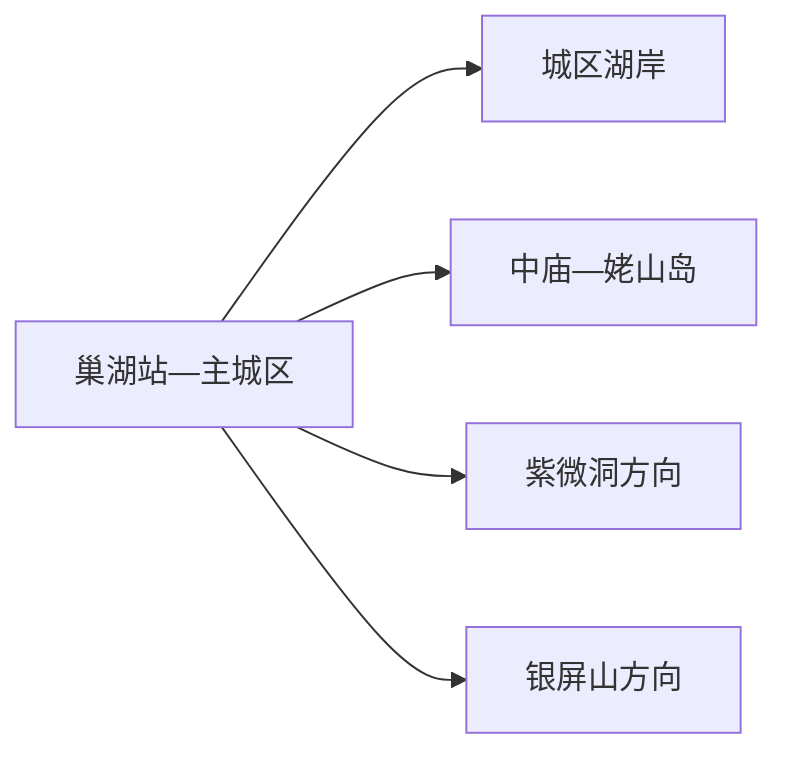
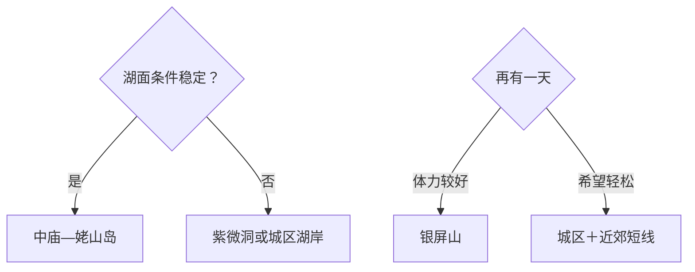

# 巢湖旅行指南

巢湖市最容易规划成三个方向：城区湖岸与地方生活适合抵达日，中庙—姥山岛以船班为核心，紫微洞与银屏山则分属北、南两个山地入口。首访用两天完成湖岛和一条山地线最从容；从合肥出发也应把它当作独立县级市，而不是一段可随手附加的市区湖滨步道。

> 建议停留：2–3 天；中庙—姥山岛和每条山地线各留半日至一日 
> 旅行关键词：巢湖湖岸、姥山岛、中庙、紫微洞、银屏山、湖鲜 
> 主要体力：城区低；岛屿、溶洞和山地中等至较高 
> 最近研究：2026-08-13

## 城市速览

| 项目 | 旅行信息 |
|---|---|
| 主要旅行价值 | 用湖岸聚落、岛屿、洞穴与山地理解巢湖东岸的县级市 |
| 建议停留 | 1 天选湖岛或山地；2 天完成两类体验；3 天增加城区慢游或另一山地方向 |
| 较舒适季节 | 春秋适合步行；夏季注意高温雷雨；冬季关注大风、大雾与船班 |
| 预算特点 | 城区平实，船票、景区交通和跨片区车辆增加成本 |
| 步行强度 | 城区低，岛屿和洞穴中等，银屏山较高 |
| 主要天气风险 | 湖面大风、雷电、大雾、高温、暴雨、山洪和湿滑台阶 |
| 独行旅行 | 铁路抵达方便；岛屿和山地需先锁返程 |
| 亲子旅行 | 湖岛、洞穴和公共湖岸可按年龄缩短 |
| 长者与低体力旅行 | 选择城区湖岸或中庙岸上短线，山地另作取舍 |
| 无障碍信息 | 城区公共空间可先咨询；码头、船舶、岛屿、洞穴和山路设施连续性需向官方确认 |

## 城市格局与游览区域

巢湖市是合肥市代管的县级市，法定代码 `340181`。固定 GeoNames `1815427` 是主城居民点，法定实体 Wikidata `Q855220` 当前连接 `P1566=1815425` 的行政记录；本页用前者定位旅行门户、用法定代码与 QID 组织市域边界。固定点另连薄实体 `Q28804536`，不另建同名页面。

| 区域 | 主要内容 | 游览特点 | 与其他区域的关系 |
|---|---|---|---|
| 主城区 | 铁路、住宿、餐饮、公共湖岸与城市公园 | 适合抵达日和低体力短线 | 是南北远线基地 |
| 中庙—姥山岛 | 中庙岸上景观、码头、姥山岛与文峰塔 | 船班、风浪和返航决定节奏 | 作为完整一日或半日主线 |
| 紫微洞方向 | 溶洞、地质景观与正式游线 | 洞内湿滑、照明和台阶需留意 | 可与城区组合，不与银屏山赶场 |
| 银屏山方向 | 山地、季节植物和公开步道 | 体力与天气门槛较高 | 适合单独半日至一日 |
| 合肥联程 | 高铁、铁路和公路换城 | 巢湖属于合肥市域但不是合肥中心城区 | 重新计算住宿、交通与返程 |

巢湖水面和岸线跨多个县区，湖名不等于行政归属。姥山岛和中庙按巢湖市入口组织；合肥滨湖国家森林公园、长临河等属于其他属地。捕鱼、垂钓、水上项目和临时岸线开放还受生态、水情与经营规则影响，旅行只使用正式码头和公共岸线。

## 主要景点

### 湖岸与岛屿

| 景点 | 区域 | 类型 | 主要看点 | 建议用时 | 室内外 | 体力 | 预约风险 | 天气影响 | 优先级 |
|---|---|---|---|---:|---|---|---|---|---|
| 中庙—姥山岛完整游览单元 | 中庙街道 | 湖岛、历史建筑、船行 | 中庙岸上景观、正规船行、姥山岛与文峰塔；内部项目合计一次 | 5–8 小时 | 室外为主 | 中 | 很高 | 极高 | A |
| 巢湖城区公共湖岸短线 | 主城区 | 城市湖岸、公园 | 城市与湖面关系、日常休闲和短程观景 | 1–3 小时 | 室外 | 低 | 低 | 高 | B |

### 洞穴与山地

| 景点 | 区域 | 类型 | 主要看点 | 建议用时 | 室内外 | 体力 | 预约风险 | 天气影响 | 优先级 |
|---|---|---|---|---:|---|---|---|---|---|
| 紫微洞景区 | 北郊方向 | 溶洞、地质 | 洞穴地貌、正式照明游线与地质观察 | 2–4 小时 | 室内外 | 中 | 高 | 中高 | A |
| 银屏山景区 | 南部散兵方向 | 山地、自然 | 山地步道、季节景观和当期开放观赏点 | 5–8 小时 | 室外 | 中高至高 | 高 | 很高 | B |
| 东庵森林公园等正式开放近郊点 | 城郊 | 森林、休闲 | 林地短线与季节活动 | 2–4 小时 | 室外 | 中 | 高 | 高 | C |
| 当期开放乡村文化点 | 市域乡村 | 村落、农旅 | 村落历史、农业和节庆体验 | 3–6 小时 | 混合 | 中 | 很高 | 高 | C |

姥山岛的码头、船舶与岛上步道是一个连续决策单元，预订时一起核对。紫微洞适合雨势较小且交通正常的时段，但强降雨仍会影响洞外道路；银屏山则以山地天气和步道状态为先。

## 美食与餐饮

| 菜品或餐饮类型 | 常见区域 | 一个人用餐与常见份量 | 风味、过敏原与饮食限制 | 排队风险与替代方法 |
|---|---|---|---|---|
| 巢湖鱼汤与淡水鱼菜 | 主城区、中庙正规餐馆 | 整鱼适合共享，一人先问小份 | 鱼刺、鱼虾过敏、汤底和盐分 | 明确重量、做法和计价单位 |
| 银鱼、虾米等湖产菜 | 正规餐馆 | 多为小盘配菜 | 水产过敏、季节来源 | 选择可说明来源的餐馆 |
| 炸制米面小食 | 城区与市场 | 可少量尝试 | 小麦、油、芝麻或馅料 | 选现制、明码标价摊点 |
| 安徽家常菜 | 主城区 | 一至两人可组合小份 | 大豆、花生、辣椒和动物油 | 改点盖饭或清炒菜 |

## 经典行程

### 一日经典路线

**路线**：中庙岸上景观 → 正规码头乘船 → 姥山岛公开游线 → 原码头返航

- **串联逻辑**：岸上、船行和岛屿围绕同一湖区入口展开。
- **预约锚点**：船班、风浪、末班返航和岛上开放。
- **休息安排**：中庙或岛上正式服务点午休，岛上只走一条主线。
- **时间不足时**：保留岸上中庙与短程湖景，取消登岛。

### 两日城市路线

**路线**：第 1 天中庙—姥山岛。 
**第 2 天**：紫微洞 → 主城区午餐 → 城区湖岸短线。

- **串联逻辑**：第一天看湖岛，第二天用洞穴和城市生活补充。
- **预约锚点**：船班、紫微洞开放和返程交通。
- **休息安排**：第二天午间回城区长休。
- **时间不足时**：第二天保留紫微洞，湖岸只走住宿附近一段。

### 三日深度路线

**路线**：第 1 天主城区与湖岸。 
**第 2 天**：中庙—姥山岛。 
**第 3 天**：银屏山完整山地日。

- **串联逻辑**：从城市湖岸到岛屿，再用一整天完成山地体验。
- **预约锚点**：第三天景区、道路和天气。
- **休息安排**：山地中段在正式服务点坐休，早返城区。
- **时间不足时**：删除第三天。

### 雨天路线

**路线**：紫微洞当期开放游线 → 主城区午餐 → 公共文化空间

- **适用条件**：普通降雨且道路正常；强降雨和积水时留在城区。
- **串联逻辑**：以洞穴和室内空间替代船行与山地。
- **预约锚点**：洞穴开放、交通和安全公告。
- **休息安排**：午间回城区完整坐休。
- **时间不足时**：只保留一个室内点。

### 亲子或低体力路线

**亲子路线**：中庙岸上短线 → 午餐 → 当期适龄短船行或城区湖岸。 
**低体力路线**：车辆到城区公共湖岸落客点 → 短程观景 → 午餐 → 返回住宿。

- **减负方式**：亲子线按儿童耐受决定是否登岛；低体力线取消洞穴台阶和山地。
- **预约锚点**：船舶儿童规则、救生衣、无障碍入口和座椅。
- **休息安排**：每个节点后坐休。
- **时间不足时**：两线均保留岸上短线。

### 远郊一日路线

**路线**：主城区 → 银屏山正式入口 → 当日开放主步道 → 原路返回

- **适用条件**：天气、步道、车辆和返程稳定。
- **串联逻辑**：把完整白天交给南部山地，避免再跨到中庙。
- **预约锚点**：开放范围、停车、接驳和最晚离园。
- **休息安排**：正式服务点午休，按体力提前折返。
- **时间不足时**：改为紫微洞或城区湖岸。

## 住宿区域

| 区域 | 优点 | 缺点 | 适合人群 | 交通特点 |
|---|---|---|---|---|
| 巢湖站—主城区 | 铁路、餐饮、补给和叫车方便 | 到中庙与银屏山仍需车辆 | 首访、公共交通、连续住宿 | 适合组织南北两条线 |
| 中庙正规住宿区 | 便于早核船班和湖岛体验 | 风浪停航时替代内容较少 | 湖岛慢游、摄影 | 订房前确认码头和返程 |
| 银屏山方向正规接待点 | 便于山地早出发 | 餐饮和夜间交通有限 | 自驾、山地专题 | 核对停车、道路与供给 |

## 市内交通

| 场景 | 建议与取舍 | 行前需要重查的内容 |
|---|---|---|
| 铁路抵达 | 巢湖站、巢湖东站按票面站名和住宿位置选择 | 车次、公交、叫车点和末班 |
| 主城区移动 | 公交、出租或网约车连接湖岸与住宿 | 线路、施工和活动改道 |
| 中庙—姥山岛 | 地面交通到正式码头，再按船班往返 | 码头、船班、风浪、票务和末班 |
| 紫微洞与银屏山 | 分别按北、南方向安排车辆 | 精确入口、道路、停车和返程 |

## 不同旅行者须知

| 旅行维度 | 可行条件 | 主要取舍 | 需额外核对 |
|---|---|---|---|
| 独行旅行 | 铁路和城区服务成熟 | 岛屿与山地晚返容错低 | 船班、车辆和末班 |
| 亲子旅行 | 湖岸、短船行和洞穴有科普性 | 水边、台阶和洞内湿滑需看护 | 年龄、救生衣、婴儿车 |
| 长者或低体力旅行 | 城区湖岸和中庙岸上易缩短 | 登岛、洞穴与山地择一 | 座椅、落客点、轮椅 |
| 无障碍需求 | 现代站点与公共湖岸优先咨询 | 船舶和历史游线转换较多 | 设施连续性需向官方确认 |
| 摄影旅行 | 湖面、岛屿和山地层次丰富 | 大雾、风浪和无人机规则影响大 | 禁飞、文保和商业拍摄 |
| 生态与水域 | 正式码头和公共岸线可行 | 禁捕、水位与湿地管理优先 | 水情、开放岸段和船舶资质 |

## 行前核对

| 核对事项 | 为什么需要重查 | 建议核对时间 | 官方入口 |
|---|---|---|---|
| 中庙—姥山岛 | 船班、风浪、票务和返航随天气变化 | 出发前三日及当天 | [巢湖市人民政府](https://www.chaohu.gov.cn/) |
| 紫微洞与银屏山 | 开放、步道和活动可能调整 | 排路线前及前一日 | [安徽省文化和旅游厅](https://ct.ah.gov.cn/) |
| 铁路 | 两个车站的停靠与接驳变化 | 购票前及当天 | [中国铁路12306](https://www.12306.cn/) |
| 湖面天气与水情 | 大风、大雾、雷电和水位影响船行 | 出发前三日及当天 | [安徽省气象局](http://ah.cma.gov.cn/) |

## 来源与更新记录

### 主要来源

| 来源 | 类型 | 支持内容 | 核验日期 |
|---|---|---|---|
| [巢湖市人民政府](https://www.chaohu.gov.cn/) | 属地政府 | 景区、交通、活动和风险核对入口 | 2026-08-13 |
| [文化和旅游部：湖光山色休闲之旅](https://zhuanti.mct.gov.cn/ah_detail/474.html) | 国家文旅部门 | 环巢湖岸线、聚落与地方饮食线索 | 2026-08-13 |
| [安徽省文化和旅游厅](https://ct.ah.gov.cn/) | 省级文旅部门 | 景区等级与文旅动态核对入口 | 2026-08-13 |
| [Wikidata Q855220](https://www.wikidata.org/wiki/Special:EntityData/Q855220.json) | 开放结构化数据 | 法定巢湖市与行政记录粒度 | 2026-08-13 |
| [GeoNames 1815427](https://sws.geonames.org/1815427/about.rdf) | 开放地名数据 | 固定巢湖主城记录 | 2026-08-13 |
| [民政部行政区划代码查询](https://dmfw.mca.gov.cn/xzqh/getList?code=340181&trimCode=false&maxLevel=3) | 国家行政区划数据 | 法定代码 340181 | 2026-08-13 |

### 更新记录

| 日期 | 更新内容 |
|---|---|
| 2026-08-13 | 首次完成巢湖指南，核验湖岛、洞穴、山地、双铁路门户和县级市粒度 |
