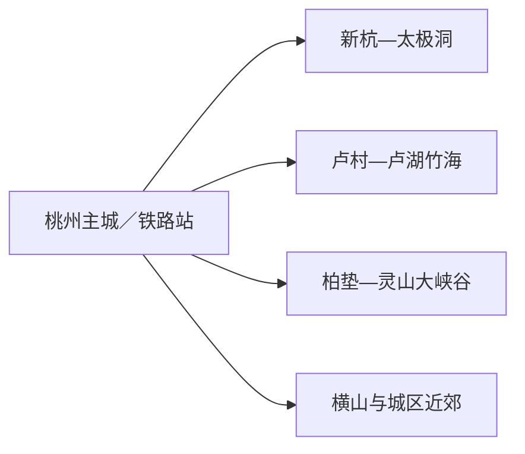
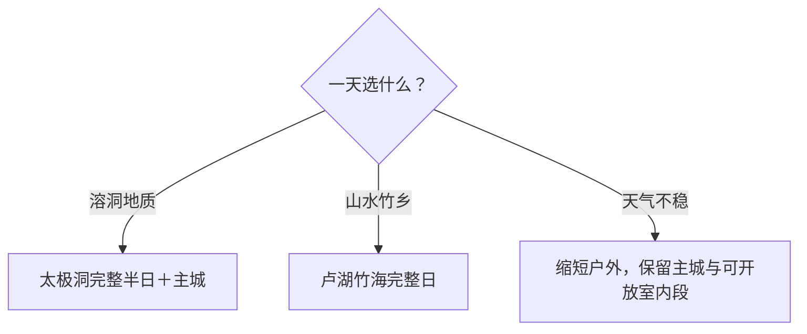

# 广德旅行指南

广德位于皖苏浙交界，最鲜明的组合是太极洞的溶洞地貌与卢湖—笄山竹海的山水竹乡。城市点位分散，自驾或预约车辆更容易把时间花在景区内；公共交通旅行则适合选太极洞或卢湖竹海中的一个主方向，再用城区补给收束。

> 建议停留：1–2 天 
> 旅行关键词：太极洞、卢湖竹海、竹乡画廊、三省通衢 
> 主要体力：城区低；溶洞与山地中等 
> 最近研究：2026-08-12

## 城市速览

| 项目 | 旅行信息 |
|---|---|
| 主要旅行价值 | 在太极洞看喀斯特洞穴，在卢湖与笄山竹海体验竹乡山水，并用竹乡画廊理解分散景区关系 |
| 建议停留 | 1天选太极洞或卢湖竹海；2天各走一个方向；更多远点按兴趣增加 |
| 较舒适季节 | 春秋适合山地与自驾；夏季洞内避暑但强对流和涉水风险上升；冬季注意结冰 |
| 预算特点 | 自驾、包车、景区门票和度假住宿是主要成本；只选一个方向更易控预算 |
| 步行强度 | 溶洞有湿滑台阶与高差；竹海、峡谷和森林路线按开放长度调整 |
| 主要天气风险 | 暴雨、山洪、雷电、台风外围影响、落石与冬季道路结冰 |
| 独行旅行 | 太极洞和成熟度假区较易安排；远郊先锁定返程与手机信号 |
| 亲子旅行 | 溶洞与竹海科普性强，需关注台阶、水边、身高年龄和保暖 |
| 长者与低体力旅行 | 选择卢湖低段、城区公共空间或太极洞较短开放线路 |
| 无障碍信息 | 溶洞和山地连续通行证据有限，设施连续性需向官方确认 |

## 城市格局与游览区域

桃州街道一带承担行政、住宿和餐饮，广德站与广德南站服务不同铁路线路。太极洞位于新杭镇方向，卢湖—笄山竹海在卢村乡方向；灵山大峡谷、横山国家森林公园和其他乡村项目分布在不同轴线上，优先按“一天一方向”安排。

| 区域 | 主要内容 | 游览特点 | 与其他区域的关系 |
|---|---|---|---|
| 桃州主城 | 住宿、餐饮、无量溪公共空间 | 低强度，适合抵离与补给 | 是各远线共同基地 |
| 新杭方向 | 太极洞、地质与溶洞体验 | 洞内湿滑、恒温，至少半天 | 与卢湖竹海通常分日 |
| 卢村方向 | 卢湖、笄山竹海、度假项目 | 山水、竹林和自驾体验 | 父度假区内项目按开放状态组合 |
| 柏垫及南部山地 | 灵山大峡谷等正式景区 | 涉水、峡谷与季节性明显 | 独立一天并留天气替代 |
| 横山近郊 | 横山国家森林公园方向 | 距主城较近，适合短段户外 | 可与城区同日，但仍核开放入口 |

GeoNames 固定记录 `1793092` 实际对应桃州镇／驻地点，Wikidata `Q1198031` 所关联的法定广德市行政记录为 `1809937`；本页以法定代码 `341882` 的县级广德市为范围，并说明两类地名记录的粒度差异。广德由宣城市代管，但旅行内容不并入宣州主城。

## 主要景点

### 溶洞与主城近郊

| 景点 | 区域 | 类型 | 主要看点 | 建议用时 | 室内外 | 体力 | 预约风险 | 天气影响 | 优先级 |
|---|---|---|---|---:|---|---|---|---|---|
| 太极洞景区 | 新杭镇桃园村 | 4A景区、国家级风景名胜区、地质公园 | 旱洞、水洞、钟乳石与地质科普 | 3–5小时 | 洞内外结合 | 中 | 高；水洞、线路和票务需核 | 中至高 | A |
| 横山国家森林公园方向 | 主城近郊 | 森林公园、城市近郊 | 林地、登高与城市近郊休闲 | 2–3小时 | 室外 | 中 | 高；具体入口、开放区与防火需核 | 高 | B |
| 无量溪滨水公共空间 | 桃州主城 | 城市绿道、路线节点 | 城区散步、休息和夜间城市生活 | 1–2小时 | 室外 | 低 | 低；施工与水岸管理需核 | 高 | 路线节点 |

### 卢湖竹海与南部山地

| 景点 | 区域 | 类型 | 主要看点 | 建议用时 | 室内外 | 体力 | 预约风险 | 天气影响 | 优先级 |
|---|---|---|---|---:|---|---|---|---|---|
| 卢湖竹海旅游度假区 | 卢村乡 | 湖泊、竹海、度假区 | 卢湖水域、笄山竹海与竹乡景观整体 | 5–7小时 | 室外为主 | 中 | 高；内部项目、停车和票制需核 | 高 | A |
| 笄山竹海景区 | 卢村方向 | 竹林、山地景区 | 竹海、山地视野与季节景观 | 3–5小时 | 室外 | 中 | 中至高；与度假区关系、入口需核 | 高 | B |
| 灵山大峡谷 | 柏垫方向 | 峡谷、涉水景区 | 峡谷溪流与季节性户外体验 | 4–6小时 | 室外 | 中至高 | 高；运营、水位和安全规则需核 | 高 | C |
| 宣木瓜文化旅游景区方向 | 市域乡镇 | 农业文化、产业体验 | 宣木瓜种植、加工与乡村产业 | 2–4小时 | 室内外结合 | 低至中 | 高；接待、采摘和生产区边界需核 | 中 | C |

卢湖、笄山竹海及其度假项目存在父子关系：路线可按当日开放组合，但完成率按一个度假方向理解。水库岸线、竹林经营区、矿山与工厂道路承担水源、生产或运输功能，使用正式观景点、公路驿站和游客入口即可获得更稳定的体验。

## 美食与餐饮

| 菜品或餐饮类型 | 常见区域 | 一个人用餐与常见份量 | 风味、过敏原与饮食限制 | 排队风险与替代方法 |
|---|---|---|---|---|
| 广德炖锅与农家菜 | 桃州主城、正规乡村餐饮 | 小锅适合2人以上，一人可选单菜 | 常含肉类、菌菇、豆制品和较多盐 | 询问小份，景区高峰提前用餐 |
| 笄山笋及竹笋菜 | 卢村与城区 | 一盘适合共享 | 竹笋纤维较多，常与肉类同炒；肠胃敏感者少量 | 按季节选正规餐厅，不采食野生植物 |
| 广德黄金芽等茶饮 | 城区、茶旅接待点 | 可单杯或小壶 | 含咖啡因；睡眠敏感者控制时间 | 体验活动先核接待和费用 |
| 宣木瓜加工食品 | 正规商店与体验点 | 适合小包装试吃 | 可能含糖、蜂蜜、酒或食品添加剂 | 看包装配料与保质条件 |
| 面食与家常快餐 | 主城和铁路站周边 | 一人容易点单 | 常见小麦、大豆、花生与肉类 | 作为早出晚归的稳定替代 |

## 经典行程

### 一日经典路线

**路线**：广德主城 → 太极洞完整游线 → 午餐 → 返回主城无量溪短段

- **串联逻辑**：把主要体力留给溶洞，返城后只安排低强度公共空间。
- **预约锚点**：太极洞门票、水洞项目、开放线路和停车。
- **休息安排**：景区游客中心与主城餐饮。
- **时间不足时**：删主城散步，保留太极洞核心。

### 两日城市路线

**第1天**：太极洞 → 桃州主城。\
**第2天**：卢湖竹海度假区 → 笄山竹海当日开放段。

- **串联逻辑**：东北溶洞与南部竹海分日，减少跨方向车程。
- **预约锚点**：两处景区门票、内部交通、停车和活动。
- **休息安排**：每天在游客中心或主城完成正餐。
- **时间不足时**：第二天只保留卢湖低段或整日取消。

### 三日深度路线

**第1天**：太极洞。\
**第2天**：卢湖—笄山竹海。\
**第3天**：灵山大峡谷或正式农业文化体验二选一。

- **串联逻辑**：溶洞、竹海、峡谷／产业三个主题分开，第三天按天气选择。
- **预约锚点**：第三天运营、涉水条件、接待和返程。
- **休息安排**：使用正规游客中心、驿站或乡村餐饮。
- **时间不足时**：整段删除第三天。

### 雨天路线

**路线**：太极洞当日开放的安全线路 → 主城午餐 → 城区短段公共空间

- **适用条件**：普通降雨且景区确认开放时采用；暴雨、山洪或雷电预警时改为主城休整。
- **预约锚点**：太极洞洞内水位、开放线与道路。
- **休息安排**：游客中心与主城室内餐饮。
- **时间不足时**：只保留确认开放的太极洞段。

### 亲子或低体力路线

**亲子路线**：太极洞地质科普短线 → 午餐 → 无量溪公共空间。\
**低体力路线**：卢湖低段观景 → 车辆连接正式休息点 → 返回主城。

- **减负方式**：亲子路线控制洞内台阶与水边看护；低体力路线避免完整登高和峡谷线。
- **预约锚点**：儿童规则、洞内线路、下客点、座椅和卫生间。
- **休息安排**：每段之间保留完整午休。
- **时间不足时**：两类路线都保留单一核心段。

### 远郊一日路线

**路线**：广德主城 → 卢湖竹海／灵山大峡谷二选一 → 返回主城

- **适用条件**：天气稳定、景区开放、车辆和返程均已确认。
- **预约锚点**：门票、漂流或涉水项目、停车和返程。
- **休息安排**：游客中心、公路驿站和正规餐饮。
- **时间不足时**：整段改为太极洞或主城近郊。

## 住宿区域

| 区域 | 优点 | 缺点 | 适合人群 | 交通特点 |
|---|---|---|---|---|
| 桃州主城 | 餐饮、铁路接驳与城市服务稳定 | 前往景区仍需车辆 | 首访、公共交通、预算旅行 | 适合作为两日固定基地 |
| 广德南站／广德站方向 | 抵离方便 | 与主城和景区入口仍有距离 | 晚到早走、跨城联程 | 按车票完整站名安排接驳 |
| 卢湖竹海正规度假住宿 | 便于早晚山水体验 | 价格、季节运营和返程选择需核 | 自驾、度假、摄影 | 先确认入住、停车、餐饮和充电 |
| 太极洞附近正规住宿 | 便于早入洞 | 夜间服务可能少于主城 | 地质专题、家庭出行 | 先确认景区入口距离和返程 |

## 市内交通

| 场景 | 建议与取舍 | 行前需要重查的内容 |
|---|---|---|
| 铁路抵达 | 广德南站与广德站不是同一站，按车次选择接驳 | 车次、出站口、公交和末班 |
| 主城移动 | 桃州片区可短段步行，铁路站和住宿用公交或车辆连接 | 施工、夜间交通和共享交通规则 |
| 景区往返 | 自驾、正规旅游交通或预约车辆适合“一天一方向” | 入口、停车、返程、充电和票务 |
| 竹乡画廊自驾 | 适合有山路经验者按开放道路串联驿站 | 道路管制、天气、导航和停车容量 |

## 不同旅行者须知

| 旅行维度 | 可行条件 | 主要取舍 | 需额外核对 |
|---|---|---|---|
| 独行旅行 | 成熟景区和主城白天易执行 | 远郊先锁返程与通信 | 末班、信号和闭园 |
| 亲子旅行 | 太极洞科普与卢湖低段 | 洞内台阶、水边和漂流需持续看护 | 儿童票、身高、装备、卫生间 |
| 长者或低体力旅行 | 低段观景与车辆分段连接 | 洞穴、峡谷和完整竹海线需减量 | 下客点、座椅、坡度 |
| 无障碍需求 | 逐点确认入口、卫生间和车辆转移 | 溶洞与山地连续动线资料有限 | 设施连续性需向官方确认 |
| 摄影旅行 | 洞穴、竹海、湖泊和公路景观多样 | 云雾、日落和花期无法保证 | 三脚架、无人机、灯光和保护规则 |
| 预算有限 | 住主城、每日只选一个方向 | 包车、度假住宿和多景区票务会增加成本 | 联票、优惠和交通总价 |
| 山地与涉水 | 选择正式开放路线和持证项目 | 强降雨时转主城或退改 | 山洪、雷电、水位、救生与保险 |
| 生产与生态空间 | 在开放体验区认识竹、茶、木瓜产业 | 加工设备、林业作业区与水库管理区按现场边界活动 | 接待、拍摄、消防和作业安排 |

## 行前核对

| 核对事项 | 为什么需要重查 | 建议核对时间 | 官方入口 |
|---|---|---|---|
| 太极洞 | 水洞、线路、门票、温度与维护会变化 | 购票前及当天 | [广德市人民政府·太极洞](https://www.guangde.gov.cn/OpennessContent/show/2722696.html) |
| 卢湖竹海 | 内部项目、道路、停车与住宿运营会变化 | 订住宿和车辆前 | [广德市人民政府·卢湖竹海](https://www.guangde.gov.cn/OpennessContent/show/2533639.html) |
| 户外与乡村项目 | 季节活动、接待和优惠变化较快 | 排路线前 | [广德市文旅局答问](https://www.guangde.gov.cn/InKnowledgeBase/show/2182.html) |
| 铁路与公路 | 班次、施工和节假日交通会变化 | 购票前及当天 | [中国铁路12306](https://www.12306.cn/) |
| 天气与自然风险 | 暴雨、台风、山洪和结冰影响山地与洞穴 | 出发前三日及当天 | [安徽省气象局](http://ah.cma.gov.cn/) |

## 来源与更新记录

### 主要来源

| 来源 | 类型 | 支持内容 | 核验日期 |
|---|---|---|---|
| [广德市人民政府：太极洞A级景区](https://www.guangde.gov.cn/OpennessContent/show/2722696.html) | 市文旅局 | 太极洞位置、景区身份、洞穴尺度与地质属性 | 2026-08-12 |
| [广德市人民政府：太极洞风景名胜区](https://www.guangde.gov.cn/News/show/1183200.html) | 自然资源与林业部门 | 风景名胜区、地质与生态保护范围 | 2026-08-12 |
| [广德市人民政府：卢湖竹海度假区](https://www.guangde.gov.cn/OpennessContent/show/2533639.html) | 市政府旅游资源 | 卢湖、笄山竹海与卢村乡关系 | 2026-08-12 |
| [广德市人民政府：文旅布局](https://www.guangde.gov.cn/News/show/1575408.html) | 市政府转载文旅资料 | 卢湖竹海度假区内部项目与全域方向 | 2026-08-12 |
| [广德市人民政府：户外休闲答问](https://www.guangde.gov.cn/InKnowledgeBase/show/2182.html) | 市文旅局答问 | 太极洞、卢湖竹海、灵山大峡谷、横山等户外项目 | 2026-08-12 |
| [广德市人民政府：竹乡画廊旅游公路](https://www.guangde.gov.cn/News/show/1699832.html) | 市政府文旅与交通资料 | 竹乡画廊串联乡镇、景区、驿站与停车 | 2026-08-12 |
| [Wikidata：Q1198031](https://www.wikidata.org/wiki/Special:EntityData/Q1198031.json) | 开放结构化数据 | 法定广德市与行政GeoNames记录 | 2026-08-12 |
| [GeoNames：1793092](https://sws.geonames.org/1793092/about.rdf) | 开放地名数据 | 固定桃州驻地点记录 | 2026-08-12 |
| [民政部行政区划代码查询](https://dmfw.mca.gov.cn/xzqh/getList?code=341882&trimCode=false&maxLevel=3) | 国家行政区划数据 | 法定代码341882 | 2026-08-12 |

### 更新记录

| 日期 | 更新内容 |
|---|---|
| 2026-08-12 | 首次完成广德指南，明确桃州点位与法定市粒度，并形成太极洞、卢湖竹海和南部山地的选择框架 |
