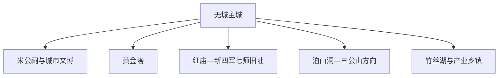
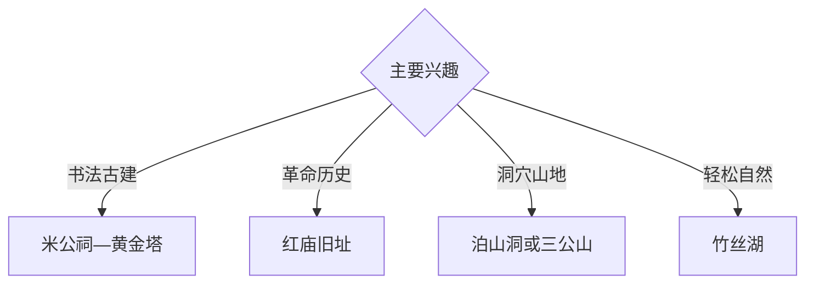

# 无为旅行指南

无为位于皖中江北，以米芾文化、黄金塔、皖江革命史、丘陵洞穴、湖泊与电缆羽绒产业形成独立旅行结构。固定快照中的 **Wucheng / GeoNames 1791346** 锚定无城主城；红庙、泊山洞和三公山等方向需要分日安排。

## 城市速览

| 项目 | 信息 |
|---|---|
| 主线 | 无城主城—米公祠—黄金塔—红庙革命史—山湖乡村 |
| 停留 | 主城 1 天；红色、洞穴或山地方向各另留 1 天 |
| 住宿 | 无城主城交通、餐饮和公共服务集中 |
| 交通 | 公路抵达为主，乡镇远点宜公交、约车或自驾 |
| 季节 | 春秋适合古建山地；汛期关注长江支流水位与山路 |
| 预算 | 主城文博灵活，远郊车辆和景区服务增加预算 |

## 城市格局与游览区域

主城承担文博、住宿和接驳；红庙方向偏革命历史，泊山洞与三公山偏自然，竹丝湖及产业镇按正式开放条件安排。文物本体、洞穴封闭段、林地防火区、水域工程和生产车间依管理边界进入。

## 主要景点

| 景点 | 区域 | 类型 | 核心体验 | 用时 | 环境 | 体力 | 研究价值 | 拥挤 | 优先级 |
|---|---|---|---|---:|---|---|---|---|---|
| 米公祠或米芾纪念展陈 | 主城 | 古建与书法 | 米芾、碑刻与地方文脉 | 2–3 小时 | 混合 | 低 | 很高 | 节假日中 | A |
| 黄金塔公开区 | 城北 | 古塔 | 宋代砖塔、建筑形制与西河环境 | 1–2 小时 | 室外 | 低 | 很高 | 低 | A |
| 无为地方文博场馆 | 主城 | 博物馆 | 城市史、皖江文化与人物 | 2 小时 | 室内 | 低 | 高 | 低 | B |
| 新四军七师旧址依法开放区 | 红庙方向 | 红色旧址 | 皖江抗战与根据地历史 | 半天至 1 天 | 混合 | 低中 | 很高 | 节假日中 | A |
| 泊山洞正式开放段 | 西部丘陵 | 洞穴 | 岩溶地貌、洞穴景观与乡村 | 半天 | 室内外 | 中 | 中高 | 季节性 | B |
| 三公山依法开放区 | 西部山地 | 山地 | 丘陵森林、步道与乡村景观 | 1 天 | 室外 | 中高 | 高 | 季节性 | B |
| 竹丝湖公共游览区 | 市域 | 湖泊 | 水岸景观、湿地与休闲 | 半天 | 室外 | 低 | 中 | 周末中 | C |

## 美食与餐饮

无为板鸭、送灶粑粑、米面点心和沿江家常菜适合在主城分顿体验。羽毛羽绒和电线电缆属于产业观察线索；进入企业展陈需提前预约，生产车间按接待规则参观。

## 经典行程

### 主城一日线
**路线**：米公祠—地方午餐—城市文博—黄金塔。**逻辑**：用书法、人物和古建串联城市史。**预约锚点**：场馆开放。**休息**：主城。**删除条件**：闭馆时保留古塔和公共空间。

### 米芾书法线
**路线**：米公祠—碑刻展陈—城市书法公共空间。**逻辑**：给书法史留出细读时间。**预约锚点**：讲解。**休息**：主城。**删除条件**：时间不足时保留核心展陈。

### 红庙历史线
**路线**：主城—新四军七师旧址—纪念设施—返程。**逻辑**：按史实展陈理解皖江根据地。**预约锚点**：旧址开放与车辆。**休息**：红庙镇。**删除条件**：闭馆时顺延专题线。

### 泊山洞线
**路线**：主城—正规入口—开放洞段—返程。**逻辑**：以管理游线体验岩溶。**预约锚点**：洞穴开放。**休息**：游客服务点。**删除条件**：暴雨、积水或检修时取消。

### 三公山线
**路线**：主城—山地入口—依法开放步道—返程。**逻辑**：独立一天承接山路尺度。**预约锚点**：道路与防火。**休息**：正规服务点。**删除条件**：雷雨、地质或防火预警时顺延。

### 亲子低体力线
**路线**：地方文博—午餐—黄金塔外观与公园。**逻辑**：室内外切换、步行可控。**预约锚点**：亲子活动。**休息**：主城。**删除条件**：高温时缩短户外段。

### 两日组合线
**路线**：首日主城文博；次日红庙、泊山洞或三公山三选一。**逻辑**：远郊方向分日。**预约锚点**：第二日交通。**休息**：连续住主城。**删除条件**：一天时保留主城线。

## 住宿区域

无城主城适合餐饮、公路抵达和多方向出发；山地正规住宿适合慢游。订房核对夜间接驳、消防、停车、早餐与恶劣天气退改。

## 市内交通

无为站、无为南站及跨江交通节点对应不同接驳，购票后确认站点。主城使用公交、出租车和步行；红庙、泊山洞、三公山及竹丝湖提前确认城乡班次与返程。

## 不同旅行者须知

书法旅行者优先米公祠；历史旅行者给红庙完整半日至一天；亲子与长者选择主城和湖区低坡段；徒步者根据防火与天气选择山路。文物本体、洞穴封闭段、水源保护区、生产车间与电力设施保留明确限制。

## 行前核对

- 核对米公祠、地方文博、红庙旧址与重点古建开放。
- 核对泊山洞、三公山、竹丝湖的道路、防火与水位。
- 核对铁路站点、城乡班次、返程约车与住宿接驳。
- 核对暴雨、高温、雷电和地质灾害预警。

## 来源与更新记录

| 来源 | 支持内容 | 核验日期 |
|---|---|---|
| [无为市政府：无为简介](https://www.ww.gov.cn/zjww/wwjj/) | 米公祠、泊山洞、黄金塔、三公山、竹丝湖与红色旧址 | 2026-09-03 |
| [无为市政府：乡村旅游行动计划](https://www.ww.gov.cn/content/article/12166395) | 文博古建、山湖与乡村旅游结构 | 2026-09-03 |
| [GeoNames 1791346](https://www.geonames.org/1791346/) | Wucheng 固定人口点与无为主城位置 | 2026-09-03 |
