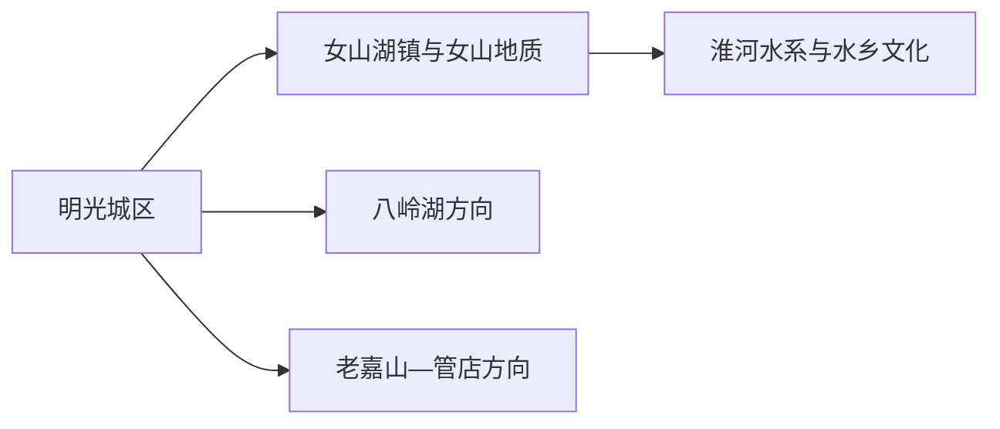
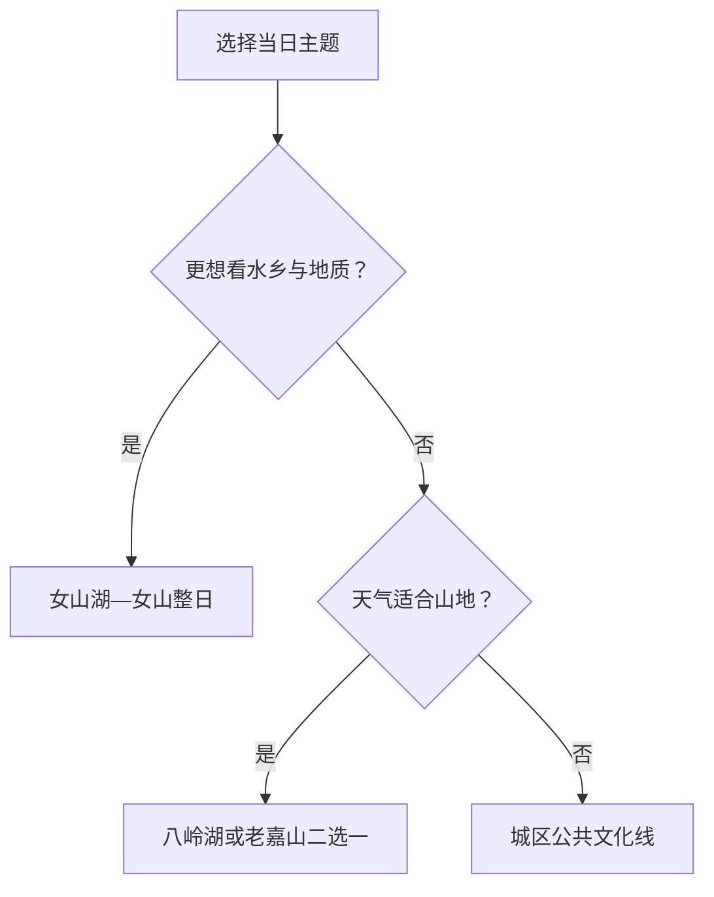

# 明光旅行指南

明光位于皖东，旅行空间从城区向女山湖水乡、女山古火山地质景观、八岭湖和老嘉山方向展开。这里适合自驾或提前落实县域车辆的慢旅行；第一次到访可在“女山湖水乡”和“山地湖区”之间选一条主线，再以城区住宿衔接。

## 城市速览

| 项目 | 信息 |
|---|---|
| 旅行主线 | 明光城区、女山湖—女山地质、八岭湖、老嘉山 |
| 建议停留 | 1 天选择女山湖或八岭湖；2 天组合城区与一个远线；3 天再加山地线 |
| 住宿基地 | 城区交通与餐饮更集中；女山湖镇适合已确认水乡行程 |
| 步行强度 | 城区低；湖区中等；山地和地质公园中至高 |
| 主要天气 | 梅雨、高温、强对流、湖区大风、汛情与冬季湿冷 |
| 预约核心 | 湖区游船、景区运营、地质公园入口、活动和县域返程 |
| 亲子 | 城区公共文化、女山地质科普和服务明确的湖区活动 |
| 低体力 | 城区加靠近落客点的湖景短段；山地按接驳条件决定 |
| 边界重点 | 湖泊水域、火山地质保护点、林地、水库和农业生产区按开放入口进入 |
| 无障碍 | 设施连续性需向官方确认，重点核对码头、坡道、栈道和卫生间 |

## 城市格局与游览区域

明光市是滁州市代管的县级市，法定代码 `341182`。GeoNames `1800519` 是明光城市点，Wikidata `Q1334907` 代表法定明光市，`P1566=1800519`。城市点用于定位中心城区，女山湖、张八岭、管店等远线需按实际入口另算交通。

| 区域 | 旅行价值 | 怎么安排 |
|---|---|---|
| 明光城区 | 到达、住宿、城市公共文化与补给 | 抵达日或半日 |
| 女山湖—女山 | 水乡古镇、湖泊、古火山地质与渔文化 | 留完整一天，先锁定水陆入口 |
| 八岭湖方向 | 湖区生态、休闲与当期运营项目 | 适合半日至一日 |
| 老嘉山方向 | 山地、森林与户外活动 | 天气稳定时独立安排 |

## 主要景点

### 城区与女山湖

| 景点 | 所在区域 | 类型 | 核心看点 | 建议用时 | 室内/室外 | 体力 | 预约难度 | 天气敏感度 | 适合旅程 |
|---|---|---|---|---|---|---|---|---|---|
| 明光城市公共文化场馆 | 城区 | 地方史与公共文化 | 皖东城市发展、地方文物与当期展览 | 1–2 小时 | 室内 | 低 | 中 | 低 | A |
| 女山湖镇公开游览区 | 女山湖镇 | 水乡古镇 | 湖镇格局、渔文化、历史建筑与水乡生活 | 3–5 小时 | 混合 | 中 | 高 | 高 | A |
| 女山地质公园公开区 | 女山湖方向 | 火山地质与自然 | 古火山口、地质科普与湖区视野 | 2–4 小时 | 室外 | 中至高 | 高 | 极高 | A |
| 嘉祐院等公开文保点 | 女山湖镇 | 历史建筑 | 水乡古镇历史与宗教建筑 | 1–2 小时 | 混合 | 中 | 高 | 高 | B |

### 湖区与山地

| 景点 | 所在区域 | 类型 | 核心看点 | 建议用时 | 室内/室外 | 体力 | 预约难度 | 天气敏感度 | 适合旅程 |
|---|---|---|---|---|---|---|---|---|---|
| 八岭湖生态旅游区 | 张八岭方向 | 湖区与休闲 | 湖面、林地与当期开放的休闲项目 | 3–6 小时 | 室外为主 | 中 | 高 | 高 | B |
| 老嘉山正式开放区 | 管店方向 | 山地森林 | 丘陵、森林与户外景观 | 4–7 小时 | 室外 | 中至高 | 高 | 极高 | B |
| 抹山等正式开放项目 | 市域乡村方向 | 乡村与康养 | 田园、季节活动与公共景观 | 2–4 小时 | 室外为主 | 中 | 高 | 高 | C |

女山湖的自然水域、渔业生产和古镇游览属于不同空间。旅行活动使用公开街巷、正规码头与景区入口；湖心养殖区、堤防作业段、地质保护核心点和林区生产道路维持原有管理用途。

## 美食与餐饮

| 类型 | 适合场景 | 份量 | 过敏与饮食提示 | 怎么选 |
|---|---|---|---|---|
| 女山湖大闸蟹 | 秋季正餐 | 常按只或重量 | 甲壳类过敏、寒凉与蘸料 | 看明码标价、重量与来源，确认当季供应 |
| 湖鲜与白米虾 | 女山湖镇正餐 | 多适合分享 | 鱼刺、水产过敏、共锅和酱油 | 先问鱼种、做法与总价，独行选小份 |
| 淮扬—皖东家常菜 | 城区正餐 | 合菜常偏大 | 猪肉、小麦、大豆和较高盐油 | 在城区选可说明配料的小份菜 |
| 米面与早餐 | 城区简餐 | 一人份方便 | 小麦、蛋、芝麻、花生 | 过敏者询问汤底与调味料 |

## 经典行程

### 一日经典路线

**路线**：明光城区出发 → 女山湖镇公开区 → 午餐 → 女山地质公园公开区 → 返回城区

- **串联逻辑**：水乡与火山地质位于同一方向，适合围绕女山湖安排完整一天。
- **预约锚点**：地质公园、古镇场馆、船艇和返程车辆。
- **休息安排**：女山湖镇午餐长休，地质公园只走开放短线。
- **时间不足时**：保留女山湖镇，删除地质公园深段。

### 两日城市路线

**第 1 天**：城区公共文化 → 城市休息 
**第 2 天**：女山湖—女山地质线

- **串联逻辑**：先在城区建立地方背景，再完整处理水乡远线。
- **预约锚点**：第二日景区、车辆和天气。
- **休息安排**：城区与女山湖镇分别安排午休。
- **时间不足时**：第一日压缩为半日，保留第二日核心。

### 三日深度路线

**第 1 天**：明光城区 
**第 2 天**：女山湖—女山地质 
**第 3 天**：八岭湖或老嘉山二选一

- **串联逻辑**：湖镇、山地湖区和城区分日，减少横跨市域。
- **预约锚点**：第三日运营项目与返程。
- **休息安排**：景区游客服务点或镇区正规餐饮。
- **时间不足时**：删除第三日。

### 雨天路线

**路线**：城区公共文化场馆 → 午餐 → 当期室内展览

- **适用条件**：普通降雨且城市交通正常；暴雨、雷电或汛情预警时按官方提示调整。
- **串联逻辑**：留在城区，避开湖面、山路和泥泞步道。
- **预约锚点**：场馆开放与道路积水。
- **休息安排**：午餐和场馆座椅。
- **时间不足时**：只留一处场馆。

### 亲子路线

**路线**：城区公共文化场馆 → 午餐 → 女山地质科普短线

- **适用条件**：地质公园入口、护栏和儿童规则已确认。
- **串联逻辑**：室内地方史与户外地质观察形成清晰主题。
- **预约锚点**：科普活动、儿童票与步道开放。
- **休息安排**：午餐长休，户外段控制在两小时内。
- **时间不足时**：保留城区场馆。

### 低体力路线

**路线**：车辆到达城区场馆 → 午餐长休 → 女山湖镇近入口短线

- **适用条件**：落客、平整步道和卫生间已确认。
- **串联逻辑**：车辆连接两处服务较稳定的点位，减少坡道和久站。
- **预约锚点**：无障碍入口、座椅、轮椅与停车。
- **休息安排**：每处只看核心内容。
- **时间不足时**：只留城区场馆。

### 山地湖区路线

**路线**：明光城区 → 八岭湖或老嘉山正式入口 → 景区短线 → 返回

- **适用条件**：天气、运营和返程车辆稳定，二者只选一处。
- **串联逻辑**：围绕单一山地目的地展开，避免远线叠加。
- **预约锚点**：景区开放、项目、停车和道路。
- **休息安排**：游客服务点午休并补水。
- **时间不足时**：整段删除，改走城区线。

## 住宿区域

| 区域 | 优点 | 取舍 | 适合人群 | 核对项 |
|---|---|---|---|---|
| 明光城区 | 铁路、公路、餐饮和多方向出发方便 | 到湖区与山地仍需车辆 | 首访、无车、多日旅行 | 夜间入住、停车、早餐与车站接驳 |
| 女山湖镇正规住宿 | 便于早晚水乡和湖区行程 | 选择少，季节与天气影响较大 | 湖区、摄影、慢游 | 合法经营、供餐、码头、退改 |
| 景区周边正规住宿 | 靠近八岭湖或山地方向 | 对其他片区没有位置优势 | 单一景区度假 | 开放、消防、夜间交通与餐食 |

## 市内交通

明光对外可利用铁路和公路，城区适合作为交通基地。女山湖、八岭湖与老嘉山分处不同方向，公共交通到达后仍可能需要接驳。行程先确定入口，再选择公交、出租车、自驾或正规包车。

| 场景 | 怎么做 | 行前核对 |
|---|---|---|
| 铁路到达 | 按票面完整站名到明光，再转城区住宿 | 车次、站前公交与夜间叫车 |
| 前往女山湖 | 预先落实县域客运或车辆，留出水乡步行时间 | 班次、码头、返程与汛情 |
| 前往山地湖区 | 自驾或正规包车更灵活，每日只选一个方向 | 景区入口、停车、道路与充电 |
| 城区移动 | 公交、出租车与短段步行组合 | 首末班、施工与高温避让 |

## 不同旅行者须知

| 旅行者 | 推荐做法 | 重点核对 |
|---|---|---|
| 独行 | 住城区，远线使用正规车辆 | 返程、司机资质、夜间到店 |
| 亲子 | 场馆加地质科普短线 | 护栏、船艇、儿童座椅与卫生间 |
| 长者与低体力 | 城区为主，湖镇只走近入口段 | 台阶、坡道、轮椅与座椅 |
| 摄影 | 女山湖与山地分日，预留天气机动 | 三脚架、无人机、湖区风力与日落返程 |
| 自驾 | 每天一个远线，城区补给 | 停车、县道施工、充电与疲劳驾驶 |

## 行前核对

- 明光市政府与文旅部门：景区运营、活动、县域交通和临时关闭。
- 女山湖、八岭湖与老嘉山运营方：入口、门票、船艇、步道与停车。
- 安徽省气象、水利与应急部门：暴雨、雷电、湖区大风和汛情。
- 中国铁路 12306：明光方向列车、站名和退改。
- 市场监管与农业部门：水产季节、称重和正规经营信息。

## 来源与更新记录

| 来源 | 支持内容 | 核验日期 |
|---|---|---|
| [明光市人民政府](https://www.mingguang.gov.cn/) | 市情、文旅、交通与动态入口 | 2026-08-30 |
| [安徽省淮河文化旅游发展带规划](https://www.xiejiaji.gov.cn/public/118323109/1260489457.html) | 女山地质公园、八岭湖与明光淮河文旅格局 | 2026-08-30 |
| [文化和旅游部：滁州智慧文旅建设](https://www.mct.gov.cn/whzx/qgwhxxlb/ah/202007/t20200715_873508.htm) | 滁州全域旅游公共服务与官方信息核对方向 | 2026-08-30 |
| [Wikidata Q1334907](https://www.wikidata.org/wiki/Q1334907) | 法定明光市、代码与 `P1566=1800519` | 2026-08-30 |
| [GeoNames 1800519](https://www.geonames.org/1800519/) | 固定明光城市点、别名与坐标 | 2026-08-30 |
| [中国铁路 12306](https://www.12306.cn/) | 列车、站名与购票动态 | 2026-08-30 |
| [安徽省气象局](http://ah.cma.gov.cn/) | 高温、暴雨、雷电与大风预警 | 2026-08-30 |

| 日期 | 更新 |
|---|---|
| 2026-08-30 | 首次完成城区、女山湖、女山地质、八岭湖和老嘉山旅行研究。 |
