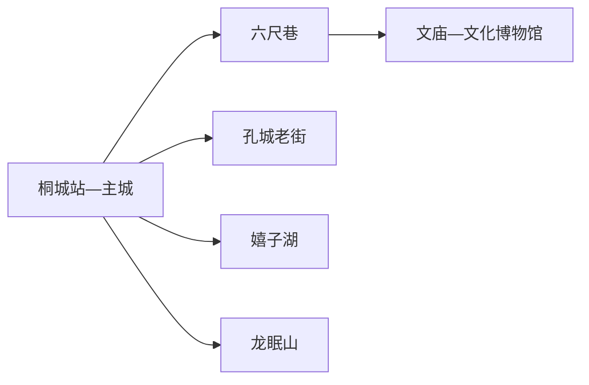
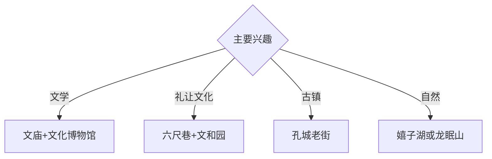

# 桐城旅行指南

桐城位于皖西南，六尺巷、文庙与桐城派文化构成紧凑的主城文脉，孔城老街、嬉子湖和龙眠山则提供古镇、湿地与山地延伸。固定快照中的 **Tongcheng / GeoNames 1792702** 对应安徽桐城市，与滁州同名镇点分开管理。

## 城市速览

| 项目 | 信息 |
|---|---|
| 主线 | 六尺巷—桐城文庙—文化博物馆—孔城老街 |
| 停留 | 主城1天；孔城、嬉子湖或龙眠山各另加1天 |
| 住宿 | 桐城站—主城便于文化线；远端住宿按主题选择 |
| 交通 | 高铁、普铁、公路抵达；远端以公交、约车或自驾为主 |
| 风险 | 古建保护、湿地水情、山洪林火、村庄与农业生产边界 |

## 城市格局与游览区域

六尺巷、文庙和桐城文化博物馆集中在主城，可步行配合短途车辆。孔城老街位于东部，嬉子湖在东南水网，龙眠山在西北山地，三条远线方向不同；每次选一条能保持充足的讲解、休息和返程时间。

## 主要景点

| 景点 | 区域 | 类型 | 核心体验 | 用时 | 环境 | 体力 | 研究价值 | 拥挤 | 优先级 |
|---|---|---|---|---:|---|---|---|---|---|
| 六尺巷景区 | 主城 | 历史街巷 | 礼让故事、张吴两家历史与城市更新 | 1–2小时 | 混合 | 低 | 很高 | 节假日高 | A |
| 桐城文庙 | 主城 | 古建筑 | 儒学建筑、地方教育与城市文脉 | 1–2小时 | 混合 | 低 | 很高 | 团体时中 | A |
| 桐城文化博物馆 | 主城 | 博物馆 | 桐城派、方苞姚鼐与地方文学 | 2–3小时 | 室内 | 低 | 很高 | 团体时中 | A |
| 文和园公开区 | 主城 | 文化园林 | 张英文化、园林与“和”文化展陈 | 1–2小时 | 混合 | 低 | 高 | 节假日中 | A |
| 孔城老街 | 孔城镇 | 历史街区 | 皖中古镇、商贸街巷与传统建筑 | 半天 | 混合 | 中 | 高 | 周末中 | A |
| 嬉子湖正式游览区 | 东南湖区 | 湖泊湿地 | 水网、候鸟、渔乡与生态观察 | 半天至1天 | 室外 | 中 | 高 | 旺季中 | B |
| 龙眠山正式游线 | 西北山地 | 山地文化 | 山水、桐城派文化地景与村落 | 1天 | 室外 | 高 | 高 | 旺季中 | B |

## 美食与餐饮

桐城水碗、水芹、丰糕和皖西南家常菜最具地方辨识度。湖鲜选择正规餐馆和合法来源；糕点留意保质期与糖分。乡村餐饮提前确认营业、停车和返程，山地日自备饮水和简餐。

## 经典行程

### 一日文化基础线
**路线**：六尺巷—文和园—午餐—桐城文庙—文化博物馆。**逻辑**：从公共记忆进入文学与教育史。**预约锚点**：文庙和博物馆开放。**休息**：主城商业区。**删除条件**：馆舍闭馆时增加公开街巷慢行。

### 桐城派深读线
**路线**：文化博物馆—文庙—午餐—相关名人公开展陈—六尺巷。**逻辑**：用人物、文本和城市空间互证。**预约锚点**：讲解和专题展。**休息**：博物馆与主城。**删除条件**：专题展调整时保留常设展。

### 孔城古镇线
**路线**：主城—孔城老街—午餐—传统建筑公开区—返城。**逻辑**：给东部商贸古镇完整半天。**预约锚点**：场馆和往返交通。**休息**：镇区公共服务点。**删除条件**：古建维护时按开放街段调整。

### 嬉子湖生态线
**路线**：主城—正式游客入口—湖区公开观景点—返城。**逻辑**：集中观察湖泊湿地与水乡。**预约锚点**：水情、船线和返程。**休息**：游客服务点。**删除条件**：洪水、大风、候鸟保护或船线停运时取消。

### 龙眠山文化线
**路线**：主城—正规登山入口—文化地景公开点—返城。**逻辑**：把文学传统放回山水环境。**预约锚点**：道路、天气和车辆。**休息**：沿线正规服务点。**删除条件**：山洪、雷雨、结冰或林火预警时取消。

### 亲子低体力线
**路线**：六尺巷—文化博物馆—午休—文和园近入口段。**逻辑**：故事、文物和园林递进。**预约锚点**：亲子讲解。**休息**：馆内与主城。**删除条件**：高温时取消园林延伸。

### 雨天线
**路线**：桐城文化博物馆—午餐—文庙可进入展陈—主城文化空间。**逻辑**：以室内内容保留城市文脉。**预约锚点**：馆舍开放。**休息**：主城。**删除条件**：道路积水时就近返宿。

## 住宿区域

桐城站—主城适合文化线、高铁抵离和多方向换乘；孔城或嬉子湖方向住宿适合古镇、湿地慢游。远端住宿按合法经营、消防、夜间交通和天气响应能力选择。

## 市内交通

桐城东站、桐城南站与普铁桐城站承担不同铁路抵离，订票后核对实际车站。主城用公交、出租车和网约车；孔城、嬉子湖和龙眠山提前确认城乡公交末班或预约返程。

## 不同旅行者须知

文学兴趣者优先文庙与文化博物馆；古建兴趣者增加孔城；亲子家庭选择六尺巷和室内场馆；行动不便者逐站确认门槛、石板路、湖区接驳与无障碍卫生间。

## 行前核对

- 核对六尺巷、文庙、文化博物馆、孔城老街和自然景区开放。
- 核对三座铁路站点、远端公交、湖区水情、山地天气和返程。
- 古建筑修缮区、湿地保护区、山林、农田和村庄生产空间沿正式游线进入。

## 来源与更新记录

| 来源 | 支持内容 | 核验日期 |
|---|---|---|
| [安庆市投资促进局：桐城市概况](https://tzcjj.anqing.gov.cn/zspt/14290784.html) | 六尺巷、文庙、文化博物馆、孔城、嬉子湖、龙眠山与交通 | 2026-09-01 |
| [GeoNames 1792702](https://www.geonames.org/1792702/) | Tongcheng 固定人口点与位置 | 2026-09-01 |

| 日期 | 更新 |
|---|---|
| 2026-09-01 | 首次完成桐城旅行研究；建立主城文脉、孔城、湖区与山地路线。 |
