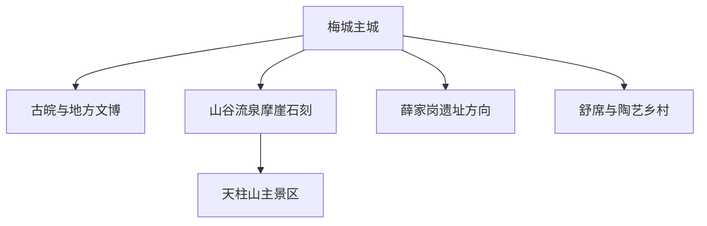
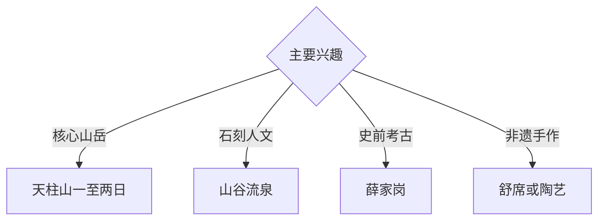

# 潜山旅行指南

潜山位于大别山东南麓，以天柱山花岗岩峰林、山谷流泉摩崖石刻、古皖文化、薛家岗考古和舒席非遗形成完整目的地。固定快照中的 **Meicheng / GeoNames 1800882** 锚定梅城主城；天柱山与王河考古方向适合分日。

## 城市速览

| 项目 | 信息 |
|---|---|
| 主线 | 梅城主城—山谷流泉—天柱山—薛家岗—非遗乡村 |
| 停留 | 主城 1 天；天柱山 1–2 天；考古方向另留半日至 1 天 |
| 住宿 | 梅城适合综合接驳；天柱山镇适合早入山 |
| 交通 | 铁路与公路抵达，景区接驳和索道按公告选择 |
| 季节 | 春秋适合登山；冬季关注冰雪，梅雨期关注山洪雷电 |
| 预算 | 主城文博灵活，天柱山门票、索道与景区住宿增加预算 |

## 城市格局与游览区域

梅城承担住宿、餐饮与交通；山谷流泉位于天柱山外围文化带，主景区需要完整山岳日；薛家岗在王河方向，是独立考古专题。世界地质公园、文物保护区、未开放山脊和乡村生产空间按公告进入。

## 主要景点

| 景点 | 区域 | 类型 | 核心体验 | 用时 | 环境 | 体力 | 研究价值 | 拥挤 | 优先级 |
|---|---|---|---|---:|---|---|---|---|---|
| 天柱山主景区 | 天柱山镇 | 山岳与地质 | 花岗岩峰林、峡谷、云海与地质演化 | 1–2 天 | 室外 | 高 | 很高 | 旺季高 | A |
| 山谷流泉摩崖石刻公开区 | 天柱山外围 | 石刻与水系 | 唐宋以来题刻、山水文化与古道 | 半天 | 室外 | 中 | 很高 | 中 | A |
| 潜山地方文博场馆 | 梅城 | 博物馆 | 古皖文化、地方史与考古背景 | 2–3 小时 | 室内 | 低 | 高 | 低 | A |
| 薛家岗遗址依法开放区 | 王河方向 | 考古遗址 | 新石器时代聚落与考古保护 | 半天 | 室外 | 低中 | 很高 | 低 | A |
| 天柱山博物馆或地质展陈 | 景区门户 | 地质科普 | 地质遗产、生态与登山准备 | 2 小时 | 室内 | 低 | 高 | 中 | B |
| 舒席非遗正规体验点 | 乡镇 | 非遗 | 竹编技艺、材料与地方生活 | 半天 | 室内 | 低 | 中高 | 预约制 | B |
| 痘姆陶等公开体验点 | 痘姆方向 | 陶艺 | 制陶传统、作坊与乡村文化 | 半天 | 混合 | 低 | 中高 | 预约制 | B |

## 美食与餐饮

潜山瓜蒌籽、天柱山茶、石耳、山粉圆子和皖西南家常菜适合分区体验。山区餐饮选择随季节变化，登山日携带饮水与简餐；野生植物以保护和观察为主，食材来源按正规餐饮标识确认。

## 经典行程

### 梅城一日线
**路线**：地方文博—皖西南午餐—城市公共空间—非遗展陈。**逻辑**：先建立古皖与地方史背景。**预约锚点**：场馆开放。**休息**：梅城。**删除条件**：闭馆时改主城慢行。

### 天柱山一日线
**路线**：景区入口—接驳或索道—核心开放游线—返程。**逻辑**：用完整一天承接海拔与地形。**预约锚点**：门票、索道和交通。**休息**：服务站。**删除条件**：雷暴、冰雪、大风或封闭时顺延。

### 天柱山两日线
**路线**：首日山谷流泉与地质展陈；次日主景区。**逻辑**：人文石刻与高强度登山分开。**预约锚点**：景区住宿与索道。**休息**：天柱山镇。**删除条件**：一天时只选主景区。

### 山谷流泉线
**路线**：梅城—摩崖石刻公开区—景区门户展陈—返程。**逻辑**：以低于登顶的体力阅读山水文脉。**预约锚点**：开放和讲解。**休息**：景区门户。**删除条件**：高水位或步道湿滑时改博物馆。

### 薛家岗考古线
**路线**：地方文博—薛家岗依法开放区—王河乡村。**逻辑**：展厅知识先于遗址观察。**预约锚点**：遗址开放与车辆。**休息**：镇区。**删除条件**：遗址暂停开放时保留文博。

### 亲子低体力线
**路线**：地质展陈—地方午餐—短段山谷流泉或非遗体验。**逻辑**：科普与动手体验结合。**预约锚点**：亲子活动。**休息**：梅城或景区门户。**删除条件**：雨天选择室内。

### 三日组合线
**路线**：首日梅城与石刻；次日天柱山；第三日薛家岗或非遗。**逻辑**：主城、山岳、考古分日。**预约锚点**：登山日天气。**休息**：梅城与天柱山镇分段住宿。**删除条件**：两天时删第三日。

## 住宿区域

梅城适合铁路、公路、餐饮与多方向出发；天柱山镇适合早入山和连续两日游览。订房核对景区入口距离、接驳、消防、取暖、早餐与天气退改。

## 市内交通

潜山站和天柱山站等名称需结合实际线路与接驳核对。梅城到天柱山、王河及乡镇体验点分别计算车程；景区内按接驳车、索道和步道开放组合路线。

## 不同旅行者须知

登山者根据体力选择索道与步道组合；石刻旅行者给山谷流泉半天；亲子与长者以文博、地质展陈和低坡段为主；考古爱好者先读馆藏。地质保护区、摩崖本体、考古探方、未开放山脊与野生动植物栖息地保留明确限制。

## 行前核对

- 核对天柱山门票、索道、接驳、步道与日出日落管理。
- 核对山谷流泉、薛家岗、文博场馆和非遗体验开放。
- 核对雷暴、大风、冰雪、山洪和地质灾害预警。
- 核对铁路站点、景区班车、返程和住宿接驳。

## 来源与更新记录

| 来源 | 支持内容 | 核验日期 |
|---|---|---|
| [天柱山风景名胜区](https://www.tzs.com.cn/site-ah-tzs/node/293_7) | 景区公告、山岳游览与安全核对入口 | 2026-09-03 |
| [安庆日报：潜山文旅与文化资源](https://aqdzb.aqnews.com.cn/epaper/xml/aqrb/20201209/RB2020120907.pdf) | 天柱山、薛家岗、山谷流泉与城市文脉 | 2026-09-03 |
| [GeoNames 1800882](https://www.geonames.org/1800882/) | Meicheng 固定人口点与潜山主城位置 | 2026-09-03 |
