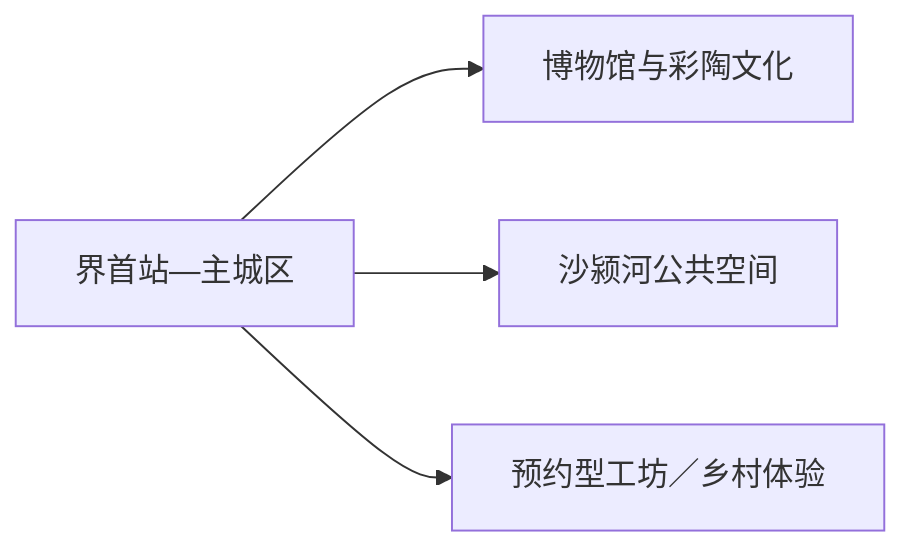
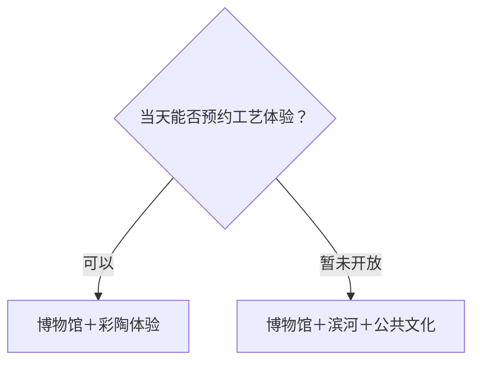

# 界首旅行指南

界首是一座适合用一到两天慢看的皖北县级市。最清晰的入口是界首市博物馆与彩陶文化：先看地方历史和工艺，再沿沙颍河公共空间感受城市生活；有明确开放和预约时，再加入彩陶工坊或乡村文化点。

> 建议停留：1–2 天 
> 旅行关键词：界首彩陶、地方文博、沙颍河、皖北小城 
> 主要体力：低至中等；乡镇体验以车辆衔接 
> 最近研究：2026-08-12

## 城市速览

| 项目 | 旅行信息 |
|---|---|
| 主要旅行价值 | 从博物馆和彩陶理解地方手工业，再用沙颍河与街市补充城市生活 |
| 建议停留 | 1 天城市核心；2 天增加正式接待的工艺或乡村体验 |
| 较舒适季节 | 春秋适合步行；夏季关注高温、雷雨与河流水位，冬季关注寒风和结冰 |
| 预算特点 | 城区交通与餐饮平实，预约车辆和手工体验增加预算 |
| 步行强度 | 城区低至中等，滨河和乡村可按体力缩短 |
| 主要天气风险 | 高温、暴雨、雷电、河流水位、大风和冬季结冰 |
| 独行旅行 | 城区易组织，工坊和乡镇提前确认接待 |
| 亲子旅行 | 彩陶和博物馆适合观察体验，材料与操作规则先核 |
| 长者与低体力旅行 | 单馆慢看加滨河平缓短段，车辆减少换乘 |
| 无障碍信息 | 现代场馆可先问电梯与卫生间；设施连续性需向官方确认 |

## 城市格局与游览区域

主城区承担铁路、住宿、餐饮和公共文化，博物馆与城市公共空间适合一日。彩陶生产、工业园和乡村项目分布在城区外围，选择有正式展示、研学或接待入口的点位；沙颍河以公共步道和开放岸段为主。

| 区域 | 主要内容 | 游览特点 | 与其他区域的关系 |
|---|---|---|---|
| 主城区 | 博物馆、餐饮、住宿、城市街区 | 紧凑，适合抵达和雨天 | 与滨河可同日 |
| 沙颍河沿岸开放段 | 城市滨水、桥梁与慢行 | 早晚舒适，汛期按水情 | 作为文博后的轻松段 |
| 彩陶与工艺方向 | 展馆、工坊、非遗活动 | 接待和体验需预约 | 放在第二天或替换一段城区 |
| 产业与乡村方向 | 循环经济、农业和村镇项目 | 只选明确公开接待空间 | 不把生产厂区当常规景点 |

GeoNames `1805844` 与 Wikidata `Q1018527` 的 `P1566` 精确对应界首城市记录，法定代码 `341282`，属于阜阳代管的独立县级市。阜阳主城只保留行政和跨城衔接。

## 主要景点

### 城市文化

| 景点 | 区域 | 类型 | 主要看点 | 建议用时 | 室内外 | 体力 | 预约风险 | 天气影响 | 优先级 |
|---|---|---|---|---:|---|---|---|---|---|
| 界首市博物馆 | 主城区 | 地方博物馆 | 地方历史、彩陶与城市发展 | 2–3 小时 | 室内 | 低 | 中；闭馆、预约和临展需核 | 低 | A |
| 界首彩陶文化展示空间 | 主城区／正式场馆 | 非遗、工艺 | 刻画、施釉、烧制与地方审美 | 1.5–2 小时 | 室内 | 低 | 高；具体场馆与开放需核 | 低 | A |
| 沙颍河城市开放岸段 | 主城区 | 滨水、路线节点 | 河流、桥梁与城市公共空间 | 1–2 小时 | 室外 | 低 | 低；水位和施工需核 | 高 | B |
| 城市公共文化场馆 | 主城区 | 图书馆／文化馆 | 当期展览、阅读与文化活动 | 1–2 小时 | 室内 | 低 | 中；活动和开放需核 | 低 | B |

### 预约体验

| 景点 | 区域 | 类型 | 主要看点 | 建议用时 | 室内外 | 体力 | 预约风险 | 天气影响 | 优先级 |
|---|---|---|---|---:|---|---|---|---|---|
| 正式接待的彩陶工坊 | 市域 | 非遗体验 | 工艺讲解、制作或展示 | 2–3 小时 | 室内为主 | 低 | 高；接待、材料和费用需核 | 低 | B |
| 正式开放的乡村文化点 | 市域乡镇 | 乡村、季节活动 | 村镇生活、地方工艺或农事 | 2–4 小时 | 混合 | 中 | 高；日期与交通需核 | 高 | C |

彩陶展馆和工坊可按不同入口分别安排，但同一机构的展览与体验不重复计作两座景区。循环经济园区、加工企业和物流空间具有产业观察价值，参访以官方开放日、研学或明确接待为入口。

## 美食与餐饮

| 菜品或餐饮类型 | 常见区域 | 一个人用餐与常见份量 | 风味、过敏原与饮食限制 | 排队风险与替代方法 |
|---|---|---|---|---|
| 阜阳格拉条等面食 | 主城区 | 单人友好 | 小麦、芝麻酱、花生和辣椒 | 高峰换居民区同类店 |
| 卷馍与皖北早餐 | 主城区、市场 | 一份可作轻餐 | 小麦、豆制品、蛋和调味酱 | 选现制、卫生清晰门店 |
| 羊肉汤与牛羊肉菜 | 主城区 | 一碗可独立成餐 | 牛羊肉、香辛料和盐分 | 问清份量和配饼 |
| 皖北家常菜 | 主城区 | 热菜适合共享 | 常见大豆、花生、肉类和辣椒 | 一人选小份或盖饭 |

## 经典行程

### 一日经典路线

**路线**：界首市博物馆 → 午餐 → 彩陶文化展示空间 → 沙颍河开放岸段

- **串联逻辑**：先建立历史框架，再看代表性工艺，傍晚用滨水慢行收尾。
- **预约锚点**：博物馆与彩陶展示空间。
- **休息安排**：午餐长休，滨河只走平缓短段。
- **时间不足时**：保留博物馆和彩陶，删滨河。

### 两日城市路线

**第 1 天**：博物馆 → 彩陶文化 → 滨河。 
**第 2 天**：预约工坊或一个正式开放乡村点。

- **串联逻辑**：城市展陈与真实工艺／乡村现场分日。
- **预约锚点**：第二天接待人、车辆和体验内容。
- **休息安排**：住主城区，第二天午餐提前确认。
- **时间不足时**：第二天只保留半日工坊。

### 三日深度路线

**第 1 天**：地方文博与城市生活。 
**第 2 天**：彩陶专题。 
**第 3 天**：正式开放的乡村或当期文化活动。

- **串联逻辑**：从城市认识到工艺深读，再看地方生活现场。
- **预约锚点**：后两日的接待与交通。
- **休息安排**：每天回城区，减少换宿。
- **时间不足时**：第三天整段删除。

### 雨天路线

**路线**：界首市博物馆 → 午餐 → 彩陶展示／公共文化场馆

- **适用条件**：普通降雨；暴雨和河流水位预警时留在城区室内。
- **串联逻辑**：用两个室内主题替代滨河和乡村。
- **预约锚点**：场馆开放。
- **休息安排**：馆内座椅和午餐区。
- **时间不足时**：只保留博物馆。

### 亲子或低体力路线

**亲子路线**：博物馆重点展厅 → 午餐 → 短时彩陶体验。 
**低体力路线**：车辆直达博物馆 → 午餐 → 滨河平缓观景点。

- **减负方式**：亲子线控制制作时长；低体力线减少站立和跨乡镇移动。
- **预约锚点**：儿童活动、材料安全、电梯和座椅。
- **休息安排**：每个主点后坐休。
- **时间不足时**：均保留博物馆。

### 远郊一日路线

**路线**：主城区 → 一个正式接待的工艺／乡村点 → 返回城区

- **适用条件**：接待、道路、天气和返程明确。
- **串联逻辑**：只选一个点，留足讲解或体验时间。
- **预约锚点**：联系人、费用、保险和车辆。
- **休息安排**：正规接待点或回城用餐。
- **时间不足时**：改为城区半日彩陶线。

## 住宿区域

| 区域 | 优点 | 缺点 | 适合人群 | 交通特点 |
|---|---|---|---|---|
| 界首站—主城区 | 抵离、餐饮和叫车方便 | 到乡镇需车辆 | 首访、公共交通、短住 | 先核末班与到站接驳 |
| 城区文化场馆附近 | 步行接文博和滨河 | 活动期停车可能紧张 | 文化旅行、低体力 | 适合一日核心线 |
| 城区外围 | 自驾出城方便 | 夜间服务较少 | 自驾、第二天远线 | 靠近计划出城方向选择 |

## 市内交通

| 场景 | 建议与取舍 | 行前需要重查的内容 |
|---|---|---|
| 铁路抵达 | 界首市站等站点按票面完整名称选择 | 车次、出站口、公交和夜间接驳 |
| 城区移动 | 公交、出租或网约车连接文博与滨河 | 班次、施工、停车 |
| 乡镇与工坊 | 预约车辆或核实城乡公交 | 精确地址、接待时间、返程 |
| 自驾 | 适合第二天单方向体验 | 道路、停车、充电和天气 |

## 不同旅行者须知

| 旅行维度 | 可行条件 | 主要取舍 | 需额外核对 |
|---|---|---|---|
| 独行旅行 | 城区服务完整 | 远点先锁返程 | 接待最低人数、夜间交通 |
| 亲子旅行 | 彩陶主题互动强 | 材料、工具和时长按年龄调整 | 年龄、陪同、清洁设施 |
| 长者或低体力旅行 | 单馆慢看加车辆短线 | 滨河长度与站内换乘减量 | 电梯、座椅、下客点 |
| 无障碍需求 | 现代场馆优先咨询 | 乡村和旧建筑存在连续性差异 | 设施连续性需向官方确认 |
| 摄影旅行 | 彩陶、河岸和小城生活题材清晰 | 工坊和人物拍摄先征得同意 | 闪光灯、三脚架、商业拍摄 |
| 产业参访 | 采用官方开放日或研学项目 | 生产与物流区域按安全管理 | 资质、保险、防护和拍摄规则 |
| 特殊天气 | 室内替代方案充分 | 暴雨时滨河和乡村后移 | 水情、道路与场馆公告 |

## 行前核对

| 核对事项 | 为什么需要重查 | 建议核对时间 | 官方入口 |
|---|---|---|---|
| 博物馆与彩陶场馆 | 闭馆、预约和活动会变化 | 排路线前及前一日 | [阜阳市文旅部门：界首市景点](http://fysgj.fy.gov.cn/detail-703.html) |
| 工坊与乡村体验 | 接待并非日常固定开放 | 出发前三日 | [界首市人民政府](https://www.ahjs.gov.cn/) |
| 铁路 | 车次与站点变化 | 购票前及当天 | [中国铁路12306](https://www.12306.cn/) |
| 天气与水情 | 暴雨、高温和河流水位影响户外 | 出发前三日及当天 | [安徽省气象局](http://ah.cma.gov.cn/) |
| 产业参访 | 安全、生产安排和开放日变化 | 确认活动时 | [阜阳市工业和信息化局](https://gxj.fy.gov.cn/) |

## 来源与更新记录

### 主要来源

| 来源 | 类型 | 支持内容 | 核验日期 |
|---|---|---|---|
| [界首市景点资料](http://fysgj.fy.gov.cn/detail-703.html) | 阜阳市政府文旅部门 | 博物馆、彩陶与城市文旅方向 | 2026-08-12 |
| [阜阳市行政与旅游概览](https://fysgj.fy.gov.cn/detail-513.html) | 阜阳市政府文旅部门 | 界首县级市归属与区域关系 | 2026-08-12 |
| [界首产业资料](https://gxj.fy.gov.cn/Content/show/1206535.html) | 阜阳市工业和信息化局 | 循环经济产业现状及生产空间边界 | 2026-08-12 |
| [Wikidata Q1018527](https://www.wikidata.org/wiki/Special:EntityData/Q1018527.json) | 开放结构化数据 | 界首与 GeoNames 精确交叉核验 | 2026-08-12 |
| [GeoNames 1805844](https://sws.geonames.org/1805844/about.rdf) | 开放地名数据 | 固定界首城市记录 | 2026-08-12 |
| [民政部行政区划代码查询](https://dmfw.mca.gov.cn/xzqh/getList?code=341282&trimCode=false&maxLevel=3) | 国家行政区划数据 | 法定代码 341282 | 2026-08-12 |

### 更新记录

| 日期 | 更新内容 |
|---|---|
| 2026-08-12 | 首次完成界首指南，核验彩陶、文博、滨河、产业边界和县级市归属 |
