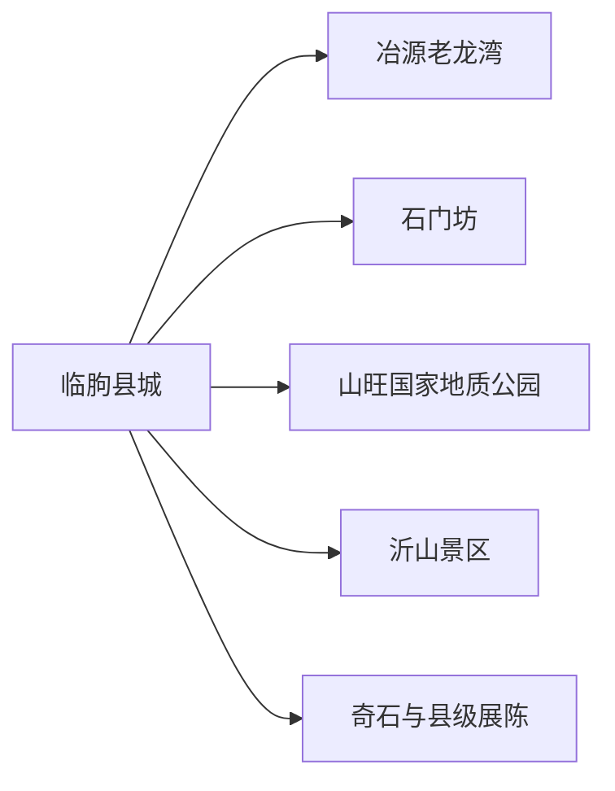
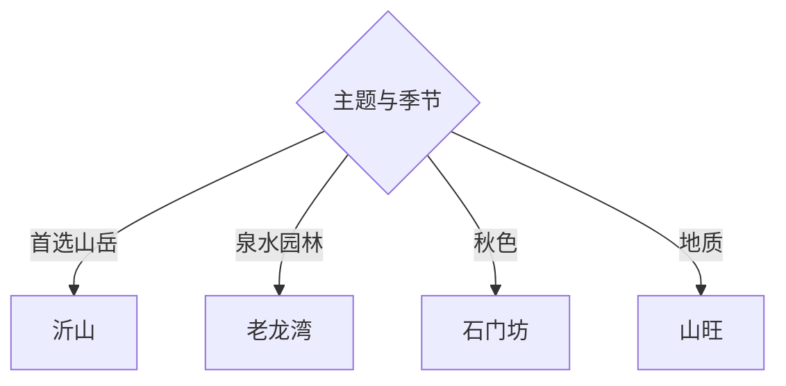

# 临朐旅行指南

临朐的代表体验是沂山、老龙湾、石门坊与山旺地质遗产，县城还可串联奇石、书画和地方展陈。自然景区之间距离大，适合以县城或冶源为基地，每天只走一个山地或泉水方向。

## 城市速览

| 项目 | 信息 |
|---|---|
| 主线 | 临朐县城—沂山—老龙湾—石门坊—山旺国家地质公园 |
| 停留 | 县城半日；每个自然方向1天，完整3—4天 |
| 住宿 | 县城适合补给；冶源适合老龙湾；沂山周边适合早进山 |
| 交通 | 从潍坊、淄博等方向公路进入，县内用班车、合规包车或自驾 |
| 风险 | 山区雷雨、落石、森林火险、秋季车流、泉池临水与冬季冰雪 |
| 边界 | 山旺化石产地、自然保护地、林区、矿山与水库工程按开放范围进入 |

## 城市格局与游览区域

固定 **Linqu / GeoNames 1803364** 对应潍坊市临朐县，本页以实体 `Q1198208` 确定县域。沂山在县域南部，老龙湾靠冶源，石门坊以秋色著名，山旺承担地质主题；县城居中，更适合拆分多日路线。

## 主要景点

| 景点 | 区域 | 类型 | 核心体验 | 用时 | 环境 | 体力 | 研究价值 | 拥挤 | 优先级 |
|---|---|---|---|---:|---|---|---|---|---|
| 沂山景区正式游线 | 沂山镇 | 山岳景区 | 山峰、森林、瀑布与东镇文化 | 1天 | 室外 | 高 | 很高 | 旺季高 | A |
| 老龙湾风景区 | 冶源街道 | 泉水园林 | 泉群、竹林、水色与园林建筑 | 半日至1天 | 室外 | 中 | 很高 | 旺季高 | A |
| 石门坊景区 | 城关西南 | 山谷景区 | 石壁、古建与秋季红叶 | 半日至1天 | 室外 | 中高 | 高 | 红叶季很高 | A |
| 山旺国家地质公园开放区 | 山旺方向 | 地质遗产 | 古生物化石地层与科普 | 半日 | 混合 | 中 | 很高 | 中 | A |
| 临朐县博物馆或县级展陈 | 县城 | 地方文博 | 地方史、化石与文化遗产 | 1.5–3小时 | 室内 | 低 | 很高 | 低 | B |
| 中国临朐奇石市场公开区域 | 县城 | 产业文化 | 观赏石、交易文化与地方产业 | 2–3小时 | 室内 | 低 | 高 | 展会时高 | B |
| 嵩山乡村旅游公开点 | 嵩山方向 | 山乡景观 | 村落、梯田与慢行 | 半日至1天 | 室外 | 中 | 中 | 节假日中 | C |
| 齐鲁天路临朐段开放节点 | 山地公路 | 景观公路 | 山地村镇与季节风景 | 1天 | 室外 | 中 | 高 | 节假日高 | B |

## 美食与餐饮

县城与冶源可选全羊、煎饼、烧肉、山野菜和潍坊面食。全羊与合菜先按人数确认份量，山货选择正规来源；登山日自备水和便携补给，景区餐饮提前确认营业与收餐时间。

## 经典行程

### 三日基础线
**路线**：县城展陈—老龙湾—沂山—石门坊或山旺。**逻辑**：用泉水、山岳和地质构成三类体验。**预约锚点**：景区、车辆与住宿。**休息**：县城或冶源。**删除条件**：天气不稳时以老龙湾和文博替代登山。

### 沂山整日线
**路线**：游客中心—景区交通—开放山岳游线—返程。**逻辑**：把高体力主景完整成日。**预约锚点**：门票、景交、防火与末班。**休息**：山上服务点。**删除条件**：雷雨、大风、冰雪或火险时取消。

### 老龙湾园林线
**路线**：冶源—老龙湾—泉池步道—冯惟敏相关展陈。**逻辑**：从水文景观读到地方文化。**预约锚点**：开放、讲解与返程。**休息**：园区。**删除条件**：结冰或临水区管控时缩短。

### 石门坊红叶线
**路线**：正式入口—山谷步道—古建开放点—原路返程。**逻辑**：按坡度与光线观察秋色。**预约锚点**：红叶期、客流与停车。**休息**：游客中心。**删除条件**：高峰拥堵或雨后湿滑时改山旺。

### 山旺地质线
**路线**：地质公园展陈—开放地层观察点—县城博物馆。**逻辑**：先现场观察，再回展馆补知识。**预约锚点**：场馆与讲解。**休息**：游客中心。**删除条件**：野外段关闭时只留展陈。

### 奇石文化线
**路线**：县级展陈—奇石市场公开区—地方书画空间。**逻辑**：把地质资源与当代产业连接。**预约锚点**：场馆、展会和交易规则。**休息**：县城。**删除条件**：市场休市时改弥河公共空间。

### 低体力线
**路线**：县城展陈—车辆到老龙湾近入口—泉池短步行。**逻辑**：以室内和缓坡水景为主。**预约锚点**：无障碍、落客点与座椅。**休息**：园区。**删除条件**：冰雪或临水湿滑时只留县城。

## 住宿区域

县城适合餐饮、客运和多方向日游；冶源适合老龙湾与泉水主题；沂山景区周边适合清晨进山。订房时核对停车、早餐、供暖或空调、夜间餐饮、消防和山路返程，秋季红叶周末尽早锁定。

## 市内交通

临朐主要依靠公路与潍坊、淄博等城市连接。县内景区跨度大，班车时刻按当次客运信息确认；包车写明合法运营、等候、景区停车和返程费用。景观公路先核对施工、坡度、天气与补给，山区天黑前结束行程。

## 不同旅行者须知

登山者优先沂山；低体力旅行者选老龙湾；地质兴趣者选山旺与县级展陈；摄影者按红叶季和泉水光线安排；亲子家庭选择地质科普与短步道。化石保护层、非开放采石点、矿山生产区、水库设施、林区防火封控段保留明确限制。

## 行前核对

- 核对沂山、老龙湾、石门坊、山旺、县级场馆与齐鲁天路节点的当日开放。
- 核对班车、山路、雷雨、冰雪、防火、红叶季客流和景区末班交通。
- 地质遗迹以观察和记录为主，化石与岩石留在原处，山林只走开放步道。

## 来源与更新记录

| 来源 | 支持内容 | 核验日期 |
|---|---|---|
| [临朐县2025年政府工作报告](https://www.linqu.gov.cn/xxgk/upload-service/102/29119/WY1886960220454916096.pdf) | 沂山、老龙湾、齐鲁天路与文旅方向 | 2026-09-01 |
| [临朐县发展规划](https://www.linqu.gov.cn/xxgk/upload-service/102/7455/WY1926906454082719744.pdf) | 沂山、石门坊、老龙湾、乡村与文化产业 | 2026-09-01 |
| [临朐县国土空间规划](https://www.linqu.gov.cn/xxgk/upload-service/102/7455/WY1469216394099953664.pdf) | 老龙湾、石门坊、沂山及保护对象 | 2026-09-01 |
| [GeoNames 1803364](https://www.geonames.org/1803364/) | Linqu 固定人口点及坐标 | 2026-09-01 |
| [Wikidata Q1198208](https://www.wikidata.org/wiki/Q1198208) | 临朐县实体与跨库标识 | 2026-09-01 |

| 日期 | 更新 |
|---|---|
| 2026-09-01 | 首次完成临朐旅行研究，按沂山、泉水、红叶和地质遗产组织。 |
