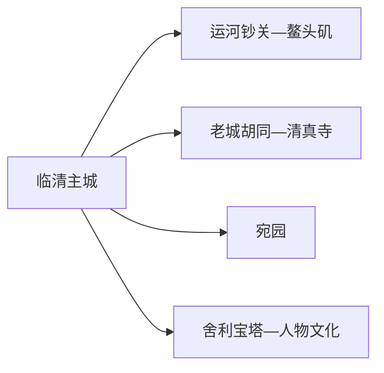
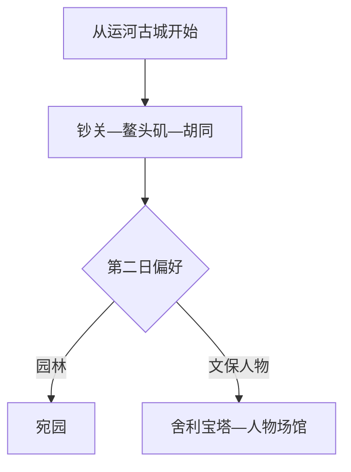

# 临清旅行指南

临清最值得走的是运河商埠线：从鳌头矶、运河钞关到老城胡同和清真寺群，能看见一座因会通河而兴的城市。宛园和舍利宝塔适合作为第二条文化线，季羡林、张自忠等人物纪念空间则按场馆开放补充。主城用一天即可建立框架，两天更适合慢看古城和园林。

> 建议停留：1–2 天 
> 旅行关键词：大运河、钞关、鳌头矶、胡同、宛园、舍利宝塔 
> 主要体力：低至中等 
> 最近研究：2026-08-13

## 城市速览

| 项目 | 旅行信息 |
|---|---|
| 主要旅行价值 | 沿大运河遗产、老城街巷和多元宗教建筑理解明清商埠城市 |
| 建议停留 | 1 天运河古城；2 天加入宛园、古塔和人物文化 |
| 较舒适季节 | 春秋适合街巷；夏季注意高温暴雨，冬季注意寒风与结冰 |
| 预算特点 | 主城中低，以场馆票务、园林和交通为主要支出 |
| 步行强度 | 古城可分段慢走，石板路与台阶需留意 |
| 主要天气风险 | 高温、暴雨、雷电、大风、河道水位和冬季结冰 |
| 独行旅行 | 主城紧凑，白天游览方便 |
| 亲子旅行 | 运河文化、园林和博物馆适合分段讲解 |
| 长者与低体力旅行 | 车辆连接钞关、鳌头矶和宛园，每处只走核心段 |
| 无障碍信息 | 新场馆可咨询，老城街巷、古塔和古建设施连续性需向官方确认 |

## 城市格局与游览区域

临清市是聊城市代管的县级市，法定代码 `371581`。固定快照中 GeoNames `1803367` 名称为 `Qingnian`；GeoNames 实时名称和别名已显示 `Linqing/临清`，Wikidata `Q1207099` 的 P1566 也指向同一 ID。这个变化属于主城标签更新，页面以法定临清市为旅行范围。

| 区域 | 主要内容 | 怎么安排 | 与其他区域的关系 |
|---|---|---|---|
| 运河古城 | 钞关、鳌头矶、胡同与宗教建筑 | 半日至一日 | 核心步行片区，按开放点分段 |
| 新城与公共文化 | 住宿、餐饮、现代场馆 | 抵达和休息基地 | 车辆连接古城与宛园 |
| 宛园片区 | 北方园林、展陈和休闲 | 2–3 小时 | 可与古城同日但需控制节奏 |
| 舍利宝塔方向 | 古塔与城郊历史空间 | 2–3 小时 | 单独车辆往返更稳妥 |
| 乡镇运河与农业空间 | 运河沿线村镇、棉业和农业 | 只选正式开放项目 | 堤防、闸坝、码头作业区和农田保留管理功能 |

## 主要景点

### 运河古城

| 景点 | 区域 | 类型 | 主要看点 | 建议用时 | 室内外 | 体力 | 预约风险 | 天气影响 | 优先级 |
|---|---|---|---|---:|---|---|---|---|---|
| 临清运河钞关 | 古城 | 大运河遗产 | 明清税关制度、运河商贸与遗址建筑 | 1–2 小时 | 混合 | 低 | 高 | 中 | A |
| 鳌头矶 | 古城 | 运河节点与古建筑 | 河道交汇、古城地标与商埠空间 | 1–2 小时 | 室外为主 | 低 | 中 | 高 | A |
| 临清老城胡同与清真寺片区 | 古城 | 历史街区 | 胡同格局、商住传统与多元宗教建筑外观 | 2–3 小时 | 室外为主 | 中 | 高 | 高 | A |
| 大运河公共展陈或博物馆 | 主城 | 博物馆 | 运河史、城市商贸和当期展览 | 1–2 小时 | 室内 | 低 | 高 | 低 | B |

### 园林与城郊文化

| 景点 | 区域 | 类型 | 主要看点 | 建议用时 | 室内外 | 体力 | 预约风险 | 天气影响 | 优先级 |
|---|---|---|---|---:|---|---|---|---|---|
| 宛园 | 主城 | 园林 | 北方园林、古建复建与文化陈设 | 2–3 小时 | 混合 | 中 | 高 | 中 | A |
| 舍利宝塔 | 城郊 | 古塔 | 明代砖塔、运河城市天际线与文保外观 | 1–2 小时 | 室外为主 | 中 | 中 | 高 | B |
| 张自忠、季羡林等人物文化场馆 | 主城及属地 | 名人文化 | 人物生平、地方教育和近现代史 | 1–2 小时 | 室内 | 低 | 高 | 低 | B |
| 黄河故道与正式生态游览点 | 市域 | 生态与水利 | 故道地貌、农业和季节生态 | 半日 | 室外 | 中 | 很高 | 很高 | C |

钞关、鳌头矶、胡同和清真寺是同一运河古城体系中的不同访问点；宗教场所优先尊重礼拜和管理安排。河道、堤防、闸坝、码头与航运设施按水利和作业边界活动。

## 美食与餐饮

临清饮食可从什香面、烧麦、清真牛羊肉和运河家常菜入手。古城适合白天小吃，正餐和早餐在主城生活区更稳定。

| 菜品或餐饮类型 | 常见区域 | 一个人用餐与常见份量 | 风味、过敏原与饮食限制 | 排队风险与替代方法 |
|---|---|---|---|---|
| 临清什香面 | 主城和老城面馆 | 一碗配多种菜码，适合一人 | 含小麦，菜码可能含蛋、肉、花生或大豆 | 提前说明不食配料，选菜码清楚的店 |
| 临清烧麦 | 早餐店和老城小吃 | 一笼适合一至两人 | 面皮含小麦，馅料多含肉和葱姜 | 早餐高峰售罄时改选包子或面食 |
| 清真牛羊肉 | 清真餐饮集中区 | 多为合菜，也可点小份面饭 | 尊重清真规范；其他过敏需求仍逐项确认 | 避开礼拜和团队用餐高峰 |
| 运河家常菜 | 主城餐馆 | 一至两盘适合分享 | 鱼、肉、酱油和花生油常见 | 独行选择盖饭、面条和小份菜 |
| 点心与糕饼 | 老城和正规商店 | 小份便于携带 | 可能含小麦、蛋、奶、芝麻和坚果 | 选择包装配料完整产品 |

## 经典行程

### 一日经典路线

**路线**：运河钞关 → 鳌头矶 → 老城午餐 → 胡同与清真寺片区 → 运河公共展陈

- **串联逻辑**：全日围绕运河古城展开，先看制度遗址，再读街巷生活。
- **预约锚点**：钞关、展馆与宗教场所开放。
- **休息安排**：老城生活街区和主城公共服务点。
- **时间不足时**：保留钞关—鳌头矶，胡同只走一小段。

### 两日城市路线

**第 1 天**：运河古城线。  
**第 2 天**：宛园 → 午餐 → 舍利宝塔或人物文化场馆。

- **串联逻辑**：第二天在园林、古塔和人物史中选两项，避免重复走古城。
- **预约锚点**：宛园票务、古塔和人物场馆开放。
- **休息安排**：中午回主城休息。
- **时间不足时**：第二天只保留宛园。

### 三日深度路线

**第 1 天**：运河古城。  
**第 2 天**：宛园—舍利宝塔。  
**第 3 天**：人物文化或正式黄河故道生态项目。

- **串联逻辑**：第三天按历史与生态兴趣二选一。
- **预约锚点**：远线接待、车辆和场馆。
- **休息安排**：连续住主城，减少换宿。
- **时间不足时**：先删第三天。

### 雨天路线

**路线**：运河展馆 → 主城午餐 → 宛园室内展陈或人物文化场馆

- **适用条件**：普通降雨且城区道路正常；强降雨时避开河岸和古塔。
- **预约锚点**：场馆临时闭馆。
- **休息安排**：主城室内空间。
- **时间不足时**：只保留一座展馆。

### 亲子与低体力路线

**亲子路线**：运河展馆 → 鳌头矶短段 → 宛园。  
**低体力路线**：车辆到钞关 → 鳌头矶附近短走 → 主城午休 → 人物场馆。

- **减负方式**：亲子路线用展陈替代长胡同；低体力路线减少石板路和古塔台阶。
- **预约锚点**：儿童活动、电梯和座椅。
- **休息安排**：老城服务点和主城餐饮。
- **时间不足时**：两类路线都先删宛园后的附加点。

### 远郊一日路线

**路线**：主城 → 舍利宝塔 → 正式黄河故道或乡村接待点 → 返回

- **适用条件**：天气稳定、接待与车辆已确认。
- **预约锚点**：远线开放、午餐和返程。
- **休息安排**：使用正式游客服务和乡镇生活区。
- **时间不足时**：只保留舍利宝塔并回主城。

## 住宿区域

| 区域 | 优点 | 缺点 | 适合人群 | 交通特点 |
|---|---|---|---|---|
| 临清站—主城 | 到达、早餐和跨片区车辆方便 | 到古城仍需接驳 | 首访、独行和多日旅行者 | 最适合作为基地 |
| 运河古城附近 | 早晚街巷氛围好 | 老建筑、停车和夜间服务需核对 | 历史文化优先者 | 白天步行方便 |
| 宛园方向 | 园林游览方便 | 到古城和车站需车辆 | 园林慢游和团队旅行者 | 提前确认散场车辆 |

## 市内交通

| 场景 | 建议与取舍 | 行前需要重查的内容 |
|---|---|---|
| 铁路抵达 | 临清站服务主城，聊城换乘按跨城计算 | 12306 车次、到站和公交 |
| 古城步行 | 钞关、鳌头矶和胡同分段走 | 开放、施工、宗教活动与河岸管制 |
| 宛园/古塔 | 公交、出租或网约车连接 | 营业、停车和返程上客点 |
| 市域远线 | 自驾或正规包车更灵活 | 道路、接待、堤防管理和返程 |

## 不同旅行者须知

| 旅行维度 | 可行条件 | 主要取舍 | 需额外核对 |
|---|---|---|---|
| 独行旅行 | 主城核心紧凑 | 夜间河岸只走照明成熟段 | 末班和上客点 |
| 亲子旅行 | 运河展陈、园林和短街巷 | 古塔台阶按年龄取舍 | 儿童票和卫生间 |
| 长者或低体力旅行 | 车辆连接核心点 | 减少胡同石板路和古塔登高 | 座椅、电梯和入口距离 |
| 无障碍需求 | 现代场馆可咨询 | 历史街巷和古建连续通行资料有限 | 设施连续性需向官方确认 |
| 宗教文化访问 | 按对外开放区域安静参观 | 礼拜时段优先保障宗教活动 | 服饰、拍摄和入内规则 |
| 河岸旅行 | 正式步道和公共空间适合散步 | 汛期、闸坝和作业区按管理范围活动 | 水位、封闭和夜间照明 |

## 行前核对

| 核对事项 | 为什么需要重查 | 建议核对时间 | 官方入口 |
|---|---|---|---|
| 古城场馆与宛园 | 开放、票务和展览可能调整 | 到访前一日 | [临清市人民政府](https://www.linqing.gov.cn/) |
| 宗教场所 | 礼拜和修缮会改变参观范围 | 到访当天 | 属地场所公告 |
| 铁路 | 车次和停站按日期调整 | 出发前一周及当天 | [中国铁路 12306](https://www.12306.cn/) |
| 天气与河道 | 暴雨、大风和水位影响河岸 | 出发前三日及当天 | [山东省气象局](https://sd.cma.gov.cn/) |

## 来源与更新记录

### 主要来源

| 来源 | 类型 | 支持内容 | 核验日期 |
|---|---|---|---|
| [民政部行政区划代码服务](https://dmfw.mca.gov.cn/xzqh/getList?code=370000&trimCode=false&maxLevel=3) | 政府开放接口 | 临清代码 `371581` 与聊城代管关系 | 2026-08-13 |
| [临清市国土空间总体规划](https://www.linqing.gov.cn/resources/public/20260212/698d702d306812a92d8d2b57.pdf) | 属地政府规划 | 运河钞关、鳌头矶、清真寺、胡同及文旅空间结构 | 2026-08-13 |
| [临清市人民政府](https://www.linqing.gov.cn/) | 属地政府 | 场馆、文旅活动、交通与风险核对入口 | 2026-08-13 |
| [GeoNames 1803367](https://www.geonames.org/1803367/) | 开放地名库 | 固定快照 Qingnian 与实时 Linqing 标签变化 | 2026-08-13 |
| [Wikidata Q1207099](https://www.wikidata.org/wiki/Q1207099) | 开放知识库 | 法定临清市与 GeoNames 精确映射 | 2026-08-13 |

### 更新记录

| 日期 | 更新内容 |
|---|---|
| 2026-08-13 | 首次建立临清独立指南；围绕运河古城、宛园和古塔组织路线，并解释固定快照名称与实时临清标签的变化。 |
