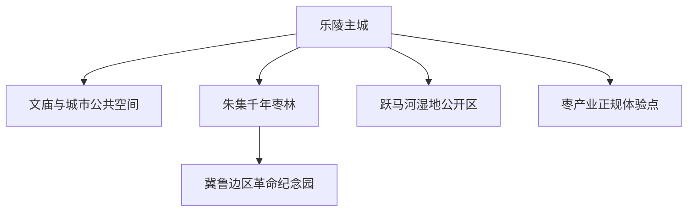
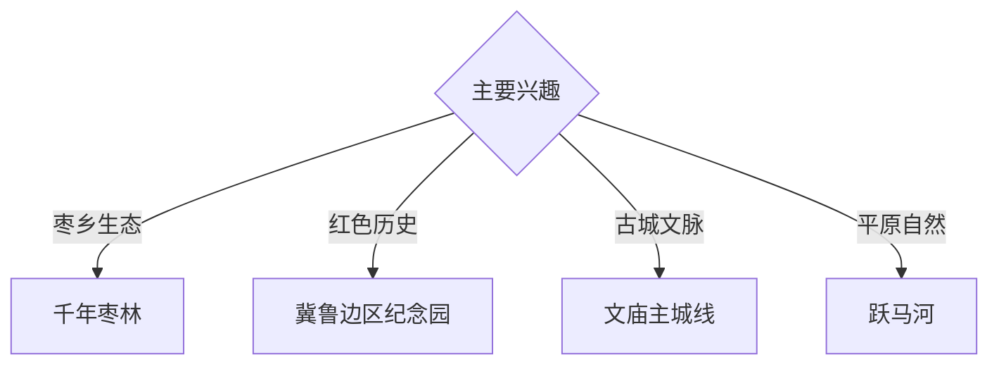

# 乐陵旅行指南

乐陵位于鲁西北平原，以千年枣林、金丝小枣文化、冀鲁边区革命历史、文庙与平原湿地构成独立旅行主题。固定快照中的 **Leling / GeoNames 1804195** 锚定主城；朱集枣林和跃马河方向需要安排地面交通。

## 城市速览

| 项目 | 信息 |
|---|---|
| 主线 | 乐陵主城—千年枣林—冀鲁边区纪念园—文庙—跃马河 |
| 停留 | 主城半日至 1 天；枣林与红色主题另留 1 天 |
| 住宿 | 主城适合餐饮、公交和多方向出发 |
| 交通 | 公路抵达为主，朱集及乡镇方向宜公交、约车或自驾 |
| 季节 | 秋季适合枣乡体验，春季适合骑行；冬夏关注风寒与高温 |
| 预算 | 主城与纪念设施灵活，乡村车辆和体验项目增加预算 |

## 城市格局与游览区域

主城适合城市史、餐饮与接驳；朱集方向把古枣树、枣文化博物馆和革命纪念园连接在同一主题区域。湿地核心区、古树保护范围、纪念设施管理区和农业生产地按公开边界参观。

## 主要景点

| 景点 | 区域 | 类型 | 核心体验 | 用时 | 环境 | 体力 | 研究价值 | 拥挤 | 优先级 |
|---|---|---|---|---:|---|---|---|---|---|
| 千年枣林游览区 | 朱集镇 | 农业景观 | 古枣树、枣乡景观与季节物候 | 半天至 1 天 | 室外 | 低中 | 很高 | 采摘季高 | A |
| 金丝小枣文化展陈 | 朱集方向 | 农业文博 | 枣品种、栽培史、加工与地方经济 | 2–3 小时 | 室内 | 低 | 高 | 中 | A |
| 冀鲁边区革命纪念园 | 朱集方向 | 红色纪念 | 冀鲁边抗战历史与军民记忆 | 2–3 小时 | 混合 | 低 | 很高 | 节假日中 | A |
| 乐陵文庙公开区 | 主城 | 古建 | 儒学空间、城市历史与文物建筑 | 1–2 小时 | 混合 | 低 | 高 | 低 | B |
| 跃马河湿地公开观察点 | 市域 | 湿地 | 平原河流、鸟类与生态恢复 | 2–3 小时 | 室外 | 低 | 中高 | 季节性 | B |
| 乐陵影视城依法开放区 | 枣林方向 | 影视与街景 | 场景体验、地方文旅与活动 | 半天 | 混合 | 低中 | 中 | 活动时高 | C |
| 枣产业正规体验点 | 乡镇 | 产业体验 | 鲜枣、干制、深加工与农旅 | 半天 | 混合 | 低 | 中高 | 预约制 | B |

## 美食与餐饮

金丝小枣、枣糕、枣花蜜、黄面鸡、马蹄烧饼和鲁西北面食适合在主城与朱集分顿体验。枣制品甜度较高，可选择小份；采摘与加工体验以园区正式接待为准。

## 经典行程

### 主城半日线
**路线**：文庙公开区—城市公园—地方餐饮。**逻辑**：用紧凑步行建立乐陵城市背景。**预约锚点**：文庙开放。**休息**：主城。**删除条件**：场馆闭门时转公共空间。

### 千年枣林线
**路线**：主城—千年枣林—枣文化展陈—返程。**逻辑**：从古树景观进入农业文化。**预约锚点**：景区和采摘季。**休息**：朱集正规服务点。**删除条件**：极端高温或大风时缩短林间段。

### 冀鲁边区历史线
**路线**：纪念园—专题展陈—枣林短段。**逻辑**：以史实展陈为核心，再理解地域环境。**预约锚点**：纪念馆开放。**休息**：朱集。**删除条件**：闭馆时顺延专题线。

### 枣乡产业线
**路线**：正规种植园—加工展陈—地方午餐。**逻辑**：观察从种植到产品的链条。**预约锚点**：接待许可。**休息**：镇区。**删除条件**：非生产季时改枣文化展陈。

### 跃马河生态线
**路线**：主城—公开湿地观察点—河岸慢行—返程。**逻辑**：以低体力方式观察平原水系。**预约锚点**：湿地开放。**休息**：主城。**删除条件**：大风、暴雨或高水位时改室内。

### 亲子低体力线
**路线**：枣文化展陈—午餐—枣林短段。**逻辑**：科普与户外体验相连。**预约锚点**：亲子活动。**休息**：朱集。**删除条件**：高温时只留室内展陈。

### 两日组合线
**路线**：首日主城与文庙；次日枣林、纪念园和产业体验。**逻辑**：城市与枣乡专题分日。**预约锚点**：第二日开放与车辆。**休息**：连续住主城。**删除条件**：一天时直接选择枣林专题。

## 住宿区域

乐陵主城适合餐饮、公路抵达和多方向出发；朱集正规乡村住宿适合枣乡慢游。订房核对夜间接驳、消防、停车、早餐和采摘季退改。

## 市内交通

跨城抵达以公路交通为主，主城内使用公交、出租车和步行；朱集、跃马河及乡村体验点提前确认城乡班次与返程。骑行选择正式道路并避开大型车辆高峰。

## 不同旅行者须知

农业旅行者优先枣林物候与正规产业点；历史旅行者给纪念园充足时间；亲子与长者适合展陈和林间平缓路；观鸟者保持安静与距离。古树根系保护区、湿地核心区、农机作业面和非开放纪念设施空间保留明确限制。

## 行前核对

- 核对千年枣林、纪念园、文庙与影视城开放。
- 核对枣树物候、采摘规则、活动日期和产业接待。
- 核对跨城客运、城乡公交、返程约车和住宿接驳。
- 核对高温、大风、暴雨、湿地水位与农业作业信息。

## 来源与更新记录

| 来源 | 支持内容 | 核验日期 |
|---|---|---|
| [文化和旅游部：冀鲁边区·枣乡乐陵乡村体验之旅](https://zhuanti.mct.gov.cn/dhxlsfn2022/shandong/detail/2363.html) | 千年枣林、纪念园、百枣园与地方美食 | 2026-09-03 |
| [国家林业和草原局：千年枣林文旅融合](https://www.forestry.gov.cn/lyj/1/ggsllvcy/20250725/635667.html) | 古枣林、红色历史、影视与文旅业态 | 2026-09-03 |
| [GeoNames 1804195](https://www.geonames.org/1804195/) | Leling 固定人口点与乐陵主城位置 | 2026-09-03 |
