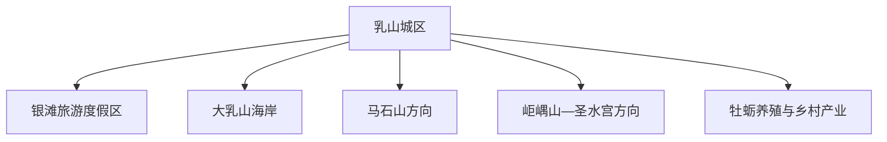
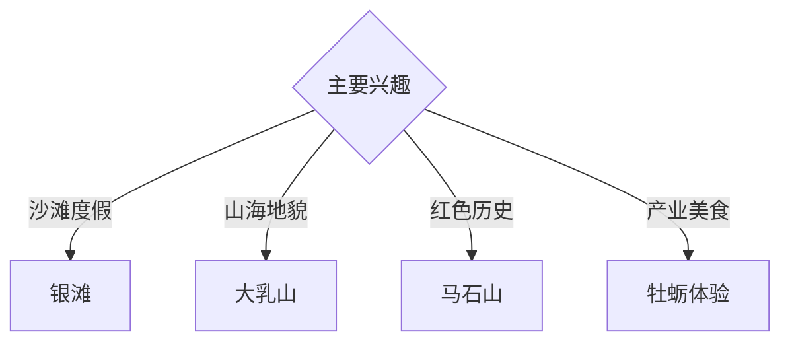

# 乳山旅行指南

乳山位于山东半岛南岸，以银滩、大乳山海岸地貌、牡蛎产业、马石山红色历史、山地古迹与温泉形成独立旅行体系。固定快照中的 **Chengqu / GeoNames 8541400** 锚定城区；银滩、大乳山与西北山地分属不同旅行方向。

## 城市速览

| 项目 | 信息 |
|---|---|
| 主线 | 城区—银滩—大乳山—马石山—牡蛎与乡村 |
| 停留 | 城区与银滩 2 天；大乳山或西部山地各另留 1 天 |
| 住宿 | 城区适合综合接驳；银滩适合海滨慢住 |
| 交通 | 铁路与公路抵达，海岸跨度大，远点宜约车或自驾 |
| 季节 | 夏季适合海滨，春秋适合山地；冬季适合牡蛎与温泉 |
| 预算 | 公共海岸灵活，度假住宿、远线车辆与景区增加预算 |

## 城市格局与游览区域

城区承担铁路接驳与生活服务；银滩是东南部海滨度假单元，大乳山位于西南海岸，马石山及其他山地古迹需要独立车程。海洋保护地、养殖筏架、港池、山林防火区和非开放岸线按管理边界进入。

## 主要景点

| 景点 | 区域 | 类型 | 核心体验 | 用时 | 环境 | 体力 | 研究价值 | 拥挤 | 优先级 |
|---|---|---|---|---:|---|---|---|---|---|
| 银滩旅游度假区公开海岸 | 东南海岸 | 海滨 | 沙滩、海岸慢行与度假生活 | 半天至 1 天 | 室外 | 低 | 中 | 夏季高 | A |
| 大乳山依法开放区 | 西南海岸 | 海岸地貌 | 山海轮廓、海湾与海洋文化 | 1 天 | 室外 | 中 | 高 | 旺季中 | A |
| 乳山城区公共文化空间 | 城区 | 城市文博 | 地方历史、城市生活与接驳 | 2–3 小时 | 混合 | 低 | 中高 | 低 | B |
| 马石山景区或纪念设施 | 西部山地 | 红色历史 | 抗战历史、山地纪念与教育 | 半天至 1 天 | 混合 | 中 | 很高 | 节假日中 | A |
| 岠嵎山依法开放区 | 西北方向 | 山地 | 奇石、森林与胶东丘陵 | 1 天 | 室外 | 中高 | 高 | 季节性 | B |
| 圣水宫等公开古迹 | 东北方向 | 古迹与山地 | 道教文化、古建遗存与丘陵 | 半天 | 混合 | 中 | 高 | 低 | B |
| 牡蛎文化正规体验点 | 沿海乡镇 | 产业体验 | 养殖、加工、饮食与海洋产业 | 半天 | 混合 | 低 | 高 | 季节性 | B |

## 美食与餐饮

乳山牡蛎是核心地方风味，另有海鲜、胶东面食、喜饼、苹果和花生。牡蛎以正规餐饮和标明来源的产品为主，按季节选择熟制或规范冷链产品；过敏人群提前沟通，饮酒后安排代驾或公共交通。

## 经典行程

### 城区银滩线
**路线**：城区公共文化空间—地方午餐—银滩公共海岸。**逻辑**：先建立城市背景，再进入海滨慢游。**预约锚点**：场馆与浴场公告。**休息**：城区或银滩。**删除条件**：风浪或雷雨时保留室内段。

### 大乳山一日线
**路线**：城区—大乳山正规入口—依法开放游线—返程。**逻辑**：给西南海岸完整一天。**预约锚点**：景区开放与车辆。**休息**：游客服务区。**删除条件**：大风、暴雨或临时封闭时顺延。

### 马石山历史线
**路线**：城区—马石山纪念设施—公开山地步道—返程。**逻辑**：以史实展陈为核心阅读山地。**预约锚点**：场馆开放。**休息**：镇区。**删除条件**：防火或恶劣天气时改城区文博。

### 岠嵎山地线
**路线**：城区—山地入口—依法开放步道—返程。**逻辑**：独立安排体力与天气。**预约锚点**：道路和防火。**休息**：服务点。**删除条件**：雷雨、地质或防火预警时取消。

### 牡蛎产业线
**路线**：正规产业展陈或体验点—海鲜午餐—公共海岸。**逻辑**：从生产链理解地方饮食。**预约锚点**：接待许可和季节。**休息**：沿海镇区。**删除条件**：非生产季或不接待时改餐饮体验。

### 亲子低体力线
**路线**：城区展陈—午餐—银滩短段。**逻辑**：步行可控且室内外切换。**预约锚点**：亲子活动。**休息**：银滩。**删除条件**：高温时缩短海岸段。

### 三日组合线
**路线**：首日城区与银滩；次日大乳山；第三日马石山或牡蛎产业。**逻辑**：东部海滨、西南山海与专题远线分日。**预约锚点**：第二三日开放。**休息**：银滩或城区连续住宿。**删除条件**：两天时删第三日。

## 住宿区域

乳山城区适合交通、餐饮和多方向出发；银滩住宿适合海滨慢游；大乳山周边正规住宿便于西南线。订房核对实际海岸距离、淡旺季营业、供暖、停车、消防与天气退改。

## 市内交通

乳山站与乳山南站对应不同线路和接驳条件，购票后确认站点。城区、银滩、大乳山与西北山地距离较远，城乡公交、约车和自驾按一天一个方向安排。

## 不同旅行者须知

海滨旅行者使用有管理的开放岸段；历史旅行者优先马石山；亲子和长者选择银滩平缓路段与城区场馆；产业旅行者通过正规接待点了解牡蛎。养殖筏架、港池、海洋保护区、非开放礁石和林地封控区保留明确限制。

## 行前核对

- 核对银滩、大乳山、马石山、岠嵎山和古迹开放。
- 核对海浪、大风、雷雨、风暴潮、山林防火和地质预警。
- 核对乳山站或乳山南站、城乡班次和返程约车。
- 核对牡蛎体验、海鲜餐饮、住宿淡旺季与退改。

## 来源与更新记录

| 来源 | 支持内容 | 核验日期 |
|---|---|---|
| [乳山市政府：乳山概况](https://www.rushan.gov.cn/col/col51333/index.html) | 银滩、马石山、岠嵎山、古迹、牡蛎与城市资源 | 2026-09-03 |
| [乳山市人民政府](https://www.rushan.gov.cn/) | 景区、交通、气象与公共服务核对入口 | 2026-09-03 |
| [GeoNames 8541400](https://www.geonames.org/8541400/) | Chengqu 固定人口点与乳山城区位置 | 2026-09-03 |
