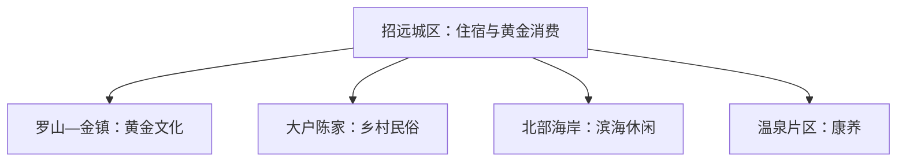
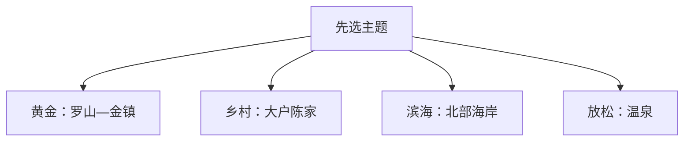

# 招远旅行指南

招远最鲜明的旅行主题是黄金文化。首次可把罗山黄金文化旅游区作为完整一天，再从城区黄金消费、温泉、大户陈家乡村休闲和北部海岸中选择补充线。矿山生产空间与旅游展示空间边界清楚，参观只走正式开放项目。

> 建议停留：2–3 天 
> 旅行关键词：黄金文化、罗山、金镇、温泉、胶东北海岸 
> 主要体力：城区低，罗山中等至较高 
> 无障碍提醒：设施连续性需向官方确认；矿山展示、山地步道和海岸设施分别核对

## 城市速览

| 项目 | 信息 |
|---|---|
| 主要旅行价值 | 了解黄金开采史、黄金加工消费、胶东乡村与北部海岸 |
| 建议停留 | 2 天覆盖黄金主题和城区；3 天增加乡村或海岸 |
| 较舒适季节 | 春秋适合综合游，夏季海岸需留意高温和强对流 |
| 预算特点 | 城区平稳，景区项目、温泉和珠宝消费弹性较大 |
| 步行强度 | 城区低；罗山中等至较高 |
| 独行旅行 | 城区和成熟景区便利，远线先确认返程 |
| 亲子旅行 | 黄金科普、乡村民俗和正式研学项目较合适 |
| 长者与低体力旅行 | 选择博物馆、金镇平缓区和温泉短线 |
| 主要天气风险 | 山区雷雨、强降雨、海岸大风、高温和森林火险 |
| 行前关键动作 | 先确认罗山、金镇与矿山展示项目，再选择乡村或海岸 |

## 城市格局与游览区域

招远是烟台市代管的县级市，法定代码 **370685**。城区承担住宿、商业与交通；罗山和金镇位于东部黄金文化方向，大户陈家在西部乡村方向，北部海岸与自驾项目距离城区较远。

| 区域 | 主要内容 | 建议节奏 | 选择提示 |
|---|---|---|---|
| 招远城区 | 到发、住宿、黄金珠宝商业与公共文化 | 半日至 1 天 | 适合抵离日和购物 |
| 罗山—金镇 | 黄金博物馆、矿业史与山地 | 1 天 | 正式展示线与生产矿区分开 |
| 大户陈家方向 | 民俗、农耕、红色展陈与乡村活动 | 半日至 1 天 | 活动和采摘按季节核对 |
| 北部海岸 | 海岸、露营和水上项目 | 1 天 | 风浪、开放和救生条件优先 |
| 温泉片区 | 温泉与康养 | 半天 | 按健康状况和运营规则选择 |

## 主要景点

| 景点 | 区域 | 类型 | 主要看点 | 建议用时 | 室内外 | 体力 | 预约风险 | 天气影响 | 优先级 |
|---|---|---|---|---:|---|---|---|---|---|
| 罗山黄金文化旅游区与金镇 | 罗山方向 | 工业文化、山地 | 黄金历史、博物馆、主题展示与罗山环境 | 1 天 | 混合 | 中 | 高 | 高 | A |
| 招远黄金珠宝消费与展示空间 | 城区 | 工业、商业 | 黄金加工、设计、展示与消费 | 2–4 小时 | 室内 | 低 | 中 | 低 | B |
| 大户庄园及大户陈家村 | 金岭镇 | 乡村、民俗 | 农耕民俗、红色展陈与乡村休闲 | 半日至 1 天 | 混合 | 低至中 | 中至高 | 中 | B |
| 北部海岸正式开放项目 | 辛庄等沿海方向 | 海岸、休闲 | 沙质海岸、自驾与季节水上活动 | 半日至 1 天 | 室外 | 低至中 | 高 | 很高 | C |
| 温泉片区正式接待项目 | 城区及周边 | 温泉、康养 | 温泉体验和休闲 | 2–4 小时 | 混合 | 低 | 高 | 中 | B |
| 招远公共文化场馆 | 城区 | 文博、地方史 | 地方历史、黄金文化与当期展览 | 2–3 小时 | 室内 | 低 | 中 | 低 | B |

罗山、黄金博物馆、金镇及其主题演艺按一个黄金文化父景区组织。生产矿井、选矿厂、尾矿库和作业道路仅在运营方明确接待的参观线内进入。

## 美食与餐饮

可按胶东面食、鲅鱼水饺、海鲜、焖子、苹果和粉丝类菜品选择。海鲜先问品种、重量、时价和加工费；一人可选水饺、面食或小份海鲜。甲壳类、鱼类、麸质、大豆和共锅烹饪是常见过敏原线索。

## 经典行程

### 一日经典路线
**路线**：城区 → 罗山黄金文化旅游区与金镇 → 城区晚餐。
- **串联逻辑**：把黄金主题完整串联，避免跨到另一条远线。
- **预约锚点**：景区、博物馆和演艺开放。
- **休息安排**：游客中心和金镇餐饮区。
- **时间不足时**：保留博物馆与核心展示，删除外围项目。

### 两日城市路线
**第 1 天**：罗山—金镇；**第 2 天**：城区黄金展示 → 温泉。
- **串联逻辑**：先理解产业历史，再看当代消费与休闲。
- **预约锚点**：景区与温泉时段。
- **休息安排**：第二天午间在城区休息。
- **时间不足时**：第二天只留城区展示。

### 三日深度路线
**第 1 天**：黄金主题；**第 2 天**：城区与温泉；**第 3 天**：大户陈家或北部海岸。
- **串联逻辑**：核心完成后，第三天按乡村或滨海偏好二选一。
- **预约锚点**：第三天活动与车辆。
- **休息安排**：固定城区住宿。
- **时间不足时**：先删第三天。

### 雨天路线
**路线**：公共文化场馆 → 黄金珠宝展示空间 → 温泉。
- **串联逻辑**：从知识展示转入室内休闲，三段都可由城区短途车辆连接。
- **适用条件**：普通降雨且场馆正常；强天气预警减少跨城移动。
- **预约锚点**：场馆和温泉运营。
- **休息安排**：城区餐饮与室内空间。
- **时间不足时**：只留一个室内主题。

### 亲子或低体力路线
**亲子路线**：黄金博物馆 → 大户陈家；**低体力路线**：城区展示 → 温泉。
- **串联逻辑**：亲子方案把产业科普与乡村体验分成前后两段，低体力方案集中在车辆可达的室内项目。
- **减负方式**：亲子选正式科普项目；低体力方案减少山路和换乘。
- **预约锚点**：研学活动、温泉与无障碍设施。
- **休息安排**：场馆休息区和城区餐饮。
- **时间不足时**：各保留一个主项目。

### 远郊一日路线
**路线**：招远城区 → 北部海岸正式开放点 → 返回。
- **串联逻辑**：海岸方向单独成日，城区承担补给、住宿和往返交通。
- **适用条件**：风浪、道路、救生和返程均已确认。
- **预约锚点**：海岸项目或营地运营。
- **休息安排**：正式游客服务区。
- **时间不足时**：整段删除，改走城区黄金主题。

## 住宿区域

| 区域 | 优点 | 缺点 | 适合人群 | 交通特点 |
|---|---|---|---|---|
| 招远城区 | 到发、餐饮和多方向移动方便 | 距海岸较远 | 首访与无车旅行 | 适合固定基地 |
| 罗山近郊 | 靠近黄金主题景区 | 夜间选择较少 | 深度黄金文化旅行 | 依赖景区或车辆 |
| 北部海岸 | 方便看海与慢游 | 季节性强、离城区远 | 自驾和滨海度假 | 先确认道路与补给 |

## 市内交通

潍烟高铁招远站承担铁路到发，具体车次以12306为准。城区使用公交、出租车或网约车；罗山、大户陈家和北部海岸方向分散，适合景区接驳、自驾或合规包车。

## 不同旅行者须知

黄金珠宝消费先核重量、纯度、工费、票据和退换规则。山地与海岸按天气选择；亲子研学以正式接待项目为准。矿区、尾矿库和生产车间属于生产空间，未经运营方安排不得进入。设施连续性需向官方确认。

## 行前核对

| 核对事项 | 为什么需要重查 | 建议时间 | 官方入口 |
|---|---|---|---|
| 罗山、金镇与博物馆 | 改造、活动和场次会变化 | 订房前及前一日 | [招远市人民政府](https://www.zhaoyuan.gov.cn/) |
| 海岸、山地与汛期安全 | 风浪、强降雨和山洪有时效性 | 出发前三日及当天 | [招远文旅安全提示](https://www.zhaoyuan.gov.cn/col/col64203/art/2026/art_cceb982dc47e4ae19a735fcf60aa1fa3.html) |
| 铁路班次 | 车次与售票会调整 | 订票时及当天 | [中国铁路12306](https://www.12306.cn/) |
| 黄金商品与活动 | 商品、工费、活动和开放项目会变化 | 消费和预约前 | 经营主体官方渠道 |

## 来源与更新记录

### 主要来源

| 来源 | 类型 | 支持内容 | 核验日期 |
|---|---|---|---|
| [招远市“十五五”规划](https://www.zhaoyuan.gov.cn/col/col100080/art/2026/art_669cbba8fdfc46eb915367f67ba3377b.html?type=4JnkXemNbirDhO2Om8bBC) | 市政府规划 | 黄金、乡村、滨海、温泉与保护空间 | 2026-08-13 |
| [招远服务业发展通知](https://www.zhaoyuan.gov.cn/col/col100081/art/2026/art_810b9f32134e4b369d7e357012283a7b.html) | 市政府 | 黄金文旅、乡村与温泉方向 | 2026-08-13 |
| [招远工业旅游方案转载](https://www.zhaoyuan.gov.cn/art/2025/5/15/art_64194_2963112.html) | 政府 | 罗山、金镇与黄金工业旅游 | 2026-08-13 |
| [GeoNames 1784953](https://www.geonames.org/1784953/zhaoyuan.html) | 开放地名数据 | 固定城市点 | 2026-08-13 |
| [Wikidata Q197524](https://www.wikidata.org/wiki/Q197524) | 开放知识库 | 法定招远市与P1566交叉核对 | 2026-08-13 |

### 更新记录

| 日期 | 更新内容 |
|---|---|
| 2026-08-13 | 首次完成城市格局、景点选择、路线与动态核对 |
