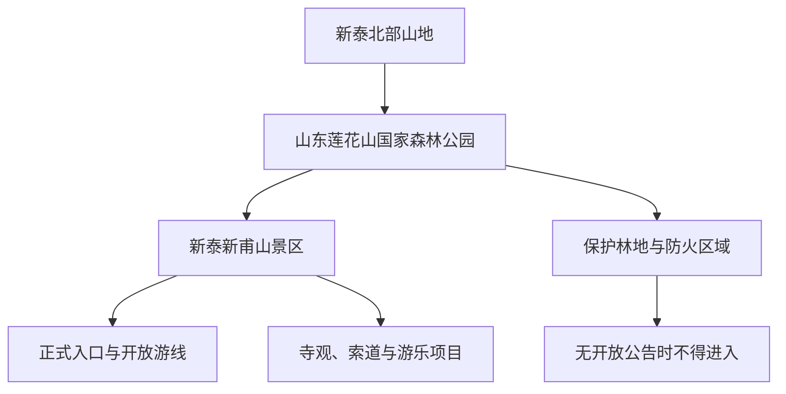
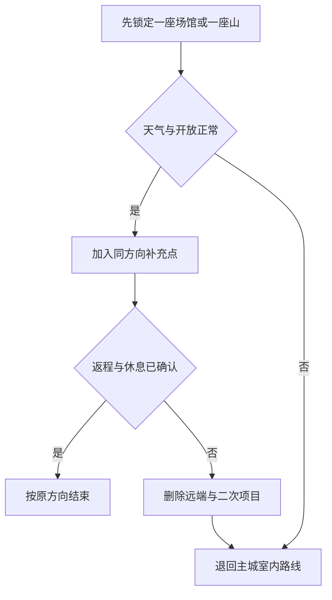

# 新泰旅行指南

新泰是泰安市代管的县级市，也是一座需要把山岳、湖库、矿业城市与乡村生产空间分开安排的鲁中目的地。首访可以在新泰市博物馆建立地方史脉络，到青云湖认识城市与东周水库的关系，再把完整一天留给新甫山；掌平洼、和圣园、新汶森林公园则分别对应山村水利、地方文化与矿区城市转型，彼此不在同一条轻松步行线上。

> 建议停留：城区 1 天；新甫山另留 1 天；增加一个乡镇方向共 3 天 
> 旅行关键词：新甫山、莲花山、青云湖、新泰文博、掌平洼螺旋井、和圣文化、新汶矿业城市、鲁中山地 
> 主要体力：城区低至中等；新甫山与山村路线中高至高强度 
> 最近研究：2026-08-12

## 城市速览

| 项目 | 旅行信息 |
|---|---|
| 主要旅行价值 | 用新泰市博物馆理解地方历史与民俗，以青云湖观察城市水利景观，再在新甫山或掌平洼选择一条山地线；新汶方向则适合从公开公园和城市空间理解煤炭资源型城市的转型背景 |
| 建议停留 | 1 天适合“博物馆＋青云湖”；2 天增加新甫山；3 天再从掌平洼、和圣园或新汶森林公园中选择一个方向，不把分散乡镇压进同一天 |
| 较舒适季节 | 春、秋较适合登山与乡村步行；夏季需防高温、雷电、短时强降雨、山洪和水库高水位，冬季需防寒风、积雪与背阴路面结冰；花期、采摘、庙会和演艺只按当年公告 |
| 预算特点 | 城区公共场馆与公园可低成本安排；山岳门票、索道或游乐项目、远郊车辆、乡村接待和住宿是主要变量，同一景区内的基础门票与二次项目需拆开核对 |
| 步行强度 | 博物馆低至中等，青云湖按开放岸段选走；新甫山有持续爬升、石阶和山地项目，掌平洼村路与螺旋井周边也不按平坦城市公园估算 |
| 主要天气与环境风险 | 雷电、暴雨、山洪、落石、林火、冬季结冰、库岸湿滑、采空塌陷和矿业生产交通；关闭的林区、水库工程区、矿区、塌陷治理区与普通农田不得进入 |
| 独行旅行 | 城区场馆和青云湖开放公园段易独立安排；登山、山村与新汶远端路线应先锁定返程，不独自进入矿井、采坑、废弃巷道、林间支路或无照明库岸 |
| 亲子旅行 | 博物馆、青云湖开放公园段与正规研学较友好；山体临崖、深井围护、水边、农机、矿山车辆和游乐设施需要持续看护，体验项目另核对身高与年龄 |
| 长者与低体力旅行 | 优先“博物馆核心展厅＋车辆连接的湖岸短段”；新甫山全程、掌平洼深井台阶和多乡镇串联不属于低体力路线 |
| 无障碍信息 | 新泰市博物馆等现代场馆可能具备单点设施，但客运站、车辆、湖岸、山门、乡村道路与卫生间之间缺少统一连续资料，须逐点确认 |

新泰市法定行政代码为 `370982`，是泰安市代管的独立县级市。泰山、岱庙与泰城中心属于[泰安](./泰安市.md)的核心旅行范围，肥城、宁阳、东平和济南莱芜方向也各有独立边界；不能因同属泰安市域或鲁中山地而把它们并入新泰景点、餐饮或住宿清单。

新泰最容易混淆的是“莲花山”与“新甫山”。莲花山古称新甫山，现有景区运营资料使用“新泰新甫山景区”名称；“山东莲花山国家森林公园”仍是自然保护地体系中的名称。两者描述同一山地核心的不同管理层级，不是两张彼此独立的景点清单：

景区门票只对应运营方公布的入口、时段与项目，不能推导整个国家森林公园、山脊、防火道和邻近村路均可通行；景区内寺观、地质点、索道、滑道与观景节点也不重复计算成多处独立景点。

## 城市格局与游览区域

新泰主城以青云、新甫等街道的公共服务为中心，青云湖位于主城近侧，是依托东周水库形成的水利风景区。新甫山位于北部泉沟方向；掌平洼在东部龙廷镇山区；和圣园在宫里镇方向；新汶城区与新汶森林公园位于西南。看似都叫“新泰周边”，实际上每一条线都要单独计算车辆往返。

| 区域 | 主要内容 | 游览特点 | 与其他区域的关系 |
|---|---|---|---|
| 新泰主城 | 新泰市博物馆、城市商业、餐饮与住宿 | 是最稳妥的到达、补给和雨天基地；公共场馆各自核对开放 | 可与青云湖组成一日；前往新甫山、掌平洼、和圣园和新汶均需车辆 |
| 青云湖—东周水库 | 青云湖水利风景区内依法开放的公园、湖岸与展陈 | 湖景与城市休闲相结合，但水库同时承担防洪、供水与水产功能 | 与主城距离相对可控；坝体、闸门、溢洪道、水源保护和作业岸线不属于游览延伸 |
| 新甫山方向 | 新泰新甫山景区、国家森林公园背景与具名开放项目 | 完整山岳日，宗教空间、自然保护、游乐项目和森林防火规则并存 | 不与掌平洼或新汶森林公园同日硬拼；“莲花山”旧名不另增加一座山 |
| 龙廷—掌平洼方向 | 掌平洼村、螺旋井、村落与山地果业背景 | 真实村庄、文物、水利和旅游接待并存，村路与院落边界重要 | 适合独立一日；不沿普通山路横切见子山、太平山保护地或临沂方向 |
| 宫里—和圣园方向 | 和圣园、柳下惠文化主题与经确认接待的果园 | 主题园区、宗教民俗活动与农业采摘分别核对 | 与天宝、楼德等镇域相邻不等于同一景区；普通果园和村居不自动开放 |
| 新汶城区与森林公园 | 新汶森林公园、矿业城市公共生活与新汶集团历史背景 | 公园和城区公共空间可以参观；煤矿、选煤、矸石处理、铁路专用线和厂区仍在生产安全体系内 | 与新泰主城存在公路距离；不能用“工业遗产”名义进入企业和矿井 |
| 采煤沉陷治理与农光互补片区 | 塌陷治理、光伏发电、设施农业和生态修复 | 是资源型城市转型背景，不是无边界开放的摄影公园 | 只进入官方具名、确认接待的访客区域；光伏板下、大棚、变电设施、沉陷水面和施工地不作为景点 |

青云湖与东周水库是同一水体在旅行和水利管理中的两种常用称呼，不应拆成两个景点。水利风景区的公共公园、明确开放岸段和展览馆可以安排，水库大坝、取水设施、巡检道路、溢洪道、库汊养殖区和高水位封闭段则服从水利与水源保护管理。

新泰的煤炭工业并非全部成为遗产。官方资料仍列有煤矿、矿业权与固废综合利用项目，也持续开展采煤沉陷治理；文旅规划中出现“矿山公园”建设方向，不足以证明一个具名矿山公园已经长期、稳定向散客开放。本页因此不把“矿山公园”列入景点：未来只有出现明确运营主体、入口、开放公告与访客路线时，才按该访客区安排；在产矿井、停产但未移交开放的井口、采空区、矸石山、洗煤厂、专用铁路和修复工地始终与之分开。

## 主要景点

优先级用于安排时间：**A** 为首访核心，**B** 为按兴趣补充，**C** 为远郊或接待不确定性较高的目的地。车站、公园短段、农业市场与城市广场可以成为路线节点，不与完整场馆或景区重复计数。

### 城区与湖库

| 景点 | 区域 | 类型 | 主要看点 | 建议用时 | 室内外 | 体力 | 预约风险 | 天气影响 | 优先级 |
|---|---|---|---|---:|---|---|---|---|---|
| 新泰市博物馆 | 新泰主城 | 综合博物馆 | 新泰历史文化、地方文物、红色文化、非遗与民俗展陈；具体在展内容以馆方为准 | 2–3 小时 | 室内 | 低 | 中至高 | 低 | A |
| 青云湖水利风景区开放公共段 | 青云湖—东周水库 | 湖泊、水利、公园 | 东周水库与城市湖景、青云湖公园及依法开放的水利文化展陈；内部公园和展馆按一个湖区单元理解 | 2–4 小时 | 室外为主 | 低至中 | 中 | 高 | A |
| 新泰市毛泽东文献博物馆（确认开放时） | 主城青云山方向 | 非国有博物馆、文献专题 | 毛泽东著作与相关文献收藏的公共展陈；只有当期明确开放展厅纳入行程 | 1.5–2.5 小时 | 室内 | 低 | 高 | 低 | B |

新泰市博物馆的常设展陈能够为后续山地、乡村和矿业城市路线提供背景。官网公布的常规开放日可以用于初步排程，但节假日、临展、团队活动、预约与最晚入馆都会变化，不能把研究日信息当作永久承诺。

青云湖适合选择一段正式湖岸，而不是追求环库。水库的公共景观价值与防洪、供水、水产、候鸟栖息功能同时存在；不下水游泳，不进入浅滩追鸟，不翻越围栏，不在大坝或溢洪设施上停车拍照。地图显示沿岸有道路，也不能证明道路对社会车辆或行人开放。

### 新甫山与北部山地

| 景点 | 区域 | 类型 | 主要看点 | 建议用时 | 室内外 | 体力 | 预约风险 | 天气影响 | 优先级 |
|---|---|---|---|---:|---|---|---|---|---|
| 新泰新甫山景区 | 泉沟镇方向 | 山岳、森林、地质与宗教文化 | 山林、地质遗迹、正式开放的寺观与观景游线，以及当日运营的索道、滑道等项目；全部按一个运营景区计算 | 6–9 小时 | 室外为主 | 中高至高 | 高 | 极高 | A |
| 见子山景区（确认开放时） | 北部山地 | 山岳、乡村休闲 | 正式景区入口内的山地游线和观景空间；不以沿线旅游公路代替入园核对 | 4–7 小时 | 室外为主 | 中高 | 高 | 极高 | C |

“新甫山景区”“莲花山景区旧称”“山东莲花山国家森林公园”与景区内各游览区存在父子层级。旅行计数时只保留一个新甫山运营单元；国家森林公园名称用于理解保护地背景，寺观、索道、过山车、地质点与观景台是内部项目。任何一项内部项目暂停，都不等于整座山永久关闭；反过来，景区售票也不表示每一条山路和游乐设备都在运行。

宗教建筑首先是宗教活动空间。进入开放寺观时保持安静，服从着装、礼仪、上香与拍摄规则；不在殿堂、林区和步道使用明火。新甫山是泰安市重点森林防火区域，火险期可能检查火种、限制线路或闭园，必须以景区、林业和应急公告为准。

见子山只在正式运营状态、入口与返程均确认时作为替代山地日。旅游公路改善了到达条件，但道路本身不是封闭景区，也不赋予进入沿线林地、矿地、水库和村民果园的许可。

### 山村、文化园与新汶方向

| 景点 | 区域 | 类型 | 主要看点 | 建议用时 | 室内外 | 体力 | 预约风险 | 天气影响 | 优先级 |
|---|---|---|---|---:|---|---|---|---|---|
| 掌平洼景区 | 龙廷镇掌平洼村 | 山村、水利遗产、乡村文化 | 螺旋井、石头村落、老井精神与当期开放的乡村接待；村庄内部节点按一个景区安排 | 3–5 小时 | 室外为主 | 中 | 高 | 高 | A |
| 和圣园景区 | 宫里镇方向 | 历史文化主题园、园林 | 柳下惠“和圣”文化主题、园林和当期开放的民俗活动；南北园及内部节点按一个园区理解 | 3–5 小时 | 室外为主 | 中 | 高 | 高 | B |
| 新汶森林公园 | 新汶街道方向 | 城郊森林公园 | 当期正式开放游线内的城郊山林与林地景观；以山门、属地公告和森林防火边界为准 | 3–6 小时 | 室外为主 | 中高 | 高 | 极高 | B |

掌平洼螺旋井是市级文物保护单位和水利遗产，井体深、台阶多，是否允许下行、允许到达的深度和参观方向必须服从现场围护。不得跨越护栏俯身拍摄，也不得把水井、石屋、革命历史展陈、果园和居民院落拆成一串无边界“打卡点”。村民住宅、学校、农具房和正在耕作的地块不因景区称号自动开放。

和圣园官方旧资料中的票价、节会月份、采摘与动物展示只能作为历史线索，当日是否存在相应项目必须重新确认。园区内部塑像、祠堂、园林、水面与采摘区按一个运营单元，不为增加景点数量重复计算；宗教活动、果园生产与普通游览也分别服从管理。

新汶森林公园位于资源型城区旁，但森林公园不等于矿山公园，更不等于在产矿区的参观入口。可以在开放山林与城市公共空间理解新汶的环境转型；不得顺着矿业道路进入煤矿、洗选、堆场、塌陷水面、工业铁路或企业生活区。遇到“矿山参观”“工业摄影”宣传时，应先找到运营主体、公开预约与指定访客路线，否则不成行。

### 农业、矿业与水域边界

新泰甜山楂、楼德煎饼、芹菜、百合、苹果等农食具有地方辨识度，但品牌产地不是公共游园。只有官方活动、经营主体或合作社明确接待的果园、展销区与研学空间可以进入；普通大棚、果园、农田、蜂场、养殖场、仓库和加工车间仍是生产区域。花期和采收期更要避让农机、喷药、灌溉和运输车辆。

采煤沉陷治理区中的光伏、农业与水面具有转型展示价值，不代表每块治理地都适合游览。地面看似平整仍可能存在沉降、积水、设备电气和工程车辆风险；没有具名开放入口时，只从公共道路合法通行，不为摄影进入光伏阵列、大棚、变电站、围网或低洼水面。关闭矿井也可能残留井筒、气体、积水和坍塌危险，任何废弃井口与地下空间都不作为探险目的地。

## 美食与餐饮

新泰饮食适合从煎饼、鲁中早餐、家常菜和季节农产入手。楼德煎饼是最容易少量购买的代表性主食，新泰甜山楂、芹菜、百合和风干鸡更适合作为季节菜或正规包装产品；“八顶八”等宴席形式通常面向多人，独行者应先问能否单点或减量。

| 菜品或餐饮类型 | 常见区域 | 一个人用餐与常见份量 | 风味、过敏原与饮食限制 | 排队风险与替代方法 |
|---|---|---|---|---|
| 楼德煎饼与新泰煎饼 | 主城、楼德镇及正规粮食门店 | 可按张、小包或单份购买，适合独食与携带；先少量试口感 | 常含小麦、玉米、小米或杂粮，可能加入鸡蛋、芝麻、花生与大豆；无麸质需求不能只看“杂粮”二字 | 节庆与比赛活动风险高；选标明配料、日期和生产者的同类产品，不为单一摊位跨镇 |
| 糁、油条、蛋饼等鲁中早餐 | 主城、新汶城区与镇区 | 小碗配一份主食适合独行，登山前避免过量油炸 | 汤底可能含牛羊禽肉、小麦、胡椒和味精，油条与蛋饼含麸质和蛋；清真、素食与过敏需求逐项问 | 清晨风险中等；在住宿附近选择周转快、菜单清楚的早餐店 |
| 新泰风干鸡与熟食 | 主城正规熟食店、农产品展销区 | 整鸡更适合多人，独食先问半只、分切或小包装 | 可能含高盐、酱油、小麦、糖与香辛料；禽肉过敏、无麸质与清真加工需确认 | 节前风险中高；按包装标签、冷链和明码标价选择，不把某一品牌当唯一答案 |
| 新泰千禧八顶八等宴席菜 | 主城及具名餐饮接待 | 多道菜、多人桌餐，不适合一人完整点单；询问单点、小份或拼餐 | 常见猪肉、禽肉、鱼、蛋、花生、芝麻、大豆和小麦，汤与炸物可能共锅 | 婚宴与节庆风险高；改选家常鲁菜馆的一荤一素或面食，不为宴席名号制造浪费 |
| 新泰甜山楂及山楂制品 | 主城市场、刘杜镇具名接待与正规包装门店 | 鲜果可少量称重，果干、糕、饮料先看含糖量与净重 | 山楂酸度高，加工品可能高糖并含明胶、坚果或同线过敏原；服药或胃部敏感者按医疗建议控制 | 采收季风险高；不进普通果园摘果，在市场或确认接待的采摘园购买 |
| 芹菜、百合、苹果与地方时蔬 | 正规市场、餐馆和确认接待的农业园 | 餐厅通常按盘，农产品可少量购买；整箱不适合短途独食 | 芹菜本身是过敏原之一，百合与蜂蜜制品需看配料；素菜可能使用动物油、蚝油或共锅 | 丰收节与采摘季风险中等；在城区市场购买可追溯产品，采摘只进入运营区 |
| 红毛山羊、羊汤和鲁中炖菜 | 主城、新汶及镇区正规餐馆 | 羊汤可一人食，整锅或羊宴适合多人；先问内脏与份量 | 盐脂较高，汤底、蘸料可能含小麦、芝麻、花生和大豆；清真制作看门店明确标识 | 冬季与周末风险中高；改选小碗羊汤或普通炖菜，不用大份套餐 |
| 山区农家菜 | 新甫山、掌平洼、和圣园周边确认营业的接待点 | 常按盘或套餐，独行者先问简餐、半份和能否单人接待 | 可能含猪肉、蛋、花生、芝麻、大豆和小麦，素菜也可能用动物油；严重过敏者不依赖口头猜测 | 周末、团体日和闭园前风险高；提前订餐或自备合规干粮，返城用餐是更稳妥替代 |

严重过敏、清真、纯素或无麸质旅行者应询问汤底、油脂、酱料、勾芡、共锅和同线加工。山地摊点与节庆市集的配料信息可能不完整，可把它们作为体验补充而非唯一正餐；酒后不驾车进山，也不在林区、宗教建筑和水源保护区饮食或丢弃包装。

## 经典行程

### 一日城区经典路线

**路线**：新泰市博物馆 → 主城午餐与休息 → 青云湖水利风景区开放湖岸短段 → 返回主城

- **串联逻辑**：上午先从地方史、红色文化和民俗建立城市脉络，下午再理解青云湖与东周水库的水利、生态和城市休闲关系；两处用城市交通连接。
- **适用与减负**：适合首访、独行、亲子与不登山者；博物馆只选常设展核心，湖区只走一段有明确入口与退出点的平缓岸线。
- **预约锚点**：博物馆开放、预约和最晚入馆最优先；其次核对青云湖开放段、水位、施工和天气，不用地图评论判断大坝可通行。
- **休息安排**：午餐和长休放在主城固定室内空间，湖区使用开放公园的座椅、卫生间和服务点，不在水利设施与鸟类栖息岸段停留。
- **时间不足时**：删去湖岸延伸和文献专题馆，只保留新泰市博物馆；遇暴雨、雷电或水库管理调整时直接取消湖区。

### 新甫山完整一日路线

**路线**：新泰主城 → 新泰新甫山景区正式入口 → 当日开放核心游线 → 游客服务区休息 → 按原确认方式返回主城

- **串联逻辑**：把山岳、森林、地质与宗教文化放在一个完整景区日内，索道、滑道、寺观与观景节点均作为景区内部选择，不另加第二座“莲花山”。
- **适用与减负**：适合普通至较好体力者；低体力者只在确认索道、上下站台阶和退出路线后选择短线，游乐项目逐项按身体条件取舍。
- **预约锚点**：景区门票、入口、索道或游乐项目、森林防火、雷电大风与闭园时间同时锁定；下山方式优先于上山项目。
- **休息安排**：使用游客中心、索道站和正式服务点；在进入长爬升前补水，不在寺观、狭窄台阶、林下和地质保护点进食久留。
- **时间不足时**：先删二次游乐和侧向观景点，再按官方节点折返；不能翻越围护走防火道、村路或山脊捷径。

### 两日山城路线

**第 1 天**：新泰市博物馆 → 主城午休 → 青云湖开放公园段 → 主城住宿 
**第 2 天**：新泰主城 → 新甫山景区 → 正式游线 → 返回主城

- **串联逻辑**：第一天处理城市历史与湖库关系，第二天独立承担山岳体力和天气风险，避免看馆后仓促进山。
- **适用与减负**：适合首次来新泰且希望覆盖核心主题者；第一天控制步行，第二天只安排新甫山一个运营单元，不追加见子山或掌平洼。
- **预约锚点**：先锁定第二天新甫山开放与返程，再匹配博物馆开放日；若山地天气不稳，可互换两天但不把闭园日改成野山路线。
- **休息安排**：两晚均以主城为基地，第一天在室内午休，第二天在景区正式服务区分段休息并留足返程缓冲。
- **时间不足时**：先删青云湖长段，再把新甫山改成官方短线；若只剩一天，在“城区双点”和“新甫山单点”中二选一。

### 掌平洼山村一日路线

**路线**：新泰主城 → 龙廷镇掌平洼景区入口 → 螺旋井依法开放参观范围 → 村内正式接待点午餐与休息 → 返回主城

- **串联逻辑**：围绕缺水山村、螺旋井与当代乡村接待理解一个完整村落，不把邻近民居、果园和北部山地串成无边界游线。
- **适用与减负**：适合乡村、水利与红色文化兴趣者；台阶能力不足者只在井口安全平台和村内平缓开放段参观，不以下井作为行程完成条件。
- **预约锚点**：景区接待、螺旋井围护与可参观深度、停车、餐饮和返程车辆优先；雨雪后另核对村路与石阶。
- **休息安排**：只使用游客中心、经营性餐饮和开放公共空间，不在井口、村民院门、学校、农机道和果园作业区停留。
- **时间不足时**：只保留螺旋井与一段村落公共空间；返程不确定、井体关闭或山路预警时取消整条远郊线。

### 和圣文化与农业边界路线

**路线**：新泰主城 → 和圣园景区 → 园区正式餐饮或宫里镇确认营业餐馆 → 当期开放的文化活动或经营性采摘区 → 返回主城

- **串联逻辑**：先在一个完整园区理解柳下惠“和圣”文化，再把采摘视为季节性、经营性的附加项目，不沿途进入普通果园。
- **适用与减负**：适合文化园林、家庭与季节农食兴趣者；低体力者缩短园区步行，放弃山坡、动物展示或采摘长段。
- **预约锚点**：和圣园营业、园内项目、宗教或民俗活动、采摘品种与收费分别确认；旧资料中的固定月份和票价不能直接沿用。
- **休息安排**：在园区服务点或镇区正规餐饮休息，采摘前后洗手并避让农机、喷药和装运，不在果树下野餐。
- **时间不足时**：删去采摘与当期演艺，只保留园区核心；园区未确认营业时不以附近村庄或私人祠墓替代。

### 新汶森林与矿业城市背景路线

**路线**：新泰主城 → 新汶城区公共空间 → 新汶森林公园正式山门 → 开放短线 → 新汶城区用餐 → 返回

- **串联逻辑**：从矿业城市的公开生活空间进入城郊森林公园，观察资源型地区的环境与城市转型；不把煤矿企业、塌陷地或规划中的矿山公园混入路线。
- **适用与减负**：适合工业城市史与森林休闲兴趣者；只走森林公园明确开放短线，矿业内容以公共展陈和可合法观察的城市背景为限。
- **预约锚点**：森林公园入口、开放线路、防火、天气、公交或车辆返程最优先；若出现企业开放日，也要使用其单独报名与访客路线。
- **休息安排**：在新汶城区正规餐馆与森林公园服务点休息，不在矿区门口、专用铁路、矸石堆场、光伏阵列和林下停留拍摄。
- **时间不足时**：删去城区观察，只保留森林公园短线；若公园关闭则直接改为新泰主城路线，不进入矿业或林业管控区替代。

### 雨天或低体力路线

**路线**：新泰市博物馆核心展厅 → 主城午餐与午休 → 确认开放的新泰市毛泽东文献博物馆或主城公共文化空间 → 返回住宿

- **串联逻辑**：以室内场馆承担主要内容，山岳、深井、湖岸、村路、矿区与农业园全部退出；两馆各有独立开放条件。
- **适用与减负**：适合普通降雨、亲子、长者和低体力旅行者；每馆只走一组核心展厅，车辆落客点与入口之间仍需确认。
- **预约锚点**：两馆闭馆日、临展、团队接待、最晚入馆和无障碍设施；暴雨积涝下即使场馆开放，也不勉强跨城移动。
- **休息安排**：把午休放在主城固定室内空间，场馆内按座椅分段参观，不在入口、消防通道和展柜前长时间停留。
- **时间不足时**：只保留新泰市博物馆；第二馆没有可靠当日公告时，用主城餐饮与住宿休息替代。

行程删减可按以下顺序执行：

这套顺序优先保留一个明确运营单元和安全返回，把季节活动、二次游乐、采摘与远端加点放在可删除层。

## 住宿区域

新泰适合以主城为住宿基地。只有连续安排新甫山、掌平洼、和圣园或新汶方向时，才考虑具名景区或镇区经核验住宿；宣传中的“山景”“矿区文化”“田园”不能证明步行可达入口或全年营业。

| 住宿区域 | 主要优势 | 主要代价 | 适合人群 | 预订前核对 |
|---|---|---|---|---|
| 新泰主城 | 餐饮、商业、博物馆、客运和叫车相对集中，适合分方向出行 | 到新甫山、掌平洼、和圣园和新汶仍需车辆 | 首访、独行、公共交通与多日分线旅行者 | 实际地址、夜间前台、电梯、隔音、停车、到客运站和次日上车点 |
| 青云湖附近城市住宿 | 便于湖区短线与主城东侧活动，环境相对开阔 | 不代表房间临湖或可直接进入水库岸线；夜间餐饮密度不同 | 亲子、低体力、以城区休闲为主者 | 到开放湖岸入口的道路、夜间照明、叫车、无障碍房和水库管理 |
| 新甫山景区周边确认运营住宿 | 可减少登山日早晚往返，便于参加具名活动 | 山路、餐饮、叫车、供暖制冷和闭园退订不如主城稳定 | 自驾、两日山地、早起登山者 | 合法经营、与检票口距离、道路、停车、餐食、火险管控和取消规则 |
| 新汶城区 | 接近新汶森林公园和矿业城市公共空间，日常服务相对完整 | 离新泰主城和北部山地较远，企业生活区与旅游区边界需辨认 | 新汶专题、自驾或探亲兼旅行 | 具体街区、夜间餐饮、到森林公园入口、公交、停车和矿区道路 |
| 掌平洼、宫里等乡村经核验住宿 | 便于慢游单一乡村或参加正式节庆、采摘 | 季节性强，餐饮、医疗、通信、消防和返程选择少 | 自驾、已确认接待的乡村旅行者 | 当日营业、供暖制冷、卫生间、餐食、司机、消防和夜间进出 |

预订景区套餐时拆开核对房间、门票、索道或游乐、早餐、停车和取消规则。新甫山闭园、道路管制或活动取消时，住宿订单不自动赋予进山权利；乡村民宿在地图上存在，也不证明前台、餐饮与夜间交通持续可用。

## 市内交通

新泰的旅行移动以公路为主。新泰客运总站、公路班线、城市公交、出租与网约车承担主要到达和换乘；地图上的铁路与“新泰站”名称不能直接当作现有客运到达方案，只有中国铁路 12306 实际售票、票面站名与当日到发才能证明可乘。

| 交通场景 | 较稳妥方式 | 主要风险 | 行前核对 |
|---|---|---|---|
| 从泰安、济南或周边城市抵达 | 使用当期公路客运、自驾或正规预约车辆；机场联程先锁定末段公路 | 班线频次、上下客点与高速施工变化；口头“直达”不等于送到景区 | 新泰客运总站、交通主管部门、承运方、实际终点与返程班次 |
| 铁路联程 | 先在 12306 选择实际售票车站，再从泰安、济南莱芜或其他节点公路转入 | 把货运铁路、规划车站或地图地名误认成客运站；同名站与城市距离 | 票面站名、到发时刻、行李、联程缓冲与末班公路交通 |
| 主城—青云湖 | 城市公交、出租、网约车或自驾到明确开放入口 | 导航到大坝、管理所或封闭岸线；环湖道路权限不明 | 公园入口、施工、水位、停车、公交末班与返程定位 |
| 主城—新甫山 | 景区交通公告、正规预约车辆或自驾 | 山门名称、旧称“莲花山”、停车和返程定位混淆；天气导致项目停运 | 景区全名、售票入口、停车、索道或游乐状态、闭园和司机接回点 |
| 主城—掌平洼或和圣园 | 自驾、当期城乡公交或预约往返车辆 | 村路、活动拥堵、散场叫车和夜间照明不稳定 | 精确入口、停车、公交首末班、司机等待、餐饮和卫生间 |
| 主城—新汶 | 城乡公交、公路车辆或自驾，目的地写明森林公园或新汶城区具体点 | 把矿区道路、企业门口或专用铁路当旅游通道 | 公园山门、公交、矿区禁行、森林防火与返回主城时间 |
| 2026 年泰新高速改扩建影响 | 按交通主管部门最新绕行和管制执行，给跨城路线增加缓冲 | 阶段性半幅封闭、单向限制、收费站与服务区调整会使旧导航失效 | [泰安市交通运输局施工公告](https://jtj.taian.gov.cn/art/2026/3/19/art_45797_10303830.html)与出发日导航 |

新泰境内矿业、物流和农业车辆较多，自驾经过乡镇、铁路道口、矿区周边和山路时应降低速度，不在厂门、铁路道口、弯道、桥梁、光伏场与农机道停车。旅游公路可以改善到达，但不等于沿线每一处林地、水库、果园和矿山都提供停车与参观。

## 不同旅行者须知

| 旅行者 | 较合适的选择 | 主要障碍 | 需要提前确认 |
|---|---|---|---|
| 独行旅行 | 新泰市博物馆、青云湖开放短段和正常运营的新甫山主线 | 乡村末班、山脚叫车、矿区与林区通信不稳定 | 返程车辆、闭馆闭园、手机信号、住宿前台和紧急联系人 |
| 亲子家庭 | 博物馆、湖岸公园和正规研学；掌平洼以井口安全观察为主 | 深井、水边、山体临崖、农机、矿业车辆和游乐设备 | 儿童预约、身高年龄、护栏、卫生间、推车与材料安全 |
| 长者与低体力旅行 | 博物馆分段、青云湖平缓短段、车辆接驳 | 山岳持续爬升、掌平洼井体台阶、乡村落客距离 | 座椅、电梯、轮椅、落客点、陪同与可随时退出的路线 |
| 轮椅或行动辅助器具使用者 | 现代场馆单点参观 | 车站—车辆—入口—展厅—卫生间的连续资料不足，山地和村落障碍更多 | 坡道、电梯、轮椅尺寸、无障碍卫生间、车辆协助和应急疏散 |
| 山地旅行者 | 新甫山正式游线、确认开放的见子山 | 火险、雷电、暴雨、结冰、落石和封闭支路 | 入口、路况、防火、气象、装备、补水、下撤和末班 |
| 工业文化旅行者 | 新汶城区公共空间、公开展陈与企业正式开放日 | 在产煤矿、关闭井口、采空区、矸石山和企业铁路不对散客开放 | 运营主体、公开报名、证件、访客路线、摄影和劳保要求 |
| 摄影旅行 | 青云湖开放岸段、新甫山观景点、村落公共空间 | 水源保护、无人机空域、宗教礼仪、肖像、矿山和农田生产边界 | 无人机、三脚架、人物授权、日出日落、封闭与商业拍摄许可 |
| 素食、清真或严重过敏者 | 主城正规餐馆和有包装标签的农产品 | 汤底、动物油、共锅、宴席大份和乡村餐饮配料不透明 | 猪肉、牛羊肉、蛋、乳、花生、芝麻、大豆、麸质与交叉接触 |
| 国际旅行者 | 博物馆、正规景区和主城住宿 | 护照实名、外语信息、支付和乡村通信差异 | 证件类型、人工核验、支付、住宿登记、翻译与返程 |

工业文化兴趣不构成进入矿区的理由。看到“生产重地”“塌陷危险”“水源保护”“森林防火”“施工”“农药作业”或私人院落标识时应停止前行；即使现场没有工作人员，也不能翻越围栏或沿废弃轨道、井口和输电设施寻找机位。

## 行前核对

| 项目 | 核对内容 | 建议时间 | 官方入口 |
|---|---|---|---|
| 新泰市博物馆 | 开放日、预约、证件、临展、最晚入馆、讲解、寄存与无障碍 | 排路线时、前一日及当天 | [新泰市博物馆](http://www.xtsbwg.cn/) |
| 新甫山景区 | 现用名称、门票、入口、开放游线、索道与游乐项目、停车和闭园 | 购票前、前一日及当天早晨 | [山东文旅景区投资集团新甫山资料](https://www.sdwljqtzjt.com/dipan/2.html)；[泰安市文旅局活动公告](https://whlyj.taian.gov.cn/art/2025/5/20/art_47879_10307911.html) |
| 莲花山国家森林公园与防火 | 自然保护地边界、火种检查、火险等级、临时封山和非开放林道 | 登山前三日及当天 | [泰安市林业局莲花山资料](https://lyj.taian.gov.cn/art/2019/4/18/art_47483_5433323.html)；[泰安市应急管理局森林防火](https://yjglj.taian.gov.cn/art/2026/6/29/art_69299_10342328.html) |
| 青云湖—东周水库 | 开放湖岸、展馆、水位、施工、水源保护、停车与高水位封闭 | 前一日及到达前 | [泰安市水利局青云湖资料](https://slj.taian.gov.cn/art/2025/5/15/art_354138_10298563.html) |
| 掌平洼 | 景区接待、螺旋井可参观范围、村路、停车、餐饮与返程 | 至少提前一天 | [泰安市水利局掌平洼螺旋井](https://slj.taian.gov.cn/art/2024/12/12/art_354133_10296865.html)；龙廷镇与景区当期公告 |
| 和圣园 | 营业、门票、园内项目、庙会或演艺、采摘与动物展示 | 排入路线前、前一日 | [泰安市文化和旅游局和圣园资料](https://whlyj.taian.gov.cn/art/2024/1/15/art_69508_4676490.html)；景区当期渠道 |
| 新汶森林公园 | 山门、开放线路、森林防火、餐饮、公交和闭园 | 前一日及当天 | [泰安市林业局森林公园名录](https://lyj.taian.gov.cn/art/2025/10/13/art_361284_10300908.html)；属地公告 |
| 矿山、沉陷治理与农业接待 | 是否存在具名开放访客区；在产矿、塌陷地、光伏和大棚的围栏与生产安排 | 只有取得运营方确认后才成行 | [泰安市自然资源和规划局矿业核查](https://zrzyj.taian.gov.cn/art/2024/11/7/art_47378_10328123.html)；[采煤沉陷区治理资料](https://sthjj.taian.gov.cn/art/2025/7/11/art_168411_10315286.html?xxgkhide=1) |
| 公路客运与城市交通 | 新泰客运总站、跨城班线、城乡公交、景区接驳、首末班与上下客点 | 订住宿前、前一日及当天 | [泰安市交通运输局](https://jtj.taian.gov.cn/)；承运方官方渠道 |
| 铁路联程 | 实际售票车站、票面站名、车次、转公路时间与末班 | 购票时及乘车前 | [中国铁路 12306](https://www.12306.cn/) |
| 天气与山地安全 | 高温、雷电、暴雨、山洪、大风、森林火险、积雪和道路结冰 | 出发前三日、每日早晨及登山前 | [中央气象台新泰预报](https://nmc.cn/publish/forecast/ASD/xintai.html)；[泰安市应急管理局](https://yjglj.taian.gov.cn/) |
| 餐饮与农产品 | 营业、份量、过敏原、清真条件、包装、称重、采摘接待与农药作业 | 预约、点单和购买前 | 经营主体菜单与标签；[泰安市政府新泰农产品名录](https://www.taian.gov.cn/art/2025/9/5/art_46739_10360300.html) |
| 行政与数据标识 | 法定县级市范围、GeoNames 城市点与 Wikidata 实体关系 | 研究更新时 | [GeoNames `1788618`](https://www.geonames.org/1788618/)；[Wikidata `Q1344683`](https://www.wikidata.org/wiki/Q1344683) |

官方渠道、票务页面和现场管理不一致时，以最新安全管理和现场封闭为准。山体关闭时不走防火道，井体关闭时不越过围护，湖岸封闭时不改走坝体，矿业或农业接待取消时不进入生产区替代。

## 来源与更新记录

### 主要来源

| 来源 | 类型 | 支持内容 | 核验日期 |
|---|---|---|---|
| [泰安市行政区划](https://tjj.taian.gov.cn/art/2022/12/26/art_46880_6422281.html) | 地级统计与行政资料 | 新泰市属于泰安市县级行政单元及乡镇街道构成 | 2026-08-12 |
| [山东省民政厅：县级以下行政区划代码表](http://mzt.shandong.gov.cn/module/download/downfile.jsp?classid=0&filename=d4f2a3c2daf44b61a320e09a61f7c9cd.pdf) | 省级民政主管部门 | 新泰市行政代码的官方依据；本页使用对应六位代码 `370982` | 2026-08-12 |
| [新泰市博物馆](http://www.xtsbwg.cn/) | 场馆官方 | 常设展览、开放服务与动态公告入口 | 2026-08-12 |
| [泰安市文旅局：新泰市文博工作](https://whlyj.taian.gov.cn/art/2024/11/25/art_45626_10304892.html) | 地级文旅主管部门 | 新泰市博物馆、寺山文物与地方文博体系 | 2026-08-12 |
| [山东文旅景区投资集团：新泰新甫山景区](https://www.sdwljqtzjt.com/dipan/2.html) | 国有景区运营资料 | 景区现用名称、旧称莲花山、运营单元、山地与项目结构 | 2026-08-12 |
| [泰安市文旅局：2025 中国旅游日新甫山活动](https://whlyj.taian.gov.cn/art/2025/5/20/art_47879_10307911.html) | 地级文旅主管部门 | 新甫山景区当前运营、活动与内部项目动态 | 2026-08-12 |
| [泰安市林业局：莲花山国家森林公园](https://lyj.taian.gov.cn/art/2019/4/18/art_47483_5433323.html) | 地级林业主管部门 | 莲花山与新甫山历史名称、森林公园与山地生态背景 | 2026-08-12 |
| [泰安市国土空间总体规划](https://zrzyj.taian.gov.cn/module/download/downfile.jsp?classid=0&filename=c4e99c96e9984a3d8cadaf01d415a229.pdf) | 地级自然资源规划 | 山东莲花山国家森林公园、青云湖湿地公园、新汶森林公园及保护地层级 | 2026-08-12 |
| [泰安市水利局：东周水库与青云湖](https://slj.taian.gov.cn/art/2025/5/15/art_354138_10298563.html) | 地级水利主管部门 | 青云湖即东周水库、水利功能、开放风景区与生态保护 | 2026-08-12 |
| [泰安市水利局：掌平洼螺旋井](https://slj.taian.gov.cn/art/2024/12/12/art_354133_10296865.html) | 地级水利主管部门 | 螺旋井位置、结构、历史、水利遗产与文物身份 | 2026-08-12 |
| [泰安市文化和旅游局：和圣园](https://whlyj.taian.gov.cn/art/2024/1/15/art_69508_4676490.html) | 地级文旅主管部门 | 园区主题、位置、内部项目和节会历史；具体运营仍动态核对 | 2026-08-12 |
| [泰安市林业局：森林公园名录](https://lyj.taian.gov.cn/art/2025/10/13/art_361284_10300908.html) | 地级林业主管部门 | 山东新泰新汶省级森林公园的官方名录身份 | 2026-08-12 |
| [泰安市生态环境局：采煤沉陷区治理](https://sthjj.taian.gov.cn/art/2025/7/11/art_168411_10315286.html?xxgkhide=1) | 地级生态环境主管部门 | 新泰采煤沉陷区、光伏发电、农光互补与生产性空间背景 | 2026-08-12 |
| [泰安市自然资源和规划局：矿业权核查](https://zrzyj.taian.gov.cn/art/2024/11/7/art_47378_10328123.html) | 地级自然资源主管部门 | 新泰仍有在产煤矿与矿业权，不能把矿业区域概括为遗产公园 | 2026-08-12 |
| [国家发展改革委：新泰大宗固废综合利用基地](https://www.ndrc.gov.cn/fggz/hjyzy/zyzhlyhxhjj/202212/t20221230_1344880.html) | 国家主管部门 | 煤矿充填、煤矸石与粉煤灰综合利用及在产项目背景 | 2026-08-12 |
| [泰安市应急管理局：森林防灭火](https://yjglj.taian.gov.cn/art/2026/6/29/art_69299_10342328.html) | 地级应急主管部门 | 莲花山等重点林区的防火检查与火源管控 | 2026-08-12 |
| [泰安市交通运输局：泰新高速改扩建](https://jtj.taian.gov.cn/art/2026/3/19/art_45797_10303830.html) | 地级交通主管部门 | 2026 年阶段性交通管制与绕行复核入口 | 2026-08-12 |
| [泰安市政府：新泰农产品名录](https://www.taian.gov.cn/art/2025/9/5/art_46739_10360300.html) | 地级政府资料 | 新泰百合干、风干鸡与金丝皇菊等当期产品 | 2026-08-12 |
| [泰安市人民政府：新泰地理标志产品](https://www.taian.gov.cn/art/2017/4/25/art_46702_4062744.html) | 地级政府资料 | 楼德煎饼、新泰芹菜、苹果、草猪、红毛山羊与甜山楂等地方产品 | 2026-08-12 |
| [中央气象台：新泰](https://nmc.cn/publish/forecast/ASD/xintai.html) | 国家气象服务 | 温度、降水、风与山地出行的动态天气入口 | 2026-08-12 |
| [GeoNames：Xintai，记录 1788618](https://www.geonames.org/1788618/) | 开放地名数据 | 新泰城市记录标识 | 2026-08-12 |
| [Wikidata：Q1344683](https://www.wikidata.org/wiki/Q1344683) | 开放结构化数据 | 新泰市法定实体及 `P1566` 对应关系 | 2026-08-12 |

### 行政与旅行边界

新泰市是泰安市代管的法定县级市，行政代码为 `370982`。旅行范围覆盖新泰行政区域内依法开放的城区场馆、水利风景区、山岳景区、森林公园、主题园区、乡村景区与具名经营性农业接待点；泰山与泰城、肥城、宁阳、东平、济南莱芜和临沂方向均按其他目的地处理。

GeoNames `1788618` 表示 Xintai 城市记录，Wikidata `Q1344683` 表示新泰市县级行政实体；实时核验中，`Q1344683` 的 `P1566` 精确指向 `1788618`。标识相互对应不等于城市点坐标覆盖整个县级市，也不能推导主城、新汶、掌平洼、和圣园和新甫山可连续步行。

新泰新甫山景区是原莲花山景区的现运营名称，“山东莲花山国家森林公园”是更上位的自然保护地名称。两者不重复计数，景区票务只覆盖公布的运营范围；保护林地、防火道、寺观非开放区和邻近村地仍服从各自管理。青云湖与东周水库同样只计一个湖库单元，公共公园和水利设施不能混为一体。

矿业空间按状态分开：公开开放的工业遗产访客区可以在未来出现正式公告后进入；规划中的矿山公园、治理中的采煤沉陷区、在产煤矿、停产未开放井口、矸石和固废处理、厂区、专用铁路与光伏农业生产区均不作为当前散客景点。农业空间也只以明确接待的果园、园区、课程与展销区为开放范围。

### 更新记录

| 日期 | 更新内容 |
|---|---|
| 2026-08-12 | 建立研究版城市页；核实 GeoNames `1788618`、Wikidata `Q1344683` 的精确 `P1566` 对应与法定代码 `370982`；厘清新甫山景区、莲花山旧称和国家森林公园的父子层级，区分青云湖与东周水库的公共游览和水利功能，并限定采煤塌陷、矿山、光伏农业、森林防火与乡村生产边界；补充城区、山岳、掌平洼、和圣园、新汶、雨天低体力路线及饮食、住宿、交通、无障碍和行前核对。 |
