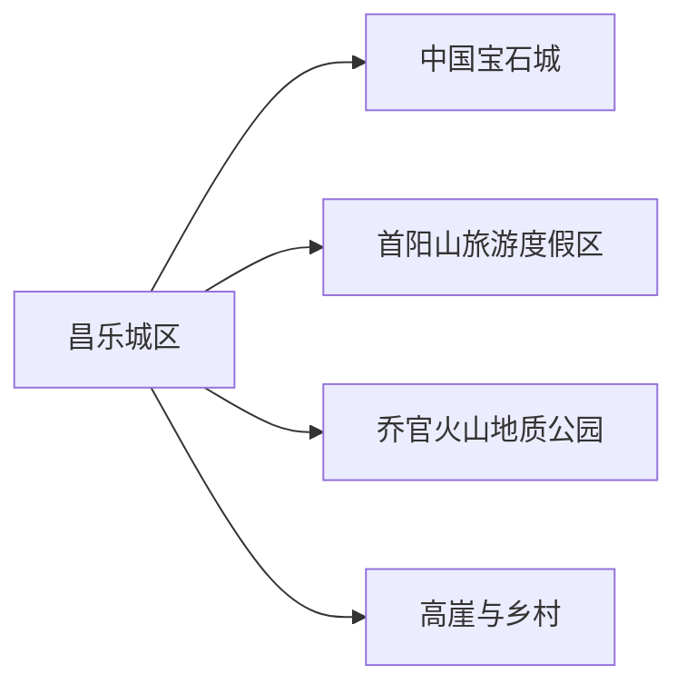
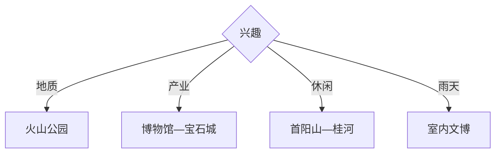

# 昌乐旅行指南

昌乐适合围绕火山地质、蓝宝石文化、首阳山与县城公园安排1—2天。地质点和矿业体验要优先选择正式开放景区与展馆；县城可作为交通餐饮中心，乔官火山群和首阳山分别留出半日。

## 城市速览

| 项目 | 信息 |
|---|---|
| 主线 | 县城博物馆—中国宝石城—首阳山—乔官火山地质公园 |
| 停留 | 县城半日至1天；增加地质远线共2天 |
| 住宿 | 县城选择多，首阳山周边适合单一度假主题 |
| 交通 | 从潍坊方向铁路或公路进入，远端点用公交、正规包车或自驾 |
| 风险 | 夏季高温雷雨、火山岩坡面、矿坑与水源保护区边界 |
| 边界 | 地质遗迹、矿业生产区、水源保护区、林地与农业设施按开放范围进入 |

## 城市格局与游览区域

固定 `Changle / GeoNames 1815669` 对应潍坊市昌乐县，本页以 `Q1062070` 组织县域。县城文化和宝石产业可连续安排，首阳山与乔官位于不同方向，适合分半日或分日选择。

## 主要景点

| 景点 | 区域 | 类型 | 核心体验 | 用时 | 环境 | 体力 | 预约风险 | 天气影响 | 优先级 |
|---|---|---|---|---:|---|---|---|---|---|
| 昌乐县博物馆 | 县城 | 地方文博 | 县史、考古与火山宝石背景 | 1.5–3小时 | 室内 | 低 | 中 | 低 | A |
| 中国宝石城公开展销区 | 县城 | 产业文化 | 蓝宝石加工、交易与地方产业 | 2–4小时 | 室内为主 | 低 | 中 | 低 | A |
| 首阳山旅游度假区 | 县城东南 | 山水人文 | 夷齐文化、桂河与度假景观 | 半日 | 室外为主 | 中 | 中 | 高 | A |
| 昌乐火山国家地质公园开放区 | 乔官镇 | 地质遗迹 | 古火山群、玄武岩与科普观察 | 半日 | 室外 | 中高 | 高 | 很高 | A |
| 西湖公园 | 县城 | 城市公园 | 湖岸步行与日常生活 | 1–2小时 | 室外 | 低 | 低 | 中 | B |
| 桂河湿地公开段 | 首阳山方向 | 河流湿地 | 滨水生态与慢行 | 1–3小时 | 室外 | 低中 | 中 | 高 | B |
| 乔官乡村公开体验点 | 乔官镇 | 农旅 | 火山小米与乡村景观 | 2–4小时 | 混合 | 中 | 高 | 高 | C |
| 非遗或地方文化展演 | 县城及乡镇 | 非遗 | 荆山悠腔、狮舞等地方文化 | 1–2小时 | 混合 | 低 | 很高 | 低 | C |

## 美食与餐饮

县城适合潍坊肉火烧、朝天锅、鸡鸭和家常鲁菜，乔官方向可关注火山小米等地方农产。共享菜先问份量和咸度；宝石、农产和研学消费选择明码标价、可提供凭证的经营点。

## 经典行程

### 两日基础线
**路线**：县城文博—宝石城—首阳山—次日乔官火山。**逻辑**：先理解产业和地质，再到现场。**预约锚点**：博物馆、地质公园。**休息**：县城与度假区。**删除条件**：天气不稳时取消火山远线。

### 县城产业线
**路线**：县博物馆—中国宝石城—西湖公园。**逻辑**：室内知识与城市休闲连续衔接。**预约锚点**：开馆与公开展区。**休息**：宝石城商业区。**删除条件**：场馆闭馆时保留正规展销与公园。

### 火山地质线
**路线**：乔官镇—地质公园正式入口—科普步道—返城。**逻辑**：用完整半日观察火山地貌。**预约锚点**：开放、讲解与交通。**休息**：游客服务区。**删除条件**：雷雨、结冰或地质点管控时取消。

### 首阳山休闲线
**路线**：首阳山—桂河公开段—度假区餐饮。**逻辑**：山水与人文在同片区完成。**预约锚点**：景区开放和停车。**休息**：度假区。**删除条件**：高温或强降雨时缩成桂河短段。

### 乡村农旅线
**路线**：乔官公开农旅点—乡村午餐—县城返程。**逻辑**：以季节和正规接待选择单一村庄。**预约锚点**：活动、供餐和道路。**休息**：镇区。**删除条件**：农忙或接待暂停时改首阳山。

### 雨天线
**路线**：县博物馆—宝石城公开展区—县城餐饮。**逻辑**：全部集中在室内和短距离。**预约锚点**：场馆。**休息**：宝石城。**删除条件**：只保留已确认开放的一个场馆。

### 低体力线
**路线**：县博物馆—宝石城—车辆游西湖公园。**逻辑**：减少火山坡面和山路。**预约锚点**：落客与无障碍。**休息**：室内场馆。**删除条件**：高温时保留室内。

## 住宿区域

昌乐城区适合铁路、公路、餐饮和多方向换线；首阳山周边适合度假慢住，核对营业与返城方式；乔官乡村住宿适合地质或农旅主题，确认消防、供餐、热水和夜间交通。

## 市内交通

昌乐站和公路交通连接潍坊及周边。县城到首阳山、乔官等地需重新核对公交与返程，包车明确正规运营和等待费用。地质公园按正式入口进入，避免把矿山便道当作游览道路。

## 不同旅行者须知

地质兴趣者优先火山公园并预约讲解；产业兴趣者用博物馆与宝石城组合；亲子适合科普馆和短步道；低体力者集中县城。矿坑、采石生产区、高崖水库水源保护区和未开放火山体保留明确限制。

## 行前核对

- 核对县博物馆、宝石城公开区、首阳山与火山地质公园的开放和讲解。
- 核对铁路公交、乡道、雷雨高温、防火与返程交通。
- 地质观察走正式步道，宝石购物保留凭证，水源地和生产矿区按法规与管理边界通行。

## 来源与更新记录

| 来源 | 支持内容 | 核验日期 |
|---|---|---|
| [山东地情：昌乐县](https://shandong-chorography.org/database/d70/section/37/article/195/) | 首阳山、火山地质、蓝宝石与水源保护地 | 2026-09-01 |
| [昌乐县人民政府](http://www.changle.gov.cn/) | 县域公告、公共服务与当期开放入口 | 2026-09-01 |
| [GeoNames 1815669](https://www.geonames.org/1815669/) | Changle 固定人口点 | 2026-09-01 |
| [Wikidata Q1062070](https://www.wikidata.org/wiki/Q1062070) | 昌乐县实体与跨库标识 | 2026-09-01 |

| 日期 | 更新 |
|---|---|
| 2026-09-01 | 首次完成昌乐旅行研究，按县城产业、首阳山与火山地质组织。 |
