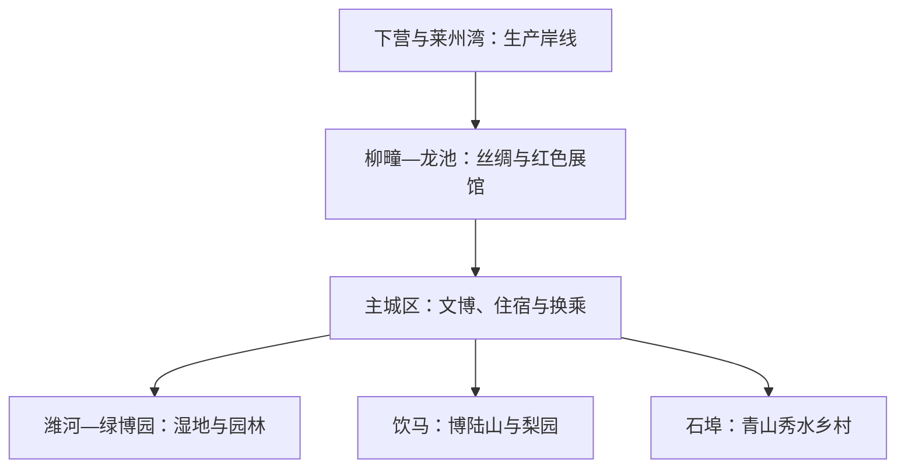

# 昌邑旅行指南

昌邑位于山东半岛中北部，从潍河两岸的主城区与湿地公园，向南连接梨园山地和乡村度假区，向北展开柳疃丝绸、龙池红色文化以及莱州湾沿岸的渔盐产业。这里适合把地方文博、河流生态、丝绸工艺和季节乡村体验分日组合；海岸生产区则与普通旅游空间有清楚边界。

> 建议停留：2–3 天\
> 旅行关键词：潍河湿地、地方文博、园林苗木、柳疃丝绸、渤海走廊、梨园山地\
> 主要体力：中等步行；博陆山路线较高\
> 最近研究：2026-08-12

## 城市速览

| 项目 | 旅行信息 |
|---|---|
| 主要旅行价值 | 用一座县级市的尺度理解潍河城市、苗木园林、柳疃丝绸、昌北红色交通史和季节性梨园乡村。 |
| 行政与同名边界 | 昌邑法定行政代码为 `370786`，是潍坊市代管的县级市，不属于潍坊中心城区。它也不是吉林省吉林市的昌邑区；两地行政实体、交通和景点完全不同。 |
| 建议停留 | 1 天可看主城文博与一段潍河公共空间；2 天增加绿博园；3 天再选柳疃—龙池或南部山地。北部海岸不应仅为“看盐田”临时加塞。 |
| 较舒适季节 | 春秋适合湿地与乡村；博陆山梨花、果实和节会具有季节性。夏季植被丰盛但炎热多雨，冬季风寒且户外体验较少。 |
| 预算特点 | 低至中等。公共文化场馆可降低门票支出，分散乡镇间的车辆接驳、季节活动和景区项目是主要变量。 |
| 步行强度 | 主城场馆低至中等；潍河湿地和绿博园面积较大；博陆山有坡道与户外步道。跨片区不能靠连续步行。 |
| 主要天气风险 | 高温、雷暴大风、暴雨和城市积水；潍河沿线还需注意水位与防汛管控，北部沿海需注意台风影响、海上大风、风暴潮、浓雾和寒潮。 |
| 独行旅行 | 主城区单馆、社区面食和公共交通较容易安排；乡镇景点返程弹性较小，宜预留叫车或正规客运方案。 |
| 亲子旅行 | 博物馆、丝绸展陈和园林植物题材直观；湿地临水、园区尺度和山路需要看护，研学或手作活动须确认年龄与是否接待散客。 |
| 长者与低体力旅行 | 可采用主城单馆加车辆接驳，或只走绿博园、湿地的短段；不宜把大园区、乡镇往返和山地叠在同一天。 |
| 无障碍信息 | 官方资料能确认公共文化机构，但不足以证明停车、入口、展厅、湿地步道和乡村街巷全程连通；设施连续性需向官方确认。 |

昌邑的 Wikidata 实体为 `Q1062186`，其 GeoNames 属性 `P1566` 精确对应 `1815482`。这一组标识指向山东昌邑市，不用于吉林市昌邑区或历史上其他同名地点。

## 城市格局与游览区域

昌邑的旅行空间沿潍河和南北公路方向展开。主城区是住宿、餐饮和换乘基地；绿博园与潍水风情湿地公园位于城区以东、潍河一带，可在确认入口后同日组合。柳疃与龙池在北部，分别承接丝绸和红色文化；饮马、石埠方向的山地与乡村项目在南部。下营及莱州湾沿岸以渔港、盐业、养殖、能源和临港工业为主，不能把卫星图上可见的岸线当成公共海滨景区。

| 区域 | 主要内容 | 游览特点 | 与其他区域的关系 |
|---|---|---|---|
| 奎聚—都昌主城区 | 昌邑市博物馆、黄元御纪念馆、文化中心、商业与住宿 | 场馆之间仍需短途交通；适合雨天和抵达日 | 是前往所有乡镇方向的住宿与调度中心 |
| 潍河城市段—绿博园 | 潍水风情湿地公园、绿博园及其内部公共展陈 | 园区尺度大，户外暴晒、风雨和水位影响明显 | 与主城距离相对近，可用一整日串联，不宜全程步行往返 |
| 柳疃—龙池 | 华裕茧绸文化博物馆、齐西古村旅游区、渤海走廊革命斗争陈列馆 | 场馆、村落与镇区分散，需车辆；团体研学属性较强 | 可按丝绸或红色主题择一，也可在确认开放后用一日串联 |
| 饮马—博陆山 | 博陆山、山阳古梨园与季节活动 | 花期、果期和赛事会改变客流；山路体力较高 | 通常独立一日，不与北部镇域路线同日 |
| 石埠方向 | 青山秀水旅游度假区及乡村休闲项目 | 开放项目和接待形态可能随季节变化 | 可替代博陆山作为南部一日，不把两处强行叠加 |
| 下营与北部沿海 | 渔港、盐田、养殖、海上风电和临港产业 | 生产、安全和防潮防汛属性优先；公开接待证据不足 | 不列入常规景点路线；如有官方活动，仅按公告指定范围进入 |

生产盐田、养殖塘、渔港码头、化工与工业园、海上风电运维区、普通农田和加工厂不是观景平台。潍河主河槽、防洪堤作业面、闸坝、泵站、滩地及高水位封闭段也不因邻近公园而开放；绿博园、梨园和乡村项目之外的苗圃、果园、机耕道与私人院落须取得经营者许可。

## 主要景点

优先级用于分配时间：**A** 为首访核心，**B** 为按兴趣补充，**C** 为季节性、远端或通常需要独立半日以上的目的地。“路线节点”不计为独立景点。同一景区及其内部展馆、园林和观景节点只作为一个项目安排。

### 主城区与潍河

| 景点 | 区域 | 类型 | 主要看点 | 建议用时 | 室内外 | 体力 | 预约风险 | 天气影响 | 优先级 |
|---|---|---|---|---:|---|---|---|---|---|
| 昌邑市博物馆 | 主城区 | 地方综合博物馆 | 昌邑历史、地方文物与城市文化脉络；2026 年政府公共文化信息确认其为免费开放机构 | 1–1.5 小时 | 室内 | 低 | 中 | 低 | A |
| 黄元御纪念馆 | 主城区 | 人物纪念馆 | 黄元御生平与地方医药文化；与市博物馆由同一官方公共文化信息列示 | 0.5–1 小时 | 室内 | 低 | 中 | 低 | B |
| 潍水风情湿地公园 | 潍河城市段 | 城市湿地与水利风景 | 潍河沿线公共绿地、湿地生境和城市河流景观；只走正式开放步道 | 1.5–3 小时 | 室外 | 中 | 低 | 高 | A |
| 绿博园 | 潍河东岸、围子方向 | 园林与苗木主题景区 | 园林植物、苗木文化、公共展陈；绿博园民间收藏博物馆属于园区内部体验，不另算一处 | 3–5 小时 | 混合 | 中 | 中 | 中至高 | A |

### 丝绸、古村与红色文化

| 景点 | 区域 | 类型 | 主要看点 | 建议用时 | 室内外 | 体力 | 预约风险 | 天气影响 | 优先级 |
|---|---|---|---|---:|---|---|---|---|---|
| 昌邑市华裕茧绸文化博物馆（柳疃丝绸文化博物馆） | 柳疃镇 | 专题博物馆与非遗 | 柳疃柞绸、缫丝织造工具和丝绸商贸记忆；政府 2026 年公共文化信息确认场馆 | 1–1.5 小时 | 室内 | 低 | 中至高 | 低 | A |
| 龙乡水韵·千年古村文化旅游区 | 龙池镇齐西村 | 传统村落与乡村文化 | 清代民居群、年俗与村落文化；内部民居、祠堂等按实际开放范围参观 | 1.5–3 小时 | 混合 | 中 | 中至高 | 中 | B |
| 渤海走廊革命斗争陈列馆 | 龙池镇 | 革命历史陈列馆 | 抗战时期“渤海走廊”交通线、根据地与群众支援史 | 1.5–2 小时 | 室内 | 低 | 高 | 低 | A |

### 南部山地与乡村

| 景点 | 区域 | 类型 | 主要看点 | 建议用时 | 室内外 | 体力 | 预约风险 | 天气影响 | 优先级 |
|---|---|---|---|---:|---|---|---|---|---|
| 博陆山风景区 | 饮马镇山阳一带 | 山地、古梨园与季节乡村 | 博陆山地形、山阳古梨园、春季花事与季节活动；果园生产区只走接待游线 | 4–6 小时 | 室外 | 中至高 | 中 | 高 | C |
| 青山秀水旅游度假区 | 石埠方向 | 乡村休闲与滨河景观 | 潍河一侧的乡村休闲、农业与度假项目；具体营业项目需当天确认 | 3–5 小时 | 混合 | 中 | 中至高 | 高 | C |

昌邑北部确有渔盐、养殖与临港产业，也有与“渤海走廊”相关的历史地理，但本页只把有明确公共接待证据的陈列馆、博物馆和旅游区列为景点。下营渔港生产码头、盐田、养殖塘、海堤与工业项目不以“海洋之旅”名义自动纳入。

## 美食与餐饮

昌邑日常饮食兼有潍坊内陆面食与昌北渔盐风味。主城区适合寻找面食、家常菜和规范经营的海鲜餐馆；柳疃、龙池、饮马等乡镇餐饮密度较低，景点附近不一定全天营业。海鲜和季节农产品以当日供应为准，不把港口、养殖场或果园生产区当作直接采购和用餐空间。

| 菜品或餐饮类型 | 常见区域 | 一个人用餐与常见份量 | 风味、过敏原与饮食限制 | 排队风险与替代方法 |
|---|---|---|---|---|
| 老面大饽饽与胶东面食 | 主城区面点铺、市场周边 | 小份面食容易独食；礼俗用大饽饽体量较大，可切分或购买小规格 | 含小麦麸质，部分做法可能使用蛋、奶或油；无麸质饮食需另选米饭与蔬菜 | 节日前成品紧俏；不必锁定单一品牌，选择明示配料和生产日期的正规面点铺 |
| 昌北辣椒子酱 | 主城区与昌北家常菜馆 | 通常是一小碟佐餐酱，适合一人试味，不宜按主菜点 | 传统做法含辣椒、大葱和蟹酱，辣、咸，含甲壳类过敏原；低盐、海鲜过敏和纯素饮食应避开 | 并非每家常备；可用普通腌菜或清爽凉菜替代，不以自制散装酱作为唯一选择 |
| 梭子蟹、对虾等昌北海鲜 | 主城区海鲜餐馆 | 多按重量或整只计价；独食先问最小份量、加工费和总价 | 甲壳类过敏风险高，蒸煮也不能消除；清蒸口味较淡，酱炒可能含小麦、糖和较多盐 | 旺季晚餐可能等位；选择明码标价、来源可追溯的同类餐馆，缺货时换本地鱼类 |
| 潍河银鱼或小型鱼菜 | 主城区家常菜馆 | 常为一盘共享，独食可问半份或与主食搭配 | 属鱼类过敏原；油炸、煎蛋做法可能含蛋和较多油。野生与养殖、产地和季节不能仅凭菜名判断 | 地方资料明确其稀少且季节性强；没有可靠供应时改点其他淡水鱼，不追求“必须吃到” |
| 山阳大梨与季节水果 | 饮马镇接待点、主城区正规果品店 | 一人易购买；采摘通常按重量结算 | 低辣低盐，但需注意糖摄入和生冷食物耐受；清洗后食用 | 花期不等于果期，果期也不等于所有果园接待；优先正规零售，采摘须提前确认 |
| 家常炒菜、汤面与米饭 | 主城区、各镇镇区 | 面、饭和小炒便于独食；部分农家菜按大盘共享 | 炒菜常用大豆油、酱油和较多盐；询问花生、芝麻、海鲜酱、猪肉和小麦成分 | 乡镇非饭点选择少；把主城或镇区作为用餐节点，不依赖景区临时摊点 |

点海鲜时先确认品种、计价单位、称重前后口径和加工费。梭子蟹、对虾、蟹酱和银鱼属于不同过敏原类别，不能因为同属“地方特产”而一起尝试；饮食受限者可用清炒时蔬、米饭和成分明确的家常菜组合。

## 经典行程

### 一日经典路线

**路线**：昌邑市博物馆 → 主城区午餐 → 黄元御纪念馆 → 潍水风情湿地公园正式开放段

- **串联逻辑**：上午用两座主城场馆建立地方历史与人物线索，下午以短途车辆连接潍河公共空间；场馆和湿地并非一条连续步行街。
- **预约锚点**：先确认昌邑市博物馆和黄元御纪念馆的开放日、入馆方式与最晚入场时间。
- **休息安排**：午餐留在主城区；湿地只选择靠近正式入口、卫生间和座椅的一段，不以完整走穿为目标。
- **时间不足时**：先删黄元御纪念馆，再缩短湿地；保留市博物馆，不以夜间临水散步补时。

### 两日城市路线

**第 1 天**：昌邑市博物馆 → 主城区午餐 → 黄元御纪念馆\
**第 2 天**：主城区 → 绿博园完整游览 → 园区或城区休息 → 潍水风情湿地公园短段 → 返回

- **串联逻辑**：第一天集中室内文博，第二天把潍河东侧的大型园区与相邻方向的公共湿地组合，减少往返；绿博园内部展馆属于同一园区游览，无需另排一站。
- **预约锚点**：绿博园当天开放入口、票务、内部展馆和活动安排最关键，同时复核市博物馆开放。
- **休息安排**：绿博园正式游客服务点承担午间休息；湿地段只在体力与天气允许时加入。
- **时间不足时**：第二天先删湿地，完整保留绿博园；第一天只保留市博物馆。

### 三日深度路线

**第 1 天**：昌邑市博物馆 → 黄元御纪念馆 → 主城区休息\
**第 2 天**：绿博园 → 潍水风情湿地公园短段\
**第 3 天**：主城区 → 华裕茧绸文化博物馆 → 柳疃或龙池镇区午餐 → 渤海走廊革命斗争陈列馆 → 返回

- **串联逻辑**：前两天完成主城和潍河生态，第三天以车辆走北部丝绸与红色文化线；下营生产岸线不顺路追加。
- **预约锚点**：第三天两个专题馆的散客接待、讲解和团体占用情况需要最先锁定。
- **休息安排**：主城承担早晚住宿，柳疃或龙池镇区作为午餐和补给点；不依赖村落临时摊点。
- **时间不足时**：第三天在丝绸馆和渤海走廊陈列馆中二选一；不要用减少返程余量换取海岸绕行。

### 雨天路线

**路线**：昌邑市博物馆 → 主城区室内午餐 → 黄元御纪念馆 → 文化中心公共空间（以当日开放为准）

- **串联逻辑**：路线只保留主城区室内节点，用短途车辆代替跨镇移动；普通降雨与暴雨预警采取不同安排。
- **预约锚点**：两馆闭馆、临时展览和入馆规则；文化中心不同机构并非共享同一开放时段。
- **休息安排**：在场馆允许使用的休息区和主城区商业设施停留，不到潍河岸、山谷、海堤或地下低洼空间避雨。
- **时间不足时**：只保留昌邑市博物馆；暴雨、雷电大风、积水或应急响应期间取消全部户外与跨镇路线。

### 亲子或低体力路线

**亲子路线**：昌邑市博物馆 → 午餐与午休 → 绿博园内确认开放的植物或收藏展陈短线。\
**低体力路线**：车辆直达昌邑市博物馆 → 馆内重点展厅 → 午餐 → 黄元御纪念馆短访。

- **串联逻辑**：亲子路线用室内文博加一段园林体验，低体力路线只保留主城两馆；两者不共用“大园区走全程”的假设。
- **预约锚点**：儿童预约、推车、研学活动年龄，以及两馆无障碍入口、电梯、轮椅和最近下客点均需确认。
- **休息安排**：亲子路线在主城区完成午休后再去园区；低体力路线每馆只看重点展厅，并预留门到门接驳。
- **时间不足时**：亲子路线先删绿博园，低体力路线先删黄元御纪念馆；不取消午休或用湿地长走补充。

### 南部乡村一日路线

**博陆山方案**：主城区 → 博陆山正式入口 → 官方开放的梨园与山地游线 → 饮马镇休息 → 返回。\
**低一档体力方案**：主城区 → 青山秀水旅游度假区正式接待区 → 石埠镇区午餐 → 返回。

- **串联逻辑**：两处位于不同南部方向，按季节、开放和体力二选一；农业景观与度假项目都只在接待边界内游览。
- **预约锚点**：博陆山入口、花果期、赛事和山路管控，或青山秀水营业项目与散客接待状态。
- **休息安排**：使用景区游客服务点与饮马、石埠镇区设施；自带饮水，不依赖果园、农田或公路边临时服务。
- **时间不足时**：整段取消南部路线，回到主城文博；不截取未确认开放的果园、山路或农场作为替代。

## 住宿区域

| 区域 | 优点 | 缺点 | 适合人群 | 交通特点 |
|---|---|---|---|---|
| 主城区文化中心—商业区 | 餐饮、补给、公共文化设施与车辆服务相对集中 | 到绿博园、柳疃、龙池和南部山地仍需接驳 | 首访、独行、无车、亲子和低体力旅行 | 适合把主城作为每日往返基地，具体公交与叫车覆盖需重查 |
| 主城区东部—潍河方向 | 前往湿地与绿博园较顺，适合第二日户外路线 | 距老城区具体场馆和餐饮取决于住宿位置，临河风雨影响较大 | 以绿博园、湿地为重点且有车辆者 | 需确认住宿到正式景区入口，而不是只比较直线距离 |
| 昌邑站接驳方向 | 适合晚到、早发或把铁路作为主要抵离方式 | 站区不等于传统商业中心，夜间餐饮和公交弹性需逐家核对 | 高铁短住、次日跨城者 | 先核对列车实际停站和住宿接送，不把“昌邑站”与潍坊站、潍坊北站混淆 |
| 柳疃或龙池镇区 | 便于早访丝绸或红色展馆，减少当天主城往返 | 住宿、夜间餐饮和叫车选择通常少于主城 | 已确认次日馆方接待、使用自驾或包车者 | 预订前确认合法住宿、停车、夜间到达和次日返程 |
| 饮马或石埠镇区 | 便于南部季节乡村路线 | 不能同时便利覆盖北部和主城，山地天气会改变计划 | 自驾、摄影、季节花果主题者 | 先确认景区开放和住宿退改；不在封闭农场或施工区域露营 |

不推荐未经核验的具体酒店。昌邑各镇之间距离和接驳差异较大，住宿页面上的“近景区”可能只是直线距离；没有自驾时，主城区通常比临时搬到乡镇更容易调度。

## 市内交通

昌邑以铁路到达加地面交通为主。昌邑站是重要铁路节点，潍坊北站也可作为从潍坊方向转入昌邑的门户；两者都不在昌邑主城区传统景点门口。市内与跨镇移动主要依赖公交、正规出租车、网约车、自驾或事先约定的车辆，实时线路、票价和末班不写成长期事实。

| 场景 | 建议与取舍 | 行前需要重查的内容 |
|---|---|---|
| 从昌邑站抵达 | 先前往主城区住宿，再按方向分日；携带行李、晚到或低体力者更适合预约正规车辆 | 车次实际停站、出站口、公交接驳、出租车候车区、末班与道路施工 |
| 从潍坊北站或潍坊中心城区转入 | 适合没有合适昌邑站车次时作为替代，但属于跨城地面转乘 | 潍坊北站到昌邑的客运、约车时间、费用和夜间可用性 |
| 从机场抵达 | 市政府区位资料把潍坊机场、青岛胶东国际机场等列为区域门户；具体航班少且航季变化，应先比较铁路 | 航班、机场大巴、落地后的跨城车辆、延误退改与夜间到达 |
| 主城区场馆之间 | 短途公交或车辆比携带行李连续步行更稳；博物馆、纪念馆和文化中心地址不同 | 公交线路、支付方式、道路调整、叫车上下客点与闭馆时间 |
| 主城—绿博园—湿地 | 可同方向安排，但园区入口和湿地入口不能只凭地图最近点判断 | 当日开放门、停车、公交、园区内部交通、水位和活动管制 |
| 前往柳疃、龙池 | 车辆最便于串联两个专题馆；公交可行性取决于当日班次，散客需先确认场馆接待 | 镇际班次、馆方预约、返程末班、讲解时间和道路施工 |
| 前往博陆山、青山秀水 | 自驾或提前约车更易控制返程；两个方向不宜同日 | 景区入口、山路、赛事、花期交通管制、停车和司机返程 |
| 步行与骑行 | 主城局部与公园正式步道可用，跨镇、跨河或前往山地不应靠骑行补足 | 高温、暴雨、强风、积水、夜间照明、骑行禁行与临时封闭 |
| 自驾 | 对分散乡镇最灵活，但应把返程、停车和天气作为路线的一部分 | 停车、道路封闭、饮酒后代驾、充电、农忙车辆与节庆拥堵 |
| 下营及沿海 | 只有官方发布的公共活动和指定接待点才进入；普通旅行不穿行渔港、盐田、养殖塘、海堤或工业园 | 港区管理、海防、风暴潮、海上大风、防汛响应和活动范围 |

铁路票面和导航中的“昌邑”“潍坊北”“潍坊”等名称需逐字确认。行政上同属潍坊不代表能够用中心城区公交快速直达；从昌邑主城前往潍坊主城、寿光、高密、安丘等地属于跨城移动。

## 不同旅行者须知

| 旅行维度 | 可行条件 | 主要取舍 | 需额外核对 |
|---|---|---|---|
| 独行旅行 | 主城单馆、公共文化空间、面食和短途叫车容易组合 | 北部与南部乡镇返程弹性小，晚间不适合临时探访生产岸线 | 场馆是否接待散客、返程末班、叫车范围、夜间照明 |
| 亲子旅行 | 地方博物馆、丝绸工具、植物园林和湿地观察较直观 | 园区长距离、临水空间、山路和研学最低人数增加看护负担 | 儿童预约、推车、互动项目年龄、卫生间、围栏与救援点 |
| 长者或低体力旅行 | 车辆直达主城场馆、单馆重点参观和园区短线可降低负担 | 湿地与绿博园范围大，乡镇往返和博陆山坡道不宜叠加 | 最近下客点、电梯、轮椅、座椅、景区接驳和陪同规则 |
| 无障碍需求 | 可先联系市博物馆及公共文化机构确认入口和展厅服务 | 乡村街巷、旧民居、湿地栈道、园林桥面和山地连续通行资料不足 | 无障碍停车位、坡道、电梯、卫生间、轮椅借用和陪同；均需向官方确认 |
| 摄影旅行 | 潍河公园、园林植物、丝绸展陈、古村与梨园题材多样 | 花期拥挤、湿地鸟类保护、馆内文物和私人院落规则不同 | 闪光灯、三脚架、商业拍摄、无人机、肖像与果园准入 |
| 预算有限 | 公共文化场馆、主城区餐饮和公交可控制开支 | 节省门票不等于节省跨镇交通；独自包车可能成为最大成本 | 公交票制、免费开放、优惠资格、景区票务和正规拼车条件 |
| 晚出发或紧凑行程 | 半天只选市博物馆、黄元御纪念馆或湿地短段之一 | 不适合临时去柳疃、龙池、博陆山、石埠或下营 | 最晚入馆、末班交通、住宿入住与日落后公园管理 |
| 高温、暴雨、台风影响或寒潮 | 高温时以室内馆为主，普通小雨减少湿地长度，寒潮缩短户外 | 暴雨、雷电大风、台风影响、河流水位、风暴潮或结冰时应取消临水、山地和沿海活动 | 昌邑气象、应急响应、河道与景区关闭、铁路公路退改 |

北部“海洋、渔盐、风电”主题常出现在产业和研学报道中，但不等于散客可以进入生产设施。摄影旅行也不构成进入渔港作业区、盐田、养殖塘、化工园、风机运维区、海堤封闭段或铁路沿线的理由。

## 行前核对

| 核对事项 | 为什么需要重查 | 建议核对时间 | 官方入口 |
|---|---|---|---|
| 昌邑市博物馆与黄元御纪念馆 | 免费开放不等于每日开放，闭馆、临展、实名、讲解和最晚入场可能调整 | 确定日期后及到访前一日 | [昌邑市 2026 年公共文化机构免费开放信息](http://www.changyi.gov.cn/CYSXXGK/SWGXJ/202607/t20260703_6574124.htm) |
| 绿博园及内部展馆 | 景区入口、票务、展会、游乐项目和民间收藏博物馆并非同一开放体系 | 购票前及当天 | [昌邑市人民政府：旅游观光](http://www.changyi.gov.cn/zjcy/lygg/) |
| 潍水风情湿地公园 | 水位、养护、赛事、防汛和候鸟保护可能关闭局部步道 | 出发前三日及当天 | [昌邑市人民政府：潍水风情湿地公园](http://www.changyi.gov.cn/zjcy/lygg/201104/t20110411_1685193.html)；[昌邑市气象局](http://www.changyi.gov.cn/CYSXXGK/SQXJ/) |
| 柳疃丝绸馆与渤海走廊陈列馆 | 专题馆可能以预约、团队讲解或研学接待为主，散客规则需确认 | 排入路线前及前一日 | [昌邑市公共文化开放信息](http://www.changyi.gov.cn/CYSXXGK/SWGXJ/202607/t20260703_6574124.htm)；[昌邑市文化和旅游局](http://www.changyi.gov.cn/CYSXXGK/SWGXJ/) |
| 齐西古村旅游区 | 村落公共街巷、展馆、民居和私人院落的开放边界不同 | 出发前一周及当天 | [昌邑市人民政府：龙乡水韵·千年古村文化旅游区](http://www.changyi.gov.cn/zjcy/lygg/201804/t20180404_2757894.html) |
| 博陆山与青山秀水 | 花果期、赛事、森林防火、山路维护和营业项目会改变游线 | 出发前三日及当天 | [昌邑市人民政府：博陆山](http://www.changyi.gov.cn/zjcy/lygg/201510/t20151010_1685192.html)；[青山秀水](http://www.changyi.gov.cn/zjcy/lygg/201510/t20151010_1685191.html) |
| 铁路、公交与跨镇客运 | 车次、站点、线路、票价、末班和施工持续变化 | 出发前一周及每天出发前 | [中国铁路 12306](https://www.12306.cn/)；[昌邑市交通运输局](http://www.changyi.gov.cn/CYSXXGK/SJTJ/) |
| 暴雨、台风影响与河流水位 | 潍河公园、桥下、滩地与低洼道路在强降雨和行洪时风险迅速上升 | 出发前三日及当天 | [昌邑市气象局](http://www.changyi.gov.cn/CYSXXGK/SQXJ/)；[昌邑市应急管理局](http://www.changyi.gov.cn/CYSXXGK/SAJJ/) |
| 海上大风、风暴潮与沿海管理 | 下营渔港、海堤、盐田、养殖和临港区域受生产、海防、防潮及应急管控 | 任何沿海官方活动前及当天 | [昌邑市应急管理局](http://www.changyi.gov.cn/CYSXXGK/SAJJ/)；[昌邑市现行有效规范性文件目录](http://www.changyi.gov.cn/CYSXXGK/SSFJ/202607/t20260702_6573991.htm) |
| 无障碍连续性 | 单一场馆有设施不能推定道路、停车、入口、展厅和卫生间全程连通 | 预约前电话确认 | 各场馆官方入口与[公共文化开放信息](http://www.changyi.gov.cn/CYSXXGK/SWGXJ/202607/t20260703_6574124.htm) |
| 餐厅、海鲜与采摘 | 营业状态、海鲜供应、花果期、计价和果园接待随季节变化 | 排入路线前及用餐当天 | [昌邑市人民政府：昌邑特产](http://www.changyi.gov.cn/zjcy/cytc/)；经营者当日官方渠道 |
| 入境、证件与住宿登记 | 跨境旅客的入境停留、护照预约和住宿登记规则可能变化 | 订票前及出发前 | [国家移民管理局](https://www.nia.gov.cn/) |

## 来源与更新记录

### 主要来源

本页优先采用民政部门、昌邑市政府及其文旅、交通、气象、应急主管部门，省级官方文化平台、公共场馆、铁路平台和开放数据。旧景点介绍只用于稳定的空间与主题信息，是否仍开放、具体票价、活动和接驳均回到 2026 年官方入口核对。

| 来源 | 支持内容 | 类型 | 核验日期 |
|---|---|---|---|
| [民政部政务服务：山东省行政区划代码](https://dmfw.mca.gov.cn/xzqh/getList?code=370000&trimCode=false&maxLevel=3) | 昌邑市法定代码 `370786`、县级市层级及隶属潍坊市 | 政府开放接口 | 2026-08-12 |
| [昌邑市人民政府：行政区划](http://www.changyi.gov.cn/zjcy/xzqh/201103/t20110309_1685181.html) | 昌邑街道、镇域与主城—乡镇行政关系 | 政府 | 2026-08-12 |
| [昌邑市人民政府：自然地理](http://www.changyi.gov.cn/zjcy/zrdl/201701/t20170108_1799350.html) | 潍河、莱州湾、沿海地貌及南北空间基础 | 政府 | 2026-08-12 |
| [昌邑市人民政府：区位交通](http://www.changyi.gov.cn/zjcy/qwjt/201510/t20151010_1685180.html) | 昌邑站、潍坊北站、机场与区域公路铁路关系 | 政府 | 2026-08-12 |
| [昌邑市 2026 年公共文化机构免费开放信息](http://www.changyi.gov.cn/CYSXXGK/SWGXJ/202607/t20260703_6574124.htm) | 市博物馆、黄元御纪念馆、绿博园民间收藏博物馆、华裕茧绸文化博物馆的机构、地址与动态开放入口 | 政府文旅 | 2026-08-12 |
| [昌邑市人民政府：绿博园](http://www.changyi.gov.cn/zjcy/lygg/201103/t20110307_1685208.html) | 绿博园园林、苗木、展陈与潍河方向关系 | 政府旅游 | 2026-08-12 |
| [昌邑市人民政府：潍水风情湿地公园](http://www.changyi.gov.cn/zjcy/lygg/201104/t20110411_1685193.html) | 湿地公园位置、公共步道、湿地与水利属性 | 政府旅游 | 2026-08-12 |
| [昌邑市人民政府：龙乡水韵·千年古村文化旅游区](http://www.changyi.gov.cn/zjcy/lygg/201804/t20180404_2757894.html) | 齐西村古村旅游区及民居、年俗与乡村文化主题 | 政府旅游 | 2026-08-12 |
| [山东宣传网：柳疃丝绸文化博物馆](https://www.sdxc.gov.cn/sy/xcdt/202205/t20220518_10257504.htm) | 柳疃丝绸生产工具、商贸物件与博物馆公共展示 | 省级官方文化平台 | 2026-08-12 |
| [山东宣传网：昌邑城乡历史与传统村落](https://www.sdxc.gov.cn/whql/whcc/202403/t20240320_13860279.htm) | 齐西、姜泊等传统村落及乡村文旅边界 | 省级官方文化平台 | 2026-08-12 |
| [山东宣传网：渤海走廊革命斗争陈列馆](https://www.sdxc.gov.cn/sy/xcdt/202103/t20210318_8149831.htm) | 陈列馆位于龙池镇、展陈主题与红色交通史 | 省级官方文化平台 | 2026-08-12 |
| [昌邑市人民政府：博陆山风景区](http://www.changyi.gov.cn/zjcy/lygg/201510/t20151010_1685192.html) | 博陆山、山阳古梨园与季节花果主题 | 政府旅游 | 2026-08-12 |
| [昌邑市人民政府：2026 年环博陆山健康跑](http://www.changyi.gov.cn/CYSXXGK/SJYJ/202607/t20260702_6574050.htm) | 博陆山近期公共活动及赛事会影响游线 | 政府体育 | 2026-08-12 |
| [昌邑市人民政府：青山秀水旅游度假区](http://www.changyi.gov.cn/zjcy/lygg/201510/t20151010_1685191.html) | 石埠方向乡村度假与潍河关系 | 政府旅游 | 2026-08-12 |
| [昌邑市人民政府：昌邑特产](http://www.changyi.gov.cn/zjcy/cytc/) | 大饽饽、辣椒子酱、梭子蟹、对虾、银鱼和梨等饮食线索 | 政府地方资料 | 2026-08-12 |
| [昌邑市人民政府：海水养殖数字化](http://www.changyi.gov.cn/ztzl/szcy/202505/t20250507_6503822.html) | 北部海水养殖的生产属性，支持养殖区不默认开放的边界 | 政府产业信息 | 2026-08-12 |
| [昌邑市现行有效行政规范性文件目录](http://www.changyi.gov.cn/CYSXXGK/SSFJ/202607/t20260702_6573991.htm) | 下营渔港存在专门管理规范，支持港区按管理边界进入 | 政府司法行政 | 2026-08-12 |
| [昌邑市交通运输局](http://www.changyi.gov.cn/CYSXXGK/SJTJ/) | 城乡公交、公路客运、施工与交通动态核对 | 政府交通部门 | 2026-08-12 |
| [中国铁路 12306](https://www.12306.cn/) | 昌邑站、潍坊北站等实际车次、停站与购票 | 铁路运营平台 | 2026-08-12 |
| [昌邑市气象局](http://www.changyi.gov.cn/CYSXXGK/SQXJ/) | 暴雨、雷电大风、高温、寒潮、海上风等属地预警入口 | 政府气象部门 | 2026-08-12 |
| [昌邑市应急管理局](http://www.changyi.gov.cn/CYSXXGK/SAJJ/) | 防汛、防台风、风暴潮与应急响应核对 | 政府应急部门 | 2026-08-12 |
| [吉林省地方志：昌邑县与昌邑区](https://dfz.jl.gov.cn/zsjl/201802/t20180205_5216570.html) | 吉林市昌邑区的名称沿革，用于与山东昌邑市消歧 | 省级官方地方志 | 2026-08-12 |
| [Wikidata 官方 API：昌邑市 Q1062186](https://www.wikidata.org/w/api.php?action=wbgetentities&ids=Q1062186&props=labels%7Cdescriptions%7Cclaims&languages=zh%7Cen&format=json) | 县级市实体及 `P1566=1815482` | CC0 开放数据 | 2026-08-12 |
| [GeoNames：Changyi 1815482](https://www.geonames.org/1815482/changyi.html) | 项目居民点记录与坐标标识 | CC BY 4.0 开放数据 | 2026-08-12 |

### 更新记录

| 日期 | 更新内容 |
|---|---|
| 2026-08-12 | 首次整理昌邑行政与同名边界、主城—潍河—南北乡镇格局、景区关系、餐饮、路线、住宿、交通和通用旅行条件；明确盐田、养殖、港区、化工工业、农田、河道堤防与文旅接待范围。 |
