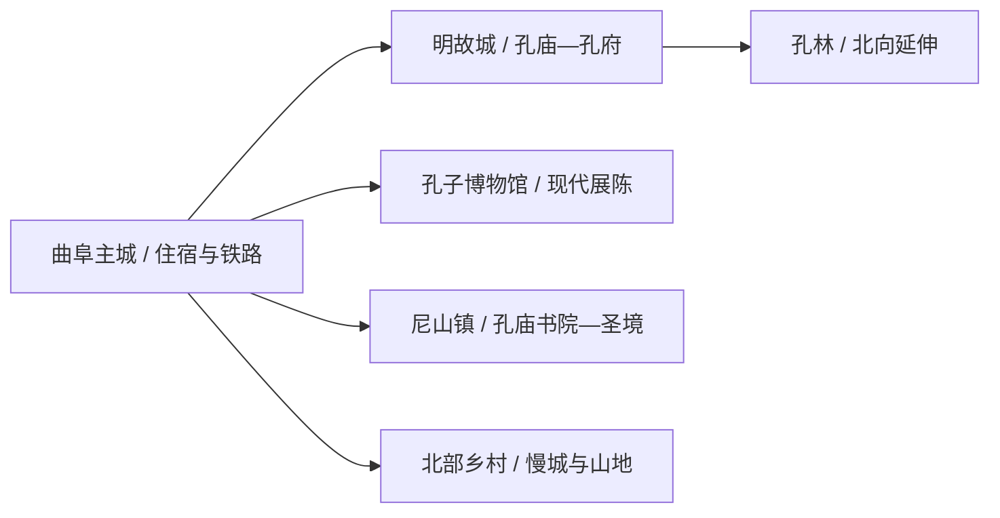
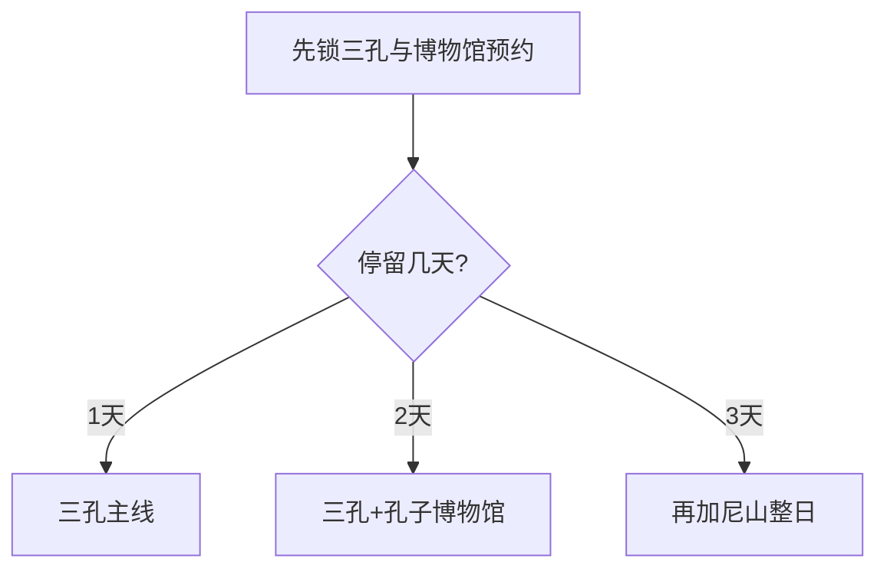

# 曲阜旅行指南

曲阜适合分成两条主线：明故城里的孔庙—孔府—孔林与孔子博物馆构成城市文化线，尼山孔庙书院与尼山圣境构成东南远线。只有一天时先完成前者；两天以上再去尼山，体验会更完整。

> 建议停留：明故城与博物馆 1–2 天；加入尼山为 2–3 天 
> 旅行关键词：三孔、世界遗产、孔子博物馆、明故城、尼山 
> 无障碍说明：孔子博物馆等现代场馆可优先询问连续无障碍动线；古建筑、孔林道路和尼山园区的设施连续性需向官方确认

## 城市速览

| 项目 | 旅行信息 |
|---|---|
| 主要旅行价值 | 世界遗产“三孔”、儒家文化博物馆体系、明故城与尼山文化片区 |
| 建议停留 | 1–3 天；三孔与尼山各留完整一天更从容 |
| 舒适季节 | 春秋步行舒适；夏季避开午后高温，冬季关注风寒与结冰 |
| 预算特点 | 三孔、尼山演艺与接驳是主要增量；公共场馆有助控制预算 |
| 步行强度 | 明故城中等；孔林和尼山中高；现代场馆低至中 |
| 天气风险 | 高温、雷雨、大风、冬季结冰与大型活动交通调整 |
| 独行旅行 | 主城很适合独行，尼山先锁返程 |
| 亲子旅行 | 孔子博物馆和分龄研学优先，古建日减少长时间讲解堆叠 |
| 长者与低体力 | 一天一处大型片区，三孔按实际体力缩短孔林段 |
| 行前重点 | 实名预约、闭馆日、三孔联票范围、尼山演艺、节庆交通 |

## 城市格局与游览区域

曲阜是济宁市代管的法定县级市，代码 `370881`。鲁城街道的明故城与孔子博物馆是主城核心；尼山镇位于东南方向，石门山、九仙山等北部乡村方向又是另一条远线。

| 区域 | 适合安排 | 怎么选择 | 时间尺度 |
|---|---|---|---|
| 明故城—三孔 | 孔庙、孔府、孔林及古城公共街区 | 首访优先，按预约时段进入 | 1 天 |
| 孔子博物馆片区 | 收藏、展览与儒家文化通识 | 可与明故城分成两半日 | 2–4 小时 |
| 蓼河与主城公共空间 | 夜间步行、餐饮与城市生活 | 按当期公告选择演艺或夜游活动 | 1–3 小时 |
| 尼山文化片区 | 尼山孔庙书院、尼山圣境与演艺 | 独立一天，先确认返程和散场交通 | 1 天 |
| 北部乡村方向 | 石门山、九仙山与文化慢城项目 | 在开放明确时选一个核心点 | 1 天 |

GeoNames `1797333` 与 Wikidata `Q210287` 的 `P1566` 精确对应，法定代码为 `370881`。固定记录是主城点，页面边界则依现行曲阜市行政范围。

## 主要景点

### 明故城与主城

| 景点 | 区域 | 类型 | 主要看点 | 建议用时 | 室内外 | 体力 | 预约风险 | 天气影响 | 优先级 |
|---|---|---|---|---:|---|---|---|---|---|
| 曲阜孔庙、孔林和孔府 | 明故城—孔林 | 世界文化遗产、5A | 礼制建筑、府第、墓地与碑刻石雕 | 1 天 | 混合 | 中高 | 很高 | 高 | A |
| 孔子博物馆 | 主城南部 | 专题博物馆 | 孔府旧藏、孔子生平与儒家文化展陈 | 3–5 小时 | 室内 | 低至中 | 很高 | 低 | A |
| 颜庙 | 明故城北部 | 历史建筑、祭祀 | 颜回祭祀建筑与古城文脉 | 1–2 小时 | 混合 | 中 | 高 | 中 | B |
| 周公庙 | 明故城东北 | 历史建筑 | 周公祭祀、鲁国历史与古建 | 1–2 小时 | 混合 | 中 | 高 | 中 | B |
| 明故城公共街区 | 主城 | 历史街区、生活空间 | 万仞宫墙、城门格局、餐饮与夜间公共活动 | 2–4 小时 | 室外为主 | 中 | 中 | 高 | B |
| 蓼河公共开放段 | 主城 | 城市滨水、夜游 | 河岸步行和当期灯会、演艺或市集 | 1–2 小时 | 室外 | 低至中 | 高 | 很高 | C |

### 尼山与北部方向

| 景点 | 区域 | 类型 | 主要看点 | 建议用时 | 室内外 | 体力 | 预约风险 | 天气影响 | 优先级 |
|---|---|---|---|---:|---|---|---|---|---|
| 尼山孔庙及书院 | 尼山镇 | 全国重点文保、古建 | 孔子诞生地传统、孔庙与书院建筑 | 2–3 小时 | 混合 | 中高 | 高 | 高 | A |
| 尼山圣境 | 尼山镇 | 文化主题景区、演艺 | 大学堂、礼乐主题展陈与当期演艺 | 4–7 小时 | 混合 | 中高 | 很高 | 中高 | B |
| 曲阜文化国际慢城当期开放点 | 石门山—吴村方向 | 乡村、生态 | 山地乡村、季节活动与慢行体验 | 半日至 1 天 | 室外 | 中高 | 高 | 很高 | C |

“三孔”是一个世界遗产项目和一处复合 5A 景区，孔庙、孔府、孔林不在完成率中拆成三座；尼山孔庙书院与尼山圣境因文保属性、票务和运营不同分别记录。明故城是生活街区，商业院落和每场夜游活动不单列为景点。

## 美食与餐饮

| 类型 | 怎么点 | 份量与过敏原 | 选择建议 |
|---|---|---|---|
| 孔府菜代表菜 | 2–4 人共享，先选两三道而非整套宴席 | 常见禽肉、海鲜、蛋、坚果、大豆和小麦 | 先问菜量、原料和总价，文化宴席与日常用餐分开比较 |
| 熏豆腐 | 一份可作小吃或配菜 | 大豆制品，卤汁可能含小麦与肉汤 | 在正规餐饮点少量尝试，确认是否为素食 |
| 煎饼、粥与面食 | 一人一份 | 含小麦或杂粮，卷菜与酱料可能含芝麻、花生 | 早餐就近选择，预约早场前留足用餐时间 |
| 尼山与乡村餐饮 | 按人数点套餐或家常菜 | 份量通常适合共享，过敏原需逐菜询问 | 先确认营业和返程，不以单店排队挤压景区时段 |

## 经典行程

### 一日经典路线

**路线**：孔庙 → 孔府 → 午餐与休息 → 孔林 → 明故城短段

- **适用条件**：三孔预约成功，开放和交通正常。
- **串联逻辑**：按空间顺序从明故城向北完成同一遗产项目。
- **预约锚点**：实名票、入园时段、讲解和节庆限流。
- **休息安排**：孔府后完整午休，孔林按体力缩短步行。
- **时间不足时**：保留孔庙—孔府，孔林改至次日。

### 两日城市路线

**第 1 天**：三孔世界遗产主线 
**第 2 天**：孔子博物馆 → 午休 → 颜庙或周公庙二选一 → 蓼河短段

- **适用条件**：博物馆和古建开放已确认。
- **串联逻辑**：第一天看历史现场，第二天用现代展陈补足脉络。
- **预约锚点**：孔子博物馆、颜庙或周公庙开放时段。
- **休息安排**：第二日下午只选一座古建，夜游按体力取舍。
- **时间不足时**：第二天只保留孔子博物馆。

### 三日深度路线

**第 1 天**：三孔 
**第 2 天**：孔子博物馆与明故城补充 
**第 3 天**：尼山孔庙及书院 → 午休 → 尼山圣境当期开放项目

- **适用条件**：尼山票务、演艺和返程交通均已锁定。
- **串联逻辑**：先完成主城历史体系，最后用整日处理尼山远线。
- **预约锚点**：尼山两处入口、演出时间与散场车辆。
- **休息安排**：尼山午间在正式服务区休息，演艺前留缓冲。
- **时间不足时**：第三天在两处尼山项目中选一处，优先保持三孔完整。

### 雨天路线

**路线**：孔子博物馆 → 午餐 → 明故城有顶棚或室内展陈 → 住宿地休息

- **适用条件**：普通降雨且场馆开放。
- **串联逻辑**：以大型室内场馆为核心，古城只走短段。
- **预约锚点**：博物馆入馆、古建临时关闭和城市交通。
- **休息安排**：午后减少户外站立，回住宿地等待雨势变化。
- **时间不足时**：只保留孔子博物馆。

### 亲子与低体力路线

**亲子路线**：孔子博物馆重点展厅 → 午休 → 明故城短段 
**低体力路线**：车辆到孔子博物馆 → 午休 → 孔庙主轴短游

- **减负方式**：孔林和尼山独立成日，讲解选重点而非全程覆盖。
- **预约锚点**：亲子活动、电梯、轮椅、最近落客点和中途退出。
- **休息安排**：博物馆座椅与住宿地午休。
- **时间不足时**：保留博物馆，取消下午古建。

### 远郊路线

**路线**：曲阜主城 → 尼山孔庙及书院 → 尼山圣境或鲁源村当期正式项目 → 主城或尼山住宿

- **适用条件**：尼山项目和返程均已确认。
- **串联逻辑**：同一片区顺向游览，避免午间返回主城。
- **预约锚点**：票务、演艺、接驳和散场时间。
- **休息安排**：正式游客中心午休，晚间演艺前再休息。
- **时间不足时**：在尼山孔庙书院与圣境中二选一。

## 住宿区域

| 区域 | 优点 | 取舍 | 适合人群 |
|---|---|---|---|
| 明故城周边 | 三孔早场和城市餐饮方便 | 节庆交通、停车和夜间噪声需确认 | 首访、古建主题 |
| 曲阜东站或新区 | 高铁到发和现代酒店方便 | 到明故城仍需车辆 | 晚到早走、商务、亲子 |
| 孔子博物馆—主城南部 | 兼顾博物馆和城市道路 | 离孔林与尼山都有接驳 | 两日文化线 |
| 尼山片区正式住宿 | 便于夜间演艺和清晨游览 | 选择与价格受活动影响 | 尼山深度、度假 |

## 市内交通

- 曲阜东站、曲阜南站和曲阜站功能与车次不同，购票和叫车使用完整站名。
- 明故城内部以步行和景区交通为主；孔林与孔庙孔府之间有距离，按体力决定步行长度。
- 尼山距主城较远，先核旅游公交、景区接驳、出租或合规包车，并把演出散场纳入返程。
- 自驾在明故城外围按引导停车，节庆和祭孔活动期间服从临时交通组织。

## 不同旅行者须知

| 情况 | 怎么安排 | 重点核对 |
|---|---|---|
| 独行 | 住主城，三孔与博物馆分日 | 预约、讲解替代、夜间返程 |
| 亲子 | 博物馆、短古建与分龄研学 | 活动年龄、讲解时长、卫生间和休息区 |
| 长者与低体力 | 孔庙孔府主轴优先，孔林缩短 | 轮椅、台阶、落客点、观光交通 |
| 文保摄影 | 先看现场标识再拍摄 | 闪光灯、三脚架、商业拍摄、碑刻和祭祀活动 |
| 演艺观众 | 尼山或夜游单独留晚间 | 演出是否上演、座位、散场交通和天气 |

遗产与礼仪边界：三孔、颜庙、周公庙和尼山孔庙书院依文物保护与祭祀秩序参观；碑刻、古树、墓地和未开放院落按现场范围游览。学校、村庄和宗教礼仪空间保持日常使用属性。

## 行前核对

| 项目 | 何时核对 | 官方入口 |
|---|---|---|
| 三孔票务、活动与交通 | 订房前、到访前一日 | [曲阜文旅服务](https://www.qfms.cn/)及曲阜、济宁文旅公告 |
| 孔子博物馆 | 预约时、到访前一日 | [孔子博物馆](https://www.kzbwg.cn/) |
| 尼山票务与演艺 | 订票前、当天 | 尼山运营方与济宁文旅官方渠道 |
| 铁路和城市交通 | 购票时、出发前一日 | [中国铁路 12306](https://www.12306.cn/)及属地交通公告 |
| 高温、雷雨和结冰 | 出发前三日起每日 | [山东省气象局](http://sd.cma.gov.cn/) |

## 来源与更新记录

| 来源 | 支持内容 | 核验日期 |
|---|---|---|
| [济宁市文旅局：曲阜文旅线路](https://whlyj.jining.gov.cn/art/2026/5/26/art_32546_2712013.html) | 三孔、孔子博物馆、尼山与交通方向 | 2026-08-13 |
| [曲阜文化建设示范区：2026 文旅资料](https://qfwhjssfq.jining.gov.cn/art/2026/3/16/art_31770_2706140.html) | 明故城、孔子博物馆、尼山与当期活动边界 | 2026-08-13 |
| [联合国教科文组织：曲阜孔庙、孔林和孔府](https://whc.unesco.org/en/list/704) | 世界遗产名称、组成与价值 | 2026-08-13 |
| [济宁市交通规划景区表](https://www.jining.gov.cn/attach/0/59b2a13e1a1d484d9aa6c90033e3d505.pdf) | 三孔、尼山孔庙书院、颜庙、周公庙等属地与道路 | 2026-08-13 |
| [民政部行政区划查询](https://dmfw.mca.gov.cn/xzqh/getList?code=37&trimCode=true&maxLevel=3) | `370881` 及济宁代管关系 | 2026-08-13 |
| [GeoNames 1797333](https://www.geonames.org/1797333/qufu.html) | 固定曲阜城市点 | 2026-08-13 |
| [Wikidata Q210287](https://www.wikidata.org/wiki/Q210287) | 法定曲阜市实体与 `P1566=1797333` | 2026-08-13 |

| 日期 | 更新 |
|---|---|
| 2026-08-13 | 首次完成曲阜市指南；建立三孔—孔子博物馆—尼山主线，补齐遗产去重、预约、交通、低体力和标识粒度。 |
