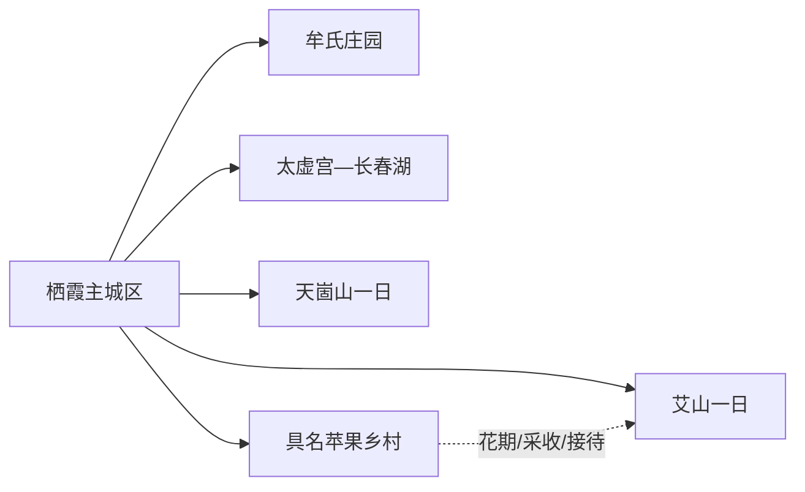
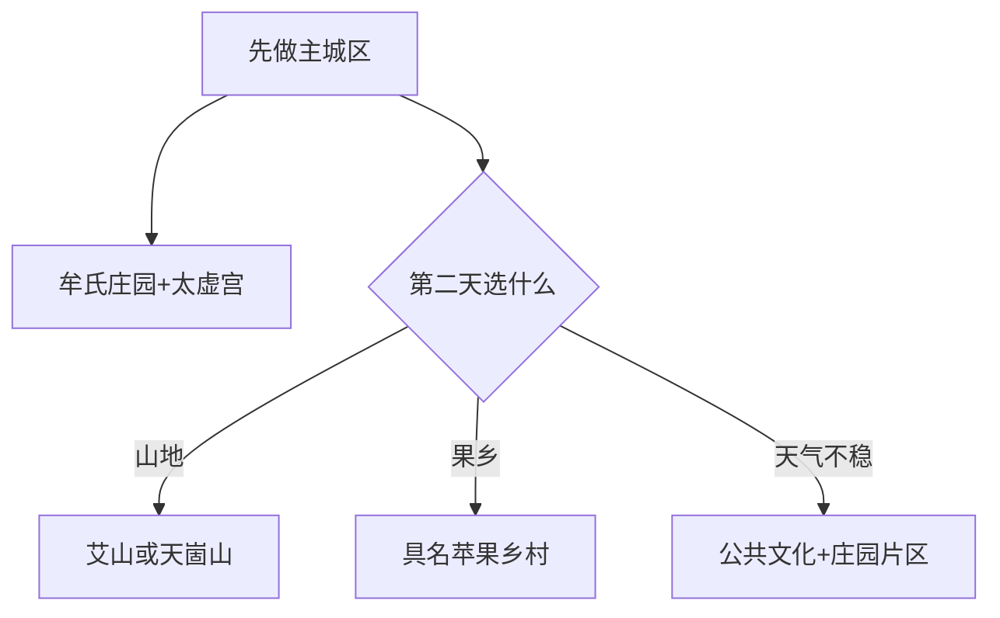

# 栖霞旅行指南

栖霞是一座山地果乡县级市，主城区的牟氏庄园—太虚宫适合组成文化日，艾山、天崮山等山岳各自需要完整远线，苹果园和乡村活动则只在具名接待、采收与道路条件明确时加入。先用城区历史线认识栖霞，再从“山地”或“果园乡村”选一条，会比按宣传清单跨镇赶场更轻松。

> 建议停留：城区 1 天；单一山地或乡村方向另留 1 天  
> 旅行关键词：牟氏庄园、太虚宫、苹果之都、胶东山地、乡村生活  
> 主要体力：城区低至中等；山地为中高  
> 最近研究：2026-08-13

## 城市速览

| 项目 | 旅行信息 |
|---|---|
| 主要旅行价值 | 从牟氏庄园理解胶东乡绅宅院与社会史，从太虚宫认识丘处机与全真文化，再在山地和苹果乡村观察栖霞自然与生产生活 |
| 建议停留 | 1 天完成主城区；2 天再选艾山、天崮山或具名苹果乡村。多个山地景区不宜同日打包 |
| 较舒适季节 | 春季花期、秋季采收和山色各有主题；具体日期按当年物候。夏季防雷雨山洪，冬季防结冰 |
| 预算特点 | 城区门票和餐饮较易预估；远线车辆、温泉/度假产品、乡村体验和旺季住宿是主要变量 |
| 步行强度 | 庄园和太虚宫为低至中等；山岳步道为中高 |
| 主要天气风险 | 暴雨、雷电、山洪、落石、浓雾、森林火险、寒潮和道路结冰 |
| 独行旅行 | 城区可自行安排；山区和乡村返程先锁定 |
| 亲子旅行 | 庄园、手造与具名农业体验可组合；山地和采摘按年龄、天气和经营规则减量 |
| 长者与低体力旅行 | 优先城区一馆一园、车辆接驳和山地游客中心周边 |
| 无障碍信息 | 新游客中心和场馆可咨询；古宅门槛、道观台阶、果园和山地的设施连续性需向官方确认 |

## 城市格局与游览区域

栖霞市是烟台市代管的法定县级市，代码 `370686`。固定 GeoNames `1797438` 名为 `Zhuangyuan`，别名包含 `Qixia`，坐标落在庄园街道主城；Wikidata `Q1359073` 表达栖霞市。固定点用于识别城区驻地，法定代码和县级市实体用于覆盖各镇与完整市域。

| 区域 | 主要内容 | 怎么安排 | 边界提示 |
|---|---|---|---|
| 庄园—翠屏主城区 | 牟氏庄园、公共文化、游客服务和住宿餐饮 | 一整日或雨天底盘 | 庄园、展馆和商业街分别核开放 |
| 太虚宫—长春湖 | 道教文化、湖区与近郊休闲 | 与城区组合半日至一日 | 宗教礼仪与湖岸管理分别遵守 |
| 艾山方向 | 山地、温泉与度假产品 | 单列一日或过夜 | 步道、温泉、道路分别核验 |
| 天崮山—苏家店等山地 | 山岳、村庄和季节活动 | 单一远线 | 山洪、火险和返程为先 |
| 桃村及苹果乡村 | 果园、市场和具名接待点 | 只在花期/采收期和正式接待时加入 | 果园、冷库、分选线和农机道路是生产空间 |

牟氏庄园是完整历史建筑景区，庄园内部院落、演艺与周边手造馆不重复拆分成多座核心景点。苹果文化覆盖栽培、分选、储运和社区生活，并不等同于全天开放的主题园；进入果园、加工区和冷库需要经营主体明确接待。

## 主要景点

### 主城文化

| 景点 | 区域 | 类型 | 主要看点 | 建议用时 | 室内外 | 体力 | 预约风险 | 天气影响 | 优先级 |
|---|---|---|---|---:|---|---|---|---|---|
| 牟氏庄园 | 庄园街道 | 4A、全国重点文保 | 胶东大型庄园建筑、社会史与当期展陈 | 3–5 小时 | 混合 | 中 | 高 | 中 | A |
| 太虚宫景区 | 城北—长春湖 | 宗教建筑、历史 | 丘处机、全真文化与宫观建筑 | 2–4 小时 | 混合 | 中 | 高 | 中 | A |
| 栖霞市文化馆/手造馆当期展览 | 主城区 | 公共文化、非遗 | 八卦鼓舞、剪纸、花饽饽等地方文化线索 | 1–2 小时 | 室内 | 低 | 中 | 低 | B |
| 胶东抗大教育基地 | 主城区庄园片区 | 红色展陈 | 胶东抗大办学历程与地方革命史 | 1.5–2.5 小时 | 室内 | 低 | 高 | 低 | B |

### 山地与乡村

| 景点 | 区域 | 类型 | 主要看点 | 建议用时 | 室内外 | 体力 | 预约风险 | 天气影响 | 优先级 |
|---|---|---|---|---:|---|---|---|---|---|
| 艾山正式开放景区/度假区 | 松山—艾山方向 | 山地、温泉 | 胶东山地、温泉与当期开放步道 | 5–8 小时 | 混合 | 中高 | 高 | 很高 | B |
| 天崮山景区 | 苏家店镇 | 山岳、地质 | 山体、石景与正式步道 | 5–8 小时 | 室外 | 高 | 高 | 很高 | B |
| 牙山正式开放区域 | 市域山地 | 森林、山岳 | 山林生态与季节景观 | 5–8 小时 | 室外 | 高 | 很高 | 很高 | C |
| 具名苹果园或农业接待点 | 各乡镇 | 农业、果乡 | 花期、采收、苹果种植与乡村生活 | 2–5 小时 | 室外为主 | 中 | 很高 | 很高 | C |
| 国路夼、后许家等具名乡村点 | 属地乡镇 | 乡村、民俗 | 正式活动、村庄公共空间与农家服务 | 3–6 小时 | 混合 | 中 | 很高 | 高 | C |

## 美食与餐饮

| 类型 | 适合区域 | 份量与选择 | 饮食提醒 | 怎么选 |
|---|---|---|---|---|
| 栖霞苹果及加工品 | 城区市场、正规商店 | 单果、小袋或礼盒 | 控糖者留意果糖；果干和果汁糖分更集中 | 选择标注产地、等级和净含量的产品 |
| 胶东八大碗与家常菜 | 主城区、正规农家餐 | 多人共享 | 猪肉、海鲜、花生和高盐较常见 | 按人数减菜，先问汤底和过敏原 |
| 花饽饽、面食 | 城区和具名非遗门店 | 小份到礼盒 | 含麸质，装饰可能含糖和色素 | 先看制作日期和配料 |
| 黑绒山羊、鱼类等地方菜 | 正规餐馆 | 适合多人 | 肉类、鱼刺和加工方式需询问 | 选全熟、明码标价菜品 |
| 果园餐与乡村桌餐 | 具名接待点 | 套餐常见 | 接待、餐标和酒水另计 | 预约时书面确认人数、价格和退改 |

## 经典行程

### 一日经典路线

**路线**：牟氏庄园 → 主城午餐 → 胶东抗大教育基地或公共文化展览 → 太虚宫短线。

- **串联逻辑**：用庄园、红色教育和全真文化组成主城历史日。
- **适用条件**：各馆开放且体力可承担两处历史建筑。
- **预约锚点**：牟氏庄园、太虚宫和教育基地。
- **休息安排**：主城区完整午休。
- **时间不足时**：保留牟氏庄园，太虚宫改为第二天。

### 两日城市路线

**第 1 天**：主城区文化线。  
**第 2 天**：艾山、天崮山或具名苹果乡村三选一。

- **串联逻辑**：第一天稳定，第二天按兴趣进入单一远线。
- **适用条件**：有车或接驳，天气与返程明确。
- **预约锚点**：第二天景区/接待点。
- **休息安排**：镇区或正式服务区午休。
- **时间不足时**：第二天只保留游客中心周边或一个果园点。

### 三日深度路线

**第 1 天**：牟氏庄园—太虚宫。  
**第 2 天**：艾山或天崮山。  
**第 3 天**：苹果乡村或另一处具名乡村活动。

- **串联逻辑**：历史、山地和农业分日体验。
- **适用条件**：自驾、摄影或物候主题旅行者。
- **预约锚点**：山地开放、花果期和乡村接待。
- **休息安排**：每天只设一个主目的地并留午休。
- **时间不足时**：删除第三天。

### 雨天路线

**路线**：牟氏庄园当期室内展陈 → 午餐 → 文化馆/手造馆或胶东抗大教育基地。

- **串联逻辑**：集中庄园片区和主城室内内容。
- **适用条件**：普通降雨；暴雨预警时按官方建议减少移动。
- **预约锚点**：场馆开放。
- **休息安排**：馆内和城区商业区。
- **时间不足时**：只留牟氏庄园精选院落。

### 亲子或低体力路线

**亲子方案**：牟氏庄园精选展 → 午餐 → 手造/非遗展览。  
**低体力方案**：车辆落客太虚宫或牟氏庄园单点 → 长休 → 返回住宿。

- **串联逻辑**：亲子重展陈互动，低体力只保留一个主点。
- **适用条件**：先核儿童活动、落客、台阶和座席。
- **预约锚点**：主景点和无障碍协助。
- **休息安排**：每 60–90 分钟休息。
- **时间不足时**：删除第二站。

### 远郊一日路线

**山地线**：主城 → 艾山或天崮山单一正式入口 → 服务区午休 → 原路返回。  
**果乡线**：主城 → 具名苹果园/乡村接待点 → 午餐 → 正式体验 → 返回。

- **串联逻辑**：山地与农业各自成线，不跨镇赶场。
- **适用条件**：山地看预警与火险；果乡看物候、接待和生产安排。
- **预约锚点**：景区、果园和车辆。
- **休息安排**：游客中心或具名接待点。
- **时间不足时**：只保留一个点，山地不改走野线。

## 住宿区域

| 区域 | 优点 | 取舍 | 适合人群 | 交通提示 |
|---|---|---|---|---|
| 栖霞主城区 | 景点、餐饮、医疗和交通集中 | 去山地仍需车辆 | 首访、独行、多方向 | 核对到牟氏庄园和客运点距离 |
| 艾山等正规度假住宿 | 方便温泉和山地 | 与主城服务分离 | 温泉、慢旅行 | 拆分核对住宿、温泉和餐食权益 |
| 具名乡村民宿 | 接近果园和季节活动 | 运营与退改受季节影响 | 自驾、摄影 | 只订证照、地址和接送清楚的住宿 |

## 市内交通

| 场景 | 建议方式 | 怎么做 | 动态核对 |
|---|---|---|---|
| 跨城抵达 | 道路客运、铁路至周边站后转乘、自驾 | 以票面到发和最终下车点为准 | 班次、站址、末班 |
| 主城区 | 公交、出租/网约、短步行 | 庄园与太虚宫分别导航 | 开放、停车和活动管制 |
| 山地方向 | 合规包车、自驾或运营接驳 | 一天一座山 | 道路、火险、门区和返程 |
| 苹果乡村 | 自驾或接待方明确车辆 | 先预约再出发 | 物候、采摘、农机作业和返程 |

## 不同旅行者须知

| 旅行者 | 优先选择 | 需要确认 | 备选方案 |
|---|---|---|---|
| 独行者 | 主城区文化线 | 远线返程和通信 | 一日主城 |
| 亲子家庭 | 庄园、手造、果园正式体验 | 看护、采摘工具和过敏 | 公共文化展览 |
| 长者与低体力者 | 单一主景点 | 门槛、台阶、落客和卫生间 | 主城一馆一餐 |
| 徒步旅行者 | 正式山地步道 | 山洪、火险、落石和日落 | 游客中心周边短线 |
| 自驾者 | 一天一个远线 | 山路、停车、酒后驾驶 | 主城住宿后包车 |

保护、生产和居民边界保持明确：森林火险或强降雨预警时暂停山地线；果园、冷库、分选厂、农机道路、水库和居民院落只按经营者明确开放的范围进入。

## 行前核对

- 在[栖霞市人民政府](https://www.sdqixia.gov.cn/)和[烟台市文化和旅游局](https://www.yantai.gov.cn/)查看开放与活动。
- 牟氏庄园、太虚宫、艾山、天崮山逐项核门票、营业和最后入园。
- 苹果乡村核花果期、接待、采摘规则、价格与返程。
- 查看气象、山洪、森林火险和道路预警。
- 通过正规客运与铁路渠道确认跨城到发。
- 无障碍旅行逐段确认场馆、古建、车辆和住宿。

## 来源与更新记录

### 主要来源

| 来源 | 机构 | 支持内容 | 核验日期 |
|---|---|---|---|
| [栖霞文旅 300 秒](https://www.yantai.gov.cn/art/2025/3/27/art_43277_3245710.html) | 烟台市文化和旅游局 | 牟氏庄园、太虚宫、艾山、牙山与苹果文化 | 2026-08-13 |
| [栖霞文旅活动](https://www.yantai.gov.cn/art/2024/5/7/art_11800_3182765.html) | 烟台市人民政府 | 牟氏庄园、太虚宫、文化馆、天崮山与乡村活动 | 2026-08-13 |
| [牟氏庄园与太虚宫近期信息](https://www.yantai.gov.cn/art/2025/10/27/art_43277_3294185.html) | 烟台市文化和旅游局 | 两处景区地址、开放和运营入口 | 2026-08-13 |
| [烟台市优抚对象游览景区名单](https://www.yantai.gov.cn/cms_files/complat3/49/attach/202512/5509757578d64d24969876b3cb8cca4c.pdf) | 烟台市人民政府 | 栖霞正式景区与场馆名单 | 2026-08-13 |
| [栖霞城区更新规划](https://www.yantai.gov.cn/cms_files/jcms1/web1/site/attach/0/d8874b3c4a9a426ba178e82f519630d1.pdf) | 烟台市人民政府 | 庄园街道、牟氏庄园、太虚宫与主城关系 | 2026-08-13 |
| [GeoNames 1797438](https://sws.geonames.org/1797438/about.rdf) | GeoNames | Zhuangyuan/Qixia 固定主城点与别名 | 2026-08-13 |
| [Wikidata Q1359073](https://www.wikidata.org/wiki/Q1359073) | Wikidata | 栖霞市实体 | 2026-08-13 |
| [民政部行政区划代码服务](https://dmfw.mca.gov.cn/xzqh/getList?code=370686&trimCode=false&maxLevel=3) | 民政部 | 法定代码和县级市层级 | 2026-08-13 |
| [山东省气象局](http://sd.cma.gov.cn/) | 气象主管部门 | 天气与灾害预警 | 2026-08-13 |

### 更新记录

| 日期 | 更新内容 |
|---|---|
| 2026-08-13 | 建立研究版；解释 Zhuangyuan 固定点与栖霞县级市的关系；按主城历史、山地和苹果乡村组织路线，并明确果园生产、森林和居民边界。 |
