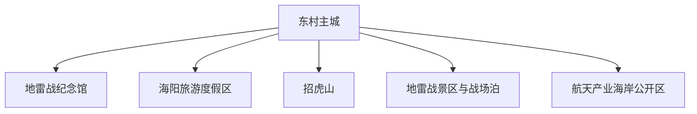
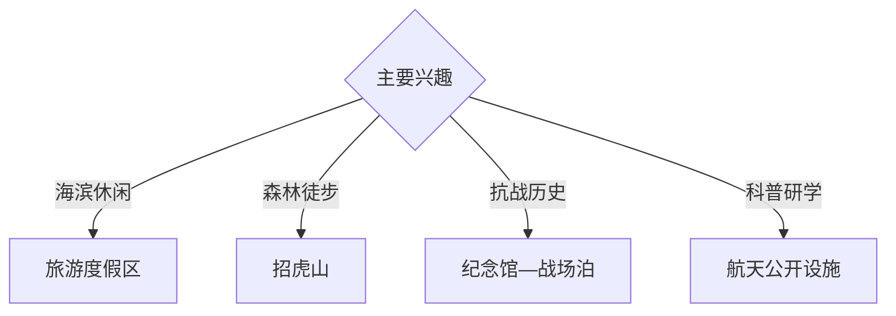

# 海阳旅行指南

海阳位于胶东半岛南岸，旅行主题包括万米海滩、招虎山、地雷战历史、大秧歌、海防文化与航天科普。固定快照中的 **Dongcun / GeoNames 1812621** 对应东村主城；南部海岸、北部山地和红色历史点位分属不同方向。

## 城市速览

| 项目 | 信息 |
|---|---|
| 主线 | 东村主城—海阳旅游度假区—招虎山—地雷战—航天海岸 |
| 停留 | 主城与海岸 2 天；山地或红色远线各另留 1 天 |
| 住宿 | 主城便于综合接驳；旅游度假区适合海滨慢游 |
| 交通 | 铁路与公路抵达，山海远点宜公交、约车或自驾 |
| 季节 | 夏季适合海滨，春秋适合山地；大风雷雨影响海岸活动 |
| 预算 | 公共海岸灵活，景区、远线车辆与旺季住宿增加预算 |

## 城市格局与游览区域

东村主城承担住宿、文博和交通；南部度假区以沙滩和体育休闲为主，招虎山位于北部山地，地雷战相关景点需要按史实展陈与景区体验区分。自然保护区、火箭发射保障区、港航作业区和非开放海岸依公告管理。

## 主要景点

| 景点 | 区域 | 类型 | 核心体验 | 用时 | 环境 | 体力 | 研究价值 | 拥挤 | 优先级 |
|---|---|---|---|---:|---|---|---|---|---|
| 地雷战纪念馆 | 主城 | 纪念馆 | 胶东抗战、民兵历史与实物展陈 | 2–3 小时 | 室内 | 低 | 很高 | 节假日中 | A |
| 海阳旅游度假区公共海岸 | 南部海岸 | 海滨 | 沙滩、海岸休闲与体育文化 | 半天至 1 天 | 室外 | 低 | 中 | 夏季高 | A |
| 招虎山依法开放区 | 方圆方向 | 森林与山地 | 山谷、森林、溪水与民俗旅游路 | 1 天 | 室外 | 中高 | 高 | 旺季中 | A |
| 海阳地雷战旅游区 | 朱吴方向 | 历史主题景区 | 历史叙事、实景演艺与山村环境 | 半天至 1 天 | 混合 | 中 | 高 | 演出时中高 | B |
| 八路军胶东军区机关旧址纪念馆 | 郭城方向 | 红色旧址 | 胶东抗战组织史与战场泊村 | 半天 | 混合 | 低中 | 很高 | 低 | A |
| 大秧歌公开展演或展陈 | 主城及活动地 | 非遗 | 海阳大秧歌、民俗与节庆 | 2–3 小时 | 混合 | 低 | 高 | 活动时高 | B |
| 航天科普正式开放设施 | 海岸产业区 | 科普 | 海上发射、航天产业与海洋工程 | 半天 | 室内 | 低 | 高 | 预约制 | B |

## 美食与餐饮

海阳海鲜、胶东花饽饽、面食、樱桃及地方家常菜适合分区体验。海岸餐饮按时价、重量和加工费确认；樱桃采摘遵守园区安排，海鲜过敏与休渔期供应提前询问。

## 经典行程

### 主城海岸线
**路线**：地雷战纪念馆—地方午餐—旅游度假区公共海岸。**逻辑**：先读城市历史，再转入海滨休闲。**预约锚点**：纪念馆和浴场公告。**休息**：主城或度假区。**删除条件**：雷雨时保留室内馆。

### 招虎山一日线
**路线**：主城—招虎山入口—依法开放步道—返程。**逻辑**：完整一天承接山路尺度。**预约锚点**：路线和防火公告。**休息**：游客中心。**删除条件**：防火封闭、暴雨或地质预警时顺延。

### 地雷战历史线
**路线**：主城纪念馆—地雷战旅游区—战场泊旧址。**逻辑**：用博物馆史实串联不同展示空间。**预约锚点**：场馆与演艺。**休息**：朱吴或郭城正规服务点。**删除条件**：一天只选远线一端。

### 海滨休闲线
**路线**：上午公共海岸—午间避晒—傍晚海岸慢行。**逻辑**：围绕紫外线和体感安排活动。**预约锚点**：浴场安全与住宿。**休息**：度假区。**删除条件**：大风、雷电或水质提示时改岸上活动。

### 航天科普线
**路线**：主城—正式开放科普设施—公共海岸观察。**逻辑**：以合规展陈理解海上航天产业。**预约锚点**：实名预约和开放日期。**休息**：度假区。**删除条件**：保障任务期间按公告调整。

### 亲子低体力线
**路线**：地雷战纪念馆—午餐—海岸短段。**逻辑**：室内外切换且步行可控。**预约锚点**：场馆活动。**休息**：主城。**删除条件**：高温或风浪时只留文博。

### 三日组合线
**路线**：首日主城与海岸；次日招虎山；第三日地雷战远线或航天科普。**逻辑**：山、海、历史分日。**预约锚点**：第二三日开放。**休息**：主城与海岸择一连续住宿。**删除条件**：两天时删一个远线。

## 住宿区域

东村主城便于场馆、餐饮和山海多方向出发；旅游度假区适合沙滩与慢游。订房核对实际海岸距离、淡旺季营业、早餐、停车、消防和恶劣天气退改。

## 市内交通

海阳站到主城及南部海岸需预留接驳；招虎山、朱吴、郭城和航天产业海岸分处不同方向，提前确认城乡班次与返程。自驾按山路、海岸停车和产业区交通组织行驶。

## 不同旅行者须知

历史旅行者优先纪念馆和旧址；海滨旅行者选择有救生与管理的开放岸段；亲子家庭可组合文博、海岸与航天科普；徒步者按防火公告选择招虎山线路。自然保护区、发射任务保障区、军事区域、港池和非开放山路保留明确限制。

## 行前核对

- 核对各纪念馆、地雷战景区、招虎山和航天科普开放。
- 核对防火、暴雨、雷电、海浪、风暴潮与水质提示。
- 核对海阳站接驳、城乡班次、末班车和返程约车。
- 核对海滨住宿、演艺和节庆活动日期。

## 来源与更新记录

| 来源 | 支持内容 | 核验日期 |
|---|---|---|
| [海阳市政府：2025 年 A 级景区服务信息](https://www.haiyang.gov.cn/art/2025/5/22/art_103161_2943416.html) | 海岸、招虎山、地雷战、旧址与场馆服务 | 2026-09-03 |
| [海阳市政府：文旅融合三年行动方案](https://www.haiyang.gov.cn/art/2023/9/28/art_100773_72128.html) | 海洋、红色、民俗、山地与航天文旅结构 | 2026-09-03 |
| [GeoNames 1812621](https://www.geonames.org/1812621/) | Dongcun 固定人口点与海阳主城位置 | 2026-09-03 |
