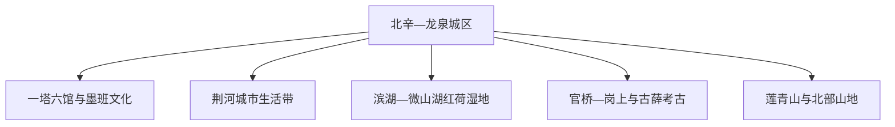
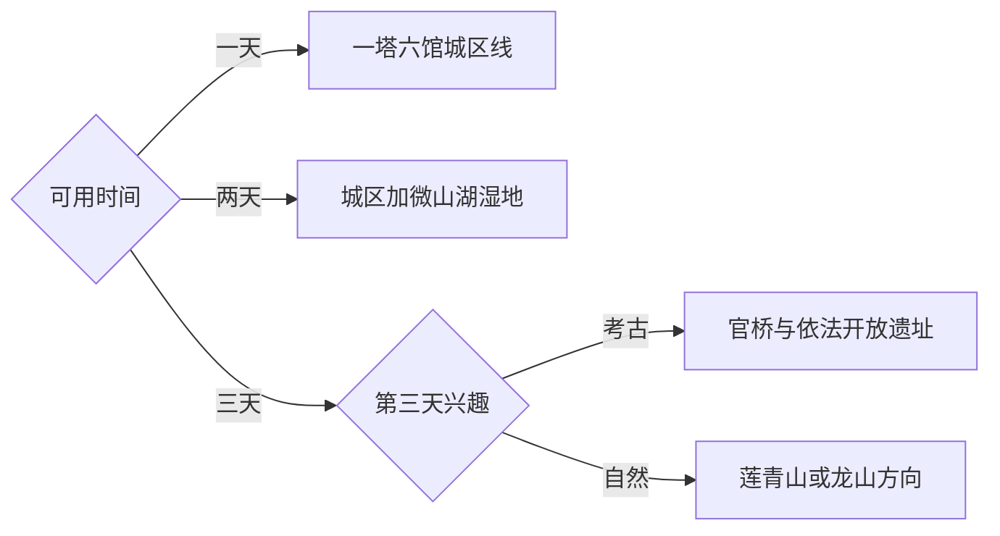

# 滕州旅行指南

滕州位于鲁南，是枣庄市代管的县级市。首访最适合先在城区理解墨子、鲁班、北辛文化与汉画像石，再用完整一天前往微山湖红荷湿地；考古遗址、古国城址和北部山地可按兴趣追加。固定快照中的 **Chengtangcun / GeoNames 1793036** 是滕州城市点，人口与坐标均落在现行滕州城区范围。

## 城市速览

| 项目 | 旅行信息 |
|---|---|
| 主要旅行价值 | 墨子与鲁班专题场馆、滕州博物馆、汉画像石、微山湖湿地和鲁南考古 |
| 建议停留 | 城区 1 天；微山湖湿地另留 1 天；山地或考古深度线再加 1 天 |
| 较舒适季节 | 春秋适合城区和遗址步行；夏季可看荷花并安排午间避热；冬季以文博为主 |
| 预算特点 | 城区文博成本较低，湿地门票与远郊车辆是主要增量支出 |
| 步行强度 | 城区低至中；湿地栈道和莲青山为中等以上 |
| 主要天气风险 | 盛夏高温、强对流、湖区大风和汛期水位变化 |
| 独行旅行 | 城区交通和餐饮方便；远郊宜提前确认返程车辆 |
| 亲子旅行 | 墨子、鲁班互动展陈适合研学，湿地日关注防晒、防蚊和临水看护 |
| 长者与低体力旅行 | 优先一塔六馆片区，用车连接湿地核心开放区 |
| 无障碍信息 | 新建场馆通常较友好，历史建筑、湿地栈道和山地连续通行需向运营方确认 |

## 城市格局与游览区域

城区以北辛、龙泉和荆河一带为住宿与公共交通中心，龙泉塔周边的墨子纪念馆、鲁班纪念馆、滕州博物馆、汉画像石馆等场馆适合连续安排。微山湖红荷湿地位于西部滨湖方向，往返和景区内部游览合计占用一整天。官桥考古、滕国故城与莲青山分处不同方向，每次选择一个主题更从容。

| 区域 | 主要内容 | 游览特点 | 与其他区域的关系 |
|---|---|---|---|
| 北辛—龙泉城区 | 一塔六馆、龙泉塔、城市商业与住宿 | 文博集中，可步行加短途车 | 适合作为首日和雨天主线 |
| 荆河城市带 | 河岸公共空间、街区与地方餐饮 | 节奏轻松，适合傍晚 | 可接在城区场馆之后 |
| 滨湖方向 | 微山湖红荷湿地、湖滨休闲 | 距城区较远，受季节与天气影响 | 预留完整一天 |
| 官桥与南部考古 | 岗上遗址、古薛文化相关开放点 | 讲解价值高，开放边界明确 | 与湿地方向分日安排 |
| 北部山地 | 莲青山、龙山龙湖等正式开放区域 | 公路接驳、坡道和户外时间较多 | 作为第三日自然主题 |

## 主要景点

优先级用于安排时间：**A** 为首访核心，**B** 为按兴趣补充，**C** 为远郊、季节性或需要单独确认开放的目的地。同一场馆群、湿地景区和山地景区按实际运营单元计算。

### 城区墨班文化与文博

| 景点 | 区域 | 类型 | 主要看点 | 建议用时 | 室内外 | 体力 | 预约风险 | 天气影响 | 优先级 |
|---|---|---|---|---:|---|---|---|---|---|
| 墨子纪念馆 | 龙泉城区 | 专题馆 | 墨家思想、科技实验与地方文化 | 1.5–2小时 | 室内 | 低 | 中 | 低 | A |
| 鲁班纪念馆 | 龙泉城区 | 专题馆 | 古代工艺、建筑机械与互动展陈 | 1.5–2小时 | 室内 | 低 | 中 | 低 | A |
| 滕州博物馆 | 城区 | 综合博物馆 | 北辛文化、古国历史与地方文物 | 2–3小时 | 室内 | 低 | 中 | 低 | A |
| 汉画像石馆 | 城区 | 专题馆 | 汉代画像石图像、社会生活与艺术 | 1–2小时 | 室内 | 低 | 中 | 低 | A |
| 龙泉塔及周边公共空间 | 龙泉城区 | 古建与城市地标 | 古塔外观与一塔六馆空间关系 | 1小时 | 混合 | 低 | 低 | 中 | B |
| 王学仲艺术馆等场馆 | 城区 | 艺术馆 | 书画艺术与滕州文化名人 | 1–2小时 | 室内 | 低 | 中 | 低 | B |

### 湖泊湿地与考古山地

| 景点 | 区域 | 类型 | 主要看点 | 建议用时 | 室内外 | 体力 | 预约风险 | 天气影响 | 优先级 |
|---|---|---|---|---:|---|---|---|---|---|
| 微山湖红荷湿地景区 | 滨湖方向 | 湿地景区 | 湖泊湿地、荷花、水鸟与栈道游览 | 1天 | 室外为主 | 中 | 中高 | 高 | A |
| 岗上遗址依法开放展示 | 官桥方向 | 考古遗址 | 大汶口文化聚落、考古方法与遗址保护 | 半天 | 混合 | 低中 | 高 | 中 | B |
| 滕国故城正式开放区域 | 姜屯方向 | 古城遗址 | 古国城址与滕地历史 | 2–3小时 | 室外 | 中 | 中 | 高 | B |
| 莲青山景区 | 北部山地 | 山地景区 | 鲁南山地、岩体景观与登高 | 半天至1天 | 室外 | 中高 | 中 | 高 | C |

考古工作区、文物库房与未开放遗址保留专业保护功能，旅行者沿正式参观线游览。微山湖湿地按景区公告使用栈道、游船和观鸟点，临水区域照看儿童并遵守防火、禁捕与生态保护要求。工艺玻璃、机床等产业参观通过企业开放日或正式预约完成。

## 美食与餐饮

滕州饮食以鲁南家常和面食为基础，菜煎饼、辣子鸡、羊肉汤、手擀面及湖区鱼鲜都适合按场景选择。城区早晚餐选择密集，湿地日则先在城区或滨湖镇区确认正餐点，再进入景区。

| 菜品或餐饮类型 | 常见区域 | 一个人用餐与常见份量 | 风味、过敏原与饮食限制 | 排队风险与替代方法 |
|---|---|---|---|---|
| 滕州菜煎饼 | 城区街巷与早餐店 | 一份适合单人，可按食材组合 | 常含面筋、鸡蛋和多种蔬菜，可提前说明辣度 | 早餐与放学时段较忙，同类小店选择多 |
| 鲁南辣子鸡 | 城区家常菜馆 | 常为共享菜，单人先问小份 | 辣度较高，留意花生、芝麻和骨块 | 正餐时段较忙，可换同区域家常馆 |
| 羊肉汤与烧饼 | 城区及镇区 | 单人点餐方便 | 羊肉风味明显，烧饼含麸质 | 午餐高峰可能排队，错峰更舒适 |
| 湖区鱼鲜与藕菜 | 滨湖方向 | 鱼类通常按重量或整份计 | 确认鱼刺、甲壳类交叉接触与价格 | 荷花季客流高，先确认菜单和结算方式 |
| 面食与鲁南小吃 | 全城 | 适合独行和交通日 | 常含小麦、葱蒜和肉汤 | 商圈周边容易找到替代 |

## 经典行程

### 一日墨班文博路线

**路线**：滕州博物馆 → 龙泉塔公共空间 → 墨子纪念馆 → 鲁班纪念馆 → 汉画像石馆 → 荆河晚餐

- **串联逻辑**：核心场馆集中在城区，用步行和短途车即可连成完整文化日。
- **预约锚点**：先核对各馆闭馆日、实名入馆与讲解时段。
- **休息安排**：午餐放在龙泉城区，下午场馆之间安排座休。
- **时间不足时**：保留滕州博物馆和墨子、鲁班两馆，艺术馆与河岸散步后移。

### 两日城区与湿地路线

**第 1 天**：一塔六馆与荆河城市生活。  
**第 2 天**：城区出发 → 微山湖红荷湿地完整游览 → 返回滕州。

- **串联逻辑**：第一天低交通成本理解城市，第二天集中处理湖区往返和景区游览。
- **预约锚点**：湿地门票、游船或区间交通最先确认。
- **休息安排**：湿地日选择游客中心或正式服务区午休，避开正午长距离栈道。
- **时间不足时**：只有一天优先按兴趣在城区文博与湿地之间二选一。

### 三日文化自然路线

**第 1 天**：城区文博。  
**第 2 天**：微山湖红荷湿地。  
**第 3 天**：岗上遗址相关展陈或莲青山二选一。

- **串联逻辑**：把城市、湖泊和考古或山地拆为三个主题日，减少跨方向折返。
- **预约锚点**：第三日考古开放与讲解优先核对，山地则确认道路和天气。
- **休息安排**：第三天结束后返回城区住宿，避免连续夜间乡道驾驶。
- **时间不足时**：删除第三日，保留城区与湿地双主线。

### 雨天文博路线

**路线**：滕州博物馆 → 汉画像石馆 → 墨子纪念馆 → 鲁班纪念馆

- **适用条件**：普通降雨用城区场馆替代湿地和山地；暴雨预警期间同步减少跨城移动。
- **预约锚点**：核对场馆因维护或极端天气产生的临时闭馆。
- **休息安排**：选择同片区餐饮，车辆点到点衔接。
- **时间不足时**：保留综合博物馆与一个专题馆。

### 亲子或低体力路线

**亲子路线**：鲁班纪念馆互动展陈 → 墨子纪念馆科学内容 → 滕州博物馆 → 城区休息。  
**低体力路线**：车辆到馆 → 滕州博物馆 → 墨子或鲁班纪念馆二选一 → 荆河短距离散步。

- **减负方式**：亲子线减少连续讲解并安排动手内容；低体力线用车连接入口，湿地只选运营方确认的短线。
- **预约锚点**：研学活动、无障碍入口和团体讲解提前确认。
- **休息安排**：每参观一馆安排一次座休，午后回住宿点调整。
- **时间不足时**：以孩子兴趣或体力保留一座专题馆和综合博物馆。

### 鲁南考古路线

**路线**：滕州博物馆史前展陈 → 岗上遗址正式开放展示 → 官桥方向相关公共文化点 → 返回城区

- **串联逻辑**：先在博物馆理解年代与器物，再到遗址观察聚落和保护方式。
- **预约锚点**：遗址开放范围、讲解和团队接待条件最关键。
- **休息安排**：在官桥镇区完成午餐与补给，遗址步行避开正午。
- **时间不足时**：保留博物馆，远郊遗址整段后移。

### 北部山地一日路线

**路线**：滕州城区 → 莲青山正式入口 → 开放步道 → 镇区补给 → 返回城区

- **适用条件**：选择能见度良好、无雷雨和山火风险预警的日期，准备适合登高的鞋服。
- **预约锚点**：核对景区开放、停车、接驳和步道状态。
- **休息安排**：按景区服务点补水，登高过程中分段休息。
- **时间不足时**：山地路线整段删除，改为城区文博或荆河慢游。

## 住宿区域

| 区域 | 优点 | 缺点 | 适合人群 | 交通特点 |
|---|---|---|---|---|
| 滕州站—荆河周边 | 铁路、老城餐饮和城市生活方便 | 部分路段较热闹 | 铁路抵离、独行和短住 | 到城区场馆可公交或短途车 |
| 北辛—龙泉城区 | 接近一塔六馆和现代商圈 | 到湿地仍需长距离公路 | 文博、亲子和首次到访 | 城区移动最省时 |
| 滕州东站周边 | 高铁抵离方便 | 夜间餐饮与核心景点密度较低 | 晚到早走与跨城联程 | 进城区需预留接驳时间 |
| 滨湖方向合规住宿 | 接近湿地、便于看晨昏景观 | 季节性强，选择少于城区 | 湿地摄影与慢度假 | 返城和叫车需提前确认 |

## 市内交通

| 场景 | 建议与取舍 | 行前需要重查的内容 |
|---|---|---|
| 从滕州站抵达 | 进入荆河和龙泉城区距离较近，公交或出租车均可 | 出站口、公交末班与道路施工 |
| 从滕州东站抵达 | 高铁便利，进主城区另留接驳时间 | 实际车次、接驳站点和晚间车辆 |
| 城区跨馆移动 | 一塔六馆片区以步行加短途车组合 | 场馆入口、临时交通管制 |
| 前往湿地或山地 | 自驾、包车或确认后的旅游交通更省换乘 | 门票、停车、返程和天气 |

湿地、官桥考古和莲青山分处不同方向，单日选择一个远点。枣庄主城区、台儿庄和薛城属于其他县级行政区，按跨城行程另算交通和住宿。

## 不同旅行者须知

| 旅行维度 | 可行条件 | 主要取舍 | 需额外核对 |
|---|---|---|---|
| 独行旅行 | 城区点餐和移动方便 | 湿地与山地返程选择较少 | 返程车辆与末班交通 |
| 亲子旅行 | 墨班互动和博物馆适合研学 | 连续场馆容易疲劳 | 活动年龄、预约与休息区 |
| 长者或低体力旅行 | 场馆集中，可用车到入口 | 湿地栈道和山地步道距离较长 | 无障碍入口和区间交通 |
| 无障碍需求 | 新馆可优先安排 | 古塔、遗址和湿地连续通行有限 | 设施连续性需向官方确认 |
| 摄影旅行 | 荷花季、古塔与画像石主题鲜明 | 湖区天气和场馆拍摄规则影响大 | 三脚架、闪光灯和航拍规则 |
| 预算有限 | 城区公共文化场馆性价比高 | 远郊车辆增加成本 | 免费开放、优惠资格与票制 |
| 晚出发或紧凑行程 | 一塔六馆可按兴趣缩短 | 远郊无法稳定插入半日 | 最晚入馆和返程时间 |
| 特殊天气 | 雨天转文博，高温安排午休 | 暴雨和大风会影响湖区与山地 | 气象、汛情和景区退改 |

## 行前核对

| 核对事项 | 为什么需要重查 | 建议核对时间 | 官方入口 |
|---|---|---|---|
| 场馆开放与预约 | 闭馆日、团队活动和临展会改变顺序 | 确定日期后及到访前一日 | [滕州市人民政府](https://www.tengzhou.gov.cn/) |
| 墨子与鲁班场馆 | 讲解、研学和展陈调整具有时效性 | 排入路线前 | [中国墨子网](https://mozi.tengzhou.gov.cn/) |
| 湿地与远郊景区 | 荷花季、水位、游船和道路影响体验 | 出发前三日及当天 | [滕州市文化和旅游局](https://www.tengzhou.gov.cn/zzq/zfbm/whhlyj/) |
| 铁路交通 | 车次、到发站和票制持续变化 | 购票时及出发当天 | [中国铁路 12306](https://www.12306.cn/) |
| 天气与自然风险 | 高温、雷雨、大风和汛情影响户外路线 | 出发前三日及当天 | [山东省气象局](http://sd.cma.gov.cn/) |

## 来源与更新记录

### 主要来源

| 来源 | 类型 | 支持内容 | 核验日期 |
|---|---|---|---|
| [滕州市“十四五”规划纲要](https://www.tengzhou.gov.cn/zwgk/xxgkml/szbm/fgj/202111/t20211116_1334550.html) | 政府 | 文博、湿地、遗址、山地与产业旅行资源 | 2026-09-03 |
| [滕州市全域旅游发展规划](https://www.tengzhou.gov.cn/zwgk/xxgkml/szbm/whhlyj/202112/P020211223403923274382.pdf) | 政府 | 旅游空间、微山湖湿地与公共服务布局 | 2026-09-03 |
| [中国墨子网：墨班文化空间](https://mozi.tengzhou.gov.cn/mohist-perspective/364.html) | 官方文化机构 | 一塔六馆与墨子、鲁班主题 | 2026-09-03 |
| [中国鲁班网：鲁班纪念馆](https://luban.tengzhou.gov.cn/luban-ruins/85.html) | 官方场馆 | 展陈内容、场馆属性与地址 | 2026-09-03 |
| [GeoNames：Tengzhou / Chengtangcun](https://www.geonames.org/1793036/) | 地名数据库 | 固定城市点、人口与坐标 | 2026-09-03 |

### 更新记录

| 日期 | 更新内容 |
|---|---|
| 2026-09-03 | 首次完成资料研究、行政边界核对与路线整理 |
