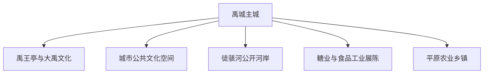
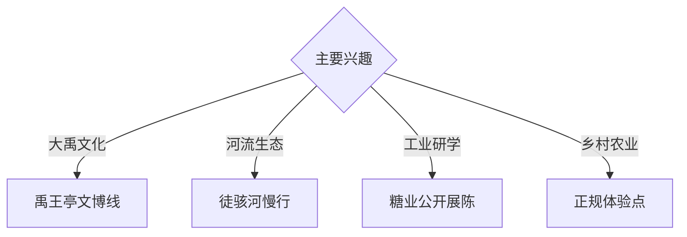

# 禹城旅行指南

禹城位于鲁西北平原与徒骇河水系之间，以大禹文化、禹王亭文博、糖城工业记忆、湿地河流与平原农业构成独立旅行主题。固定快照中的 **Yucheng / GeoNames 1785979** 锚定主城；河流湿地和产业农业点按正式开放条件安排。

## 城市速览

| 项目 | 信息 |
|---|---|
| 主线 | 禹城主城—大禹文化—禹王亭文博—徒骇河—糖业与农业 |
| 停留 | 主城 1 天；河流生态或产业专题另留半日至 1 天 |
| 住宿 | 主城铁路、公路、餐饮与公共服务集中 |
| 交通 | 铁路与公路抵达，乡镇远点宜公交、约车或自驾 |
| 季节 | 春秋适合城市与河岸；夏季关注高温、暴雨和水位 |
| 预算 | 城市文博支出较低，产业接待与乡镇车辆增加预算 |

## 城市格局与游览区域

主城适合文博、餐饮和铁路接驳；徒骇河等水系适合公共河岸观察，糖业和农业主题通过正式开放的展陈或接待点理解。河道行洪区、泵站水工设施、生产车间和农机作业区依公告管理。

## 主要景点

| 景点 | 区域 | 类型 | 核心体验 | 用时 | 环境 | 体力 | 研究价值 | 拥挤 | 优先级 |
|---|---|---|---|---:|---|---|---|---|---|
| 禹王亭博物馆或大禹文化展陈 | 主城 | 博物馆 | 大禹传说、地方历史与治水文化 | 2–3 小时 | 室内 | 低 | 很高 | 节假日中 | A |
| 禹王亭及依法开放园区 | 主城 | 纪念景观 | 大禹文化、城市记忆与园林 | 1–2 小时 | 混合 | 低 | 高 | 中 | A |
| 城市公共文化场馆 | 主城 | 公共文化 | 地方社会、非遗与当代城市 | 2 小时 | 室内 | 低 | 中高 | 低 | B |
| 徒骇河公共河岸 | 市域 | 河流生态 | 平原水系、治水与滨河慢行 | 2–3 小时 | 室外 | 低 | 高 | 傍晚中 | B |
| 湿地或城市水系公开区 | 主城周边 | 湿地与公园 | 水鸟、城市生态与季节景观 | 半天 | 室外 | 低 | 中 | 季节性 | B |
| 糖业食品工业公开展陈 | 产业区 | 工业文化 | 制糖、食品加工与产业城市 | 2–3 小时 | 室内 | 低 | 高 | 预约制 | B |
| 平原农业正规体验点 | 乡镇 | 农业体验 | 粮食、畜牧、农产品与乡村生活 | 半天 | 混合 | 低 | 中 | 季节性 | C |

## 美食与餐饮

禹城扒鸡、房寺烧饼、签子馒头、鲁西北面食和地方家常菜适合在主城体验。糖业与功能食品属于城市产业线索，购买产品时查看配料和规范标识；农业体验按接待安排进入。

## 经典行程

### 主城一日线
**路线**：禹王亭文博—地方午餐—公共文化场馆—城市公园。**逻辑**：从大禹文化进入当代城市。**预约锚点**：场馆开放。**休息**：主城。**删除条件**：闭馆时增加公共园区和河岸。

### 大禹文化专题线
**路线**：禹王亭展陈—园区公开空间—治水主题资料整理。**逻辑**：区分历史记忆、传说与当代展示。**预约锚点**：讲解。**休息**：主城。**删除条件**：时间不足时保留常设展。

### 徒骇河生态线
**路线**：主城—公共河岸—湿地观察点—返程。**逻辑**：从现实水系理解平原治水。**预约锚点**：水位和开放。**休息**：城市公园。**删除条件**：高水位、暴雨或雷电时转室内。

### 糖业工业线
**路线**：城市文博—正式开放产业展陈—产品展示。**逻辑**：连接农业原料与食品工业。**预约锚点**：企业接待许可。**休息**：主城。**删除条件**：生产单位不接待时保留公共展陈。

### 平原农业线
**路线**：主城—正规农业体验点—乡镇午餐—返程。**逻辑**：观察平原农业和城乡关系。**预约锚点**：接待与农事季节。**休息**：镇区。**删除条件**：农忙或天气不适时改主城。

### 亲子低体力线
**路线**：禹王亭文博—午餐—短段滨河公园。**逻辑**：室内学习与户外活动平衡。**预约锚点**：亲子活动。**休息**：主城。**删除条件**：高温时只留室内馆。

### 两日组合线
**路线**：首日大禹文化与主城；次日河流生态、工业或农业三选一。**逻辑**：主城与专题远线分日。**预约锚点**：第二日接待。**休息**：连续住主城。**删除条件**：一天时保留主城线。

## 住宿区域

禹城主城适合铁路公路抵达、餐饮和各方向出发；乡镇正规住宿适合农业研学团队。订房核对车站距离、夜间接驳、消防、停车和恶劣天气退改。

## 市内交通

禹城站、禹城东站对应不同铁路线路和城区接驳，购票后确认站名。主城用公交、出租车和步行；河流、产业区与农业乡镇提前确认城乡班次和返程。

## 不同旅行者须知

历史旅行者优先禹王亭文博；亲子家庭可组合场馆与短段滨河；工业农业兴趣者先取得正规接待安排；观鸟者在公开观察点保持距离。河道行洪区、水工设施、食品生产线、仓储区和农机作业面保留明确限制。

## 行前核对

- 核对禹王亭、公共文化场馆与专题展陈开放。
- 核对徒骇河水位、湿地开放、暴雨、高温和雷电预警。
- 核对禹城站或禹城东站、市内公交和乡镇返程。
- 核对糖业或农业体验的接待许可、卫生与安全要求。

## 来源与更新记录

| 来源 | 支持内容 | 核验日期 |
|---|---|---|
| [禹城市人民政府](https://www.yuchengshi.gov.cn/) | 城市、文旅、交通与公共服务核对入口 | 2026-09-03 |
| [山东省发展规划](https://www.sd.gov.cn/module/download/downfile.jsp?classid=0&filename=31fadfc0307e433f9aef8326cea96398.pdf) | 大禹文化传承示范园与省级文化发展方向 | 2026-09-03 |
| [GeoNames 1785979](https://www.geonames.org/1785979/) | Yucheng 固定人口点与禹城主城位置 | 2026-09-03 |
