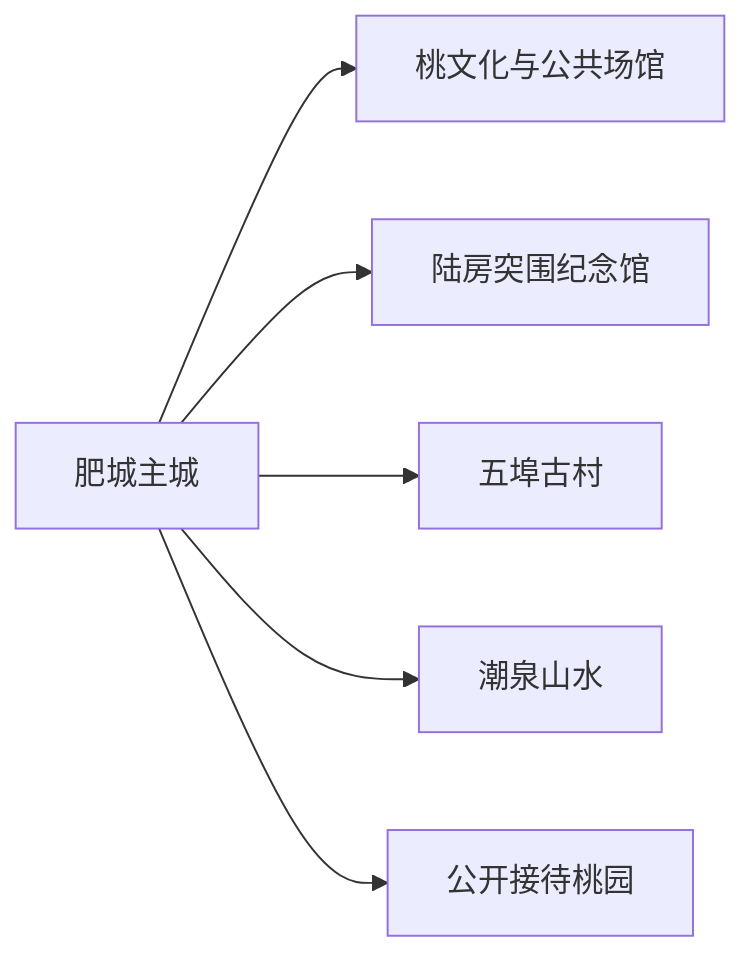
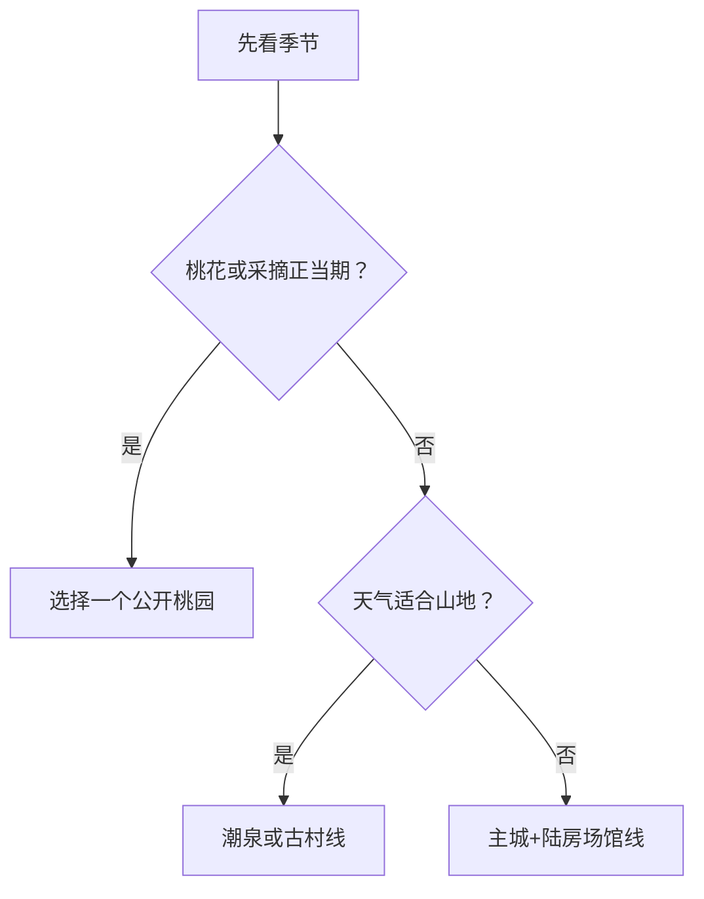

# 肥城旅行指南

肥城位于泰安西部，旅行主线由桃文化、陆房突围红色记忆、古村和北部山水组成。主城适合作为住宿与交通基地；桃花季的果园和乡村活动按花期、交通组织与公开接待选择，陆房、五埠、潮泉等方向各自需要半日至一日。

## 城市速览

| 项目 | 信息 |
|---|---|
| 旅行主线 | 肥桃与桃木文化、陆房突围、五埠古村、潮泉山水与乡村生活 |
| 建议停留 | 1 天选桃文化或红色文化；2–3 天再加古村、山地或季节乡村 |
| 住宿基地 | 肥城主城 |
| 步行强度 | 主城低；古村中等；山地与果园中至高 |
| 主要天气 | 春季大风与花期波动，夏季高温雷雨，秋冬森林火险和道路结冰 |
| 季节选择 | 桃花与采摘按当年花期、果期和活动公告 |
| 亲子 | 博物馆、公开果园研学和古村短线较合适 |
| 低体力 | 主城场馆加车辆观景，古村只走入口附近短段 |
| 生产边界 | 果园、农田和加工场所按经营者公开接待范围体验 |
| 无障碍 | 设施连续性需向官方确认，并核对古村路面、山地入口和车辆落客 |

## 城市格局与游览区域

肥城市是泰安市代管县级市，法定代码 `370983`。GeoNames `1789176` 是主城居民点，Wikidata `Q1198379` 代表法定肥城市且 `P1566=1789176`。主城、安临站—陆房、五埠、潮泉和桃园片区之间依靠公路串联。

| 区域 | 旅行价值 | 怎么选 |
|---|---|---|
| 主城 | 住宿、餐饮、公共文化与城市服务 | 抵达日、雨天和多日行程基地 |
| 安临站—陆房 | 红色历史与乡村 | 以纪念馆开放为锚点安排半日至一日 |
| 五埠 | 古村、石巷与乡村生活 | 选择公开街巷和接待院落，午后返城 |
| 潮泉 | 山水、森林与乡村休闲 | 天气稳定时独立半日或一日 |
| 桃园片区 | 花海、果园和桃文化活动 | 按花期、采摘期和交通组织选择一个园区 |

## 主要景点

### 主城与桃文化

| 景点 | 所在区域 | 类型 | 核心看点 | 建议用时 | 室内/室外 | 体力 | 预约难度 | 天气敏感度 | 适合旅程 |
|---|---|---|---|---|---|---|---|---|---|
| 肥城市公共文化场馆 | 主城 | 地方史与公共文化 | 城市沿革、肥桃与桃木文化、当期展览 | 1–2 小时 | 室内 | 低 | 中 | 低 | B |
| 桃文化公开展示与活动区 | 主城及近郊 | 民俗与非遗 | 肥桃文化、桃木雕刻和节令活动 | 2–3 小时 | 混合 | 低至中 | 高 | 中 | B |
| 公开接待桃园 | 市域乡村 | 农业与季节景观 | 花期观赏、果期采摘和农业体验 | 2–4 小时 | 室外 | 中 | 高 | 很高 | C |

### 红色、古村与山水

| 景点 | 所在区域 | 类型 | 核心看点 | 建议用时 | 室内/室外 | 体力 | 预约难度 | 天气敏感度 | 适合旅程 |
|---|---|---|---|---|---|---|---|---|---|
| 陆房突围胜利纪念馆 | 安临站镇方向 | 红色纪念与博物馆 | 陆房突围历史、文物与主题展陈 | 2–3 小时 | 室内为主 | 低至中 | 中 | 低 | A |
| 五埠伙大门景区 | 孙伯镇方向 | 古村与乡村文化 | 石巷、传统建筑与村落公共空间 | 3–5 小时 | 室外为主 | 中 | 中 | 高 | B |
| 鱼山桃花海 | 仪阳方向 | 季节景观 | 桃花、丘陵果园与乡村景观 | 2–4 小时 | 室外 | 中 | 高 | 很高 | C |
| 潮泉镇正式开放山水项目 | 北部 | 山地与乡村休闲 | 森林、泉水与当期公开游线 | 4–6 小时 | 室外 | 中至高 | 高 | 很高 | C |

果园、农田和桃木加工点首先是生产空间。选择政府公布、经营主体清楚的体验项目，采摘数量、加工参观、车辆停放和儿童活动按现场规则执行。

## 美食与餐饮

| 类型 | 适合场景 | 份量 | 过敏与饮食提示 | 选择方法 |
|---|---|---|---|---|
| 肥桃与桃制品 | 时令加餐、伴手礼 | 先少量购买 | 加工品可能高糖或含坚果、乳、明胶 | 看产地、配料和储存条件 |
| 山东面食与煎饼 | 早餐、简餐 | 一人份方便 | 小麦、芝麻、花生与大豆常见 | 选能说明配料的社区店 |
| 炖鸡、豆腐与家常菜 | 正餐 | 多人分享更合适 | 大豆、花生、共锅与肉汤 | 先问小份和时价 |
| 乡村宴席菜 | 古村或活动日 | 份量较大 | 油盐、肉类、坚果和酒类需确认 | 只选明码标价、证照清楚的接待点 |

## 经典行程

### 一日经典路线

**路线**：主城公共文化场馆 → 午餐 → 陆房突围胜利纪念馆 → 返回主城

- **串联逻辑**：先建立肥城地方背景，再用一座核心纪念馆完成红色文化主题。
- **预约锚点**：两处场馆开放与讲解时段。
- **休息安排**：午餐长休，纪念馆参观后再返程。
- **时间不足时**：只保留陆房纪念馆，主城场馆移到雨天。

### 两日城市路线

**第 1 天**：主城 → 陆房突围胜利纪念馆 
**第 2 天**：五埠伙大门景区 → 乡村午餐 → 返回

- **串联逻辑**：红色历史与古村生活分日，减少跨镇折返。
- **预约锚点**：纪念馆、五埠接待和返程车辆。
- **休息安排**：每天午餐作长休，古村在正式服务点休息。
- **时间不足时**：第二天缩成五埠入口附近短线。

### 三日深度路线

**路线**：主城与陆房 → 五埠古村 → 潮泉或一个公开桃园

- **串联逻辑**：历史、村落与自然农业三类主题逐日展开。
- **预约锚点**：第三天的花期、项目开放、天气和车辆。
- **休息安排**：山地或果园日避开正午暴晒，车辆内保留休息。
- **时间不足时**：按季节删除潮泉或桃园之一。

### 雨天路线

**路线**：主城公共文化场馆 → 室内午餐 → 陆房突围胜利纪念馆

- **适用条件**：普通降雨且道路、场馆正常。
- **串联逻辑**：两座室内场馆用车辆连接，减少泥泞乡村道路和山地停留。
- **预约锚点**：临时闭馆、强对流和道路积水。
- **休息安排**：午餐及场馆休息区。
- **时间不足时**：保留预约更稳定的一馆。

### 亲子与低体力路线

**亲子路线**：公共文化场馆 → 午餐 → 当期公开的桃文化体验 
**低体力路线**：陆房纪念馆 → 车辆休息 → 主城短距离公共空间

- **适用条件**：亲子体验须有明确接待与安全说明；低体力路线控制在平地和室内。
- **串联逻辑**：以可理解、可随时退出的项目替代山地长走。
- **预约锚点**：年龄、卫生间、座椅、轮椅与车辆落客。
- **休息安排**：每个主项目后安排不少于半小时休息。
- **时间不足时**：只留一座场馆。

### 桃花季或山水主题路线

**路线**：主城 → 一个官方公布的桃花观赏区或潮泉正式项目 → 午餐与休息 → 返回

- **适用条件**：花期、天气、开放、停车和返程均已确认。
- **串联逻辑**：一次只选一个片区，把时间留给季节体验。
- **预约锚点**：活动交通组织、入园、采摘、停车和返程。
- **休息安排**：正午进入室内餐饮或车辆休息。
- **时间不足时**：改为主城桃文化展示。

## 住宿区域

| 区域 | 优点 | 取舍 | 适合人群 | 核对项 |
|---|---|---|---|---|
| 肥城主城 | 餐饮、叫车、住宿和城市服务集中 | 去乡村均需公路往返 | 首访、无车、多日 | 停车、早餐、夜间入住 |
| 陆房或五埠周边正规住宿 | 便于专题慢游 | 选择与夜间服务较少 | 已确认接待的两日行程 | 证照、消防、供暖、返程 |
| 桃园或山地周边 | 清晨进入季节项目 | 受天气与活动影响大 | 自驾、摄影 | 合法住宿、道路、通信与退订 |

## 市内交通

肥城没有用一条城市公交连续串起全部旅行片区。主城内以公交、出租车和网约车为主；陆房、五埠、潮泉及果园方向使用城乡客运、合规包车或自驾，并在出发前确认返程。

| 场景 | 怎么做 | 核对项 |
|---|---|---|
| 从泰安联程 | 按跨城公路交通重新计算 | 上下车点、末班与行李 |
| 主城移动 | 公交结合出租车 | 班次、活动管制、夜间叫车 |
| 乡村和山地 | 自驾或落实车辆 | 道路、停车、天气、返程 |
| 花期活动 | 服从临时分流与接驳 | 预约、停车场、接驳终点 |

## 不同旅行者须知

| 旅行者 | 推荐做法 | 重点核对 |
|---|---|---|
| 独行 | 住主城、白天完成单一远线 | 返程、通信、叫车 |
| 亲子 | 场馆与公开农业体验二选一组合 | 农机、水边、食品与卫生间 |
| 长者与低体力 | 车辆串联一馆一景 | 落客、坡道、座椅和轮椅 |
| 摄影 | 花期错峰，古村尊重居民生活 | 花期、肖像、无人机、农田边界 |
| 自驾 | 每天只选一个县域方向 | 停车、乡道路况、酒后驾驶与夜返 |

## 行前核对

- 肥城市政府与文旅部门：场馆、节庆、桃花花期、采摘和乡村接待。
- 山东气象：雷电、强降雨、高温、大风、寒潮与森林火险。
- 陆房纪念馆、五埠和潮泉运营方：开放、讲解、入口、停车与无障碍。
- 交通运营方：泰安联程、城乡客运、临时接驳和末班。

## 来源与更新记录

| 来源 | 支持内容 | 核验日期 |
|---|---|---|
| [肥城市人民政府](https://www.feicheng.gov.cn/) | 市情、活动、场馆和动态入口 | 2026-08-13 |
| [肥城市2025年政府工作报告](https://www.feicheng.gov.cn/art/2025/2/10/art_241038_10362188.html) | 陆房纪念馆、五埠、鱼山桃花海、潮泉与文旅规划 | 2026-08-13 |
| [肥桃文化资料](https://www.feicheng.gov.cn/art/2025/1/16/art_78090_5807159.html) | 肥桃种植环境、历史与桃木文化 | 2026-08-13 |
| [Wikidata Q1198379](https://www.wikidata.org/wiki/Q1198379) | 法定肥城市、代码与 `P1566=1789176` | 2026-08-13 |
| [GeoNames 1789176](https://www.geonames.org/1789176/) | 固定居民点与坐标 | 2026-08-13 |
| [山东省气象局](http://sd.cma.gov.cn/) | 天气预警入口 | 2026-08-13 |

| 日期 | 更新 |
|---|---|
| 2026-08-13 | 首次完成肥城桃文化、陆房、古村、山水与季节旅行研究。 |
