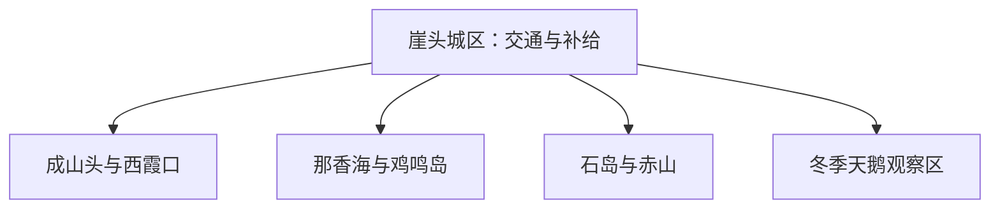

# 荣成旅行指南

荣成沿山东半岛最东端展开，崖头城区、成山头—西霞口、那香海—鸡鸣岛、石岛—赤山和冬季天鹅观赏区分属不同方向。先按海岸片区选择住宿，再把每天控制在一个主方向，能明显减少折返。

> 建议停留：2–4 天<br>
> 旅行关键词：成山头、赤山、那香海、天鹅、石岛、海岸与渔港文化<br>
> 主要体力：城区低至中等；海岬、山岳和岛屿为中等<br>
> 最近研究：2026-08-13

## 城市速览

| 项目 | 旅行信息 |
|---|---|
| 主要旅行价值 | 在一座海岸县级市里选择海岬、山岳文化、岛屿、湿地候鸟和渔港生活 |
| 建议停留 | 2 天选东部海岬与南部赤山；3–4 天再加城区、那香海或冬季天鹅线 |
| 较舒适季节 | 春秋适合海岸步行；夏季适合滨海度假；冬季以合规候鸟观察为重点 |
| 预算特点 | 城区中等，海岸度假住宿、景区、岛船和跨片区车辆提高预算 |
| 步行强度 | 海岬栈道、赤山坡道、岛上道路和沙滩步行均有持续负担 |
| 主要天气风险 | 大风、浓雾、雷雨、台风、海浪、冬季结冰和低温风寒 |
| 独行旅行 | 城区易安排；岛船和偏远海岸提前锁定返程 |
| 亲子旅行 | 动物园、沙滩和岛屿各有年龄与安全规则，每天选一个大型项目 |
| 长者与低体力旅行 | 选择城区或单一景区，住宿贴近当天主方向 |
| 无障碍信息 | 度假区与城区新建空间较易调整；海岬、山地、船舶和古建资料有限，设施连续性需向官方确认 |

## 城市格局与游览区域

荣成市由威海市代管，法定代码 **371082**。固定 GeoNames `1786855` 是崖头主城点，居民点实体 `Q49279615` 与之相连；法定荣成市实体 `Q1020474` 的 P1566 指向较广的行政记录 `1797113`。本页以固定点作为队列键，以法定实体与代码确定市域边界。



| 区域 | 主要内容 | 游览特点 | 与其他区域的关系 |
|---|---|---|---|
| 崖头城区 | 博物馆、樱花湖、住宿与交通 | 适合抵达日和雨天 | 到各海岸方向均需车辆 |
| 成山头—西霞口 | 海岬、动物园与东端海岸 | 两座独立运营目的地，可同方向分日 | 与那香海并非连续步行海岸 |
| 那香海—鸡鸣岛 | 度假海岸、沙滩和岛船 | 海岸与岛屿票务分开 | 船班受风浪影响 |
| 石岛—赤山 | 山岳文化、渔港城市与南部海岸 | 适合住石岛一晚 | 距崖头和成山头较远 |
| 天鹅湖—烟墩角等冬季方向 | 合规观鸟、湿地与村落公共空间 | 季节性强，保持观鸟距离 | 与保护区核心、养殖塘和私人岸线分开 |

## 主要景点

### 城区、海岬与东部海岸

| 景点 | 区域 | 类型 | 主要看点 | 建议用时 | 室内外 | 体力 | 预约风险 | 天气影响 | 优先级 |
|---|---|---|---|---:|---|---|---|---|---|
| 荣成博物馆或城市文化场馆 | 崖头城区 | 博物馆 | 地方史、海洋与民俗展陈 | 2–3 小时 | 室内 | 低 | 中 | 低 | A |
| 樱花湖体育公园公共区域 | 崖头城区 | 城市公园 | 湖岸休闲、季节花景与城市生活 | 1.5–3 小时 | 室外 | 低 | 低 | 高 | B |
| 成山头风景区 | 成山镇方向 | 海岬、历史文化 | 山东半岛东端海岬与正式开放游线 | 4–7 小时 | 室外 | 中 | 高 | 极高 | A |
| 西霞口神雕山野生动物世界 | 成山镇方向 | 动物园 | 大型园区、动物展区与内部交通 | 1 天 | 混合 | 中 | 高 | 高 | B |
| 那香海旅游度假区公开区域 | 港西镇方向 | 海岸、度假 | 正式沙滩、商业街与当期休闲项目 | 半天至 1 天 | 混合 | 中 | 高 | 极高 | B |

### 石岛、岛屿与冬季生态

| 景点 | 区域 | 类型 | 主要看点 | 建议用时 | 室内外 | 体力 | 预约风险 | 天气影响 | 优先级 |
|---|---|---|---|---:|---|---|---|---|---|
| 石岛赤山风景区 | 石岛 | 山岳、文化 | 山海视角、寺院建筑和园区展陈 | 5–8 小时 | 混合 | 中至高 | 高 | 高 | A |
| 鸡鸣岛正式游览线 | 那香海近海 | 岛屿、村落 | 持证船班、岛上公共游线和海岛生活 | 半天至 1 天 | 室外 | 中 | 高 | 极高 | B |
| 天鹅湖或烟墩角合规观鸟点 | 北部海岸 | 湿地、候鸟 | 冬季大天鹅与沿岸公共观察空间 | 2–5 小时 | 室外 | 低至中 | 中 | 极高 | B |
| 石岛公共海岸与渔港文化观察点 | 石岛城区 | 城市海岸 | 公共岸线、渔业城市生活和合法餐饮 | 2–4 小时 | 室外为主 | 低 | 中 | 高 | C |

候鸟观察使用公共观景点并保持距离；湿地保护区核心、养殖塘、滩涂生产区和救助区域按管理规定执行。石岛港、造船修造区、海洋牧场生产设施和防波堤作业区属于生产空间，海上体验选择持证旅游项目。

## 美食与餐饮

| 菜品或餐饮类型 | 常见区域 | 一个人用餐与常见份量 | 风味、过敏原与饮食限制 | 排队风险与替代方法 |
|---|---|---|---|---|
| 胶东海鲜 | 崖头、石岛及正规餐馆 | 多按份或重量，一人先问小份与时价 | 甲壳类、贝类、鱼类过敏风险高 | 选择明码标价、来源清楚的当季养殖或捕捞产品 |
| 鲅鱼水饺等海味面点 | 各城区 | 一份适合独食 | 含鱼、小麦，馅料可能含蛋或大豆 | 改点素馅或普通面食并确认配料 |
| 无花果与季节果品 | 荣成市域 | 小份购买 | 留意成熟度、清洗与个体过敏 | 非产季改选有标签的加工品 |
| 胶东家常菜 | 崖头、石岛 | 小炒可单点 | 葱蒜、酱油、花生油和海味底料常见 | 海鲜餐厅拥挤时选择城区家常菜馆 |

## 经典行程

```mermaid
flowchart TD
    S["先选住宿片区"] --> E{ "主看东部海岬" }
    E -->|是| C["成山头或西霞口"]
    E -->|否| R{ "主看南部山海" }
    R -->|是| H["石岛与赤山"]
    R -->|否| N["那香海或冬季天鹅线"]
    C --> X["每天只留一个大型目的地"]
    H --> X
    N --> X
```

### 一日经典路线

**路线**：崖头城区 → 成山头风景区 → 附近正式餐饮 → 返回崖头或同方向住宿

- **串联逻辑**：把海岬作为全天唯一主项目，避免再跨到石岛或鸡鸣岛。
- **预约锚点**：入园、景区交通、天气、停车和返程。
- **休息安排**：景区游客中心和正式餐饮区分段休息。
- **时间不足时**：缩短园内附加项目，保留海岬主游线。

### 两日城市路线

**第 1 天**：崖头城区与博物馆；**第 2 天**：成山头或赤山二选一。

- **串联逻辑**：先用城区了解荣成，再根据住宿方向选择东部海岬或南部山海。
- **预约锚点**：场馆、景区、住宿与跨片区车辆。
- **休息安排**：首日低强度，第二天在景区内安排午休。
- **时间不足时**：首日只留博物馆，完整保留第二天主景区。

### 三日深度路线

**第 1 天**：崖头；**第 2 天**：成山头—西霞口方向择一；**第 3 天**：石岛—赤山或那香海—鸡鸣岛择一。

- **串联逻辑**：三天分别处理城市、东部和南部/西部海岸，住宿可随主线调整。
- **预约锚点**：大型景区、岛船、天气、跨片区车辆和住宿。
- **休息安排**：岛船和山地日都保留午间固定休息。
- **时间不足时**：删第 3 天，不把两条海岸压成一日。

### 雨天路线

**路线**：荣成博物馆 → 城区午餐 → 有明确开放的室内文化或商业空间

- **适用条件**：普通降雨且城区道路正常；台风、大风和海浪预警时取消海岸与船线。
- **预约锚点**：闭馆、道路、景区停运和船班。
- **休息安排**：以城区住宿为中心短车移动。
- **时间不足时**：只留博物馆。

### 亲子或低体力路线

**亲子路线**：西霞口动物园完整一日，或博物馆 → 樱花湖短段<br>
**低体力路线**：博物馆 → 城区午休 → 那香海正式平缓海岸短段

- **减负方式**：亲子线不叠加第二座大型景区；低体力线缩短海岬、山地和沙滩步行。
- **预约锚点**：儿童规则、园内交通、场馆电梯和海岸上下客点。
- **休息安排**：使用园区游客中心或城区坐席空间。
- **时间不足时**：亲子保留一个完整项目；低体力保留博物馆。

### 远郊一日路线

**路线**：崖头或石岛住宿地 → 一处合规冬季观鸟点或鸡鸣岛正式船线 → 返回

- **适用条件**：季节、风浪、船班、公共观察点和返程均明确；观鸟与登岛二选一。
- **预约锚点**：鸟情与保护公告、船票、天气和车辆。
- **休息安排**：在正式游客服务点与城区完成休息。
- **时间不足时**：改为崖头城区公园和文化场馆。

## 住宿区域

| 区域 | 优点 | 缺点 | 适合人群 | 交通特点 |
|---|---|---|---|---|
| 崖头城区 | 交通、餐饮和补给最均衡 | 到远海岸仍需车辆 | 首访、多方向旅行者 | 适合作为两晚基地 |
| 成山头—那香海方向 | 靠近东部与北部海岸 | 旺季价格、餐饮与退改波动 | 海岸度假、亲子 | 先定景区再选具体位置 |
| 石岛城区 | 便于赤山与南部海岸，海鲜餐饮集中 | 到崖头、成山头较远 | 赤山、渔港文化主题者 | 适合单独住一晚 |

## 市内交通

| 场景 | 建议与取舍 | 行前需要重查的内容 |
|---|---|---|
| 铁路抵达 | 荣成站作为主要铁路门户，抵达后按住宿片区换地面交通 | 12306、公交、末班与夜间到达 |
| 跨片区移动 | 公交、景区接驳、出租或正规预约车辆组合 | 线路、班次、停车与活动管制 |
| 岛屿与海上项目 | 使用持证客船、正式码头和公布航线 | 风浪、救生、儿童与退改 |
| 自驾 | 对多海岸方向最灵活 | 海雾、台风、停车、充电和冬季结冰 |

## 不同旅行者须知

| 旅行维度 | 可行条件 | 主要取舍 | 需额外核对 |
|---|---|---|---|
| 独行旅行 | 城区和单一景区易闭环 | 偏远海岸与岛船提前锁返程 | 末班、船班和叫车范围 |
| 亲子旅行 | 动物园、博物馆和沙滩可择一 | 大型园区与水边增加照看 | 年龄、救生、推车和园内交通 |
| 长者或低体力旅行 | 住宿贴近当日主景区 | 海岬坡道、沙滩和山地仍有负担 | 接驳、电梯、座椅与坡度 |
| 无障碍需求 | 优先城区和新建度假空间 | 海岬、山地和船舶连续动线资料不足 | 设施连续性需向官方确认 |
| 摄影旅行 | 海岬、天鹅和渔港各成主题 | 候鸟距离、无人机和港区拍摄受管理 | 保护公告、日出开放和许可 |
| 特殊天气 | 城区室内路线可替代 | 大风、海浪、台风和雾影响全部海岸线 | 气象、船班和景区公告 |

## 行前核对

| 核对事项 | 为什么需要重查 | 建议核对时间 | 官方入口 |
|---|---|---|---|
| 景区与岛船 | 演出、船班、门票与维修会变化 | 购票前及到访前一日 | [荣成市人民政府](https://www.rongcheng.gov.cn/) |
| 候鸟观察 | 鸟情、保护管理与公共观察点具有季节性 | 出发前三日及当天 | [荣成市文化和旅游局工作信息](https://www.rongcheng.gov.cn/art/2026/1/21/art_80817_6099985.html) |
| 海洋天气 | 风浪、雾和台风直接影响海岸与船线 | 出发前三日及当天 | [山东省气象局](http://sd.cma.gov.cn/) |
| 铁路与公交 | 车次、班次和末班影响跨片区路线 | 出发前一周及当天 | [中国铁路 12306](https://www.12306.cn/) |

## 来源与更新记录

### 主要来源

| 来源 | 类型 | 支持内容 | 核验日期 |
|---|---|---|---|
| [荣成市 2026 年文旅工作思路](https://www.rongcheng.gov.cn/art/2026/1/21/art_80817_6099985.html) | 市文旅部门 | 成山头、西霞口、那香海、鸡鸣岛与冬季天鹅主题 | 2026-08-13 |
| [荣成市文旅局在线答疑](https://www.rongcheng.gov.cn/art/2025/4/29/art_40577_5453646.html) | 市文旅部门 | 景区活动、非遗、研学和线路背景 | 2026-08-13 |
| [石岛赤山景区资料](https://www.rongcheng.gov.cn/art/2011/12/1/art_40561_1110334.html) | 市政府 | 赤山位置、山海与文化展陈 | 2026-08-13 |
| [荣成市行政区划](https://www.rongcheng.gov.cn/) | 市政府 | 属地公告与市域动态入口 | 2026-08-13 |
| [民政部行政区划查询](https://dmfw.mca.gov.cn/xzqh/getList?code=37&trimCode=true&maxLevel=3) | 政府开放接口 | 荣成市代码 `371082` 与威海代管关系 | 2026-08-13 |
| [GeoNames 1786855](https://www.geonames.org/1786855/yatou.html) | 开放地理数据 | 固定崖头主城点与 PPLA3 分类 | 2026-08-13 |
| [Wikidata Q1020474](https://www.wikidata.org/wiki/Q1020474) | 开放知识图谱 | 法定荣成市实体、代码与行政 GeoNames 记录 | 2026-08-13 |
| [中国铁路 12306](https://www.12306.cn/) | 铁路运营方 | 当前车站与列车核对入口 | 2026-08-13 |

### 更新记录

| 日期 | 更新内容 |
|---|---|
| 2026-08-13 | 首次完成荣成独立旅行研究；从威海父页迁入成山头、赤山、住宿、交通与路线所有权。 |
