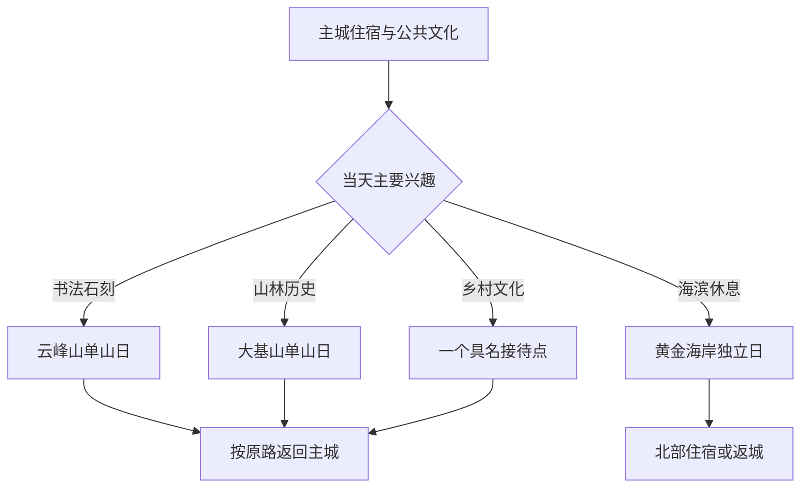
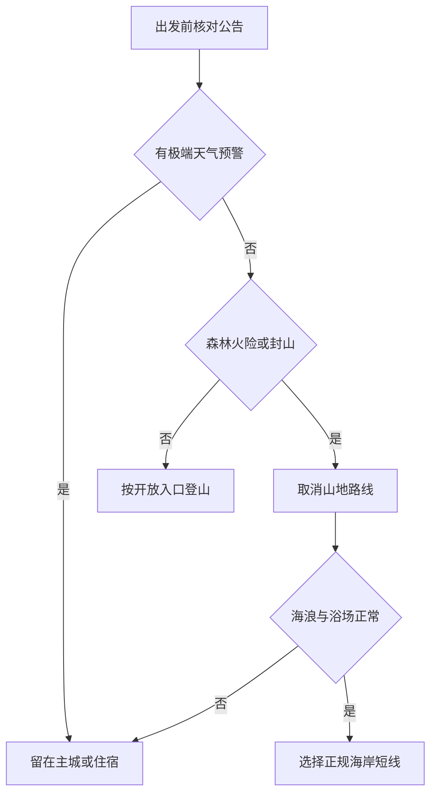

# 莱州旅行指南

莱州位于胶东半岛西北部、莱州湾东岸，是由烟台市代管的县级市。旅行者实际面对的是三种不同尺度：文昌路—永安路一带的主城公共文化与生活服务，南侧云峰山、大基山和中华月季园组成的山地文化方向，以及北部三山岛—金仓一带的海岸、渔业与港产空间。三者之间需要车辆连接，不能把“山海莱州”理解成一条连续步道。

首访可用 1 天认识主城与书法文化，用第 2 天完成云峰山或大基山其中一座山；若把黄金海岸、朱旺村或其他乡村接待点纳入行程，宜再增加 1 天。云峰山和大基山是两处独立山岳景区；规划中的“东莱文化名山旅游区”是上位建设构想，不代表两山已经共用入口、门票或连续开放游线。

> 建议停留：2—3 天；北部海岸或单一乡村方向另留 1 天 
> 旅行关键词：魏碑石刻、书法、山林、月季、古邑文博、莱州湾海岸、胶东海鲜 
> 主要体力：城区低至中等；山岳中高至高；海岸受风浪、日晒与步行长度影响 
> 最近研究：2026-08-12

## 城市速览

| 项目 | 旅行信息 |
|---|---|
| 主要旅行价值 | 在一座县级城市内同时理解古代光州—掖县历史、北魏书法石刻、道教山林、月季栽培传统与莱州湾海洋生产；城市页的重点是把可参观景区、文物保护区和矿港生产空间分清 |
| 建议停留 | 1 天可做主城文博与公园短线；2 天加入云峰山或大基山；3 天可把另一座山或北部海岸单独成日，不建议双山与海岸压在同一天 |
| 较舒适季节 | 春季花事与秋季户外通常更适合长时间步行；夏季海滨和山林需防高温、雷雨、台风与强对流；冬季海风、寒潮、积雪和道路结冰会放大跨片区负担 |
| 预算特点 | 主城公共文化场馆和公园可降低门票支出；景区门票、山地往返车辆、海岸住宿、旺季餐饮和跨镇包车是主要增量成本 |
| 步行强度 | 主城可按短段步行；云峰山看石刻需要持续爬升，大基山游线也包含山路、坡道和较长户外暴露；黄金海岸面积大，不宜按普通城市公园估算 |
| 主要天气风险 | 山区雷电、暴雨、落石、森林火险与冬季结冰；海岸大风、海雾、雷雨、台风、风暴潮、海浪与高温暴晒；极端天气时取消山海路线 |
| 独行旅行 | 主城场馆和一座正规景区较易独立安排；远郊返程、乡村接待和夜间海岸不够稳定，出发前应把车辆接回与最后开放时间一并确认 |
| 亲子旅行 | 博物馆、文化馆、月季园和有正式服务区的短游线较适合；山体临边、海水浴场、赶海、动物互动和农业体验均需持续看护并确认年龄规则 |
| 长者与低体力旅行 | 可采用“单馆 + 平缓公园 + 车辆接驳”；云峰山石刻、大基山完整环线、松林海岸和乡村石路难以完全无台阶，宜设置明确折返点 |
| 无障碍信息 | 新建公共文化设施可能提供电梯、无障碍卫生间或轮椅，但景区入口、石刻山路、沙滩、村落与换乘之间的连续无障碍资料不足；需要逐段向运营方确认 |

莱州的行程取舍可以先按“文化证据、山地体力、海岸天气”三个条件判断。对大多数首访者，博物馆与云峰山的文化线比把多个乡镇景点拼成清单更容易形成完整认识；对低体力者，主城公共文化比勉强登山更能保留旅行质量。

## 城市格局与游览区域

莱州市现辖文昌路、永安路、文峰路、城港路、三山岛、金仓 6 个街道和 11 个镇。主城位于市域中部偏北，莱州站在城区外缘承担铁路到发；云峰山与大基山分别位于主城南侧不同方向，北部海岸又延伸到三山岛、金仓和城港路沿海地带。地图上的直线距离不会反映进山入口、港区绕行、村路与滨海防护林管理造成的实际时间。

| 区域 | 主要内容 | 游览特点 | 与其他区域的关系 |
|---|---|---|---|
| 文昌路—永安路主城 | 莱州市博物馆、市民之家公共文化空间、掖县公园、成熟餐饮与住宿 | 适合把地方史、非遗和城市生活作为首日基础；片区内可短步行，跨到高铁站或山脚仍需车辆 | 是住宿和换乘中枢；去云峰山、大基山、北部海岸都应分别计算往返 |
| 文峰路南部 | 云峰山风景区、中华月季园及山前村镇 | 书法石刻与花卉主题相邻，但各有入口、开放和季节条件；云峰山登山强度明显高于园内平缓游览 | 可在同一方向择一主一辅；不因“云峰山北麓”就把两处写成同一景区 |
| 文昌路东南山地 | 大基山景区及周边正式接待的乡村节点 | 大基山以完整山林景区游线安排；自然保护地、岳石文化遗址、摩崖题刻和内部服务点都属于同一上位景区或保护关系，不重复拆分 | 与云峰山是两座独立山体；普通体力者宜分日，不走林区野路横穿 |
| 三山岛—金仓北部海岸 | 黄金海岸生态旅游景区、海岸松林、海水浴场与度假接待 | 风浪、浴场管理、道路与淡旺季影响大；正规旅游区之外同时存在渔港、养殖和防护林 | 适合独立一日或住一晚；不与南部山地横向串联 |
| 城港路—朱旺方向 | 朱旺红砖艺术馆景区、村落红色文化与经确认开放的海岸活动 | 场馆、村庄公共区域和海岸活动区不是自动连续开放；团队活动、研学和节庆可能需要预约 | 可作为北部海岸日的文化补充；返程和实际接待状态应先锁定 |
| 程郭、郭家店等乡村方向 | 马家庄现代农业园、初家村、小草沟等具名接待点 | 农业、乡村和季节活动分散，营业、采摘、研学和餐食具有时效性 | 一天只选一个方向；普通果园、农田、大棚、水库和村民院落不因靠近线路而开放 |
| 金城、三山岛、夏邱、柞村等生产带 | 金矿采选冶炼、石材矿山加工、港口、盐田、水产养殖与物流 | 这些空间解释莱州经济地理，但生产区、矿井、采坑、尾矿库、石材作业面、港池和专用道路不是景点 | 只进入有独立运营、明确准入和正式接待的访客区域；不把产业规划当成已经开放的工业旅游 |

各方向的关系可以概括为：主城负责理解与补给，南部两座山分别承担书法和山林体验，北部海岸承担海滨停留，乡村节点只在接待成立时加入。

“东莱文化名山旅游区”把云峰山、大基山、寒同山和中华月季园作为规划中的组团式项目，但研究日仍应按各景区现实入口、票务和运营公告组织。云峰山摩崖石刻属于文物保护对象，大基山又与自然保护地和山林防火相连；即使未来交通廊道完善，也不意味着文物保护区、自然保护区与林地全部向游客连续开放。

北部海岸同样需要分层理解。黄金海岸生态旅游景区的正式沙滩、广场、步道和服务区可以按运营边界游览；相邻的三山岛渔港、莱州港、养殖塘、盐田、港口铁路、堤防、防潮工程和沿海防护林首先承担生产、航运、防灾或生态保护功能，不能凭海景或地图道路自由进入。

## 主要景点

优先级用于安排时间，不代表绝对排名：**A** 为首访核心，**B** 为按兴趣补充，**C** 为远郊、季节性或通常需要独立半天以上的目的地。车站、市集和公园短线只作为路线节点，不与正式景点并列；同一景区及其内部遗址、题刻、展馆、动物区、花园或观景节点只记录一次。

### 主城公共文化与城市生活

| 景点 | 区域 | 类型 | 主要看点 | 建议用时 | 室内外 | 体力 | 预约风险 | 天气影响 | 优先级 |
|---|---|---|---|---:|---|---|---|---|---|
| 莱州市博物馆—市民之家公共文化组团 | 主城 | 博物馆、公共文化 | 以地方考古、历史文物、书画与临时展理解古光州、掖县到莱州的城市脉络；同一建筑组团内的文化馆或专题展不重复清点 | 2—3 小时 | 室内 | 低 | 中 | 低 | A |
| 掖县公园 | 主城 | 城市公园 | 月季城市意象、地方人物公共雕塑与日常生活观察，适合作为场馆后的平缓休息段 | 1—1.5 小时 | 室外 | 低 | 低 | 中 | 路线节点 |
| 南关大集或朱桥大集 | 主城或朱桥镇 | 周期市集 | 胶东集市、农副产品、海产与羊汤等生活文化；开集日期、摊位和交通并非每天相同 | 1.5—2 小时 | 室外为主 | 中 | 高 | 中 | 路线节点 |

博物馆是进入两座山之前最有效的知识底座。馆内展品轮换、临展和开放空间会变化，不能把宣传中出现过的单件文物写成永久在展。掖县公园承担休息和城市观察，不与博物馆合并为一个景区，也不因人物雕塑数量而拆成多站。

### 云峰山书法与月季

| 景点 | 区域 | 类型 | 主要看点 | 建议用时 | 室内外 | 体力 | 预约风险 | 天气影响 | 优先级 |
|---|---|---|---|---:|---|---|---|---|---|
| 云峰山风景区 | 文峰路街道 | 山岳、书法石刻 | 云峰山摩崖石刻与《郑文公下碑》等北魏书法遗存；石刻、碑亭和登山线路统一按一处景区理解 | 半日至 1 天 | 室外为主 | 高 | 中至高 | 高 | A |
| 中华月季园 | 云峰山北麓 | 专类园、花卉 | 月季品种、园林展示与花节文化；盛花、活动和局部展陈有季节性 | 2—3 小时 | 室外为主 | 低至中 | 中 | 高 | B |

云峰山、文峰山在本地资料中可能出现相近称谓，行前应以票务或导航入口的正式名称确认。全国重点文物保护单位“云峰山、天柱山摩崖石刻”包含跨地点的文物体系；莱州行程只写本市云峰山实际开放部分，不把平度天柱山计入莱州，也不把一处摩崖题记拆成独立景点。

### 大基山山林与历史文化

| 景点 | 区域 | 类型 | 主要看点 | 建议用时 | 室内外 | 体力 | 预约风险 | 天气影响 | 优先级 |
|---|---|---|---|---:|---|---|---|---|---|
| 大基山景区 | 文昌路街道东南 | 山林、历史文化 | 森林景观、历史遗址、题刻与道教文化；天鹅湖、大基宝塔、摩崖题刻和内部动物互动等均为完整景区游线的组成部分 | 半日至 1 天 | 室外为主 | 中高至高 | 中 | 高 | A |

大基山景区与大基山自然保护地不是同义范围。游客按景区开放入口和核准游线活动，不能由景区门票推导保护地核心区域、林场道路或所有山谷均可进入。森林火险较高时，火种、吸烟、野炊、露营和离开正式路线都可能受到严格限制；临时封闭应直接服从现场管理。

### 北部海岸与乡村接待

| 景点 | 区域 | 类型 | 主要看点 | 建议用时 | 室内外 | 体力 | 预约风险 | 天气影响 | 优先级 |
|---|---|---|---|---:|---|---|---|---|---|
| 黄金海岸生态旅游景区 | 三山岛—金仓海岸 | 海滨、度假 | 正式开放沙滩、松林与公共服务空间；海水浴场、水上活动和活动场地按当天管理 | 半日至 1 天 | 室外 | 中 | 中至高 | 高 | B |
| 朱旺红砖艺术馆景区 | 城港路街道朱旺村 | 乡村博物馆、红色文化 | 红砖建筑、乡村历史与红色文化展陈；村内公共空间和海岸活动需分别确认 | 2—3 小时 | 混合 | 低至中 | 中 | 中 | B |
| 马家庄现代农业园 | 程郭镇 | 农业体验、亲子 | 农业展示与季节活动；生产大棚、作业区和体验区边界需由运营方确认 | 2—3 小时 | 混合 | 低至中 | 高 | 中 | C |
| 初家村景区 | 属地乡村方向 | 乡村景区 | 具名乡村接待与地方生活环境，适合与同方向单一主题组合 | 2—3 小时 | 室外为主 | 中 | 高 | 中至高 | C |
| 小草沟村等具名接待点 | 郭家店镇等乡村方向 | 乡村、研学 | 经官方活动或经营主体确认的观星、研学、果业和村落体验 | 半日至 1 天 | 混合 | 中 | 高 | 高 | C |

北部海岸与乡村项目的共同风险是“宣传存在”不等于“当天可散客进入”。节庆线路、招商项目、研学团和旅行社线路可以证明当地主题，但不能代替当日营业公告。没有具名运营方、开放入口和返程安排时，宁可只保留黄金海岸正规区域或朱旺红砖艺术馆，不临时进入普通村路、养殖岸线和生产大棚。

## 美食与餐饮

莱州饮食兼有胶东面食、羊汤与莱州湾海鲜。主城适合寻找单碗主食、正规海鲜餐馆和成熟市场；北部海岸的海产更接近生产地，但渔港、养殖塘和码头不是自由采购或赶海空间。菜单中的“时价”必须在下单前确认品种、重量、计价单位、加工费和总价。

| 菜品或餐饮类型 | 常见区域 | 一个人用餐与常见份量 | 风味、过敏原与饮食限制 | 排队风险与替代方法 |
|---|---|---|---|---|
| 朱桥羊汤配炸面鱼 | 朱桥大集及城区羊汤馆 | 羊汤可按碗点，炸面鱼按食量搭配，适合独食 | 羊肉、羊骨汤与小麦；可能加入香菜、胡椒和复合调味，严格清真需求还需确认屠宰、加工与共厨条件 | 大集和早餐高峰排队，且朱桥大集不是每天开集；城区同类正规羊汤馆可替代 |
| 莱州梭子蟹 | 北部海产供应与城区正规海鲜餐馆 | 常按只或重量计价，独食先问最小份量 | 甲壳类高风险过敏原；蒸煮区也可能与鱼、贝类共用工具，痛风或需控制嘌呤者应谨慎 | 产季、海况和休渔管理影响供应；下单前看活体、称重、单价和加工费，不追逐来路不明的低价 |
| 扇贝、海参、对虾等莱州湾海产 | 城区与海岸正规餐馆 | 拼盘和整盘多适合共享；独食优先选明确小份或按只点单 | 贝类、甲壳类和鱼类过敏原集中；蒜蓉、酱汁可能含大豆、小麦、芝麻，严格素食者不适用 | 旺季热门海岸餐馆等位较久；可回主城选择明码标价的胶东菜馆 |
| 鲅鱼水饺或海鲜水饺 | 主城饺子馆与胶东餐馆 | 按盘或份点，较适合一人 | 鱼类、虾贝、小麦和蛋；不同馅料可能共用面板、锅具和蘸料 | 正餐高峰有排队；选择能明确说明馅料和数量的普通饺子馆即可 |
| 海鲜卤面、疙瘩汤 | 主城面馆与家常菜馆 | 单碗主食，便于控制预算和份量 | 小麦、鱼虾贝类和蛋常见，汤底可能含肉；“清汤”不自动等于素食或无过敏原 | 午餐高峰可能售罄；询问当日卤汁和海鲜种类，可改点不含海鲜的明确浇头 |
| 胶东大饽饽与花饽饽 | 市场、面点店和节庆活动 | 切块或小规格适合途中补给，大型礼俗饽饽不适合独食 | 小麦为主，造型面点可能含乳、蛋、糖或色素；麸质不耐受者不适用 | 节庆定制需要预约；日常购买选择有标签、生产日期和配料信息的正规店 |
| 当季樱桃、苹果、葡萄等果物 | 正规市场与确认接待的采摘园 | 按实际食量购买，生鲜不宜在高温中久放 | 需清洗并留意个体果物过敏；采摘不代表可以边采边吃或进入全部种植区 | 花果期和成熟期随天气变化；市场购买比临时寻找果园更稳定，采摘须先确认营业和计价 |

独行者若想尝海鲜，优先选择可按只、按小份或按明确重量点单的餐馆；多人聚餐则可用清蒸、酱焖、饺子和蔬菜分散单一过敏原。饮酒后不自驾，海鲜市场购买生鲜后也要确认储存和加工条件，不把后备箱或常温房间当作冷链。

## 经典行程

### 一日经典路线

**路线**：莱州市博物馆—市民之家公共文化组团 → 主城午餐与休息 → 掖县公园 → 成熟街区短段

- **串联逻辑**：先用博物馆建立古光州、掖县、书法与地方物产的背景，再把公园和街区作为城市生活观察；全日留在主城，不用赶山地入口。
- **适用与减负**：适合首访、雨季前后、晚到旅客和低至中等体力者；场馆只选核心展厅，公园按平缓短段往返。
- **预约锚点**：优先核对博物馆开放日、预约、临展、证件和最晚入场；市民之家内部各机构可能有不同开放时间，分别确认。
- **休息安排**：午餐和长休息放在主城成熟商圈，博物馆内按座椅与楼层分段参观；高温时把公园推迟到傍晚。
- **时间不足时**：删去街区和公园延伸，只保留博物馆核心展与正餐；不要用临时商业展替代地方史内容。

### 两日城市与书法路线

**第 1 天**：莱州市博物馆—市民之家公共文化组团 → 主城午餐 → 掖县公园短段 
**第 2 天**：主城 → 云峰山风景区官方入口 → 当日开放石刻游线 → 山下休息 → 返回主城

- **串联逻辑**：第一天先理解莱州历史与书法背景，第二天再把北魏石刻放回山体现场；两日均以主城住宿，减少换房和行李负担。
- **适用与减负**：适合文博和书法旅行者；云峰山按开放核心线设置折返点，低体力者可把第二天改为中华月季园，不强求登至最高处。
- **预约锚点**：第一天锁定博物馆，第二天确认云峰山门票、文物维护、开放路线、天气、森林火险与返程车辆；石刻在保护或维修时服从围挡。
- **休息安排**：第一天在城区午休，第二天在游客服务区或正式休息点补给；不在摩崖石刻旁进食、倚靠、拓印或放置器材。
- **时间不足时**：第二天缩短为云峰山核心石刻段，或整日改为月季园；不从未开放山路抄近路，也不临时加入大基山。

### 三日双山深度路线

**第 1 天**：主城文博与掖县公园短线 
**第 2 天**：云峰山风景区 → 山下休息 → 返回主城 
**第 3 天**：大基山景区官方入口 → 当日开放完整或折返游线 → 返回主城

- **串联逻辑**：主城提供历史背景和补给，云峰山聚焦魏碑书法，大基山聚焦山林、历史遗址与道教文化；两座山分日后，文保规则和体力分配都更清晰。
- **适用与减负**：适合普通至较强体力且重视文化山岳者；连续两天登山前评估膝踝和天气，必要时将第 3 天改为月季园或主城休息。
- **预约锚点**：分别核对两座景区的入口、票务、维护、闭园和森林防火；“东莱文化名山旅游区”规划不能替代任一景区当天公告。
- **休息安排**：每天回主城用餐和住宿；山地日只在正式服务区停留，随身携水但不在文物或林区使用明火、自热食品和野炊设备。
- **时间不足时**：双山二选一，书法优先云峰山、山林历史优先大基山；不把两座山压成同日，也不横穿保护地连接。

### 雨天路线

**路线**：莱州市博物馆核心展厅 → 馆内或市民之家休息 → 主城正式午餐 → 当期开放的室内公共文化活动

- **串联逻辑**：全部依赖主城成熟场馆与短距离接驳，避开山路、海岸、村路和露天花园；普通小雨仍以减少换乘为目标。
- **适用与减负**：适用于普通降雨且道路运行正常的情况；暴雨、雷电、台风、积水或交通预警时留在住宿，不把“室内路线”当成必须跨城执行的任务。
- **预约锚点**：博物馆和文化馆的临时闭馆、活动名额、证件与最晚入场；出发前同步查看城市积水、公交和道路公告。
- **休息安排**：把午餐与等待都放在场馆附近固定室内空间，携带湿物时遵守寄存和地面防滑要求。
- **时间不足时**：只保留博物馆；若场馆闭馆，则改为住宿周边用餐和休息，不转去云峰山、大基山、海岸或普通矿洞避雨。

### 亲子或低体力路线

**亲子路线**：莱州市博物馆亲子短线 → 主城午餐与午休 → 中华月季园正式开放区或掖县公园短段 
**低体力路线**：车辆落客 → 莱州市博物馆一组核心展厅 → 室内午休 → 掖县公园最近平缓入口 → 返回住宿

- **串联逻辑**：亲子线用“馆藏与花城”形成观察主题，低体力线则保持单馆和一段平缓公园；两条路线都不要求登山、赶海或在多个乡镇换乘。
- **适用与减负**：亲子家庭需持续看护并减少长展线，低体力者需确认落客、电梯、轮椅和卫生间；月季园若非花期、炎热或大风，直接改回主城公园。
- **预约锚点**：分别确认博物馆儿童活动年龄、陪同、推车与寄存，以及月季园开放、花期、活动和车辆入口；无障碍连续性向每个场所单独确认。
- **休息安排**：午休放在主城固定室内空间，公园或园区每走一段就回到可退出的服务节点；儿童不接近无护栏水边、施工区和园艺作业区。
- **时间不足时**：删去月季园或公园，只做博物馆单馆；无障碍条件不明时不以到场试走替代事前核对。

### 北部海岸一日路线

**路线**：莱州主城或莱州站 → 黄金海岸生态旅游景区正式入口 → 景区服务区午餐与休息 → 朱旺红砖艺术馆景区（确认开放时）→ 主城或北部住宿

- **串联逻辑**：全日保持在北部大方向，海岸承担主要户外时间，朱旺作为文化补充；两处仍需车辆连接，不沿港区、防护林或普通岸线抄近路。
- **适用与减负**：适合天气稳定、已经确认往返车辆者；不下水者也可走正规短段海岸，低体力者保留一个入口附近的观海区并删除朱旺。
- **预约锚点**：先查景区开放、浴场与水上项目状态、海浪和台风预警，再查朱旺场馆接待与返程；游泳以现场救生、旗号和广播为准。
- **休息安排**：只使用景区、场馆或正规餐饮的服务空间；不在渔港、养殖塘、盐田、防潮堤、货运道路和防护林核心区域停留野餐。
- **时间不足时**：先删朱旺，只保留黄金海岸正规区域；出现大风、大浪、雷电、台风、闭园或水质公告时整段取消，改回主城室内路线。

路线选择的安全顺序是先判断预警和开放，再决定山、海或主城，而不是抵达后寻找野路替代：

山体封闭时不改走林道，海岸关闭时不转向未管理沙滩。景区约满或场馆临时闭馆时，最稳妥的替代是缩短行程或回到主城公共空间，不是进入矿区、港区、保护地和村民生产空间补足“景点数量”。

## 住宿区域

莱州以主城为最稳妥的住宿基地。若连续两天走云峰山和大基山，住主城能平衡餐饮、医疗、车辆与天气退路；北部海岸住宿只适合海滨为核心且已核实全年或当季营业的行程。导航中带“云峰山”“大基山”“黄金海岸”字样，不代表步行可到检票口或海水浴场。

| 住宿区域 | 主要优势 | 主要代价 | 适合人群 | 预订前核对 |
|---|---|---|---|---|
| 文昌路—永安路主城 | 餐饮、公共文化、医疗和叫车相对集中，前往南北各方向较均衡 | 不贴近任何一座山或海岸，每个远点仍需车辆往返 | 首访、多日分方向、独行、亲子和低体力旅行者 | 与博物馆和实际公交站的距离、电梯、无障碍房、停车、早餐与前台时间 |
| 莱州站接驳方向 | 便于晚到早走，减少拖行李进城后的反复换乘 | 站区生活服务未必等同主城成熟商圈，景区也不在车站步行范围 | 中转、早班铁路、次日包车者 | 票面站名、公交或出租上客点、夜间照明、餐饮、寄存和到主城的最后一段 |
| 文峰路南部确认运营住宿 | 前往云峰山或月季园相对方便 | 山前夜间餐饮、叫车、道路与淡季营业可能不如主城稳定 | 自驾、书法或花事为核心者 | 具体地址、是否真在景区入口附近、营业日期、停车、供暖制冷和取消规则 |
| 大基山周边确认运营住宿 | 可减少大基山日的城区往返 | 与云峰山、北部海岸和铁路站不顺路；林区夜间活动受防火与道路影响 | 自驾、单山慢游、已确认景区开放者 | 合法经营、道路、景区入口、晚餐、夜间照明、消防和紧急联络 |
| 黄金海岸与北部度假区 | 海滨停留方便，可避免一天内长距离往返 | 淡旺季差异、海风、台风、海岸关闭、餐饮与医疗距离影响大 | 海滨休息、自驾、多晚慢住 | 实际海景与步行入口、浴场状态、营业季、停车、餐饮、取消和极端天气退订 |
| 朱旺等乡村确认接待点 | 便于乡村活动、团队研学或慢节奏停留 | 公开预订、夜间交通、消防、餐食和返程资料可能不足 | 已由运营方确认的团队、研学或自驾旅行者 | 经营主体、房型、消防、卫生间、供暖制冷、餐食、夜间接入和返程车辆 |

海岸或乡村住宿的“套票”应拆开看房间、门票、餐食、活动、接送和取消规则。遇台风、暴雨、森林火险或景区关闭时，住宿仍营业也不代表原行程可执行；先确认退改，再把活动收缩到安全公共空间。

## 市内交通

莱州站随潍烟高铁投入使用后成为铁路门户，但“到达莱州站”不等于已经到主城中心、云峰山、大基山或黄金海岸。主城依靠公交、出租车、网约车与步行，跨到山地、海岸和乡村则要把去程、等待和返程作为一项完整交通任务。

| 交通场景 | 较稳妥方式 | 主要风险 | 行前核对 |
|---|---|---|---|
| 铁路抵达莱州站 | 按 12306 票面车次到莱州站，再换公交、出租或预约车辆 | 把车站当成景区入口；晚到时公交班次、站前施工与照明可能变化 | 车次、出站口、莱州站综合交通枢纽、公交站位、出租上客点与住宿接回 |
| 莱州站—主城 | 公交或合规车辆；官方较早答复曾确认 11 路接入高铁站，但线路和班次需以出发日公告为准 | 依赖历史答复推定今天的末班；规划延伸线路不等于已经获批运营 | 当前公交线路、首末班、夜间班次、道路验收与叫车定位 |
| 主城片区内 | 短步行结合公交、出租或网约车，按博物馆、公园和餐饮分段 | 高温、雨雪、路口与施工使地图步行时间失真 | 公交调整、道路施工、过街、无障碍落客与夜间照明 |
| 主城—云峰山 | 预约往返车、自驾或当期明确运行的公共交通 | 山脚入口定位、返程叫车、闭园和手机信号；把月季园入口误作云峰山检票口 | 景区正式入口、司机接回点、最晚离园、天气、防火与停车 |
| 主城—大基山 | 预约往返车或自驾，按景区正式入口到达 | 景区与自然保护区范围混淆；林场或村路不适合抄近路 | 售检票入口、停车、开放游线、返程、防火检查与道路结冰 |
| 主城—黄金海岸 | 自驾或预约车辆较稳妥，必要时住北部 | 距离长、海岸入口分散、港产道路与旅游道路混杂，旺季停车压力大 | 景区入口、停车、浴场状态、返程、海浪台风和施工绕行 |
| 乡村与市集 | 只有在接待、开集日期和返程均确认后乘车前往 | 市集日期错位、乡村叫车少、采摘或活动临时取消 | 开集日、经营主体、道路、停车、餐食、卫生间和返程时间 |
| 自驾 | 对双山分日、海岸住宿和携带行李更灵活 | 山路、雨雪、矿区重车、港区货运、村路会车、停车与饮酒风险 | 路况、限行、停车、充电、驾驶员休息、天气和替代路线 |

2025 年莱州市交通运输局公开答复显示，当时公交 11 路已延伸至高铁站，另有线路仍受道路和设施条件制约。它说明车站接驳正在完善，却不是 2026 年或更晚日期的时刻表。出发时应以属地公交、车站现场和交通部门最新信息为准，尤其是早晚班、节假日与道路施工期间。

从烟台、潍坊、青岛等城市前往莱州，应按铁路或公路实际到发安排，不因行政上由烟台代管就把烟台主城区到莱州视为普通市内通勤。烟台市区、蓬莱机场、潍坊站、青岛机场和莱州站是不同交通节点；跨城当天还要为车站到住宿或景区的最后一段留足时间。

## 不同旅行者须知

| 旅行维度 | 可行条件 | 主要取舍 | 需额外核对 |
|---|---|---|---|
| 独行旅行 | 主城文博、城市公园和一座正规山岳景区可独立安排 | 海岸、乡村和山脚返程不如主城稳定；大份海鲜和包车成本较高 | 返程车辆、末班公交、景区闭园、计价单位与夜间住宿接入 |
| 亲子家庭 | 博物馆、文化馆、月季园和服务区完整的短游线 | 山体临边、沙滩海浪、动物互动、农业设备和大集人流需持续看护 | 儿童预约、年龄身高、推车、卫生间、救生、走失预案与过敏原 |
| 长者与低体力旅行 | 单馆、车辆接驳、掖县公园短段与园区折返线 | 云峰山持续爬升、大基山长游线、沙滩和村路会放大体力负担 | 最近落客点、电梯、轮椅、座椅、坡度、卫生间和退出路线 |
| 轮椅或行动辅助器具使用者 | 主城新建公共文化设施更可能形成单点无障碍 | 站—车—馆—山—海的连续资料不足；石刻、林路和沙滩难以推定可通行 | 车站协助、无障碍车辆、场馆入口、电梯、卫生间、陪同和返程 |
| 书法与文博爱好者 | 博物馆先行、云峰山单山日能形成完整证据链 | 石刻保护、维修、光线与登山体力会限制观看；不允许接触、拓印或跨越围挡 | 在展文物、讲解、石刻开放、摄影、三脚架和文保要求 |
| 山地徒步者 | 云峰山或大基山按官方路线各自成日 | 景区游线不等于野线开放；保护地、防火道和矿山道路不作为穿越线路 | 森林火险、封山、雷电、降雨、结冰、最晚离园和救援联络 |
| 海滨旅行者 | 黄金海岸正式景区与管理浴场可按公告游览 | 看到海不等于允许游泳、赶海或进入防护林；台风、风浪和海雾影响显著 | 浴场开放、救生旗号、海浪风暴潮、停车、水质与水上项目资质 |
| 摄影旅行 | 城市公共空间、石刻允许区域、正式观景点和海岸开放段 | 文物、人物、宗教活动、无人机、港区、矿区和军警设施有不同边界 | 闪光灯、三脚架、无人机、商业拍摄、人物授权与日出日落时段 |
| 预算有限 | 主城公共文化、城市公园和单碗主食可控成本 | 住得偏远可能把房费差额转为包车；双山、海岸和乡村叠加会迅速增费 | 免费开放是否需预约、交通、门票、退改、海鲜称重与住宿总价 |
| 素食、清真或严重过敏者 | 主城正规餐馆更容易沟通配料和加工 | 羊汤、海鲜、鱼卤、共锅与复合酱料使名称难以证明条件 | 汤底、油脂、屠宰、鱼虾贝、蛋奶、坚果、芝麻、小麦与交叉接触 |
| 国际旅行者 | 车站、主城场馆和正规景区入口较容易按证件办理 | 护照预约、外语信息、移动支付、郊区通信和紧急沟通可能不连续 | 证件类型、实名预约、支付、翻译、住宿接待与紧急联系人 |

书法石刻和乡村居民空间都需要克制摄影。允许携带相机不等于允许闪光灯、三脚架、无人机、直播、拓印或商业素材采集；人物、宗教活动、作坊和村民住宅应先获得同意。港口、矿山、冶炼、石材、养殖和防护林区域即使具有视觉吸引力，也以生产安全、保密、生态和现场管理为先。

## 行前核对

| 核对事项 | 为什么需要重查 | 建议核对时间 | 官方入口 |
|---|---|---|---|
| 莱州市博物馆与市民之家场馆 | 开放日、预约、证件、临展、讲解、活动名额、寄存和无障碍会变化 | 排入路线前及到访前一日 | [莱州市人民政府](https://www.laizhou.gov.cn/)；[烟台市博物馆、纪念馆名录](https://www.yantai.gov.cn/art/2025/3/10/art_43273_3241840.html) |
| A 级景区身份与运营 | 景区等级不能代替当天售票、开放、维护和闭园信息；同名规划项目也不代表统一入口 | 订住宿前、到访前一日及当天 | [烟台市 A 级旅游景区名录](https://whlyj.yantai.gov.cn/art/2025/7/25/art_42223_2904418.html)；各景区官方渠道 |
| 云峰山与摩崖石刻 | 文物维护、围挡、摄影、开放线路和最晚入场直接影响书法主题 | 出发前一周及到访前一日 | [莱州市政府：云峰山与郑文公碑](https://www.laizhou.gov.cn/art/2012/1/12/art_23194_1544171.html)；景区与文物主管部门公告 |
| 大基山 | 门票、开放游线、自然保护地边界、动物互动、天气和闭园会变化 | 出发前一日及当天早晨 | [烟台市文旅局：大基山等登山信息](https://whlyj.yantai.gov.cn/col/col42216/art/2026/art_85787f2484074b848358b9ba4c89dc47.html)；景区公告 |
| 中华月季园与花节 | 花期、园艺维护、节庆活动、入园和停车具有季节性 | 确定日期后及到访前一日 | [烟台市文旅局莱州花季线路](https://www.yantai.gov.cn/col/col43277/art/2026/art_d3102aca706d408ba714def47247cc88.html)；园区当期官方公告 |
| 黄金海岸与海水活动 | 海岸开放不等于浴场、水上项目或全部岸线开放；风浪、水质和救生状态每日变化 | 出发前三日、前一晚及每次下水前 | [莱州官方山海线路](https://www.yantai.gov.cn/col/col43277/art/2026/art_d3102aca706d408ba714def47247cc88.html)；[国家海洋预报台](https://www.oceanguide.org.cn/)；现场公告 |
| 朱旺与乡村接待 | 场馆营业、团队活动、采摘、研学、餐食和村路交通可能临时调整 | 至少提前一日 | [烟台市文旅局：朱旺与莱州乡村线路](https://whlyj.yantai.gov.cn/col/col42216/art/2026/art_10a1a7b4dce742e4939ff9b4a9aef2cd.html)；经营主体官方渠道 |
| 森林火险与山地安全 | 高火险、雷电、暴雨、落石、积雪或结冰可能封闭山林；禁止用火要求高于普通公园 | 出发前三日、前一晚及进山前 | [烟台市 2026 年森林防火提示](https://www.yantai.gov.cn/col/col11800/art/2026/art_a20933aa05a3404bbfb4b3ea09cd2b06.html)；[文旅安全提示](https://whlyj.yantai.gov.cn/col/col116173/art/2026/art_1a1999a5021948a8888429bee421306d.html) |
| 莱州站与铁路 | 车次、停站、检票口、施工和退改会变化，车站到主城仍需接驳 | 购票时、出发前一日及当天 | [中国铁路 12306](https://www.12306.cn/) |
| 莱州站公交与跨镇交通 | 线路、首末班、夜间班次、道路验收和节假日安排会调整 | 出发前一周、前一日及乘车当天 | [莱州市交通运输局关于高铁接驳的公开答复](https://www.laizhou.gov.cn/art/2025/6/27/art_62833_20355.html)；[烟台市交通运输局](https://jtj.yantai.gov.cn/) |
| 天气、海风与道路结冰 | 山海两套风险可能同时出现，主城无雨也不代表海岸或山顶安全 | 出发前三日及每日清晨 | [中央气象台莱州预报](https://www.nmc.cn/publish/forecast/ASD/laizhou.html) |
| 自然保护、港矿与生产边界 | 大基山保护地、沿海防护林、矿区、石材区、港区、盐田和养殖区有独立管理 | 规划摄影、徒步或自驾路线前 | [烟台市生物多样性保护行动计划](https://hbj.yantai.gov.cn/art/2025/1/16/art_23649_2908453.html)；[莱州沿海防护林整改公示](https://www.laizhou.gov.cn/col/col44754/art/2026/art_1592519f89b143119a81784f27910a79.html) |
| 餐饮、海鲜与市集 | 营业、开集日期、产季、计价、加工费和过敏原具有时效性 | 排入路线前及每次点餐前 | [烟台市文旅局莱州美食线路](https://www.yantai.gov.cn/art/2023/6/21/art_50841_3122362.html)；市场监管、餐厅和市集官方渠道 |

若景区票务、属地公告和现场安全管理不一致，以最新的关闭、疏散与保护要求为准。云峰山或大基山关闭时不走野线，海岸关闭时不进无救生沙滩，乡村接待取消时不进入居民院落或生产地，铁路和公交变化时优先调整住宿与接回而不是压缩安全余量。

## 来源与更新记录

### 主要来源

| 来源 | 用途 | 类型 | 核验日期 |
|---|---|---|---|
| [莱州市人民政府](https://www.laizhou.gov.cn/) | 属地公告、机构入口、交通、文旅和应急动态的总核对入口 | 县级市政府 | 2026-08-12 |
| [莱州市医疗卫生服务体系规划中的市域概况](https://www.laizhou.gov.cn/art/2023/6/30/art_100686_72649.html) | 17 个镇街、6 个街道与 11 个镇、面积和市域空间范围 | 县级市政府规划 | 2026-08-12 |
| [莱州市创建省级全域旅游示范区实施方案](https://www.laizhou.gov.cn/art/2022/4/26/art_100685_26377.html) | 公共文化、海岸、乡村、月季、海鲜与工业农业融合背景，并用于限定生产和接待边界 | 县级市政府文件 | 2026-08-12 |
| [烟台市 A 级旅游景区名录](https://whlyj.yantai.gov.cn/art/2025/7/25/art_42223_2904418.html) | 大基山、黄金海岸、云峰山、中华月季园、马家庄、初家与朱旺的景区名称、属地和等级 | 地级文旅主管部门 | 2026-08-12 |
| [烟台市文旅局：莱州花香、山海与美食二日线路](https://www.yantai.gov.cn/col/col43277/art/2026/art_d3102aca706d408ba714def47247cc88.html) | 月季园、朱桥大集、黄金海岸、主城夜间公共空间、大基山和博物馆的现实组合 | 地级文旅主管部门 | 2026-08-12 |
| [烟台市文旅局：大基山登山信息](https://whlyj.yantai.gov.cn/col/col42216/art/2026/art_85787f2484074b848358b9ba4c89dc47.html) | 大基山景区属性、官方游线、咨询和动态开放核对 | 地级文旅主管部门 | 2026-08-12 |
| [莱州市政府：云峰山与郑文公碑](https://www.laizhou.gov.cn/art/2012/1/12/art_23194_1544171.html) | 云峰山书法石刻、郑文公碑及文物保护工程背景 | 县级市政府 | 2026-08-12 |
| [烟台市博物馆、纪念馆名录](https://www.yantai.gov.cn/art/2025/3/10/art_43273_3241840.html) | 莱州公共与乡村博物馆的机构性质和地址核对 | 地级政府公共文化名录 | 2026-08-12 |
| [烟台市文旅局：朱旺红砖艺术馆与莱州乡村线路](https://whlyj.yantai.gov.cn/col/col42216/art/2026/art_10a1a7b4dce742e4939ff9b4a9aef2cd.html) | 朱旺红砖艺术馆、小草沟等乡村节点及跨点交通背景 | 地级文旅主管部门 | 2026-08-12 |
| [莱州市重点招商项目](https://www.laizhou.gov.cn/art/2024/11/25/art_23191_2976213.html) | 东莱文化名山上位规划、滨海度假区、矿业石材与海洋产业空间；不作为营业承诺 | 县级市政府项目资料 | 2026-08-12 |
| [莱州市交通运输局关于高铁接驳的公开答复](https://www.laizhou.gov.cn/art/2025/6/27/art_62833_20355.html) | 莱州站投入使用、公交 11 路历史接驳状态和交通设施仍需动态核对 | 县级交通主管部门 | 2026-08-12 |
| [烟台市文旅局 2026 年汛期暑期安全提示](https://whlyj.yantai.gov.cn/col/col116173/art/2026/art_1a1999a5021948a8888429bee421306d.html) | 山区、海岸、未开发区域、高温、雷雨、火种与交通安全 | 地级文旅主管部门 | 2026-08-12 |
| [烟台市 2026 年森林防火提示](https://www.yantai.gov.cn/col/col11800/art/2026/art_a20933aa05a3404bbfb4b3ea09cd2b06.html) | 莱州相关森林火灾案例、林区无火出游与现行防火责任 | 地级政府与林业提示 | 2026-08-12 |
| [烟台市生物多样性保护战略与行动计划](https://hbj.yantai.gov.cn/art/2025/1/16/art_23649_2908453.html) | 大基山生物多样性优先区域、自然保护区与文峰山森林公园关系 | 地级生态环境主管部门 | 2026-08-12 |
| [莱州沿海防护林自然保护区整改公示](https://www.laizhou.gov.cn/col/col44754/art/2026/art_1592519f89b143119a81784f27910a79.html) | 北部沿海防护林自然保护与养殖、废弃物、岸线准入边界 | 县级林业部门 | 2026-08-12 |
| [烟台市文旅局：莱州五条线路与特色美食](https://www.yantai.gov.cn/art/2023/6/21/art_50841_3122362.html) | 云峰山、大基山、黄金海岸、朱旺、马家庄、莱州海鲜和朱桥羊汤主题 | 地级文旅主管部门 | 2026-08-12 |
| [中国铁路 12306](https://www.12306.cn/) | 莱州站车次、停靠、票务、退改和实时铁路运行 | 铁路运营平台 | 2026-08-12 |
| [中央气象台莱州预报](https://www.nmc.cn/publish/forecast/ASD/laizhou.html) | 高温、降雨、雷电、寒潮、风力和道路结冰判断 | 国家气象服务 | 2026-08-12 |
| [国家海洋预报台](https://www.oceanguide.org.cn/) | 海浪、风暴潮和近岸海洋风险动态核对 | 国家海洋预报机构 | 2026-08-12 |
| [GeoNames：Laizhou `1804578`](https://www.geonames.org/1804578/laizhou.html) | 项目固定人口地名记录、坐标与行政归属 | 开放地名数据库 | 2026-08-12 |
| [GeoNames：Laizhou Shi `6573967`](https://www.geonames.org/6573967/laizhou-shi.html) | 较广行政记录，用于解释同一城市存在不同空间尺度地名 ID | 开放地名数据库 | 2026-08-12 |
| [Wikidata：莱州市 `Q666700`](https://www.wikidata.org/wiki/Q666700) | 法定县级市实体、烟台代管关系、代码 `370683` 与两个 GeoNames 标识 | 开放结构化数据 | 2026-08-12 |

### 行政、数据与旅行边界

莱州市是烟台市代管的法定县级市，法定代码为 `370683`。本页旅行范围覆盖莱州市行政区域内依法开放的城市公共空间、场馆、景区、文物参观区、经营性乡村与海滨接待区；烟台中心城区、龙口市、招远市、蓬莱区、青岛市和平度市的景点均归其他目的地。烟台页只保留法定代管关系和跨城链接，不再承载莱州的大基山、云峰山、住宿、餐饮或县域路线。

GeoNames `1804578` 是带人口数据的驻地型记录，坐标落在莱州主城附近；GeoNames `6573967` 是空间更广的行政记录。Wikidata 法定实体 `Q666700` 当前同时列出 `P1566 = 1804578` 和 `P1566 = 6573967`，说明开放数据把城市驻地点与县级市行政范围连接到了同一个法定实体。此外，开放知识库中还可能存在内容很薄的同名居民点实体；这些记录不代表现实中另有第二座“莱州”。

因此，页面元数据保留任务分配的 `1804578` 作为稳定城市键，正文采用法定莱州市 `Q666700` 与代码 `370683` 的旅行范围。坐标点不代表整座县级市，行政记录也不能证明某个矿区、港区、村庄、保护地或海岸已经对游客开放；实际路线始终以入口、运营、交通和安全公告为准。

景点去重也按运营上位单元执行：云峰山风景区及其摩崖石刻计一处，大基山景区及其内部山林、遗址、题刻和服务节点计一处，黄金海岸正式旅游区计一处。规划中的东莱文化名山旅游区、滨海生态旅游度假区和全域旅游线路是空间组织与发展背景，不把多个现实入口合并，也不把招商中的拟建项目提前写成已开放景点。

### 更新记录

| 日期 | 更新内容 |
|---|---|
| 2026-08-12 | 首次系统整理莱州旅行资料；确认 GeoNames `1804578`、行政记录 `6573967`、Wikidata `Q666700` 与法定代码 `370683` 的粒度差异；把大基山及县域路线集中到莱州页；厘清云峰山、大基山、中华月季园和东莱文化名山规划的父子与并列关系；加入主城、双山、海岸、乡村、文保、矿港生产、森林火险、无障碍、饮食限制、铁路公交和 1—3 日替代路线。 |
