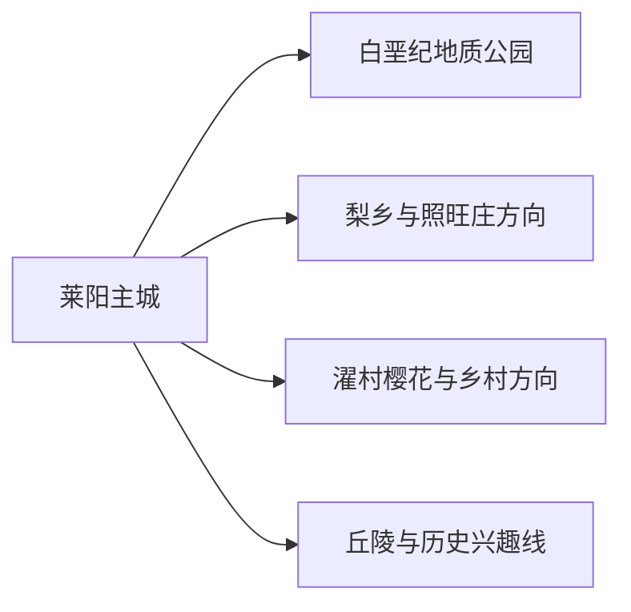
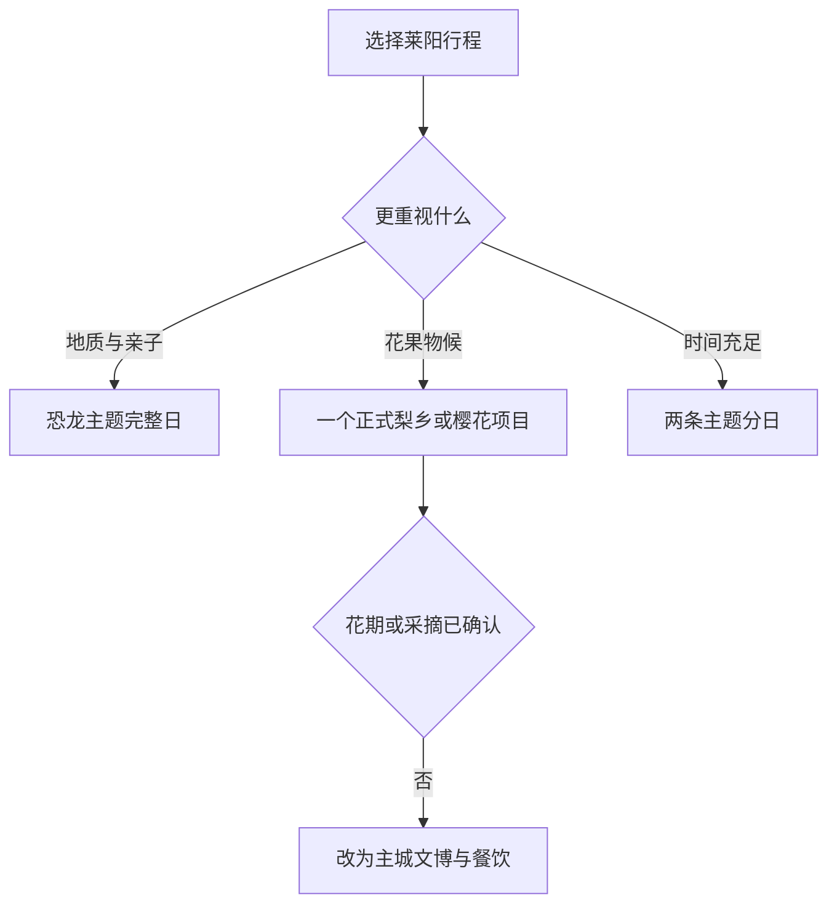

# 莱阳旅行指南

莱阳位于胶东半岛腹地，最有辨识度的旅行主题是白垩纪恐龙化石、梨乡物候和县级市生活。主城文博与恐龙主题可组成一天，梨花、梨果、樱花和乡村活动则按当年物候与经营方公告选择。

> 建议停留：2 天；花期或地质专题可安排 3 天 
> 旅行关键词：白垩纪、莱阳梨、梨乡、螳螂拳、胶东饮食 
> 主要体力：低至中等；地质与乡村远线依赖车辆 
> 最近研究：2026-08-12

## 城市速览

| 项目 | 旅行信息 |
|---|---|
| 主要旅行价值 | 在白垩纪国家地质公园理解莱阳恐龙与地层，在主城和正规乡村项目体验梨乡文化。 |
| 建议停留 | 1 天主城加恐龙主题；2 天增加梨乡或濯村；3 天再选地方文博与山地兴趣线。 |
| 较舒适季节 | 春季梨花、樱花明显，秋季适合梨果与户外；花果日期随气温和降雨变化。 |
| 预算特点 | 主城住宿餐饮为中低预算，跨乡镇车辆、景区票务和节庆旺季是增量。 |
| 步行强度 | 主城较平缓，地质公园和村落点位跨度大，宜分段乘车。 |
| 主要天气风险 | 高温、强降雨、雷暴、大风和冬季道路结冰。 |
| 独行旅行 | 主城和铁路到发方便；远线先落实返程。 |
| 亲子旅行 | 恐龙科普、城市公园和正规采摘较适合，户外遗址与水边持续看护。 |
| 长者与低体力旅行 | 用一个馆或一个乡村片区组成半日，车辆连接并留午休。 |
| 无障碍信息 | 新馆、村落道路和户外遗址之间的设施连续性需向官方确认。 |

### 城市身份与边界

莱阳是烟台市代管的县级市 **370682**。固定 **GeoNames 1804586** 与法定实体 **Wikidata Q371640** 的 `P1566` 精确相连；同号薄居民点记录不另设页面。烟台主城、海阳、栖霞和莱州分别按独立城市安排行程。

## 城市格局与游览区域

| 区域 | 主要内容 | 游览特点 | 与其他区域的关系 |
|---|---|---|---|
| 主城—旌旗路 | 公共文化、城市餐饮、住宿和交通 | 适合抵达日和雨天 | 可与恐龙主题同日组合 |
| 白垩纪地质公园方向 | 地质遗迹、恐龙化石与科普展陈 | 户外遗址和室内馆的开放可能分开 | 预留半天至一天，不与多条乡村线硬拼 |
| 梨乡—照旺庄方向 | 梨园、梨文化与正式采摘活动 | 花果期短，园区首先是农业生产空间 | 与主城组合较顺，先确认接待 |
| 濯村及乡村方向 | 樱花、村落公共空间与节庆活动 | 花期和交通受天气影响 | 作为季节整日，不追多个花点 |

## 主要景点

| 景点 | 区域 | 类型 | 主要看点 | 建议用时 | 室内外 | 体力 | 预约风险 | 天气影响 | 优先级 |
|---|---|---|---|---:|---|---|---|---|---|
| 莱阳白垩纪国家地质公园 | 城郊 | 地质公园与科普 | 白垩纪地层、恐龙化石及当期开放展馆 | 4–7 小时 | 混合 | 中 | 高 | 高 | A |
| 莱阳市博物馆 | 主城 | 地方综合博物馆 | 地方历史、书法、螳螂拳和临展 | 1.5–3 小时 | 室内 | 低 | 中 | 低 | A |
| 梨乡风情旅游区 | 照旺庄方向 | 农业文化与物候 | 梨花、梨果、农业科普与节庆 | 3–6 小时 | 户外 | 低至中 | 高 | 极高 | B |
| 濯村樱花园正式开放区 | 姜疃方向 | 花事与乡村旅游 | 樱花物候、村庄公共景观和活动 | 3–6 小时 | 户外 | 中 | 高 | 极高 | B |
| 蚬河公园公共开放段 | 主城 | 城市滨水公园 | 河岸绿地、城市生活与短程慢行 | 1–2 小时 | 室外 | 低 | 低 | 高 | B |
| 娘娘山景区 | 市域 | 山地与地方文化 | 丘陵、地方文化和当日开放步道 | 4–7 小时 | 户外 | 中高 | 高 | 极高 | C |

恐龙化石产地、考古工作面和地质保护区按管理边界参观；梨园、樱桃园和花生等农业基地以经营者明确接待的范围为体验空间。

## 美食与餐饮

| 菜品或餐饮类型 | 常见区域 | 一个人用餐与常见份量 | 风味、过敏原与饮食限制 | 排队风险与替代方法 |
|---|---|---|---|---|
| 莱阳梨与梨制品 | 正规市场、果店 | 鲜果适合少量购买 | 关注糖分、清洗、配料和保存 | 非产季选择标签清楚的加工品 |
| 胶东花饽饽、面食 | 主城 | 一人可分次食用 | 含小麦，装饰可能含蛋奶 | 选现制、配料清楚的同类店 |
| 胶东家常菜与海鲜 | 主城、滨海乡镇正规餐馆 | 多人共享更合适 | 海鲜、花生、大豆和小麦常见 | 先问重量、时价和来源 |
| 芋头、花生等地方农产 | 市场与正规餐饮 | 小份品尝 | 坚果过敏和淀粉摄入需注意 | 以正规市场替代进入生产基地 |

## 经典行程

### 一日经典路线

**路线**：莱阳市博物馆 → 午餐 → 白垩纪国家地质公园当日开放主线 → 返回主城

- **串联逻辑**：先建立地方背景，再集中看恐龙与地层。
- **预约锚点**：地质公园展馆、遗址开放与最晚入场。
- **休息安排**：主城午餐，公园游客中心再坐休。
- **时间不足时**：主城场馆缩短，保留地质公园核心展陈。

### 两日城市路线

**第 1 天**：主城文博 → 恐龙主题  
**第 2 天**：正式梨乡或濯村花事项目 → 主城晚餐

- **串联逻辑**：地质与农业物候分日，避免跨乡镇追花。
- **预约锚点**：第二天花期、接待和停车。
- **休息安排**：乡村午餐选择明示营业的服务点。
- **时间不足时**：第二天只保留一个正式项目。

### 三日深度路线

**第 1 天**：主城与恐龙主题  
**第 2 天**：梨乡或樱花项目  
**第 3 天**：娘娘山景区或主城慢行

- **串联逻辑**：第三天按天气补充山地，而不是重复花果主题。
- **预约锚点**：山地开放、防火和返程。
- **休息安排**：山地日留完整午休和下撤时间。
- **时间不足时**：第三天改为蚬河公园短段。

### 雨天路线

**路线**：莱阳市博物馆 → 室内午餐 → 地质公园室内展馆或主城休息

- **适用条件**：普通降雨且道路正常；强对流和积水时留在主城。
- **串联逻辑**：用室内展陈替代花园、遗址户外段和山地。
- **预约锚点**：两个场馆当日开放。
- **休息安排**：午后只选一馆。
- **时间不足时**：保留距离住宿最近的场馆。

### 亲子或低体力路线

**亲子路线**：地质公园科普展馆 → 午餐 → 蚬河公园短段  
**低体力路线**：主城场馆精选展陈 → 午休 → 车辆到一个正式梨园入口短停

- **减负方式**：亲子减少长遗址步道；低体力路线以车辆和一处短段为主。
- **预约锚点**：儿童活动、最近落客点、座椅与卫生间。
- **休息安排**：两条路线均保留完整午休。
- **时间不足时**：只保留一个室内场馆。

### 远郊一日路线

**路线**：主城 → 一个正式花事或梨乡项目 → 乡镇午餐 → 原路返回

- **适用条件**：物候、接待、道路和返程已确认。
- **串联逻辑**：围绕一个花果片区慢游，减少跨镇车辆时间。
- **预约锚点**：园区入口、停车、采摘权和价格。
- **休息安排**：选择有卫生间和遮阴的服务点。
- **时间不足时**：缩短园区线路，不临时增加第二处花园。

## 住宿区域

| 区域 | 优点 | 代价 | 适合人群 | 交通提示 |
|---|---|---|---|---|
| 主城中心 | 餐饮、商业和叫车方便 | 花期活动需早出 | 首访、独行、两日游 | 比较到莱阳站和景区的实际车程 |
| 莱阳站周边 | 抵离方便 | 夜间体验较少 | 早晚列车 | 核对步行与站前施工 |
| 正规乡村住宿 | 靠近花果项目 | 季节营业与退改变化大 | 自驾、摄影 | 确认资质、餐饮与次日返程 |

## 市内交通

莱阳站和公路客运承担主要到发，乡村与地质公园方向通常需要公交、出租、正规预约车辆或自驾。花期交通拥堵时，优先使用官方临时停车和接驳安排。

| 场景 | 建议与取舍 | 行前需要重查的内容 |
|---|---|---|
| 铁路抵达 | 先按住宿和第一天片区选择接驳 | 车次、站前交通、末班与行李 |
| 主城移动 | 公交、出租和短段步行结合 | 线路调整、道路施工与夜间上客点 |
| 花果与地质远线 | 选择一条方向并落实返程 | 接待、停车、临时接驳、乡道和天气 |
| 自驾 | 适合乡村与山地 | 花期拥堵、农机、酒后驾驶和充电补给 |

## 不同旅行者须知

- **独行旅行**：主城为住宿基点，远线提前约返程。
- **亲子旅行**：恐龙科普优先，户外遗址与水边持续看护。
- **长者与低体力旅行**：一馆一园组成半日，优先有座位和车辆落客的入口。
- **无障碍需求**：确认场馆电梯、户外坡度、乡村路面、卫生间和停车落客。
- **花果体验**：按经营者规则观赏、采摘和称重，尊重农事生产节奏。

## 行前核对

| 核对事项 | 建议时间 | 官方入口 |
|---|---|---|
| 地质公园开放与展馆 | 订行程前及前一日 | [莱阳市人民政府](https://www.laiyang.gov.cn/) |
| 梨花、梨果和樱花物候 | 出发前一周及当天 | 莱阳属地与经营方正式公告 |
| 铁路和市内交通 | 购票时及当天 | [12306](https://www.12306.cn/) |
| 天气、防火和道路 | 出发前三日及当天 | [山东省气象局](https://sd.cma.gov.cn/) |

## 来源与更新记录

### 主要来源

| 来源 | 支持内容 | 核验日期 |
|---|---|---|
| [民政部行政区划代码查询](https://dmfw.mca.gov.cn/) | 莱阳市 370682 与烟台代管关系 | 2026-08-12 |
| [Wikidata Q371640](https://www.wikidata.org/wiki/Q371640) | 法定实体与 GeoNames 精确映射 | 2026-08-12 |
| [GeoNames 1804586](https://www.geonames.org/1804586/laiyang.html) | 固定莱阳城市点 | 2026-08-12 |
| [莱阳市情简介](https://www.laiyang.gov.cn/col/col18303/art/2026/art_0034351a42224f158a0a9cf58ffcee13.html) | 城市区位、梨乡、恐龙与地方文化 | 2026-08-12 |
| [莱阳市政府工作报告](https://www.laiyang.gov.cn/art/2023/1/11/art_58454_2963143.html) | 白垩纪地质公园与文旅布局 | 2026-08-12 |
| [烟台市政府：地理标志产品](https://www.yantai.gov.cn/art/2024/9/19/art_11751_3215384.html) | 莱阳梨的市域物产背景 | 2026-08-12 |

### 更新记录

| 日期 | 更新内容 |
|---|---|
| 2026-08-12 | 首次整理莱阳实体、白垩纪—梨乡双主题、花果生产边界、路线、住宿与交通。 |
