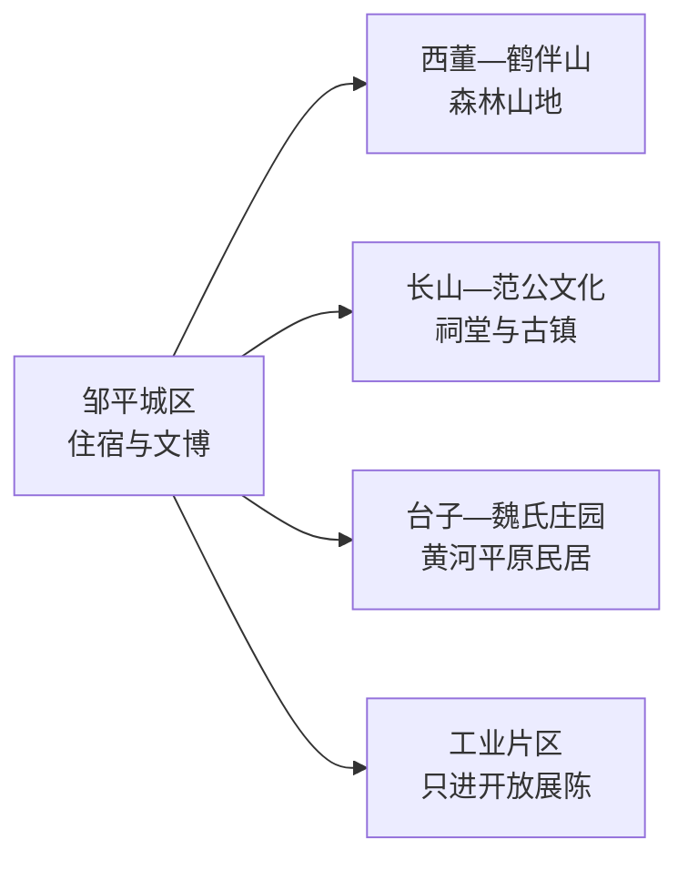
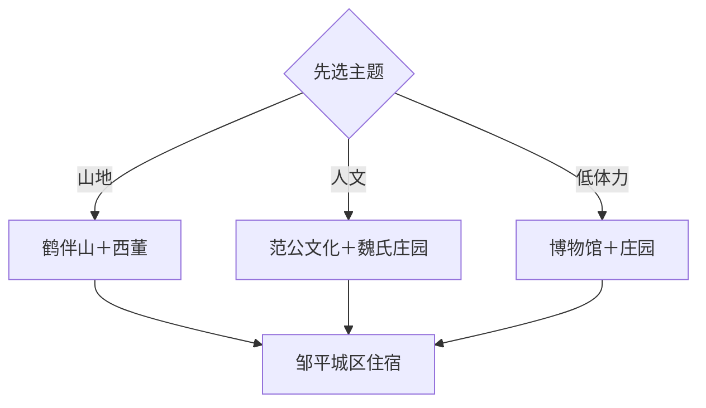

# 邹平旅行指南

邹平位于滨州西南、鲁中山地北缘，鹤伴山、范仲淹故里文化、魏氏庄园、古村与工业城市共同构成旅行主线。城区是住宿与换乘基地，鹤伴山和醴泉寺在南部山地，魏氏庄园位于台子镇方向；2 天可分别安排山地与人文线路。

本页绑定邹平同名聚居点 **GeoNames 1783641**。该点未进入项目固定 `cities500` 快照，只用于法定县级市覆盖，不改变固定 GeoNames 进度。

## 城市速览

| 项目 | 信息 |
|---|---|
| 主线 | 鹤伴山—范公文化—魏氏庄园—齐鲁古村—工业城市 |
| 停留 | 1 天选山地或人文线；2 天完成两条主线 |
| 住宿 | 邹平城区方便高铁、公路和跨方向接驳 |
| 交通 | 邹平站抵离后，远点以公交、出租或预约车辆为主 |
| 季节 | 春秋适合登山；花期按当期公告；夏季避开午后高温和雷雨 |
| 预算 | 城区消费平实，山地交通、讲解与乡村体验增加成本 |

## 城市格局与游览区域

南部山地与北部黄河平原方向相反，适合分日。魏桥等工业企业是城市背景，旅行内容采用正式开放的展馆、公共街区和预约参观，不进入生产车间、物流通道或能源设施。

## 主要景点

| 景点 | 区域 | 类型 | 核心体验 | 用时 | 环境 | 体力 | 预约风险 | 天气影响 | 优先级 |
|---|---|---|---|---:|---|---|---|---|---|
| 鹤伴山旅游景区 | 西董街道 | 森林与山地 | 森林步道、沟谷、山泉与登高 | 半天至1天 | 室外 | 中高 | 节假日中 | 很高 | A |
| 范公祠及范仲淹文化点 | 长山镇方向 | 祠堂与人物文化 | 范仲淹生平、乡土记忆与古镇环境 | 1–2小时 | 混合 | 低 | 高 | 中 | A |
| 魏氏庄园 | 台子镇方向 | 庄园与民居 | 清代城堡式民居、院落和黄河平原乡绅文化 | 2–3小时 | 混合 | 低中 | 高 | 中 | A |
| 醴泉寺 | 青阳镇方向 | 寺院与山地 | 古寺环境、范公文化线索和山前景观 | 1.5–2.5小时 | 混合 | 中 | 高 | 高 | B |
| 邹平市博物馆或公共文博 | 主城区 | 博物馆 | 地方历史、考古和城市发展 | 1.5–2小时 | 室内 | 低 | 高 | 低 | A |
| 唐李庵 | 西董方向 | 古建与山林 | 山间古建、碑刻和林地环境 | 1–2小时 | 混合 | 中 | 很高 | 高 | B |
| 樱花山当期开放区 | 南部山前 | 季节景观 | 春季花景和山地休闲 | 2–4小时 | 室外 | 中 | 花期高 | 很高 | C |
| 西董古村公开区域 | 南部乡村 | 村落 | 石屋、山地聚落和乡村生活 | 2小时 | 室外为主 | 中 | 中 | 中 | B |
| 黄河台子段公开节点 | 台子镇方向 | 河流与平原 | 黄河大堤、平原农业与河岸地理 | 1–2小时 | 室外 | 低 | 中 | 很高 | C |
| 工业文化正式开放单元 | 城区工业片区 | 工业展陈 | 纺织、铝业与县域工业城市背景 | 1–2小时 | 室内为主 | 低 | 很高 | 低 | C |

## 美食与餐饮

邹平可从酸浆豆腐、台子火烧、青阳炒鸡、锅子饼和鲁中家常菜切入。城区便于一人点主食，炒鸡和合菜适合共享；大豆、肉类、麸质、花生芝麻和油盐需求在点餐时说明。

## 经典行程

### 鹤伴山一日线
**路线**：城区—鹤伴山—乡村午餐—西董古村—返城。**逻辑**：山地和村落同向。**预约锚点**：景区开放。**休息**：景区服务区。**删除条件**：雷雨、高温或体力不足时缩短登高。

### 范公文化线
**路线**：城市文博—范公祠—长山公共街区。**逻辑**：先建立地方史，再理解人物文化。**预约锚点**：祠堂开放。**休息**：长山镇区。**删除条件**：场馆关闭时保留公共文化点。

### 魏氏庄园线
**路线**：城区—魏氏庄园—台子镇午餐—黄河公开节点。**逻辑**：民居与黄河平原社会相互补充。**预约锚点**：庄园开放。**休息**：台子镇。**删除条件**：水情或大风时取消河岸段。

### 古建山前线
**路线**：醴泉寺—唐李庵已开放区域—返城。**逻辑**：沿南部山前比较古建环境。**预约锚点**：逐处开放。**休息**：正式服务点。**删除条件**：道路或文保调整时只保留一处。

### 雨天文博线
**路线**：邹平公共文博—范公文化室内展陈—城区餐饮。**逻辑**：减少山地暴露。**预约锚点**：场馆开放。**休息**：城区。**删除条件**：极端天气预警时按属地安排暂停出行。

### 亲子低体力线
**路线**：博物馆—午餐—魏氏庄园短线。**逻辑**：车辆近达，院落步行可控。**预约锚点**：儿童参观。**休息**：馆区。**删除条件**：疲劳时只保留博物馆。

### 两日完整线
**路线**：首日鹤伴山—西董，次日范公祠—魏氏庄园。**逻辑**：山地与平原分日。**预约锚点**：两日开放和车辆。**休息**：连续住城区。**删除条件**：只有一天时按兴趣二选一。

## 住宿区域

邹平城区适合铁路抵离和跨方向移动。南部山地住宿适合已有车辆、希望早进山的旅行者；台子方向住宿适合黄河和平原专题，并需确认营业与返程。

## 市内交通

通过 12306 核对邹平站车次。鹤伴山、长山、台子分属不同方向，按日包车或自驾更高效。森林防火区、黄河行洪区、文保修缮区和工业生产区执行明确边界。

## 不同旅行者须知

山地旅行者优先鹤伴山；古建爱好者逐处确认开放；亲子和低体力旅行者采用博物馆加庄园；摄影旅行者按花期和公共机位安排。林区火险、雷雨、黄河水情与企业安全规则具有优先级。

## 行前核对

- 核对鹤伴山、魏氏庄园、范公文化点和古建开放。
- 通过 12306 核对邹平站，并落实南部山地和台子方向返程。
- 山地日核对雷雨、高温、森林火险和步道状态。
- 黄河与工业线路分别核对水情、公开区域和预约接待。

## 来源与更新记录

| 来源 | 支持内容 | 核验日期 |
|---|---|---|
| [鹤伴山景区](https://hebanshan.net/) | 景区位置、森林与主要游线 | 2026-09-04 |
| [山东省政协联谊报：邹平文旅](https://sdscxh.com/uploads/file/20251124/2abaa69984817fa04a910588e65f290b.pdf) | 范公文化、鹤伴山和全域旅游线索 | 2026-09-04 |
| [GeoNames 1783641](https://www.geonames.org/1783641/) | 邹平同名城市点与坐标 | 2026-09-04 |

