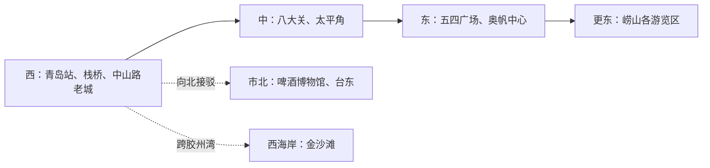

# 青岛旅行指南

青岛最清楚的旅行线索，是从胶州湾口的老城沿黄海海岸向东展开：栈桥与中山路连接港城起点，八大关和太平角把近代建筑放进林荫与海湾之间，五四广场和奥帆中心则呈现当代城市天际线。青岛啤酒博物馆位于老城北侧，需要单独接驳；崂山各游览区和胶州湾西岸的金沙滩都已超出中心城区连续游览范围。海岸很长、街道多坡，按片区单向移动比沿海岸反复折返更实用。

> 建议停留：3–5 天\
> 旅行关键词：山海老城、近代建筑、滨海步行、帆船、啤酒、海鲜、崂山\
> 主要体力：中等至较高步行；老城坡道、海岸长距离和崂山登高会额外增加负担\
> 最近研究：2026-07-30

## 城市速览

| 项目 | 旅行信息 |
|---|---|
| 主要旅行价值 | 沿一条由西向东的海岸城市轴，连续观察港口老城、近代建筑群、海水浴场、现代广场与奥运帆船遗产，并以啤酒工业和崂山山海景观补充城市性格 |
| 建议停留 | 2 天可完成老城与八大关—浮山湾主线；3 天可加入啤酒博物馆或海军博物馆；4–5 天适合另留一天给崂山，再按兴趣选择金沙滩或更多场馆 |
| 较舒适季节 | 晚春与秋季通常适合长距离户外，但海雾、冷暖变化和节假日客流仍会影响体验；夏季可下海的日期和海况需重查，冬季海岸风大、体感温度低 |
| 预算特点 | 中等；开放式街区、广场和海岸降低景点成本，滨海住宿、暑期房价、付费场馆、崂山景区交通与海上项目是主要支出变量 |
| 步行强度 | 中等至较高；老城坡路与石阶、八大关分散街巷、连续海岸线和大面积广场容易低估距离，崂山线路通常为高体力 |
| 主要天气风险 | 春夏海雾可能遮蔽海景并影响海上交通；夏秋需关注台风、暴雨、大风、海浪和风暴潮；冬季海风、寒潮及道路结冰会放大户外负担 |
| 独行旅行 | 老城步行、博物馆和公共交通方便独自安排；整盘海鲜和大份家常菜不易控制份量，可优先水饺、疙瘩汤、排骨米饭或明确小份菜 |
| 亲子旅行 | 海底世界、海军博物馆和正规海水浴场具有明确主题；海边必须持续看护，山地、礁石、长海岸和场馆高峰对儿童体力与安全要求高 |
| 长者与低体力旅行 | 可把每天限制在一个沿海片区，并用地铁或短途车辆连接；不宜将信号山登高、八大关全走、奥帆长栈道和崂山放进同一天 |
| 无障碍信息 | 青岛地铁公布了无障碍电梯、坡道、轮椅和预约协助服务；历史街区、沙滩、山地、码头及各景点入口之间的连续无障碍条件仍需逐处向官方确认 |

## 城市格局与游览区域

中心旅行区可理解为一条向东延伸的滨海带，再加两个需要离开主线的方向。青岛站、栈桥和中山路位于西端老城；八大关、太平角居中；五四广场和奥帆中心在更东的浮山湾。啤酒博物馆向北进入市北区，崂山继续向东并分成多个入口，金沙滩则在胶州湾西岸。下图只表示旅行关系，不表示实际距离。

| 区域 | 主要内容 | 游览特点 | 与其他区域的关系 |
|---|---|---|---|
| 青岛湾老城 | 青岛站、栈桥、中山路、大鲍岛、天主教堂周边 | 栈桥与中山路南北相接，老建筑、里院和商业街可连续步行；道路有坡度，内部场馆各自开放 | 从这里向东到海军博物馆、鲁迅公园尚需继续步行或短途接驳；到八大关不宜全程硬走 |
| 信号山—大学路 | 信号山、龙山路、龙江路、大学路及周边历史建筑 | 山坡、台阶和街巷密集，适合半日慢行；网红路口不是独立景点 | 与中山路同属大老城系统，但方向和高差不同，紧凑行程应二选一而非全部清点 |
| 汇泉湾—八大关—太平角 | 八大关建筑群、太平角、第二海水浴场及沿岸公共空间 | 林荫街道与海岸相互穿插，可连续走一段；花石楼等建筑是区域内部点位 | 位于老城与浮山湾之间，可沿海向东组织，但从栈桥走到奥帆中心已超出普通一日舒适步行量 |
| 浮山湾 | 五四广场、奥帆中心、情人坝及现代商务区 | 广场、港池和栈道尺度大，适合傍晚；帆船、游船和夜景均属动态项目 | 与八大关可同日单向衔接；返回老城或前往崂山应使用地铁、公交或车辆 |
| 登州路—台东 | 青岛啤酒博物馆、台东餐饮与市北生活区 | 馆舍参观与餐饮方便组合，但不在海岸连续步行线上 | 可从老城向北接驳后继续住宿地，不应夹在八大关与奥帆之间反复绕行 |
| 崂山风景区 | 巨峰、太清、仰口—华严、九水等不同游览区 | 入口、换乘中心、索道、登山强度和景观主题不同；一次只选一条线最稳妥 | 距中心城区远，至少留完整一天；不能把“大河东”“仰口”“九水”当成同一入口 |
| 西海岸—金沙滩 | 黄岛、金沙滩及胶州湾西岸度假区 | 跨湾后才进入另一片城区，沙滩活动受季节、海况和大型活动影响 | 地铁、公路或轮渡均可能承担跨湾交通，但实时可用性不同；原则上按独立半日或一日处理 |

## 主要景点

优先级用于安排时间，不代表绝对排名：**A** 为首访核心，**B** 为按兴趣补充，**C** 为远郊、季节性或通常需要独立半天以上的目的地。海水浴场、码头、广场、网红路口和观景平台如果只是路线中的停留点，不单独计入城市景点完成率。

### 老城与西部海岸

| 景点 | 区域 | 类型 | 主要看点 | 建议用时 | 室内外 | 体力 | 预约风险 | 天气影响 | 优先级 |
|---|---|---|---|---:|---|---|---|---|---|
| 栈桥—中山路—大鲍岛老城 | 青岛湾老城 | 城市地标、历史街区 | 栈桥从中山路南端伸入青岛湾，中山路与里院街区呈现港城商业历史；栈桥、回澜阁外部、中山路和大鲍岛按一组城市体验记录 | 3–5 小时 | 室外为主 | 中 | 低；内部场馆另计 | 高 | A |
| 信号山—龙山路—大学路 | 老城东部山坡 | 公园、历史街巷 | 从较高位置理解红瓦老城与海湾关系，再进入龙山路、龙江路和大学路街巷；重点是地形与街区，不是逐个网红墙打卡 | 2–4 小时 | 室外为主 | 中高 | 低至中 | 高 | B |
| 中国人民解放军海军博物馆 | 莱阳路、小青岛附近 | 军事博物馆 | 海军历史、舰艇及室内外展区；与小青岛、鲁迅公园相邻，但馆方预约和安检决定游览节奏 | 3–4 小时 | 混合 | 中 | 高 | 中高 | B |
| 青岛海底世界 | 鲁迅公园—汇泉湾 | 海洋科普场馆 | 水族展示与海洋科普，适合亲子和普通雨天；表演、展区与客流会动态变化 | 2.5–4 小时 | 室内为主 | 中 | 中高 | 低至中 | B |

### 八大关与浮山湾

| 景点 | 区域 | 类型 | 主要看点 | 建议用时 | 室内外 | 体力 | 预约风险 | 天气影响 | 优先级 |
|---|---|---|---|---:|---|---|---|---|---|
| 八大关—太平角 | 汇泉湾至太平湾 | 历史建筑群、滨海街区 | 林荫街道、近现代别墅与海湾关系；花石楼、第二海水浴场、太平角观景点属于同一片区内部选择 | 3–5 小时 | 室外为主 | 中 | 低至中 | 高 | A |
| 五四广场—奥帆中心 | 浮山湾 | 城市广场、奥运遗产、滨海空间 | “五月的风”、浮山湾城市界面、奥帆赛场遗产与港池；情人坝和港内栈道作为内部节点，不重复计数 | 2.5–4 小时 | 室外为主 | 中 | 低；海上项目另计 | 高 | A |

### 工业文化

| 景点 | 区域 | 类型 | 主要看点 | 建议用时 | 室内外 | 体力 | 预约风险 | 天气影响 | 优先级 |
|---|---|---|---|---:|---|---|---|---|---|
| 青岛啤酒博物馆 | 市北区登州路 | 工业遗产、企业博物馆 | 青岛啤酒历史、酿造工艺与早期厂房；品饮只是部分体验，未成年人、驾驶者及不饮酒者应以当期参观规则和无酒精选择为准 | 2–3 小时 | 室内为主 | 低至中 | 中高 | 低 | A |

### 远郊与跨湾目的地

| 景点 | 区域 | 类型 | 主要看点 | 建议用时 | 室内外 | 体力 | 预约风险 | 天气影响 | 优先级 |
|---|---|---|---|---:|---|---|---|---|---|
| 崂山风景区（单选一条游览线） | 崂山区东部 | 山海景区、道教文化、峡谷 | 巨峰偏登高，太清偏山海与人文，仰口—华严兼具山海和台阶，九水偏峡谷水景；各线不按四个城市景点重复计算 | 7–11 小时，含往返 | 室外为主 | 中高至高 | 高 | 高 | C |
| 金沙滩 | 西海岸新区 | 沙滩、海湾 | 胶州湾西岸的大型沙滩与度假空间；“到海边”不等于海况允许下水，开放和警示旗决定游泳条件 | 5–9 小时，含跨湾 | 室外 | 中 | 低至中；活动期高 | 高 | C |

崂山的入口选择应先于购票和交通：

| 游览线 | 常用集散方向 | 体验重点 | 体力与边界 |
|---|---|---|---|
| 巨峰 | 大河东游客服务中心方向 | 主峰登高、山体视野 | 登高和台阶多，索道也不能消除全部步行；云雾、大风和雷电会显著降低可行性 |
| 太清 | 大河东南线方向 | 山海公路、太清宫及沿海人文 | 景点分散并依赖景区交通；宗教场所礼仪和具体开放需重查 |
| 仰口—华严 | 仰口东线方向 | 海湾、山路、岩石地貌与寺院 | 与大河东不是同一入口；狭窄台阶、洞道或索道运营会改变线路，低体力者需谨慎 |
| 九水 | 九水游客服务中心方向 | 峡谷、溪流和季节水景 | 水量受季节与降雨影响，强降雨时存在封闭风险；不能与南线按地图距离顺接 |

景点边界以片区和管理范围为准：栈桥、中山路、大鲍岛构成一条老城轴；八大关、花石楼、第二海水浴场和太平角属于同一片区；五四广场、奥帆中心港池与情人坝按一个现代滨海项目记录；崂山各游览区是同一大型风景区下的独立线路，完成一条不代表“走完崂山”。

## 美食与餐饮

青岛餐桌以胶东海鲜、面食和家常菜为主。海鲜可以清蒸、原汁、辣炒或入汤，份量常按盘、条、只或重量计算；先问清品种、时价、计价单位、烹饪费和实际份量，再决定是否点整鱼、整蟹或海鲜拼盘。青岛啤酒与海鲜经常同时出现，但饮酒不是体验青岛饮食的必要条件。

| 菜品或餐饮类型 | 常见区域 | 一个人用餐与常见份量 | 风味、过敏原与饮食限制 | 排队风险与替代方法 |
|---|---|---|---|---|
| 辣炒蛤蜊或原汁蛤蜊 | 老城、市北居民区、正规海鲜餐馆 | 常为一盘，适合一至两人共享；独行应先问重量与小份 | 贝类过敏风险高，辣炒版常含辣椒、蒜及可能含大豆或小麦的酱料；贝壳不开口或有异味应停止食用 | 热门街区晚餐排队高；选择明码标价、翻台稳定的同类餐馆即可，不必追单一名店 |
| 鲅鱼水饺 | 胶东菜馆、水饺店 | 通常按盘或按个数点，适合单人，也容易共享 | 含鱼类和小麦，馅料可能含蛋、猪油或韭菜；鱼类过敏、素食与无麸质需求需逐店确认 | 名店高峰等待明显；以现包、明确鲅鱼馅和份量的社区水饺店替代 |
| 海鲜疙瘩汤 | 家常菜馆、海鲜餐馆 | 一碗可单人用餐，大盆适合共享；先确认容器大小 | 小麦疙瘩配蛤蜊、虾或其他海鲜，可能含蛋；甲壳类、贝类和麸质过敏风险需确认 | 通常比整盘海鲜更易点单；热门店排队时可在胶东家常菜馆寻找同类汤品 |
| 大虾烧白菜等胶东家常海鲜 | 胶东菜馆、社区餐馆 | 常为共享菜，独行先问小份或改点套餐 | 鲜咸家常，可能含虾、贝类、大豆和小麦调味；不一定辣 | 景区一线价格与份量差异大；查看明码标价和当日菜牌，按同类菜替换 |
| 海菜凉粉 | 老城小吃店、胶东菜馆 | 一小盘适合单人或共享，常作凉菜 | 海菜制作，口感清凉；蒜汁、醋和酱油常见，可能含大豆、小麦并与海鲜共用操作台 | 通常无需专程排队；售罄时可换其他胶东凉菜，不把单店当唯一答案 |
| 排骨米饭 | 市区家常快餐与老城区 | 一份即为单人正餐，适合不吃海鲜时使用 | 猪肉与米饭为主，汤汁可能含大豆、小麦，素食者不适用 | 用餐高峰周边居民店选择多，可作为海鲜餐之间的低决策成本替代 |
| 青岛啤酒与无酒精饮品 | 啤酒博物馆周边、餐馆和全城酒吧 | 啤酒按杯、瓶或扎出售；单人应控制总量并同时进食饮水 | 含酒精和谷物，可能不适合未成年人、孕期、服药者、驾驶者及麸质敏感者；可选择水、茶或明确标识的无酒精饮品 | 节庆与夜间热门区排队、最低消费和价格会变化；无需为“原浆”跨城追店，先核对来源、容量和保鲜条件 |

购买或加工海鲜时，应确认“斤”是否按 500 克计、称重前后状态、加工方式与费用，并索取清晰账单。对鱼类、甲壳类或贝类严重过敏者，蒸锅、炒锅、油锅和调味料的交叉接触风险不可忽略；仅凭“没点海鲜”不能推断厨房无海鲜过敏原。

## 经典行程

### 一日经典路线

**路线**：栈桥 → 中山路—大鲍岛老城 → 交通接驳至八大关 → 太平角短段 → 五四广场—奥帆中心

- **串联逻辑**：按海岸由西向东移动，一天内只前进、不返回老城；老城、近代滨海街区和现代浮山湾各取一段，片区之间使用地铁、公交或短途车辆，不把整条海岸当成连续步道。
- **预约锚点**：无固定预约锚点；若进入花石楼等收费建筑、参加帆船或游船项目，则以该项目的官方时段为锚点。
- **休息安排**：中山路室内餐饮、八大关外围咖啡或商业设施、香港中路商圈可承担休息；海边长椅不能替代避风、避雨和降温空间。
- **时间不足时**：先删太平角向东的长步行，再把奥帆中心缩成五四广场附近短段；至少保留栈桥—中山路老城与八大关两个不同城市层次。

### 两日城市路线

**第 1 天**：栈桥 → 中山路—大鲍岛 → 信号山或海军博物馆二选一\
**第 2 天**：八大关 → 太平角 → 交通接驳 → 五四广场—奥帆中心

- **串联逻辑**：第一天集中在老城西段，并根据预约或体力只选山地街巷、海军主题中的一个；第二天沿滨海城市轴向东，不再返回旧城补点。
- **预约锚点**：选择海军博物馆时，它是首要预约锚点；选择信号山时，需核对园内收费或限流设施，第二天的海上项目另行预约。
- **休息安排**：第一天在中山路或大学路周边安排午餐，第二天在太平角与香港中路之间安排室内长休息，避免连续暴露在海风和日晒中。
- **时间不足时**：第一天先删信号山或海军博物馆中的备选项，第二天先删奥帆长栈道；不以加速步行补回所有点位。

### 三日深度路线

**第 1 天**：栈桥—中山路老城 → 青岛啤酒博物馆 → 台东用餐\
**第 2 天**：八大关—太平角 → 五四广场—奥帆中心\
**第 3 天**：崂山预先选定的一条游览线

- **串联逻辑**：第一天由老城向北一次移动，第二天专注中心滨海带，第三天完整留给山地，避免在崂山日再追加市区预约。若更重视海军历史，可用海军博物馆替换第一天啤酒博物馆。
- **预约锚点**：崂山具体游览线和入园时段最先确定，其次是青岛啤酒博物馆或海军博物馆；根据预约结果调换前两天顺序。
- **休息安排**：第一天以馆舍和台东餐饮区恢复体力；第二天午后安排室内休息；第三天使用游客中心和官方休息点，不把索道排队视作恢复时间。
- **时间不足时**：第三天无法保证完整往返时整日删除崂山；市区两天先删奥帆远端栈道和老城次要街巷。

### 雨天路线

**路线**：青岛啤酒博物馆 → 台东室内午餐 → 青岛海底世界

- **适用条件**：仅适用于普通降雨。台风、暴雨、大风、海雾导致交通异常或官方要求避险时，即使场馆在室内也不应跨城赶场；崂山、礁石、沙滩和海上项目全部取消。
- **预约锚点**：两个付费场馆的入场时段分别核对，优先锁定较难改签的一处；馆际交通要留出雨天拥堵余量。
- **休息安排**：把午餐放在台东或换乘便利的室内商业区，湿滑天气减少老城坡路和沿海步行。
- **时间不足时**：先删较远或尚未购票的第二个场馆；只参观啤酒博物馆或海底世界均可形成完整半日。

### 亲子或低体力路线

**亲子路线**：青岛海底世界 → 鲁迅公园近段或正规海水浴场岸上观察 → 室内午餐 → 提前返回\
**低体力路线**：地铁抵达五四广场附近 → 广场短段 → 车辆接驳至奥帆中心最近可用入口 → 港池近段 → 原入口附近离开

- **减负方式**：亲子路线只在海况、天气和现场管理允许时接近水边，儿童全程由成人看护；低体力路线不走五四广场至情人坝的完整往返，也不默认所有滨海栈道、沙滩和场馆入口连续无障碍。
- **预约锚点**：亲子路线以海底世界为锚点；低体力路线无固定预约，但如参加游船或帆船活动，必须先向运营方确认上下船和无障碍协助条件。
- **休息安排**：场馆、香港中路商业设施或奥帆中心附近室内空间作为休息点；海边遇强风、低温或暴晒时立即缩短户外段。
- **时间不足时**：亲子路线先删海边延伸，低体力路线只保留五四广场或奥帆中心其中一处，不用连续接驳补齐两处。

### 崂山一日路线

**路线**：中心城区 → 预先选定的游客服务中心 → 巨峰、太清、仰口—华严或九水中的一条线 → 原集散点返回

- **适用条件**：先按体力、季节水量、宗教人文或山海视野选线，再买对应门票和交通；不要只搜索“崂山门票”后才决定入口。雷电、暴雨、大风、山火风险或景区关闭时整段取消。
- **预约锚点**：具体游览区、入园时段、景区交通与索道；导航名称必须与票面入口一致。
- **休息安排**：游客中心、索道站和官方服务点是主要补给位置，自备饮水、简餐、防晒和保暖层；山路上不保证连续商店。
- **时间不足时**：不在不同游览区之间临时换线；晚出发直接删除整段，改用市区单一片区。

### 金沙滩跨湾路线

**路线**：中心城区 → 地铁或公路跨胶州湾 → 金沙滩 → 西海岸用餐休息 → 按原定交通返回

- **串联逻辑**：金沙滩位于黄岛，不是栈桥沿海步道的延伸。跨湾后集中在沙滩与附近服务区，不再赶回八大关或崂山。
- **预约锚点**：无固定景点预约；若遇啤酒节、大型活动、海上项目或自驾停车管理，则以活动票务、停车和返程交通为锚点。
- **休息安排**：使用浴场正式服务设施和西海岸室内餐饮；在开放期、警示旗允许且有救生管理的正规区域活动，不在非开放海域下水。
- **时间不足时**：删除整个跨湾行程，不压缩成“到沙滩拍照后立刻返回”；海雾、台风、强风浪或浴场关闭时改为中心城区室内路线。

## 住宿区域

| 区域 | 优点 | 缺点 | 适合人群 | 交通特点 |
|---|---|---|---|---|
| 青岛站—中山路 | 抵达老城方便，步行可到栈桥与历史街区，餐饮选择多 | 暑期和节假日拥挤，坡路、老建筑隔音及街区施工差异大 | 首访、独行、重视老城与清晨海岸者 | 青岛站铁路与地铁衔接便利；去八大关、浮山湾需向东移动 |
| 汇泉湾—八大关外围 | 靠近海岸、鲁迅公园、海底世界与八大关，环境相对舒展 | 价格常受季节影响，部分住宿离地铁或餐饮区仍有坡路 | 海景、摄影、亲子或慢节奏旅行者 | 公交和车辆更直接；选房时核对具体入口与地形，不只看直线距离 |
| 香港中路—五四广场 | 商业、地铁和餐饮集中，兼顾八大关、奥帆中心与跨区移动 | 商务区感较强，旺季滨海房价高，广场尺度大 | 多日首访、需要稳定交通与室内设施者 | 适合向西回老城、向东去崂山方向，机场和北站也可轨道换乘 |
| 奥帆中心—浮山湾东侧 | 傍晚海景与现代滨海空间便利 | 距老城较远，热门海景住宿价格高，活动日交通管制多 | 重视现代海岸、夜景和海上活动者 | 地铁加步行或短途接驳；大型活动和游船运营需重查 |
| 台东—登州路 | 靠近啤酒博物馆与本地餐饮，价格通常比一线海景区灵活 | 不在海岸主线，前往八大关和奥帆需乘车 | 美食、夜间市区活动、预算相对有限者 | 可连接老城和市北，但不要把啤酒街当作步行到海边的起点 |
| 青岛北站—李村方向 | 铁路、地铁换乘与早晚车次方便，住宿选择广 | 离传统旅行核心较远，每天往返会增加通勤 | 以青岛北站进出、短住或次日转车者 | 依赖地铁进入市南；机场方向换乘相对清楚，实时线路仍需核对 |
| 西海岸—金沙滩 | 适合沙滩度假、大型活动和西岸慢住 | 去老城、八大关和崂山均需跨湾，不能每天当作近距离往返 | 以金沙滩或西海岸为主要目的者 | 地铁、公路和部分水运承担跨湾交通；末班与活动管制影响大 |

## 市内交通

青岛的枢纽名称容易混淆：青岛站靠近栈桥，青岛北站在主城区北部，青岛西站位于西海岸；胶东国际机场又在胶州市方向，距离传统市南景点较远。订票和住宿时先确认实际站名，再估算到第一站的时间。

| 场景 | 建议与取舍 | 行前需要重查的内容 |
|---|---|---|
| 胶东国际机场抵达 | 机场是航空、铁路、地铁和公路综合枢纽，可按住宿位置选择轨道、铁路、机场巴士或出租车；深夜不能假设公共交通配置与白天相同 | 航站楼、航班、地铁与铁路时刻、机场巴士、夜间上客点及施工 |
| 青岛站抵达 | 最接近栈桥和中山路，适合直接进入老城；站前坡路、人流和施工会影响拖行李体验 | 出站口、地铁换乘、寄存、站前交通管制和住宿实际步行路线 |
| 青岛北站抵达 | 适合换乘城市轨道和机场方向，铁路班次选择多；到市南核心仍需较长通勤 | 到发站、地铁首末班、换乘通道和大型活动延时 |
| 青岛西站抵达 | 位于西海岸，适合黄岛与金沙滩方向；若住宿在市南，需预留跨湾时间 | 铁路车次、公交或地铁衔接、跨湾拥堵及夜间交通 |
| 中心城区跨片区 | 地铁适合连接老城、香港中路、市北和部分崂山集散方向；公交更贴近滨海线，但容易受旺季拥堵影响 | 最新线网、首末班、施工、活动封站、无障碍电梯出口 |
| 沿海步行 | 每个片区内部适合步行，片区之间应穿插公交、地铁或短途车辆；沿海“看得见”不等于走得近 | 海岸封闭、步道施工、潮汐、风浪、照明和道路过街条件 |
| 前往崂山 | 先到与票面一致的游客服务中心，再使用景区交通；大河东、仰口、九水不能互相替代 | 游览区开放、地铁或公交、观光车、索道、停车和返程末班 |
| 跨胶州湾去西海岸 | 地铁通常比旺季自驾更稳定，公路适合多人和行李；水运更像观光产品，不能默认每日同班次通勤 | 线网、末班、隧道或大桥交通、轮渡与旅游船、活动管制 |
| 海上交通与活动 | 奥帆、栈桥码头等可能开行游船或帆船项目，但航线、安检、实名制和上下船码头会调整 | 海雾、风浪、停复航、票务、救生要求、无障碍上下船条件 |
| 自驾 | 老城、八大关和前海一线旺季停车紧张，公共交通通常更省心；自驾更适合郊区或多人行李 | 限行、单行、景区预约停车、啤酒节等大型活动交通组织及饮酒后代驾 |

## 不同旅行者须知

| 旅行维度 | 可行条件 | 主要取舍 | 需额外核对 |
|---|---|---|---|
| 独行旅行 | 地铁、街区、小份主食和博物馆容易独立安排 | 整鱼、整蟹和海鲜拼盘份量大；崂山晚返、夜间沙滩和跨湾末班不宜现场临时决定 | 小份菜、计价单位、末班交通、远郊返程和场馆安检 |
| 亲子旅行 | 海底世界、海军博物馆和正规浴场具备鲜明主题，可每天只选一处主项目 | 海边持续看护、场馆排队、长海岸和崂山山路都会迅速消耗体力 | 儿童票与预约、推车规则、救生服务、浴场开放和警示旗 |
| 长者或低体力旅行 | 采用“一片区 + 短接驳 + 室内长休息”，可覆盖老城外观与浮山湾短段 | 老城坡道、信号山台阶、八大关分散道路、沙滩软地和崂山登高难以完全消除 | 最近下客点、电梯出口、场馆轮椅、景区观光车与连续无障碍路线 |
| 无障碍需求 | 地铁官方提供无障碍电梯、坡道、轮椅与爱心预约服务 | 地铁出口到历史街区、沙滩、码头或景点入口的“最后一段”可能有坡道、台阶、沙地和绕行 | 出发前联系地铁和场馆确认电梯出口、升降设备、无障碍卫生间、轮椅服务；崂山索道和游船需向运营方确认，不能推断可用 |
| 摄影旅行 | 老城高低视角、八大关树影、太平角礁岸和浮山湾夜景题材丰富 | 海雾会让远景完全消失，强风、潮湿盐雾和游客密度影响器材与构图 | 日出日落、潮汐、海雾、三脚架、闪光灯、无人机、商业拍摄和军事场馆规定 |
| 预算有限 | 老城外观、广场、部分滨海公共空间和公共交通可控制成本 | 暑期住宿、海鲜时价、崂山内部交通和跨湾打车容易扩大预算 | 明码标价、计价单位、优惠证件、退改规则、场馆联票和交通费用 |
| 晚出发或紧凑行程 | 中山路—栈桥、五四广场—奥帆中心或台东—啤酒博物馆周边可单独构成半日 | 不临时加入崂山、金沙滩或长距离海岸；热门场馆晚到可能无法入场 | 最晚入场、末班地铁、夜间照明、海上项目停航与活动管制 |
| 海雾、台风、冬季大风 | 海雾天可转老城街巷或馆舍，冬季缩短海岸暴露并增加防风层 | 台风、暴雨、大浪和风暴潮期间取消崂山、沙滩、礁石、栈道与海上活动；海雾时不要为观景反复等待或冒险靠海 | 气象与海洋预警、浴场警示旗、景区关闭、停复航、道路结冰和机场铁路运行 |

## 行前核对

| 核对事项 | 为什么需要重查 | 建议核对时间 | 官方入口 |
|---|---|---|---|
| 栈桥、中山路及老城内部场馆 | 栈桥维护、街区施工、展馆开放和大型活动会改变步行线；街区外观开放不代表所有建筑可进入 | 排入路线前、到访前一日 | [青岛市文化和旅游局](https://www.qingdao.gov.cn/zwgk/xxgk/whly/)；[青岛政务网：栈桥与老城](https://www.qingdao.gov.cn/zwgk/xxgk/whly/gkml/gzxx/202601/t20260126_10481040.shtml) |
| 信号山及八大关内部建筑 | 园内收费设施、建筑开放、季节活动和客流管制会变化 | 到访前一日及当天 | [青岛政务网：信号山](https://www.qingdao.gov.cn/yfqd/qdwl/cjfw/wyqps/202009/t20200909_519804.shtml)；各建筑官方渠道 |
| 海军博物馆预约与安检 | 该馆仍实行实名预约，证件、放票、入馆时段、室外舰艇开放和安检规定会调整 | 确定日期后了解放票规则，预约后于前一日复查 | [中国人民解放军海军博物馆](https://hjbwg.com/) |
| 青岛海底世界票务、展区与表演 | 票种、入场时段、表演和夜场会调整，节假日客流高 | 购票前、到访前一日 | [青岛海底世界](https://www.qdhdworld.com/) |
| 青岛啤酒博物馆票务与参观规则 | 分时票、体验项目、品饮内容、年龄和证件要求具有时效性 | 购票前、到访前一日 | [青岛啤酒博物馆](https://www.tsingtaomuseum.com/) |
| 五四广场、奥帆中心与海上项目 | 帆船、游船、活动、夜景和码头可能因天气或赛事调整 | 订项目时、到访前一日及当天 | [青岛政务网：扬帆青岛](https://www.qingdao.gov.cn/yfqd/)；运营方官方渠道 |
| 崂山游览区、入口与景区交通 | 不同游览区门票、换乘中心、观光车、索道和停车并不通用，天气会造成分区关闭 | 订票前、出发前三日及当天清晨 | [崂山风景区](https://www.qdlaoshan.cn/)；[官方购票与交通提示](https://dp.qdlaoshan.cn/fore/index?code=031375) |
| 海水浴场与金沙滩 | 游泳服务、救生网、警示旗、水上项目和大型活动按季节及海况调整；到沙滩不等于可以下海 | 到访前三日及当天入水前 | [青岛市城市管理局：海水浴场安全](https://www.qingdao.gov.cn/zwgk/xxgk/csgl/ywfl/hygl/202511/t20251104_10354086.shtml)；现场警示旗和广播 |
| 地铁、公交与跨湾交通 | 线网、首末班、施工、活动延时、胶州湾道路和轮渡会变化 | 出发前一周、前一日及乘车当天 | [青岛地铁](https://www.qd-metro.com/)；[青岛市交通运输局](https://qdjt.qingdao.gov.cn/) |
| 铁路到发站 | 青岛站、青岛北站和青岛西站位置差异大，车次与检票安排会变 | 订票时、出发前一日及当天 | [中国铁路 12306](https://www.12306.cn/) |
| 胶东国际机场与接驳 | 航班、地铁、铁路、机场巴士、航站楼交通和夜间安排会调整 | 订票时、抵离前一日及当天 | [青岛政务网：胶东机场交通指南](https://www.qingdao.gov.cn/zwgk/xxgk/gaj/ywflxx_561/jtgl/202108/t20210816_3219276.shtml)；承运航空公司 |
| 海雾、台风、暴雨、大风与寒潮 | 预警会影响景区、海岸、浴场、索道、海上交通、机场和铁路；海雾可能使能见度显著下降 | 出发前三日、每日清晨及每次海上或山地活动前 | [青岛市气象局](https://sd.cma.gov.cn/qdsqxj/)；[青岛政务网：气象灾害预案](https://www.qingdao.gov.cn/zwgk/xxgk/bgt/gkml/gwfg/202112/t20211210_3978460.shtml) |
| 海浪、风暴潮、潮汐与近岸生态 | 大浪、风暴潮、潮位及季节性浒苔会改变沙滩、礁石、码头与海上活动条件 | 到访前三日及当天 | [青岛市海洋发展局](https://ocean.qingdao.gov.cn/)；浴场、景区和海事部门公告 |
| 无障碍连续路线 | 地铁站有服务不代表出口至景点的全程无台阶；历史建筑、沙地、索道和码头差异大 | 预约前联系运营方，到访当天再次确认 | [青岛地铁无障碍服务](https://www.qd-metro.com/news/view.php?id=5815)；各场馆或景区官方客服 |
| 入境、签证与证件规则 | 仅跨境旅行需要；适用条件随国籍、口岸、停留方式和政策变化 | 购票前及出发前 | [国家移民管理局](https://www.nia.gov.cn/)；承运航空公司官方渠道 |
| 餐厅、海鲜时价与啤酒活动 | 营业状态、品种、计价单位、加工费、节庆和酒精服务会变化 | 点餐前及活动当天 | 餐厅或主办方官方渠道，以现场明码标价、菜单和账单为准 |

## 来源与更新记录

### 主要来源

| 来源 | 类型 | 支持内容 | 核验日期 |
|---|---|---|---|
| [青岛政务网：自然环境](https://www.qingdao.gov.cn/yfqd/qdgk/zrhj/202009/t20200903_67.shtml) | 政府 | 海洋性气候、海雾、冬季风大及季节气候背景 | 2026-07-30 |
| [青岛市城市风貌保护管理办法](https://www.qingdao.gov.cn/zwgk/xxgk/cxjs/gkml/gwfg/202010/t20201018_414663.shtml) | 政府规章 | 老城、八大关—太平角、栈桥、信号山等历史风貌范围 | 2026-07-30 |
| [青岛政务网：栈桥、花石楼与太平角](https://www.qingdao.gov.cn/zwgk/xxgk/whly/gkml/gzxx/202601/t20260126_10481040.shtml) | 政府文旅信息 | 栈桥与中山路位置关系、花石楼和太平角历史背景 | 2026-07-30 |
| [青岛政务网：百年中山路](https://www.qingdao.gov.cn/ywdt/qsdt/202607/t20260721_10682077.shtml) | 政府 | 中山路与栈桥、里院和近代商业建筑的关系 | 2026-07-30 |
| [青岛政务网：八大关—太平角](https://www.qingdao.gov.cn/zwgk/xxgk/whly/gkml/gzxx/202604/t20260407_10555314.shtml) | 政府文旅信息 | 建筑群、海岸和街区作为一个游览片区 | 2026-07-30 |
| [青岛政务网：扬帆青岛](https://www.qingdao.gov.cn/yfqd/) | 政府旅游信息 | 五四广场、奥帆中心、中山路、金沙滩等景点属性 | 2026-07-30 |
| [中国人民解放军海军博物馆](https://hjbwg.com/) | 场馆 | 场馆地址、预约类型与动态公告入口 | 2026-07-30 |
| [青岛市文旅局：场馆预约政策](https://www.qingdao.gov.cn/zwgk/xxgk/whly/ywfl/202408/t20240828_8203870.shtml) | 政府文旅部门 | 海军博物馆仍需实名预约及其他市属场馆政策背景 | 2026-07-30 |
| [青岛政务网：海底世界](https://www.qingdao.gov.cn/yfqd/qdwl/cjfw/wyqtsjd/202009/t20200910_521986.shtml) | 政府旅游信息 | 海底世界位置、场馆构成与海洋科普属性 | 2026-07-30 |
| [青岛啤酒博物馆](https://www.tsingtaomuseum.com/) | 场馆 | 博物馆介绍、票务、预约与动态参观入口 | 2026-07-30 |
| [青岛啤酒官网：博物馆](https://www.tsingtao.com.cn/MT/product/FashionMuseum.html) | 企业官网 | 登州路厂址、啤酒历史与酿造工艺展示属性 | 2026-07-30 |
| [崂山风景区](https://www.qdlaoshan.cn/) | 景区 | 分区公告、开放、索道、交通与票务入口 | 2026-07-30 |
| [崂山风景区：官方购票与交通提示](https://dp.qdlaoshan.cn/fore/index?code=031375) | 景区票务 | 大河东、仰口等入口及景区观光交通边界 | 2026-07-30 |
| [崂山风景名胜区总体规划](https://qdlaoshan.cn/upload/file/20220511/20220511152440_50265.pdf) | 景区规划 | 巨峰、太清、仰口、九水等不同游览区构成 | 2026-07-30 |
| [青岛政务网：金沙滩](https://www.qingdao.gov.cn/yfqd/qdwl/cjfw/wyqhb/202009/t20200902_518754.shtml) | 政府旅游信息 | 金沙滩位于胶州湾西岸黄岛区及跨湾空间关系 | 2026-07-30 |
| [青岛市城市管理局：海水浴场安全提醒](https://www.qingdao.gov.cn/zwgk/xxgk/csgl/ywfl/hygl/202604/t20260430_10581742.shtml) | 政府主管部门 | 非开放期不得下海、潮汐礁石风险和现场警示要求 | 2026-07-30 |
| [青岛市气象灾害应急预案](https://www.qingdao.gov.cn/zwgk/xxgk/bgt/gkml/gwfg/202112/t20211210_3978460.shtml) | 政府与气象资料 | 台风、暴雨、大风、海雾、寒潮、结冰及其交通影响 | 2026-07-30 |
| [青岛地铁](https://www.qd-metro.com/) | 交通运营方 | 线网、运营公告与乘车信息入口 | 2026-07-30 |
| [青岛地铁：无障碍服务](https://www.qd-metro.com/news/view.php?id=5815) | 交通运营方 | 无障碍电梯、坡道、轮椅、无障碍窗口和预约协助 | 2026-07-30 |
| [青岛政务网：胶东国际机场交通](https://www.qingdao.gov.cn/zwgk/xxgk/gaj/ywflxx_561/jtgl/202108/t20210816_3219276.shtml) | 政府交通信息 | 机场铁路、地铁和公路综合交通结构 | 2026-07-30 |
| [青岛政务网：青岛美食](https://www.qingdao.gov.cn/zwgk/xxgk/whly/gkml/gzxx/202407/t20240730_8154491.shtml) | 政府文旅信息 | 蛤蜊疙瘩汤、辣炒蛤蜊、大虾烧白菜等代表海鲜菜 | 2026-07-30 |
| [青岛政务网：胶东与海洋物产](https://qdwmsj.qingdao.gov.cn/html/shijianzixun/2025/0108/8562.html) | 政府公共文化信息 | 鲅鱼水饺、海菜凉粉、青岛蛤蜊等地方饮食 | 2026-07-30 |
| [GeoNames：Qingdao](https://www.geonames.org/1797929/qingdao.html) | 开放地名数据 | GeoNames 城市点 ID 及中国—山东—青岛层级 | 2026-07-30 |
| [Wikidata：Q170322](https://www.wikidata.org/wiki/Q170322) | 开放结构化数据 | 青岛实体消歧及 GeoNames ID 对应关系 | 2026-07-30 |

### 更新记录

| 日期 | 更新内容 |
|---|---|
| 2026-07-30 | 首次完成滨海城市轴、景点组合边界、崂山入口区分、跨湾尺度、美食与过敏原、住宿交通、海雾与台风风险、无障碍证据及官方来源研究 |
