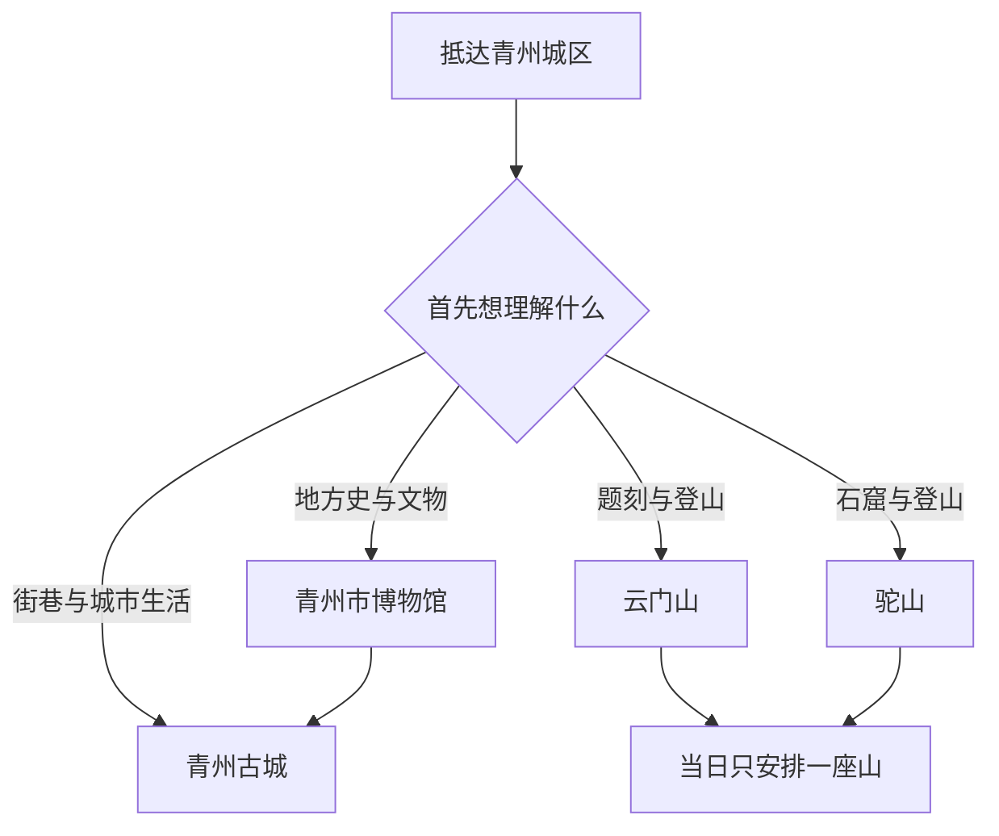
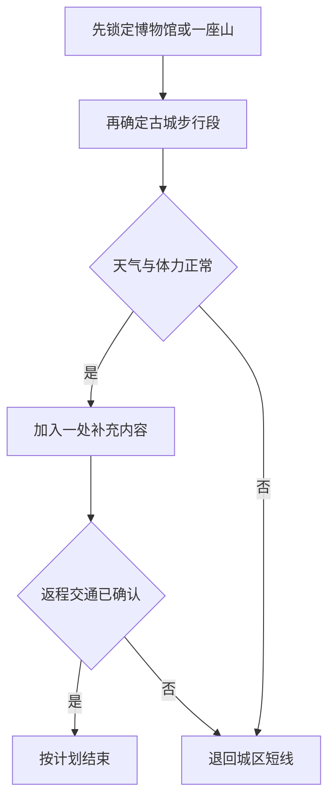

# 青州旅行指南

青州是潍坊市代管的县级市，也是一座需要把“古城”“博物馆”和“山岳石刻”拆开理解的历史文化目的地。青州古城适合步行认识街巷、园林与多元社区，青州市博物馆用出土文物补足跨时代脉络，云门山和驼山则把摩崖题刻、石窟造像与登山体力放到同一条判断线上。三者共同进入“青州古城旅游区”的品牌叙述，不等于共用一个入口、同一张票或一段连续步行路线。

> 建议停留：城区文化线 2 天；加入一座山 3 天；西南山区另按独立一日计算 
> 旅行关键词：古城街巷、青州博物馆、龙兴寺佛教造像、明代状元卷、云门山题刻、驼山石窟、多元社区、鲁中山地 
> 主要体力：古城中等步行；博物馆低至中等；云门山、驼山及西南山区中高至高强度 
> 最近研究：2026-08-13

## 城市速览

| 项目 | 旅行信息 |
|---|---|
| 主要旅行价值 | 先在青州市博物馆建立青州从史前、汉代到北朝佛教艺术和明清文脉的时间线，再走古城街巷理解城内生活，最后按体力在云门山题刻与驼山石窟中选择一座山 |
| 建议停留 | 1 天只能在“博物馆＋古城”与“一座山＋古城短段”中二选一；2 天覆盖博物馆、古城和云门山或驼山；3 天可把两座山分开，或增加井塘古村等西南方向 |
| 较舒适季节 | 春、秋更适合古城长距离步行和登山；夏季需防高温、雷暴、短时强降雨与山洪，冬季需防寒风、积雪和背阴台阶结冰；节庆、花期、红叶和演艺日期只按当年公告 |
| 预算特点 | 古城公共街巷与部分公共文化空间可低成本游览；博物馆预约、古城内部付费项目、山岳门票和接驳、远郊包车及住宿是主要变量 |
| 步行强度 | 古城石板路、门槛和街巷约束明显；博物馆展线长但可分段；云门山与驼山均需持续爬升，不能把“离城区近”理解为低体力 |
| 主要天气与自然风险 | 高温、雷电、暴雨、山洪、落石、湿滑台阶、森林火险和冬季结冰；南阳河、弥河、水库、峡谷和未开放山沟在高水位或预警期间不得进入 |
| 独行旅行 | 博物馆和古城公共街巷易独立安排；登山、远郊景区和夜间返程需提前确定开放、末班交通与通信，避免独自进入封闭石窟、林区或村道 |
| 亲子旅行 | 博物馆、古城定向观察和正规研学较适合；山体陡阶、临崖位置、石刻保护线、拥挤街巷及演出设备需要持续看护 |
| 长者与低体力旅行 | 优先“博物馆核心展厅＋古城短段”，用车辆连接；云门山、驼山、仰天山和峡谷景区不能按普通公园估算体力 |
| 无障碍信息 | 青州市博物馆等现代场馆可能具备单点设施，但铁路站、落客点、古城石板路、园林门槛、山体入口和卫生间之间缺少统一连续资料，须逐点确认 |

青州市行政代码为 `370781`，是潍坊市代管的独立法定县级市。潍坊主城区的风筝与年画场馆、寿光的农业与滨海景点、临朐的沂山与石门坊、昌乐的县域景点均不属于青州；它们只能作为跨城方向，不能并入青州景点、住宿或餐饮清单。

青州的首访选择可以按下面的关系理解：

博物馆与古城可以在同一天用车辆连接；云门山和驼山虽在同一山地背景中，却应分别核对入口、开放范围与体力，不以山脊、林间小路或文物保护地带互相穿越。

## 城市格局与游览区域

青州城区北接铁路与现代建成区，中部以古城和南阳河为重要旅行空间，南阳湖一带的青州市博物馆是独立的文博锚点。城区继续向南进入云门山、驼山等近郊山体，向西南才是井塘古村、仰天山、泰和山等更远的乡村与山岳方向。所谓“青州古城旅游区”是包含青州古城、青州市博物馆和云门山等内容的国家 5A 级旅游品牌；实际旅行仍需按独立地址、入口和运营公告执行。

| 区域 | 主要内容 | 游览特点 | 与其他区域的关系 |
|---|---|---|---|
| 青州古城与南阳河 | 古城街巷、偶园所在的完整古城运营单元、宗教与社区文化、餐饮和夜间活动 | 适合步行，但商业街、居民街、宗教场所、付费院落和活动舞台开放规则不同 | 可作为住宿与晚间活动中心；前往博物馆和山体均需接驳 |
| 南阳湖—博物馆片区 | 青州市博物馆新馆、公共文化与城市休息空间 | 室内展线长，是雨天、亲子和低体力行程的核心；不再前往已承担不同功能的旧馆地址寻找主展 | 与古城不是同一入口；博物馆结束后可乘车进入古城，不宜假设全程步行 |
| 云门山方向 | 云门山景区、摩崖“寿”字、石窟及历代题刻的依法开放部分 | 近郊山岳，台阶、裸岩与文物保护要求并存；以景区公告和现场围护为边界 | 可与古城短段组合，但不与驼山全程或远郊山岳硬拼 |
| 驼山方向 | 驼山石窟、山体游线与依法开放的观景范围 | 石窟价值高，登山与石阶强度不能忽略；拍摄、触摸和临近造像均受文物保护要求约束 | 与云门山是不同山体和游览单元；不能沿未开放山路横切 |
| 西南山区 | 井塘古村、仰天山、泰和山及齐鲁天路青州段的正式服务节点 | 景点分散，自驾或预约车辆更现实；一日通常只选一个山岳核心或古村组合 | 从城区往返占用完整日，不与潍坊主城、临朐景点或两座山岳横向串联 |
| 黄楼及东部花卉产业方向 | 花卉交易、展会和经确认接待的农业文旅点 | 交易市场、展会、苗圃和温室各有不同准入；花期与活动不能按往年日期推断 | 只在当期官方活动或经营主体确认接待时加入，不进入普通大棚、育苗场和物流区 |
| 北部铁路与开发区 | 青州市站、青州北站及城市到发服务 | 两站名称相近但位置、车次和接驳不同；工业园区不是旅游区 | 抵达后按实际目的地选择车辆，不由“高铁站”泛称推断落客点 |

青州古城里的偶园、阜财门、牌坊、传统街巷、府衙相关展示、非遗店铺和节庆舞台共同构成一个古城游览单元，不把每个院落或牌坊重复计算成独立景点。公共街巷可按现场秩序通行，收费院落、宗教场所、居民院门、学校、后台、屋顶与维护区域则分别服从管理要求。

青州市博物馆是独立场馆。它与古城、云门山共同进入上位旅游品牌，不代表古城活动公告能代替博物馆预约，也不代表博物馆预约能进入山岳景区。龙兴寺遗址出土佛教造像在博物馆展陈中形成核心内容，但“看过出土文物”不等于获得进入考古遗址、库房或修复空间的许可。

云门山石窟及石刻与驼山石窟在全国重点文物保护单位体系中存在保护关系，旅行执行上仍是两座山、两套现场条件。保护名称的合并不能推导出山体连通、联票、同一检票口或可以从石窟旁翻越围护继续穿山。

## 主要景点

优先级用于安排时间：**A** 为首访核心，**B** 为按兴趣补充，**C** 为远郊、季节性或需要独立一日的目的地。古城内部节点按一个完整运营单元理解；同一博物馆内展厅、同一山体内题刻与观景点不重复计数。

### 古城与城区文博

| 景点 | 区域 | 类型 | 主要看点 | 建议用时 | 室内外 | 体力 | 预约风险 | 天气影响 | 优先级 |
|---|---|---|---|---:|---|---|---|---|---|
| 青州古城 | 古城与南阳河 | 古城街区、历史建筑、社区文化 | 偶园、阜财门、牌坊与传统街巷等共同组成的古城体验；演艺和单独收费院落按当日开放 | 4–6 小时 | 室外为主 | 中 | 中至高 | 中至高 | A |
| 青州市博物馆 | 南阳湖片区 | 综合博物馆 | 龙兴寺遗址佛教造像、明赵秉忠殿试卷、东汉“宜子孙”玉璧、香山汉墓与地方通史；在展状态以馆方为准 | 3–5 小时 | 室内 | 低至中 | 高 | 低 | A |
| 范公亭公园依法开放部分 | 古城西侧城区 | 历史公园、纪念空间 | 城市园林、地方名人纪念与休息环境；馆舍、祠堂和展陈逐处核对 | 1.5–3 小时 | 混合 | 低至中 | 中 | 中 | B |

青州古城适合从一条主街和一组侧巷认识空间，而不是追求“打卡完所有牌坊”。节假日主街拥挤时可先走人流较缓的公共街巷，付费院落只选一至两处；夜间演出、灯会和巡游属于动态项目，不写入固定承诺。真教寺等宗教建筑首先是宗教活动场所，参观须服从开放时段、着装、礼仪和拍摄要求，不把礼拜空间当作布景。

博物馆新馆规模大，先看地方通史，再选择佛教造像、状元卷、玉器或汉墓中的一至两个主题，能够减少展厅疲劳。文物轮换、特展、讲解、寄存和预约方式会变化；不要为追逐单件文物绕过闭馆、停展或现场限流。

### 云门山与驼山石刻

| 景点 | 区域 | 类型 | 主要看点 | 建议用时 | 室内外 | 体力 | 预约风险 | 天气影响 | 优先级 |
|---|---|---|---|---:|---|---|---|---|---|
| 云门山景区 | 城区南部 | 山岳、摩崖题刻、石窟 | 摩崖“寿”字、历代题刻、云门山石窟及正式开放观景线；内部节点按同一景区计算 | 3–5 小时 | 室外 | 中高 | 高 | 极高 | A |
| 驼山及驼山石窟开放游线 | 城区南部偏西 | 山岳、石窟寺、文物 | 北周至唐代石窟造像及山体环境；只在景区开放线路和保护设施之外观察 | 3–5 小时 | 室外 | 中高至高 | 高 | 极高 | A |

云门山的“寿”字、云门洞、题刻和石窟属于同一山体游线，不拆成多个景点。驼山各窟龛同样作为一处石窟游览单元。两山都可能因森林防火、强对流、积雪结冰、维护或文物保护临时调整；门票页面存在不等于全部山道和所有窟龛都开放。

石刻与造像不得触摸、描摹、拓印、攀爬或使用会影响文物和其他游客的强光设备。无人机、三脚架、商业拍摄和专业采集须按管理规定另行确认。面对封闭龛窟、护栏或施工围挡时，以退回开放线为唯一替代，不寻找侧坡或林间绕行。

### 西南山地与古村

| 景点 | 区域 | 类型 | 主要看点 | 建议用时 | 室内外 | 体力 | 预约风险 | 天气影响 | 优先级 |
|---|---|---|---|---:|---|---|---|---|---|
| 井塘古村依法开放区域 | 王府街道西南方向 | 古村、石砌民居 | 石砌院落、村落格局与省级非遗相关建筑技艺；居民院落和经营空间边界清楚 | 2–4 小时 | 室外为主 | 中 | 高 | 高 | B |
| 仰天山国家森林公园开放游线 | 王坟镇方向 | 森林、山岳、地质景观 | 森林、山地与经景区确认开放的洞穴或观景线；内部节点不重复计数 | 5–8 小时 | 室外为主 | 高 | 高 | 极高 | C |
| 泰和山景区 | 西南山区 | 峡谷、山岳、文化景观 | 峡谷、水景和当日开放的山地游线；按一个完整景区安排 | 5–8 小时 | 室外为主 | 高 | 高 | 极高 | C |
| 九龙峪景区 | 云门山街道南部方向 | 山水、乡村休闲 | 山地、森林、水景与正式运营项目；具体项目和水量受季节影响 | 4–7 小时 | 室外为主 | 中高 | 高 | 极高 | C |

井塘是现实村庄，不是所有院门都对外开放。只使用景区入口、公共道路、开放院落和明确经营的服务设施；不推门进入民宅，不攀上屋顶和院墙，不在无人同意时近距离拍摄居民。仰天山、泰和山和九龙峪是独立景区，一天只选一处核心，更不能借“齐鲁天路”之名把沿线村庄、林区、山沟和水库都视为开放观景台。

### 花卉、河流与生产空间

青州花卉具有鲜明产业辨识度，但花卉市场、展会场馆、苗圃、温室、交易仓库和物流道路不是同一种参观空间。当期花博会、官方展会或经营主体明确接待的园区可以加入；普通大棚、育苗基地、装卸区和研究试验区不因“花卉之乡”标签自动开放。

南阳河、弥河和山区水系兼具景观、防洪、供水或农业功能。只使用依法开放的公园段、景区栈道和观景台；河滩、闸坝、溢洪道、水库大坝、泵站、采石场、矿洞、废弃洞穴和森林防火隔离区不列为景点，也不作为拥堵时的捷径。

## 美食与餐饮

青州餐饮既有鲁中面食、糕点和羊肉，也能在古城及周边看到回族饮食传统。最稳妥的做法是按菜品与餐饮区域选择，不把网络上某一家老字号当作唯一答案；古城节庆摊位和西南山区农家乐还应与固定正餐分开评估。

| 菜品或餐饮类型 | 常见区域 | 一个人用餐与常见份量 | 风味、过敏原与饮食限制 | 排队风险与替代方法 |
|---|---|---|---|---|
| 青州糕点、蜜三刀等传统甜点 | 古城、中心城区正规糕点店 | 可按块、小盒购买，适合独食与分享；整盒购买先考虑保质期和携带 | 常含小麦、糖、油脂、芝麻、花生、蛋或乳；糖油较高，严重过敏者核对同线加工 | 节假日古城老店风险高；比较配料、生产日期和包装，在城区同类门店购买 |
| 牛肉煎包、牛肉锅贴 | 古城与城区早餐、面食店 | 常按个或小份出售，适合一人；早餐时段更常见 | 面皮含小麦，馅料与蘸料可能含芝麻、大豆、葱蒜；“牛肉”不自动等于清真制作 | 早餐和周末风险中等；选明示经营资质的普通面食店，先问最小份量与加工环境 |
| 郑母烧饼、杠子头等面食 | 城区、郑母等具名产地的正规门店 | 可单个购买，适合路上补给，但口感偏干应配水 | 含小麦麸质，酥类可能含猪油、芝麻、花生或蛋；清真与素食需单独确认 | 热门批次售完时选同类现制面食，不为追店跨镇绕行 |
| 回族糗糕及清真风味 | 古城相关街区、明确标识的清真餐饮 | 糕点或主食可小份尝试，正餐先问单人份 | 原料可能含黍、米、枣、糖、油脂；清真餐饮中仍可能有坚果、芝麻、乳和麸质 | 节庆与礼拜前后客流较高；尊重经营和宗教节奏，选择有明确标识的替代店 |
| 庙子全羊、羊汤与羊肉菜 | 庙子镇方向、城区羊汤和鲁菜馆 | 羊汤可一人食；全羊与大盘菜通常适合多人，先问小份或单点 | 羊肉、内脏和盐脂含量较高，汤底和蘸料可能含小麦、芝麻、花生；清真加工需看门店说明 | 周末与冷天风险中高；一人改选羊汤、小份羊肉或城区同类餐馆 |
| 状元鸡及鲁菜熟食 | 古城、城区正规餐馆和熟食店 | 整鸡适合多人；独食询问半只、分切或单人菜 | 可能含酱油、小麦、糖、香辛料与较高盐分；禽肉过敏、无麸质需求逐项确认 | 古城核心店高峰风险较高；按菜型选城区鲁菜馆，不把名称相同视为配方相同 |
| 青州柿饼、蜜桃、弥河银瓜等时令农产 | 城区市场、具名接待点 | 可按斤少量购买；整箱不适合短途独食 | 水果过敏和控糖人群需注意；产地名称不等于当日成熟或具备可追溯包装 | 花期、采收季和节庆风险高；在正规市场称重购买，采摘只进确认接待的经营园区 |
| 山区农家菜 | 井塘、仰天山、泰和山等确认营业的接待点 | 常按盘或套餐，独行者先问简餐、拼餐和最小份量 | 可能含猪肉、鸡蛋、花生、芝麻、大豆和小麦，素菜也可能用动物油或共锅 | 周末、团体和闭园前风险高；提前订餐或自备合规干粮，不能依赖沿途普通村民临时接待 |

古城夜间摊位适合作为体验补充，不适合作为严重过敏者的唯一正餐。配料、冷链和共锅情况不清时跳过；饮酒后不得驾车进山，也不在文物、宗教和居民空间内边走边吃或放置饮料。

## 经典行程

### 一日经典路线

**路线**：青州市博物馆 → 南阳湖片区午餐与休息 → 青州古城主街与一组侧巷 → 古城外围结束

- **串联逻辑**：上午先用文物建立时间线，下午再把古城街巷、园林和社区放回具体空间；两处用车辆连接，不把上位 5A 品牌误解为同一院落。
- **适用与减负**：适合首访、独行和不登山者；博物馆只走通史与一个专题，古城只选一条主线，可把连续步行控制在两段。
- **预约锚点**：青州市博物馆预约、闭馆日和最晚入场最优先；其次核对古城收费院落、演出和临时交通管制。
- **休息安排**：博物馆内按开放休息区分段停留，中午在城区正式餐饮休息，古城段使用公共服务点，不在居民门口和宗教入口席地休息。
- **时间不足时**：先删古城收费院落和夜间演出，再缩短博物馆专题展厅；不要临时加入云门山或驼山。

### 两日历史与山岳路线

**第 1 天**：青州市博物馆 → 午休 → 青州古城 → 古城外围住宿 
**第 2 天**：城区出发 → 云门山景区 → 山下正式服务区休息 → 返回城区

- **串联逻辑**：第一天完成文物与城市史，第二天单独处理题刻、石窟和山岳体力；避免博物馆疲劳后继续登山。
- **适用与减负**：适合普通体力的文化旅行者；第二天只走云门山当日开放核心线，不追加驼山，必要时在中途观景节点折返。
- **预约锚点**：第一天锁定博物馆，第二天锁定云门山门票、开放游线、森林防火与天气；车辆返程排在临时演艺之前。
- **休息安排**：第一天午休放在城区，第二天在登山前后使用游客中心和正式服务点，随身携水但不在石刻保护区进食。
- **时间不足时**：第二天缩短山体游线或取消登山，只保留古城短段；不能用驼山未开放小路补足“石窟打卡”。

### 三日石窟与古城深度路线

**第 1 天**：青州市博物馆 → 南阳湖片区休息 → 范公亭公园开放部分 
**第 2 天**：青州古城公共街巷 → 一处收费院落 → 午休 → 古城侧巷与当期活动 
**第 3 天**：驼山开放游线 → 山下休息 → 返回城区

- **串联逻辑**：博物馆先提供造像与地方史证据，古城日留足社区观察时间，第三天再到驼山理解石窟与山体的现场关系。
- **适用与减负**：适合重视文博与石窟者；古城日减少追点，驼山日按体力设置折返点，不同时安排云门山。
- **预约锚点**：博物馆与驼山开放最关键，古城院落只选确认开放的一处；石窟维护、封闭和摄影要求需要单独确认。
- **休息安排**：前两天均回城区，第三天在正式服务区补给；避免在石窟平台、陡阶和无护栏处停留进餐。
- **时间不足时**：先删范公亭公园和古城当期活动，再将第三天改为云门山或驼山二选一的短线；不压缩成双山同日。

### 雨天路线

**路线**：青州市博物馆核心展厅 → 馆内休息 → 城区正式午餐 → 雨势缓和后青州古城短段或室内公共文化空间

- **串联逻辑**：以大型室内场馆承担主要内容，古城只在无雷电、无积水且道路开放时短走；山岳、峡谷、河岸和古村石路全部退出。
- **适用与减负**：适合普通降雨下仍已抵达城区的旅行者；博物馆分两段看展，低体力者可直接单馆往返。
- **预约锚点**：博物馆临时闭馆、城市积水和交通调整优先于原计划；雨停不代表山路、河道和石阶立即安全。
- **休息安排**：使用博物馆、餐馆和住宿的固定室内空间；不在古城檐下堵塞商户、居民和消防通道。
- **时间不足时**：只保留博物馆；遇暴雨、雷电、山洪、地质灾害或道路积水预警时取消全部跨片区移动。

### 亲子或低体力路线

**亲子路线**：青州市博物馆亲子短线 → 午餐与午休 → 青州古城定向观察短线 
**低体力路线**：车辆落客 → 青州市博物馆一组核心展厅 → 午休 → 青州古城平缓街段或直接返回住宿

- **串联逻辑**：亲子线用“馆藏文物—古城空间”形成可观察的连续主题；低体力线以单馆为核心，只在确认路面、落客和卫生间后增加古城。
- **适用与减负**：亲子不追求完整展厅，低体力者不进入云门山、驼山和远郊山岳；轮椅与婴儿车须把门槛、石板和拥挤人流纳入判断。
- **预约锚点**：亲子活动年龄、材料与陪同规则，以及博物馆无障碍入口、轮椅、电梯、卫生间和落客点分别确认。
- **休息安排**：午休放在城区固定室内空间；古城每走一段就回到可退出的公共节点，不在台阶和牌坊下停留。
- **时间不足时**：删去古城，只做博物馆单馆；无障碍连续性无法确认时不以现场试走替代事前核对。

### 西南古村或山地一日路线

**路线**：青州城区 → 井塘古村开放区域 → 正式接待点午餐 → 返回城区 
**山岳替代**：青州城区 → 仰天山或泰和山（二选一）→ 景区服务区 → 返回城区

- **串联逻辑**：古村线处理石砌聚落与居民边界，山岳替代线只处理一个完整景区；两种路线共享西南方向，但不在同一天全部串联。
- **适用与减负**：适合已完成城区核心、能接受车辆往返者；不自驾者先确认预约车和返程，山岳线按中高至高体力准备。
- **预约锚点**：古村接待、院落开放与停车，或所选山岳门票、景交、森林防火和闭园时间；司机接回位置同时锁定。
- **休息安排**：只使用游客中心、经营性餐饮和开放院落的服务区，不在村民院门、林区和公路弯道停留。
- **时间不足时**：古村线删去非核心院落，山岳线在官方节点折返；返程不确定时直接取消远郊，不把普通村路作为替代景观线。

路线之间的删减顺序可以概括为：

这套顺序把动态活动、次要院落和远郊加点放在可删除层，核心场馆、单一山岳与安全返程仍能保留。

## 住宿区域

青州适合以城区为住宿基地。古城外围便于夜间步行，南阳湖与博物馆方向便于文化场馆和车辆接驳，铁路站周边只适合作为早晚到发节点；山地和乡村住宿必须确认实际运营、道路、餐饮和夜间接待，不因宣传中的“民宿”名称推定全年营业。

| 住宿区域 | 主要优势 | 主要代价 | 适合人群 | 预订前核对 |
|---|---|---|---|---|
| 青州古城外围 | 步行进入古城方便，夜间餐饮与城市氛围集中 | 节庆可能拥堵、噪声和交通管制，车辆不一定能到门口 | 首访、夜游、无自驾旅行者 | 与古城入口距离、停车、隔音、电梯、夜间步行照明 |
| 南阳湖—博物馆片区 | 博物馆和现代城区服务较近，车辆落客通常更清晰 | 与古城仍需接驳，夜间街巷体验较弱 | 文博、亲子、低体力旅行者 | 博物馆开放日、公交或叫车、无障碍房、早餐与寄存 |
| 中心城区交通便利地段 | 餐饮、补给和跨片区叫车相对均衡 | 不一定贴近任何一个核心景点 | 多日分方向、独行和商务兼旅行 | 到古城、博物馆和山体的实际车程，前台营业与停车 |
| 青州市站或青州北站周边 | 适合晚到早走或衔接固定车次 | 两站不等同于景区入口，周边夜间服务和到古城距离不同 | 过夜中转、早班铁路 | 票面站名、步行安全、夜间到达、接驳与退房时间 |
| 云门山附近确认运营的住宿 | 可减少登山日前后的城区往返 | 山路、餐饮、叫车和夜间医疗资源不如城区稳定 | 自驾、明确以云门山为核心者 | 合法经营、具体地址、道路、停车、餐食、取消规则 |
| 西南山区确认运营的民宿 | 便于单一古村或山岳慢游 | 距城区远，天气、停电、通信和返程影响更大 | 自驾、已预约远郊行程者 | 当日营业、供暖制冷、餐饮、消防、司机、闭园后进出 |

景区售票平台展示“酒店套餐”时，应拆开核对房间、门票、景交、早餐和取消规则。位于“云门山”“仰天山”或“齐鲁天路”宣传范围，不代表可以步行到检票口，也不代表夜间山路适合无车出行。

## 市内交通

青州市站与青州北站是不同铁路节点，票面站名必须逐字确认。青州古城、青州市博物馆、云门山和驼山也不是同一落客点；城区文化线可用公交、出租或网约车分段，山岳与西南山区则需把返程车辆与开放时间一起锁定。

| 交通场景 | 较稳妥方式 | 主要风险 | 行前核对 |
|---|---|---|---|
| 铁路抵达 | 按票面选择青州市站或青州北站，再转城市交通 | 只看“青州”二字走错站；节假日叫车与道路拥堵 | 12306 车次、站名、出站口、到住宿的接驳 |
| 古城—博物馆 | 公交、出租或网约车分段，步行只用于各片区内部 | 把 5A 组合品牌误解为连续步行；活动交通管制 | 博物馆入口、古城落客点、公交调整与步行距离 |
| 城区—云门山或驼山 | 公交专线存在时按当期公告，或预约往返车辆 | 末班、闭园、叫车定位和山脚通信不稳定 | 景区入口、返程时间、司机接回点、天气与封闭 |
| 城区—井塘古村 | 自驾或预约车辆更稳妥 | 村路停车、周末拥堵、临时接待和返程 | 开放入口、停车点、车辆等待、餐饮和卫生间 |
| 城区—仰天山、泰和山等西南方向 | 自驾、正规旅游交通或明确包车 | 距离长、山路弯急、多个景区名称相近、跨点耗时 | 目的地全名、导航入口、景交、闭园和返程余量 |
| 古城夜游 | 步行结合公共交通或预约车 | 演出散场拥堵、部分街段限行、夜间噪声与照明差异 | 当期活动、交通管制、最后接回时间与住宿入口 |

文化和旅游部报道曾记录青州开设多条主题旅游公交并改善西南山区路网，但线路、季节和停靠会变化，不能把历史报道当作当天时刻表。铁路、公交、景区专线和道路施工都应在出发前重新查询；远郊路线还需给返程留出比导航估算更宽的余量。

不建议在节假日用无明确落客点的车辆穿行古城核心，也不建议在山地闭园后等待临时叫车。骑行只适合开放城市道路和合规绿道；高速公路、隧道、陡峭景区路、森林防火道路和村内生产道路不能因地图显示“可通行”而进入。

## 不同旅行者须知

| 旅行者 | 较合适的选择 | 主要障碍 | 需要提前确认 |
|---|---|---|---|
| 独行旅行 | 博物馆、古城公共街巷和城区餐饮 | 远郊末班少，山脚叫车与夜间返程不稳定 | 返程车辆、闭馆闭园、手机信号与住宿到达 |
| 亲子家庭 | 博物馆核心展厅、古城定向观察、正规研学 | 展线疲劳、古城拥挤、山体陡阶与临崖 | 活动年龄、儿童预约、婴儿车、卫生间与走失预案 |
| 长者与低体力旅行 | 博物馆分段、古城平缓短线、车辆接驳 | 石板、门槛、长展线和山体持续爬升 | 电梯、轮椅、座椅、落客点、陪同与退出路线 |
| 轮椅或行动辅助器具使用者 | 现代场馆单点参观 | 古城和山体的连续无障碍资料不足 | 从停车到入口、安检、电梯、卫生间和返程全链路 |
| 文博与石窟爱好者 | 博物馆专题线、驼山或云门山单山日 | 单件文物轮换、石窟维护与拍摄限制 | 在展状态、讲解、石窟开放、摄影与文保边界 |
| 摄影旅行 | 古城街巷、博物馆允许区域、山体正式观景点 | 肖像、宗教活动、馆藏文物、无人机与商业拍摄限制 | 闪光灯、三脚架、无人机、人物授权与开放时段 |
| 自驾旅行 | 西南山区和分散片区更灵活 | 古城限行、山路拥堵、临时停车和饮酒风险 | 停车场、道路预警、司机休息、充电与替代路线 |
| 素食、清真或严重过敏者 | 城区有明确标识与可沟通的正规餐馆 | 菜名不能证明加工环境，节庆摊位配料不清 | 汤底、油脂、共锅、坚果、乳蛋、麸质和交叉接触 |
| 国际旅行者 | 博物馆、古城与正规景区入口 | 护照预约、外语信息、支付和山区通信差异 | 证件类型、实名预约、支付、翻译与紧急联系人 |

石窟、宗教与居民空间尤其需要克制摄影。人物肖像、礼拜活动、婚礼、商户后场和居民院落都应先获同意；文物展厅允许拍照也不自动允许闪光灯、自拍杆、直播或商业素材采集。

## 行前核对

| 项目 | 核对内容 | 建议时间 | 官方入口 |
|---|---|---|---|
| 青州市博物馆 | 预约入口、证件、闭馆日、最晚入场、在展文物、讲解、寄存与无障碍 | 放票时及参观前一天 | [青州市博物馆](http://www.qingzhou.gov.cn/bwg/) |
| 青州古城 | 公共街巷、收费院落、活动、演出、停车与交通管制分别核对 | 出发前一天；节庆当日再查 | [潍坊市文化和旅游局](https://whhlyj.weifang.gov.cn/) |
| 云门山 | 售票、开放游线、石刻保护、森林防火、天气和闭园 | 出发前一天及当天早晨 | [青州古城旅游区官方问答](https://whhlyj.weifang.gov.cn/55348/2005562368892997632.html) |
| 驼山 | 石窟开放、维护围挡、登山路线、摄影与返回时间 | 出发前一天及当天早晨 | [山东省文化和旅游厅国保资料](https://whhly.shandong.gov.cn/module/download/downfile.jsp?classid=0&filename=084393c5b66043d6a2f338efdc526ca1.pdf) |
| 西南山区 | 所选景区全名、入口、票务、景交、森林火险、山洪和返程 | 至少提前一天 | [文化和旅游部青州乡村线路](https://zhuanti.mct.gov.cn/xcss2024_xcygj/shandong/detail/7274.html) |
| 铁路 | 青州市站或青州北站、车次、出站口与晚到接驳 | 购票时及乘车前 | [中国铁路 12306](https://www.12306.cn/) |
| 公交与旅游交通 | 当期线路、站点、首末班、节假日绕行和企业联系方式 | 出发前一天 | [山东省交通运输厅公共交通企业信息](https://jtt.shandong.gov.cn/art/2023/1/5/art_298302_10307691.html) |
| 天气与山地安全 | 高温、雷电、暴雨、山洪、森林火险、积雪和道路结冰 | 每日出发前；登山前再查 | [中央气象台青州预报](https://www.nmc.cn/publish/forecast/ASD/qingzhou.html) |
| 住宿与餐饮 | 实际地址、经营状态、取消规则、夜间到达、过敏原和清真条件 | 预订时及到店前 | 经营主体官方渠道与订单平台 |
| 行政与数据标识 | 青州市法定范围、GeoNames 城市点和 Wikidata 实体 | 研究更新时 | [GeoNames `1786731`](https://www.geonames.org/1786731/qingzhou.html)；[Wikidata `Q1360781`](https://www.wikidata.org/wiki/Q1360781) |

若景区官方渠道、票务页面和现场公告不一致，以最新现场安全管理为准。山体关闭时不改走野路，博物馆约满时不购买来源不明的代预约，古城活动取消时仍可按开放公共街巷和城市服务重新缩短行程。

## 来源与更新记录

### 主要来源

| 来源 | 用途 | 类型 | 核验日期 |
|---|---|---|---|
| [青州市博物馆官方入口](http://www.qingzhou.gov.cn/bwg/) | 场馆公告、预约、展览与参观服务动态核对 | 场馆官方 | 2026-08-12 |
| [山东宣传网：青州市博物馆新馆启用](https://www.sdxc.gov.cn/sy/tp/202305/t20230516_11945854.htm) | 新馆启用、建筑与馆藏规模 | 省级官方机构转载新华社 | 2026-08-12 |
| [山东宣传网：青州市博物馆](https://www.sdxc.gov.cn/whql/whqlsy/202604/t20260416_17642317.htm) | 新馆展陈、佛教造像与城市文博价值 | 省级官方机构 | 2026-08-12 |
| [山东宣传网：青州——东方古州、三齐重镇](https://www.sdxc.gov.cn/whql/xcwhzx/202408/t20240829_14723576.htm) | 古城山水格局、博物馆重点文物、城市文化与饮食 | 省级官方机构 | 2026-08-12 |
| [山东宣传网：青州博物馆悠悠文明](https://www.sdxc.gov.cn/sy/xcdt/202010/t20201004_11623163.htm) | 博物馆沿革、状元卷、玉璧、汉墓和地方史 | 省级官方机构转载人民日报 | 2026-08-12 |
| [山东省文化和旅游厅：国家一级博物馆](https://whhly.shandong.gov.cn/art/2024/5/24/art_100579_10338308.html) | 青州市博物馆等级与行业定位 | 省级主管部门 | 2026-08-12 |
| [山东省文化和旅游厅：第七批全国重点文物保护单位简介](https://whhly.shandong.gov.cn/module/download/downfile.jsp?classid=0&filename=084393c5b66043d6a2f338efdc526ca1.pdf) | 云门山石窟及石刻、驼山石窟的文物保护信息 | 省级主管部门 | 2026-08-12 |
| [文化和旅游部：探寻古州风韵、漫游青山古村](https://zhuanti.mct.gov.cn/xcss2024_xcygj/shandong/detail/7274.html) | 古城、云门山、井塘古村、九龙峪、交通与地方饮食 | 国家主管部门 | 2026-08-12 |
| [文化和旅游部：青州旅游公共交通实现主客共享](https://www.mct.gov.cn/whzx/qgwhxxlb/sd/202312/t20231208_950220.htm) | 旅游公交、西南山区路网、客流与停车边界 | 国家主管部门转载 | 2026-08-12 |
| [文化和旅游部：山东培育旅游业新动能](https://www.mct.gov.cn/whzx/qgwhxxlb/sd/202109/t20210915_927777.htm) | 古城非遗、范公亭、井塘与城市文化空间 | 国家主管部门转载 | 2026-08-12 |
| [文化和旅游部：山东全域旅游图景](https://www.mct.gov.cn/whzx/qgwhxxlb/sd/201904/t20190416_842807.htm) | 青州古城旅游区与开放模式背景 | 国家主管部门转载 | 2026-08-12 |
| [潍坊市文化和旅游局](https://whhlyj.weifang.gov.cn/) | 青州景区、场馆、活动与旅游安全动态 | 地级主管部门 | 2026-08-12 |
| [潍坊市文化和旅游局：青州古城官方问答](https://whhlyj.weifang.gov.cn/55348/2005562368892997632.html) | 古城、博物馆、云门山组合品牌及游览动态 | 地级主管部门 | 2026-08-12 |
| [山东省交通运输厅：潍坊市公共交通企业信息](https://jtt.shandong.gov.cn/art/2023/1/5/art_298302_10307691.html) | 青州公交运营主体与主管部门核对 | 省级主管部门 | 2026-08-12 |
| [中国铁路 12306](https://www.12306.cn/) | 青州市站、青州北站、车次与购票 | 铁路运营平台 | 2026-08-12 |
| [中央气象台青州预报](https://www.nmc.cn/publish/forecast/ASD/qingzhou.html) | 天气、强对流、降水、道路结冰与登山判断 | 国家气象服务 | 2026-08-12 |
| [GeoNames：Qingzhou](https://www.geonames.org/1786731/qingzhou.html) | GeoNames 城市点标识 | 开放地名数据库 | 2026-08-12 |
| [GeoNames：Yidu](https://www.geonames.org/12324302/yidu.html) | 青州城区内部的固定 `PPLA4` 聚居点记录 | 开放地名数据库 | 2026-08-13 |
| [Wikidata：青州市](https://www.wikidata.org/wiki/Q1360781) | 法定城市实体与 GeoNames 对应核对 | 开放知识库 | 2026-08-12 |

### 行政与旅行边界

青州市是潍坊市代管的法定县级市，行政代码为 `370781`。旅行范围覆盖青州行政区域内依法开放的古城街巷、公共场馆、景区、文物参观区域、经营性古村与农业接待点；潍坊主城、临朐县、寿光市、昌乐县以及淄博方向的景点分别归属其他目的地。

GeoNames `1786731` 表示 Qingzhou 城市记录，Wikidata `Q1360781` 表示青州市法定实体，其 `P1566` 精确指向 `1786731`。即便标识相互对应，城市点坐标也不能代表整个青州市行政范围，更不能推导古城、博物馆、云门山、驼山和西南山区可连续步行。

固定库存中的 GeoNames `12324302` 标作 `Yidu`，是青州城区内部的另一处 `PPLA4` 聚居点记录。本页已经按青州市法定范围组织城区、具体景点、完整路线、住宿与交通，因此该记录并入青州指南，不另起一座城市。

“青州古城旅游区”是包含青州古城、青州市博物馆与云门山等内容的上位旅游品牌。覆盖统计和品牌叙述不改变现场运营边界：古城内部节点按一个完整古城单元，博物馆按独立场馆，云门山按独立山岳景区，驼山按另一处山岳与石窟单元；井塘、仰天山、泰和山、九龙峪也分别执行自己的入口与开放规则。

### 更新记录

| 日期 | 更新内容 |
|---|---|
| 2026-08-12 | 建立研究版城市页；确认 GeoNames `1786731`、Wikidata `Q1360781` 与法定代码 `370781`；厘清青州古城旅游区的组合品牌与古城、博物馆、云门山独立入口，拆分云门山与驼山两座山体，限定石窟、古村、花卉生产和水域边界；加入 1–3 日、雨天、亲子低体力和西南远郊路线，以及饮食限制、住宿、交通、无障碍与行前核对。 |
| 2026-08-13 | 补充 GeoNames `12324302`（Yidu）作为青州城区内部点的粒度说明，并沿用同一城市指南。 |
