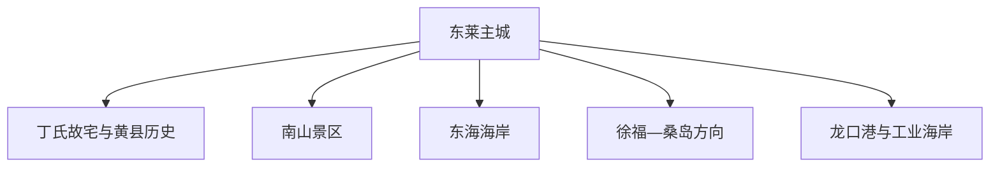
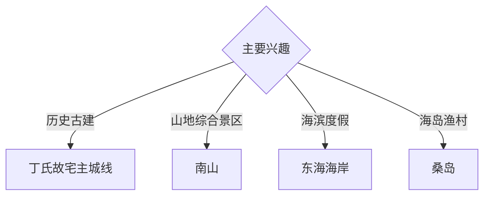

# 龙口旅行指南

龙口位于胶东半岛西北岸，旅行主题由黄县古城记忆、丁氏故宅、南山、东海海岸、桑岛渔村与港口工业共同组成。固定快照中的 **Donglai / GeoNames 1807152** 对应东莱主城；海岸、海岛与南山位于不同方向。

## 城市速览

| 项目 | 信息 |
|---|---|
| 主线 | 东莱主城—丁氏故宅—南山—东海海岸—桑岛与渔村 |
| 停留 | 主城 1 天；南山、海岸或海岛方向各另留 1 天 |
| 住宿 | 东莱主城适合综合接驳；东海度假区适合海滨慢游 |
| 交通 | 公路抵达为主，远点宜公交、约车或自驾，海岛另核船班 |
| 季节 | 春秋适合文博山地，夏季适合海滨；大风浓雾影响水路 |
| 预算 | 主城文博适中，景区门票、海滨住宿与海岛接驳增加预算 |

## 城市格局与游览区域

东莱主城适合历史文博和餐饮；南山、东海度假区、徐福—桑岛方向分别成线。港区、临港工业带、养殖区与无正式接待的岛岸按生产和航行边界管理。

## 主要景点

| 景点 | 区域 | 类型 | 核心体验 | 用时 | 环境 | 体力 | 研究价值 | 拥挤 | 优先级 |
|---|---|---|---|---:|---|---|---|---|---|
| 丁氏故宅 | 东莱主城 | 古建与博物馆 | 胶东民居、清代商贸与家族历史 | 2–3 小时 | 混合 | 低 | 很高 | 节假日中 | A |
| 漱芳园及公开展区 | 东莱主城 | 园林与展陈 | 古宅园林、地方文物与公共文化 | 1–2 小时 | 混合 | 低 | 高 | 中 | A |
| 南山旅游景区 | 东江方向 | 综合景区 | 山地景观、文化建筑与度假设施 | 1 天 | 混合 | 中 | 中高 | 旺季高 | A |
| 东海旅游度假区公共海岸 | 北部海岸 | 海滨 | 沙滩、海岸休闲与落日 | 半天至 1 天 | 室外 | 低 | 中 | 夏季高 | B |
| 桑岛旅游景区 | 徐福方向 | 海岛与渔村 | 渔村、海岛景观与海洋生活 | 1 天 | 室外 | 中 | 高 | 旺季中 | A |
| 西河阳等公开古村 | 诸由观方向 | 古村 | 胶东村落、民居与乡土文化 | 半天 | 混合 | 低中 | 中高 | 低 | B |
| 港口公开观察点 | 西部海岸 | 港城观察 | 港口城市、物流与工业景观 | 1–2 小时 | 室外 | 低 | 中 | 低 | C |

## 美食与餐饮

龙口粉丝、黄县肉盒、排骨包子、海鲜与胶东面食适合分区体验。主城老店适合地方小吃，海岸餐饮按时价和规格点单；海鲜过敏、休渔期供应与饮酒驾驶需要提前考虑。

## 经典行程

### 主城历史线
**路线**：丁氏故宅—漱芳园—地方午餐—东莱城市慢行。**逻辑**：从古宅理解黄县商贸与胶东生活。**预约锚点**：场馆开放。**休息**：主城。**删除条件**：闭馆时保留公开街区和地方饮食。

### 南山一日线
**路线**：主城—南山景区—正式开放游线—返程。**逻辑**：给大型综合景区完整一天。**预约锚点**：门票和接驳。**休息**：景区服务区。**删除条件**：大风、雷雨或临时关闭时改主城。

### 东海海滨线
**路线**：主城—东海公共海岸—午后休息—日落。**逻辑**：围绕潮汐和体感安排海滨时段。**预约锚点**：浴场与住宿。**休息**：度假区。**删除条件**：风浪、雷电或水质提示时保留岸上活动。

### 桑岛一日线
**路线**：主城—码头—正规船班—桑岛公开区—返程。**逻辑**：把船期作为全天锚点。**预约锚点**：实名船票与返程。**休息**：岛上正规服务点。**删除条件**：停航时改徐福或海岸线。

### 古村乡土线
**路线**：东莱—西河阳或一处公开古村—地方午餐—返程。**逻辑**：聚焦胶东聚落。**预约锚点**：古建开放。**休息**：镇区。**删除条件**：与桑岛同日时取消。

### 亲子低体力线
**路线**：丁氏故宅—午餐—短段公共海岸或城市公园。**逻辑**：文博与户外切换、步行可控。**预约锚点**：场馆亲子活动。**休息**：主城。**删除条件**：高温时只留文博。

### 三日组合线
**路线**：首日主城历史；次日南山；第三日东海海岸或桑岛。**逻辑**：古城、山地与海洋主题分日。**预约锚点**：第三日风浪和船班。**休息**：主城或海岸分段住宿。**删除条件**：两天时删海岛。

## 住宿区域

东莱主城便于历史线、餐饮与多方向出发；东海度假区适合海滨休闲；南山周边正规住宿适合景区慢游。订房核对实际海岸距离、淡旺季营业、停车、消防和大风停航退改。

## 市内交通

龙口跨东莱、东江、沿海与港区多个片区，公交和出租车适合主城，南山、东海、徐福及桑岛码头提前确认车程与末班。自驾在港区重车道路和海岸停车场按现场组织行驶。

## 不同旅行者须知

古建旅行者优先丁氏故宅；海岛旅行者给返程留机动；亲子与长者在主城和正规海岸选择低体力路线；工业兴趣者只使用公开观察点或正式接待线路。港池、码头作业面、养殖设施、军事区域和非开放岛岸保留明确限制。

## 行前核对

- 核对丁氏故宅、南山、桑岛和古村开放及预约。
- 核对海岛船班、实名要求、返程与停航退改。
- 核对大风、浓雾、雷雨、海浪与森林防火信息。
- 核对市域公交、末班车、港区道路和住宿接驳。

## 来源与更新记录

| 来源 | 支持内容 | 核验日期 |
|---|---|---|
| [龙口市政府：2026 年 A 级景区服务信息](https://www.longkou.gov.cn/col/col104722/art/2026/art_1700813af9604b18aae5bc60b9efabbd.html) | 南山、桑岛、古村景区及开放服务 | 2026-09-03 |
| [龙口市政府：丁氏故宅的前世今生](https://www.longkou.gov.cn/art/2023/1/31/art_104798_2930351.html) | 丁氏故宅位置、建筑与历史价值 | 2026-09-03 |
| [GeoNames 1807152](https://www.geonames.org/1807152/) | Donglai 固定人口点与龙口东莱主城位置 | 2026-09-03 |
