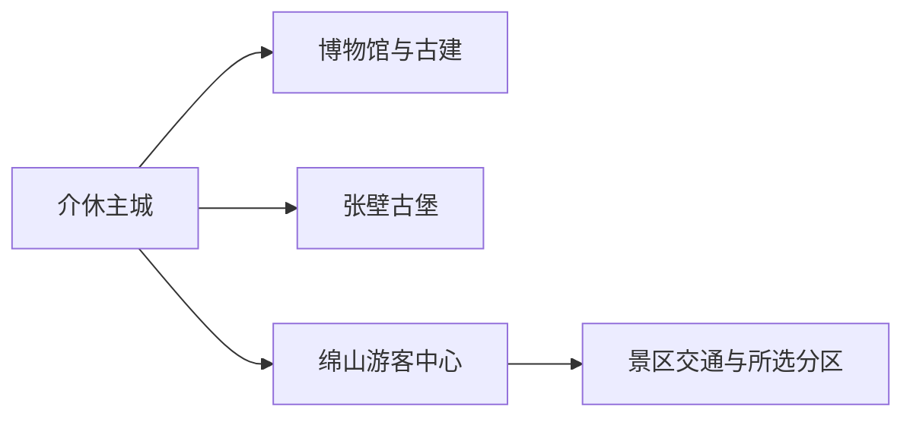
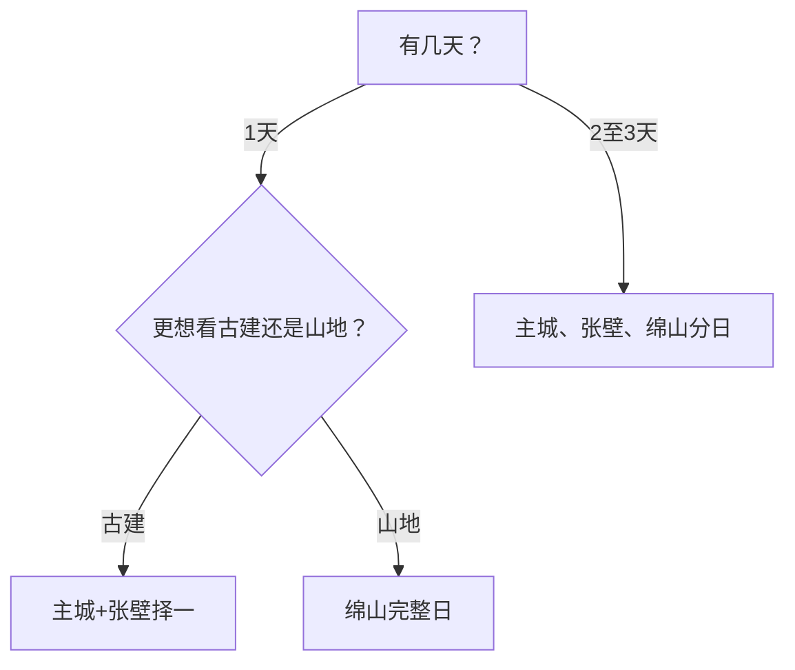

# 介休旅行指南

介休位于晋中南部，旅行重点清晰分成三组：主城古建与博物馆、张壁古堡，以及需要完整一天的绵山。首访可住介休主城，两天分别安排古堡和绵山；若只停一天，在张壁与绵山中选择一个主题，体验会更完整。

## 城市速览

| 项目 | 信息 |
|---|---|
| 旅行主线 | 主城古建、张壁古堡、绵山山地与寒食文化 |
| 建议停留 | 1 天主城加张壁；2 天增加绵山；3 天适合慢游与周边古建 |
| 住宿基地 | 介休主城；早入绵山可选景区确认开放的正规住宿 |
| 步行强度 | 主城中等，古堡中至高，绵山高 |
| 主要天气 | 山区雷雨、落石、山洪、冬季冰雪与森林火险 |
| 预约核心 | 绵山门票与景区交通、张壁古堡开放与讲解 |
| 亲子 | 张壁古堡地道须按年龄与现场开放选择，主城场馆更稳妥 |
| 低体力 | 主城古建短线；绵山只选交通可达、台阶较少的开放分区 |
| 文保边界 | 古建、壁画、塑像与地道按文保和运营规则参观 |
| 无障碍 | 设施连续性需向官方确认，尤其核对古堡石路、地道与绵山换乘 |

## 城市格局与游览区域

介休市是晋中市代管县级市，代码 `140781`。GeoNames `1805833` 为介休主城居民点，Wikidata `Q1362530` 代表法定介休市且 `P1566=1805833`。介休主城、张壁村与绵山景区分处不同方向，应依靠铁路站、公路和景区交通串联。

| 区域 | 旅行价值 | 怎么安排 |
|---|---|---|
| 主城 | 祆神楼、后土庙、地方文博与城市生活 | 抵达日或半日文化线 |
| 张壁村 | 古堡、地道、寺庙与村落 | 独立半日至一日，先确认地道开放 |
| 绵山 | 山岳、寺观、峡谷与寒食文化 | 完整一天，只选当期开放动线 |
| 洪山及乡村 | 泉域、古村与传统生产 | 有明确接待和车辆时作为第三日选项 |

## 主要景点

### 主城与古建

| 景点 | 所在区域 | 类型 | 核心看点 | 建议用时 | 室内/室外 | 体力 | 预约难度 | 天气敏感度 | 适合旅程 |
|---|---|---|---|---|---|---|---|---|---|
| 介休市博物馆 | 主城 | 地方史与文物 | 介休历史、古建、商贸与地方文化 | 1.5–2.5 小时 | 室内 | 低 | 中 | 低 | A |
| 祆神楼及周边古建 | 主城 | 古建筑 | 楼阁、街巷与城市历史空间 | 1–2 小时 | 混合 | 中 | 中 | 中 | B |
| 介休后土庙 | 主城 | 古建筑与宗教艺术 | 古建、壁画、琉璃与庙宇格局 | 1.5–2.5 小时 | 混合 | 中 | 中 | 中 | A |

### 古堡与山地

| 景点 | 所在区域 | 类型 | 核心看点 | 建议用时 | 室内/室外 | 体力 | 预约难度 | 天气敏感度 | 适合旅程 |
|---|---|---|---|---|---|---|---|---|---|
| 张壁古堡 | 龙凤镇张壁村 | 古村、军事防御与文保 | 堡门、街巷、寺庙、院落与开放地道系统 | 4–6 小时 | 混合 | 中至高 | 中 | 高 | A |
| 绵山风景区 | 绵山镇方向 | 山岳、寺观与峡谷 | 山地景观、寺观建筑、寒食文化和分区游线 | 1 天 | 室外为主 | 高 | 高 | 很高 | A |
| 洪山泉域公开游览点 | 洪山镇方向 | 泉水、古村与生产文化 | 泉域环境、传统村落与经确认开放的展示 | 3–5 小时 | 混合 | 中 | 高 | 高 | C |

绵山由多个分区和交通节点组成，完整游览取决于景区车、步道、索道或电梯的当期组合。先选一条正式线路，再安排进出时间；文保建筑、峡谷水边和森林防火区遵循现场边界。

## 美食与餐饮

| 类型 | 适合场景 | 份量 | 过敏与饮食提示 | 选择方法 |
|---|---|---|---|---|
| 介休担担面、面食 | 早餐、简餐 | 一人份 | 小麦、芝麻、花生和辣椒 | 先问配料与辣度 |
| 贯馅糖与地方点心 | 加餐、伴手礼 | 少量分享 | 糖、芝麻、坚果和麸质 | 看配料、生产日期和储存 |
| 山西过油肉与家常菜 | 正餐 | 更适合分享 | 小麦、猪肉、酱油与共锅 | 先问半份或小份 |
| 绵山景区餐饮 | 山地日补给 | 以简餐为主 | 选择少、价格和营业随季节变化 | 自备基础补给并核对禁火规则 |

## 经典行程

### 一日经典路线

**路线**：介休市博物馆 → 主城午餐 → 祆神楼与后土庙 → 返回住宿

- **串联逻辑**：用地方史串联两处主城古建，步行与短途乘车结合。
- **预约锚点**：博物馆、后土庙开放与讲解。
- **休息安排**：午餐长休，古建间安排一次室内休息。
- **时间不足时**：博物馆与后土庙二选一，再看祆神楼外部。

### 两日城市路线

**第 1 天**：主城古建与博物馆 
**第 2 天**：张壁古堡完整游览 → 返回介休

- **串联逻辑**：城市古建和村堡防御体系分日理解。
- **预约锚点**：张壁门票、地道开放、讲解和返程。
- **休息安排**：古堡午餐后再进入下半程，地道前后补水。
- **时间不足时**：张壁只保留地面古堡与一组核心建筑。

### 三日深度路线

**路线**：主城 → 张壁古堡 → 绵山完整一日

- **串联逻辑**：从城市历史到古堡，再进入山岳宗教与寒食文化。
- **预约锚点**：绵山入园、景区车、索道或电梯、闭园和天气。
- **休息安排**：绵山按正式服务区分段休息。
- **时间不足时**：删除主城次要点，仍给绵山完整一天。

### 雨雪天气路线

**路线**：介休市博物馆 → 室内午餐 → 后土庙按开放短线 → 返回

- **适用条件**：普通降雨或小雪且城市道路与古建开放正常。
- **串联逻辑**：以室内和院落短线为主，山地与地道改期。
- **预约锚点**：临时闭馆、古建保护性关闭和道路结冰。
- **休息安排**：午餐及博物馆座椅。
- **时间不足时**：只保留博物馆。

### 亲子与低体力路线

**亲子路线**：介休市博物馆 → 午餐 → 张壁古堡地面核心区 
**低体力路线**：车辆到达博物馆 → 午休 → 祆神楼周边短段

- **适用条件**：亲子地道体验按年龄、恐暗与开放状态判断；低体力路线保持平地。
- **串联逻辑**：两条路线都减少山地高差，保留可理解的历史主题。
- **预约锚点**：卫生间、座椅、轮椅、地道年龄提示和落客点。
- **休息安排**：每个主项目后长休。
- **时间不足时**：只留博物馆。

### 绵山完整日

**路线**：介休主城 → 绵山游客中心 → 景区交通 → 当期开放的一条完整分区动线 → 原路返回

- **适用条件**：入园、交通、天气、步道与返程均已确认。
- **串联逻辑**：用一条官方动线完成山地主题，减少跨分区赶路。
- **预约锚点**：门票、景区车、索道或电梯、停止入园与返程。
- **休息安排**：每次换乘都安排短休，午餐使用正式服务点。
- **时间不足时**：缩短为一个分区，不临时横跨整座景区。

## 住宿区域

| 区域 | 优点 | 取舍 | 适合人群 | 核对项 |
|---|---|---|---|---|
| 介休站—主城 | 铁路、餐饮、叫车与古建便利 | 绵山需早起乘车 | 首访、无车、多日 | 站口、早餐、停车、夜间入住 |
| 介休东站方向 | 高铁到发方便 | 距老城和景区入口仍需车辆 | 晚到早走 | 实际接驳和酒店周边服务 |
| 绵山景区外围正规住宿 | 便于早入景区 | 受季节、道路和运营影响 | 以绵山为主 | 营业、景区入口、供暖、退订 |

## 市内交通

介休站与介休东站承担铁路到发。主城用公交、出租车或网约车；张壁与绵山按景区或城乡交通、公路车辆连接。先锁定景区预约，再选择具体到达方式。

| 场景 | 怎么做 | 核对项 |
|---|---|---|
| 普速铁路 | 介休站到主城较顺 | 车次、站口、夜间交通 |
| 高铁 | 介休东站后转车 | 接驳、行李、末班 |
| 张壁古堡 | 预留往返车辆 | 开放、停车、返程 |
| 绵山 | 到游客中心后使用当期景区交通 | 入园、换乘、末班、天气 |

## 不同旅行者须知

| 旅行者 | 推荐做法 | 重点核对 |
|---|---|---|
| 独行 | 住主城，张壁和绵山分别锁定返程 | 末班、通信、夜间叫车 |
| 亲子 | 博物馆加张壁地面线 | 地道、护栏、年龄、卫生间 |
| 长者与低体力 | 主城古建短线，绵山只选交通可达分区 | 电梯、景区车、坡道、座椅 |
| 文博爱好者 | 为后土庙、张壁和主城古建留充足时间 | 开放殿堂、讲解、拍摄、修缮 |
| 冬季旅行 | 主城为主，山地按冰雪公告调整 | 结冰、索道、道路、供暖 |

## 行前核对

- 介休市政府、文旅部门与景区：开放、票务、讲解、修缮和活动。
- 绵山运营方：游客中心、景区车、索道、电梯、步道和天气停运。
- 张壁古堡：地道、古建、停车、讲解与返程。
- 山西气象和 12306：山区预警、森林火险、介休站与介休东站车次。

## 来源与更新记录

| 来源 | 支持内容 | 核验日期 |
|---|---|---|
| [介休市人民政府](https://www.jiexiu.gov.cn/) | 市情、公共服务与动态核对入口 | 2026-08-13 |
| [张壁古堡运营方](https://www.zgzbgb.com/) | 古堡位置、地面与地道构成、票务动态入口 | 2026-08-13 |
| [绵山风景区](https://www.cnsanjia.com/) | 绵山票务、分区与景区交通动态入口 | 2026-08-13 |
| [Wikidata Q1362530](https://www.wikidata.org/wiki/Q1362530) | 法定介休市、代码与 `P1566=1805833` | 2026-08-13 |
| [GeoNames 1805833](https://www.geonames.org/1805833/) | 固定主城点与坐标 | 2026-08-13 |
| [中国铁路12306](https://www.12306.cn/) | 铁路车次与站名动态入口 | 2026-08-13 |

| 日期 | 更新 |
|---|---|
| 2026-08-13 | 首次完成介休主城、张壁古堡、绵山与乡村旅行研究。 |
