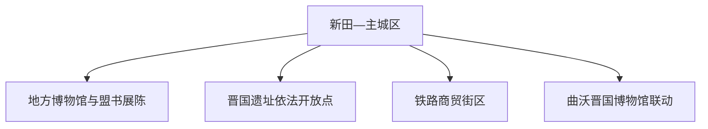
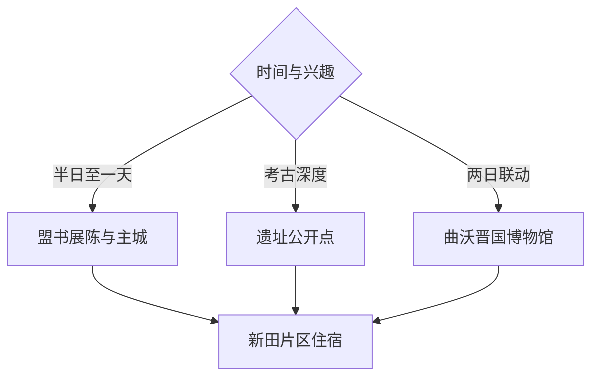

# 侯马旅行指南

侯马位于晋南交通十字路口，晋国晚期都城遗址、侯马盟书、近现代铁路商贸与汾河—浍河平原共同构成旅行线索。固定快照中的 **Xintian / GeoNames 1807818** 对应新田一带；市域紧凑，适合以主城为基地串联考古展陈和依法开放的遗址点。

## 城市速览

| 项目 | 信息 |
|---|---|
| 主线 | 侯马盟书—晋国遗址—铁路商贸—晋南城市生活 |
| 停留 | 主城 1 天；考古深度线与周边联动可安排 2 天 |
| 住宿 | 新田路及交通枢纽周边便于餐饮、铁路和市内移动 |
| 交通 | 铁路与公路枢纽性强，市内短途以公交、出租车为主 |
| 季节 | 春秋适合遗址步行；夏季午后避热；冬季重室内文博 |
| 预算 | 城区消费平实，讲解和跨县联动交通是主要增量成本 |

## 城市格局与游览区域

主城区围绕铁路枢纽和新田路展开，文博、餐饮与住宿集中；晋国遗址由多个保护区和考古点组成，公开展陈与工作区边界清晰。曲沃的晋国博物馆属于相邻县行政范围，适合另日联动，并在行程中明确跨县交通。

## 主要景点

| 景点 | 区域 | 类型 | 核心体验 | 用时 | 环境 | 体力 | 研究价值 | 拥挤 | 优先级 |
|---|---|---|---|---:|---|---|---|---|---|
| 侯马地方博物馆或盟书展陈 | 主城区 | 博物馆 | 侯马盟书、晋国史与考古方法 | 2–3小时 | 室内 | 低 | 很高 | 团体时中 | A |
| 侯马晋国遗址公开展示点 | 市域遗址区 | 考古遗址 | 新田都城格局、铸铜与祭祀遗存 | 半天 | 混合 | 低中 | 很高 | 低 | A |
| 台神古城等依法开放遗址段 | 市域遗址区 | 城址 | 城垣、道路与聚落空间辨识 | 1–2小时 | 室外 | 中 | 高 | 低 | B |
| 侯马铁路与商贸公共街区 | 火车站周边 | 城市街区 | 晋南枢纽、铁路城市与商贸生活 | 2小时 | 室外 | 低 | 中 | 日间中 | B |
| 汾河或浍河公共生态空间 | 市域河流 | 河流与公园 | 平原水系、城市绿地与季节景观 | 2小时 | 室外 | 低 | 中 | 傍晚中 | B |
| 彭真故居依法开放区 | 垤上方向 | 纪念地 | 近现代人物史与地方社会 | 2–3小时 | 混合 | 低 | 高 | 纪念日中 | B |
| 曲沃晋国博物馆 | 相邻曲沃县 | 跨县博物馆 | 晋国墓地、车马坑与系统展陈 | 半天至1天 | 混合 | 中 | 很高 | 节假日高 | C |

## 美食与餐饮

侯马适合寻找牛肉丸子面、饸饹、油糕、晋南臊子面和家常面食。火车站与新田路周边选择多，一人点面食较方便；早餐和地方小吃适合分散体验，牛肉、辣椒和汤底盐度可在点餐时说明。

## 经典行程

### 主城一日线
**路线**：盟书展陈—午餐—铁路商贸公共街区—河流公共空间。**逻辑**：从晋国史走到现代枢纽城市。**预约锚点**：博物馆开放。**休息**：新田路。**删除条件**：高温时缩短户外段。

### 晋国考古线
**路线**：地方文博—遗址公开展示点—台神古城依法开放段。**逻辑**：先看出土材料，再读城址空间。**预约锚点**：遗址开放和讲解。**休息**：主城区。**删除条件**：考古工作或保护调整时只保留公开展陈。

### 盟书专题线
**路线**：盟书展陈—相关考古资料—城市公共文化空间。**逻辑**：围绕文字、盟誓与晋国政治组织。**预约锚点**：专题展览与讲解。**休息**：馆区。**删除条件**：专题展撤换时改晋国综合线。

### 近现代城市线
**路线**：铁路公共街区—城市展陈—彭真故居依法开放区。**逻辑**：连接铁路商贸与人物史。**预约锚点**：纪念地开放。**休息**：主城餐饮区。**删除条件**：远点交通不足时保留铁路街区。

### 河谷慢行线
**路线**：主城公园—汾河或浍河公开岸线—晚餐。**逻辑**：以低强度观察晋南平原城市。**预约锚点**：无。**休息**：沿线公园。**删除条件**：汛情、大风或封闭时转室内文博。

### 亲子低体力线
**路线**：盟书展陈—午餐—短段城市公园。**逻辑**：核心知识在室内完成，户外距离可控。**预约锚点**：儿童参观和讲解。**休息**：新田片区。**删除条件**：疲劳时只保留博物馆。

### 两日晋国联动线
**路线**：首日侯马盟书与遗址；次日跨县前往曲沃晋国博物馆。**逻辑**：都城与墓地展陈互相补充。**预约锚点**：两馆开放和跨县车辆。**休息**：连续住侯马或按返程调整。**删除条件**：只有一天时保留侯马本地线。

## 住宿区域

新田路、火车站及主城商业区适合铁路抵达、晚餐和次日出发。临街住宿与安静度之间按个人偏好选择；早班车旅客重点核对步行距离、夜间前台和行李寄存。

## 市内交通

侯马站、侯马西站及公路客运服务不同线路，订票后核对站名和接驳。主城公交、出租车与网约车可覆盖常规点位；遗址分散点和曲沃方向提前安排车辆。遗址保护区周边按停车、步行与现场引导进入。

## 不同旅行者须知

考古爱好者优先预约讲解并给遗址半天；亲子家庭从盟书文字和车马考古切入；低体力旅行者以主城馆舍为核心；铁路史旅行者可补充枢纽公共街区。考古发掘区、文物库房、遗址保护围栏、铁路作业区和河道行洪区执行明确限制。

## 行前核对

- 核对地方博物馆、盟书专题展、遗址点和彭真故居开放。
- 核对侯马站、侯马西站、跨县车辆与末班返程。
- 核对考古工作、文物保护、汛情和高温提示。
- 曲沃晋国博物馆属于跨县行程，另核对其预约、门票和接驳。

## 来源与更新记录

| 来源 | 支持内容 | 核验日期 |
|---|---|---|
| [山西省文旅厅：旅游业发展规划](https://wlt.shanxi.gov.cn/zwgk/xxgk/xxgkml/qt/202204/P020220420405006964545.pdf) | 晋国遗址与专题遗址博物馆发展框架 | 2026-09-03 |
| [山西省政府驻广州办：侯马区位与产业资料](https://sxszfzgzb.shanxi.gov.cn/zshz/zsxm/2026zsyzzdxm/202603/t20260317_10081986.shtml) | 侯马交通区位与现代城市背景 | 2026-09-03 |
| [GeoNames 1807818](https://www.geonames.org/1807818/) | Xintian 固定人口点与侯马主城位置 | 2026-09-03 |

