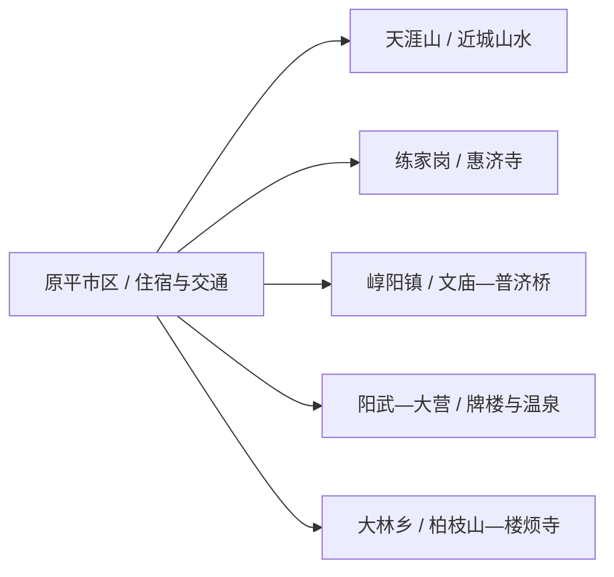
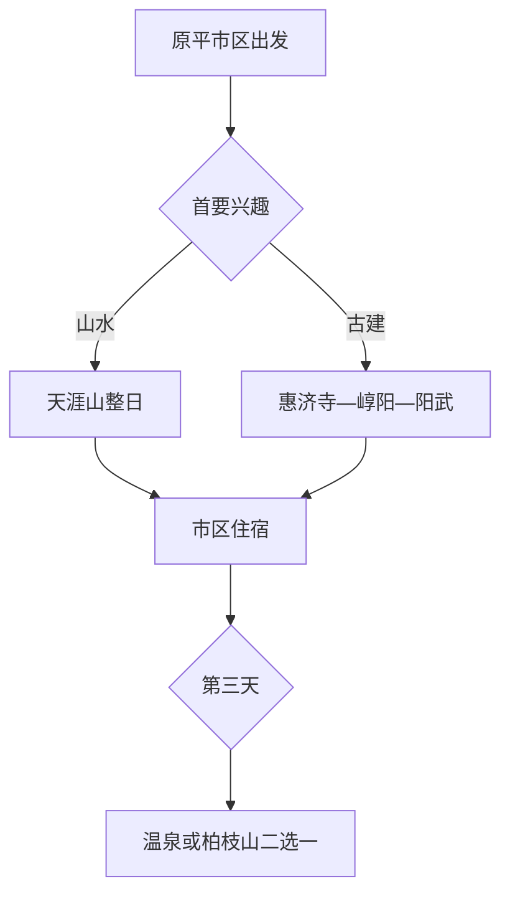

# 原平旅行指南

原平适合围绕两类体验安排：天涯山提供成熟的近城山水线，崞阳—练家岗—阳武则把古建、石桥和村落串成一条公路文化线。先选一条完整走深，比一天横跨所有乡镇更从容。

> 建议停留：天涯山与城区 1 天；加入古建线为 2 天；再加温泉或柏枝山为 3 天 
> 旅行关键词：天涯山、惠济寺、崞阳古建、朱氏牌楼、晋北面食 
> 无障碍说明：城市公共设施和部分景区服务区可优先询问坡道与轮椅；古寺、石桥、村路和山地的设施连续性需向官方确认

## 城市速览

| 项目 | 旅行信息 |
|---|---|
| 主要旅行价值 | 天涯山自然人文景观、宋金以来古建筑与石桥、晋北乡村和温泉资源 |
| 建议停留 | 1–3 天；古建点分散，车辆比跨镇步行实用 |
| 舒适季节 | 春秋适合山地与古建；夏季避开正午，冬季关注冰雪和淡季开放 |
| 预算特点 | 城区成本较稳；车辆、讲解、温泉和乡村接驳增加预算 |
| 步行强度 | 城区低；古建线中等；天涯山和柏枝山中高 |
| 天气风险 | 大风、雷雨、高温、山洪、冬季道路结冰 |
| 独行旅行 | 城区和天涯山可独行，乡村古建线先锁司机与返程 |
| 亲子旅行 | 天涯山短线、古桥与乡村文化适合分段体验 |
| 长者与低体力 | 惠济寺或朱氏牌楼选一处，车辆串联并减少登山 |
| 行前重点 | 文保点开放、讲解联系、景区票务、乡村道路与返程 |

## 城市格局与游览区域

原平是忻州市代管的法定县级市，代码 `140981`。市区位于滹沱河谷交通走廊；天涯山靠近城区东南，崞阳、练家岗、阳武、大营和大林等古建、温泉与乡村点分散在不同方向。

| 区域 | 适合安排 | 怎么选择 | 时间尺度 |
|---|---|---|---|
| 原平市区 | 住宿、餐饮、铁路和城市公共空间 | 作为每日基地，早晚补给 | 半日 |
| 天涯山方向 | 4A 景区、石鼓主题与山水步行 | 首访优先，按体力选择短线或完整线 | 半日至 1 天 |
| 练家岗—崞阳 | 惠济寺、崞阳文庙和普济桥 | 用车辆顺向串联，提前联系文保点 | 1 天 |
| 阳武—大营 | 朱氏牌楼与温泉 | 文保与休闲二选一或组合半日 | 半日至 1 天 |
| 大林乡方向 | 柏枝山、古树与楼烦寺 | 开放和道路明确时独立成日 | 1 天 |

GeoNames `1786060` 与 Wikidata `Q1331388` 的 `P1566` 精确对应，法定代码为 `140981`。固定记录用于定位主城，行政范围以现行原平市为准。

## 主要景点

### 山水与古建主线

| 景点 | 区域 | 类型 | 主要看点 | 建议用时 | 室内外 | 体力 | 预约风险 | 天气影响 | 优先级 |
|---|---|---|---|---:|---|---|---|---|---|
| 天涯山风景区 | 城区东南 | 4A 山水、人文 | 山峰、石鼓、石鼓神祠与介子推文化主题 | 4–6 小时 | 室外为主 | 中高 | 高 | 很高 | A |
| 原平惠济寺 | 练家岗村 | 全国重点文保、古寺 | 宋代大佛殿及历代建筑与彩塑 | 1.5–2.5 小时 | 混合 | 中 | 很高 | 中 | A |
| 崞阳文庙 | 崞阳镇 | 古建筑、教育史 | 文庙格局与地方教育文化 | 1–2 小时 | 混合 | 中 | 很高 | 中 | B |
| 原平普济桥 | 崞阳镇 | 全国重点文保、古桥 | 金代石拱桥结构与石刻 | 1 小时 | 室外 | 低至中 | 中 | 高 | B |
| 阳武朱氏牌楼 | 阳武村 | 全国重点文保、石雕 | 清代石牌楼与雕刻细节 | 1–2 小时 | 室外 | 低至中 | 高 | 高 | A |

### 休闲与远线

| 景点 | 区域 | 类型 | 主要看点 | 建议用时 | 室内外 | 体力 | 预约风险 | 天气影响 | 优先级 |
|---|---|---|---|---:|---|---|---|---|---|
| 大营温泉当期运营项目 | 大营镇 | 温泉、休闲 | 地热资源与合规温泉服务 | 3–5 小时 | 室内外混合 | 低 | 很高 | 中 | B |
| 柏枝山正式开放线 | 大林乡西神头方向 | 山地、古树 | 古楸树、山地景观与乡村文化 | 半日至 1 天 | 室外 | 中高 | 高 | 很高 | B |
| 楼烦寺开放区域 | 大林乡方向 | 古寺、历史 | 佛教建筑与慧远相关地方记忆 | 1–2 小时 | 混合 | 中 | 很高 | 中高 | C |
| 滹沱河城市公共休闲段 | 市区 | 城市滨水 | 河谷城市格局与短步行 | 1–2 小时 | 室外 | 低 | 低 | 高 | C |

惠济寺、崞阳文庙、普济桥和朱氏牌楼都是文保点，开放条件可能不同；实际安排时逐点确认，并在当天开放的项目中顺向串联。天涯山内部石鼓、神祠和步道按一个景区安排。

## 美食与餐饮

| 类型 | 怎么点 | 份量与过敏原 | 选择建议 |
|---|---|---|---|
| 莜面鱼鱼、莜面栲栳栳 | 一人一份或多人共享 | 莜麦为主，蘸汁可能含小麦、大豆、肉汤 | 先问做法和蘸料，独行选小份 |
| 河捞、刀削面与合子饭 | 一人一碗 | 含小麦，汤底可能含肉类和辣椒 | 车辆长线前选清淡版本 |
| 大烩菜 | 2–4 人共享 | 可能含猪肉、豆制品、粉条与多种调味料 | 先问份量和主要肉类，减少重复主食 |
| 炒琪、麻叶、锅盔等小吃 | 小份分享或作路餐 | 含小麦、油脂，部分含芝麻或糖 | 购买包装与生产信息清楚的产品 |

## 经典行程

### 一日经典路线

**路线**：原平市区 → 天涯山风景区 → 市区晚餐

- **适用条件**：景区开放，天气适合山地活动。
- **串联逻辑**：完整一天交给最成熟的近城景区。
- **预约锚点**：票务、步道、最晚入园和返程车辆。
- **休息安排**：游客服务区午休，下山后回市区恢复。
- **时间不足时**：走景区核心短线，取消远端步道。

### 两日城市路线

**第 1 天**：天涯山 
**第 2 天**：惠济寺 → 崞阳文庙—普济桥 → 阳武朱氏牌楼

- **适用条件**：三处文保点的开放与联系均已确认。
- **串联逻辑**：第二天沿同一公路方向串联古寺、古镇与石雕。
- **预约锚点**：文保点管理方、讲解和乡村道路。
- **休息安排**：崞阳镇午餐坐休，下午只保留牌楼一站。
- **时间不足时**：惠济寺与朱氏牌楼二选一，普济桥作短停。

### 三日深度路线

**第 1 天**：天涯山 
**第 2 天**：练家岗—崞阳—阳武古建线 
**第 3 天**：大营温泉或柏枝山—楼烦寺方向二选一

- **适用条件**：第三日项目正常运营，道路与天气稳定。
- **串联逻辑**：山水、古建、休闲或乡村山地各占一天。
- **预约锚点**：温泉营业、山地开放和返程。
- **休息安排**：第三日只选一个方向，午后回市区。
- **时间不足时**：删除第三天，前两日保持完整。

### 雨雪天路线

**路线**：原平市区公共文化活动 → 午餐 → 合规温泉项目或住宿地休息

- **适用条件**：市区道路正常，温泉项目确认营业。
- **串联逻辑**：减少文保村路与山地暴露。
- **预约锚点**：场馆、温泉营业和道路结冰信息。
- **休息安排**：午后只保留一个室内项目。
- **时间不足时**：只保留市区用餐与休息。

### 亲子与低体力路线

**亲子路线**：天涯山核心短线 → 午休 → 滹沱河公共休闲段 
**低体力路线**：车辆到惠济寺或朱氏牌楼二选一 → 午休 → 市区短步行

- **减负方式**：山地和古建线不放在同一天，乡村点用车辆串联。
- **预约锚点**：台阶、落客点、卫生间、轮椅和儿童安全。
- **休息安排**：每个主点后回到车辆或正式服务区。
- **时间不足时**：保留一处文保点或天涯山短线。

### 远郊路线

**路线**：原平市区 → 柏枝山正式开放线 → 楼烦寺开放区域 → 市区

- **适用条件**：属地接待、山路、天气和返程已确认。
- **串联逻辑**：把大林乡方向作为一个完整乡村山地日。
- **预约锚点**：开放范围、讲解、道路和车辆。
- **休息安排**：西神头村或正式服务点午休。
- **时间不足时**：只保留柏枝山短线，寺院改期。

## 住宿区域

| 区域 | 优点 | 取舍 | 适合人群 |
|---|---|---|---|
| 原平市区 | 铁路、餐饮与车辆选择集中 | 每日仍需向乡镇往返 | 首访、公共交通旅行 |
| 天涯山附近正规住宿 | 便于清晨入园 | 夜间餐饮与交通少于市区 | 山水摄影、慢旅行 |
| 崞阳镇 | 便于古建线分段 | 住宿选择与服务需重查 | 古建深度、自驾 |
| 大营镇合规温泉住宿 | 便于温泉休息 | 运营状态和交通需确认 | 低体力、休闲旅行 |

## 市内交通

- 原平西站和原平站车次结构不同，按票面完整站名选择住宿与接驳。
- 市区至天涯山可用出租、合规网约或景区当期交通；乡村古建线更适合自驾或合规包车。
- 文保点所在村落道路与停车条件有限，车辆停在允许区域后步行进入。
- 冬季优先走已清雪主路，山路和乡道按交警与属地公告调整。

## 不同旅行者须知

| 情况 | 怎么安排 | 重点核对 |
|---|---|---|
| 独行 | 住市区，古建线使用合规车辆 | 返程、司机、开放联系和信号 |
| 亲子 | 天涯山短线与古桥观察 | 护栏、临水、台阶、讲解时长 |
| 长者与低体力 | 一天一处古建，车辆到最近落客点 | 轮椅、门槛、座椅、卫生间 |
| 古建摄影 | 选择自然光和短时停留 | 闪光灯、三脚架、壁画彩塑与商业拍摄规则 |
| 温泉旅行 | 先确认健康条件和运营资质 | 水温、浸泡时长、消毒、救生与禁忌提示 |

文保与生产边界：古建、壁画、彩塑和石刻按保护要求参观；村落、农田、温泉取水设施、矿业与工业空间保留生活生产属性。山地防火期依现场火源管理活动。

## 行前核对

| 项目 | 何时核对 | 官方入口 |
|---|---|---|
| 天涯山与文保点开放 | 排行程时、到访前一日 | [原平市人民政府](https://www.yuanping.gov.cn/)及忻州文旅公告 |
| 铁路与乡镇接驳 | 购票时、出发前一日 | [中国铁路 12306](https://www.12306.cn/)及交通部门 |
| 温泉与乡村项目 | 订房或预约时 | 运营方、属地政府和文旅部门 |
| 雷雨、大风与冰雪 | 出发前三日起每日 | [山西省气象局](http://sx.cma.gov.cn/)及应急、交警信息 |
| 无障碍条件 | 预约与用车时 | 景区、文保管理方、酒店和承运方 |

## 来源与更新记录

| 来源 | 支持内容 | 核验日期 |
|---|---|---|
| [文化和旅游部：山西·乡村古建 乐游原平](https://zhuanti.mct.gov.cn/xcss2024_xcygj/shanxi/detail/7212.html) | 天涯山、惠济寺、崞阳文庙、普济桥、大营温泉、柏枝山与地方饮食 | 2026-08-13 |
| [原平市人民政府](https://www.yuanping.gov.cn/) | 市情、公共服务和动态公告入口 | 2026-08-13 |
| [国务院第八批全国重点文物保护单位名单](https://www.gov.cn/zhengce/content/2019-10/16/content_5440577.htm) | 普济桥、阳武朱氏牌楼等文保身份 | 2026-08-13 |
| [民政部行政区划查询](https://dmfw.mca.gov.cn/xzqh/getList?code=14&trimCode=true&maxLevel=3) | `140981` 及忻州代管关系 | 2026-08-13 |
| [GeoNames 1786060](https://www.geonames.org/1786060/yuanping.html) | 固定原平城市点 | 2026-08-13 |
| [Wikidata Q1331388](https://www.wikidata.org/wiki/Q1331388) | 法定原平市实体与 `P1566=1786060` | 2026-08-13 |

| 日期 | 更新 |
|---|---|
| 2026-08-13 | 首次完成原平市指南；建立天涯山、练家岗—崞阳—阳武古建线与大营、大林远线，补齐文保、交通、天气和标识粒度。 |
