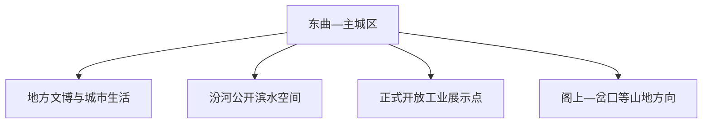
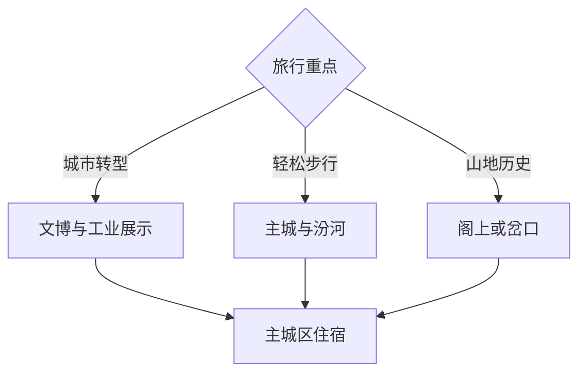

# 古交旅行指南

古交位于太原以西的汾河谷地，是一座由山地、河谷、煤炭工业和资源型城市转型共同塑造的县级市。固定快照中的 **Dongqu / GeoNames 8053958** 对应古交东曲一带；旅行以主城公共文化、汾河河谷、正式开放的工业与生态展示空间为主，山地方向另留完整白天。

## 城市速览

| 项目 | 信息 |
|---|---|
| 主线 | 主城文博—汾河公共空间—矿业城市史—山地乡村 |
| 停留 | 主城 1 天；山地或工业主题另加 1 天 |
| 住宿 | 市中心便于餐饮和公交；远郊行程适合当天往返 |
| 交通 | 从太原经铁路或公路抵达，远点提前确认城乡班次 |
| 季节 | 春秋适合河谷步行；夏季关注强降雨；冬季关注冰雪道路 |
| 预算 | 住宿与餐饮相对平实，远郊包车或约车是主要增量成本 |

## 城市格局与游览区域

主城区沿汾河与铁路展开，日常服务集中；矿区、生产企业和山地村镇分布在不同沟谷。工业参观选择具有接待安排的展馆、观礼点或研学项目，生产矿井、专用铁路和采空区依门禁与安全边界管理。

## 主要景点

| 景点 | 区域 | 类型 | 核心体验 | 用时 | 环境 | 体力 | 研究价值 | 拥挤 | 优先级 |
|---|---|---|---|---:|---|---|---|---|---|
| 古交地方文博或城市展陈 | 主城区 | 博物馆 | 地方历史、煤炭工业与城市转型 | 2–3小时 | 室内 | 低 | 很高 | 低 | A |
| 汾河公共滨水空间 | 主城区 | 河流与城市公园 | 河谷城市形态与居民生活 | 2小时 | 室外 | 低 | 高 | 傍晚中 | A |
| 正式开放矿业工业展示点 | 市域矿区 | 工业遗产与研学 | 煤炭生产史、矿区社区与生态治理 | 半天 | 混合 | 中 | 很高 | 预约制 | A |
| 水泉寨或东曲公共街区 | 东曲方向 | 城市街区 | 工矿城市生活、铁路与河谷关系 | 2小时 | 室外 | 低 | 中 | 低 | B |
| 阁上革命纪念地公开区 | 阁上方向 | 红色纪念 | 晋西北抗战历史与山地交通 | 半天 | 混合 | 中 | 高 | 纪念日中 | B |
| 岔口乡村与山地公开路线 | 岔口方向 | 乡村与山地 | 吕梁山东麓地貌、村落与季节景观 | 1天 | 室外 | 中高 | 中 | 季节性 | C |
| 狐爷山等依法开放山地段 | 市域山地 | 自然与徒步 | 河谷视野、山地植被与地貌 | 半天至1天 | 室外 | 高 | 中 | 低 | C |

## 美食与餐饮

古交适合寻找刀削面、剔尖、莜面、过油肉和当地家常面食。主城区更适合一人点餐与连续换店；进入山地村镇前准备饮水和简餐，选择明码标价、卫生信息清晰的经营场所。

## 经典行程

### 主城一日线
**路线**：地方文博—午餐—东曲公共街区—汾河滨水空间。**逻辑**：先理解城市，再观察河谷与生活空间。**预约锚点**：地方展馆开放。**休息**：市中心。**删除条件**：强降雨时缩短滨水段。

### 城市转型线
**路线**：地方展陈—正式开放工业展示点—生态治理公共区。**逻辑**：把资源开发、社区与修复放在同一条证据链。**预约锚点**：工业参观实名与接待时段。**休息**：主城区。**删除条件**：接待取消时保留文博与公共空间。

### 汾河慢行线
**路线**：主城公共街区—汾河公开步道—城市公园。**逻辑**：以低强度步行读取河谷城市。**预约锚点**：无。**休息**：沿线商业区。**删除条件**：汛情或道路封闭时改为室内展陈。

### 阁上历史线
**路线**：主城—阁上方向公开纪念设施—村镇午餐—返程。**逻辑**：用山地交通理解地方抗战史。**预约锚点**：纪念设施开放与车辆。**休息**：乡镇服务点。**删除条件**：冰雪或强降雨时整段顺延。

### 山地乡村线
**路线**：主城—岔口方向依法开放村落与步道—返程。**逻辑**：独立一天承接吕梁山东麓尺度。**预约锚点**：道路和接待。**休息**：正规农家乐。**删除条件**：高火险、地质灾害预警时采用城区线。

### 亲子低体力线
**路线**：地方展陈—午餐—短段滨水公共空间。**逻辑**：室内外各一段，控制坡道与换乘。**预约锚点**：展馆。**休息**：市中心。**删除条件**：儿童疲劳时只保留展陈。

### 两日组合线
**路线**：首日主城与汾河；次日工业主题或阁上山地二选一。**逻辑**：把不同方向拆日。**预约锚点**：第二日接待与交通。**休息**：连续住主城区。**删除条件**：只有一天时保留主城线。

## 住宿区域

市中心与东曲一带餐饮、公交和生活服务较集中，适合首访；铁路出行者可兼顾车站接驳。远郊住宿选择持证经营并核对供暖、消防、夜间抵达和返程方式。

## 市内交通

古交与太原之间有铁路、公路联系，购票时核对古交站及实际停靠。主城可用公交、出租车和步行组合；阁上、岔口及工业接待点提前确认班次、预约车辆和返程。山路自驾按天气、限行和矿区交通组织行驶。

## 不同旅行者须知

工业史旅行者先锁定正式接待；亲子家庭以文博和短段滨水为主；长者选择主城低坡路线；徒步者携带离线地图和保暖防雨装备。河道行洪区、生产矿井、采空沉陷治理区、专用铁路及森林防火封控区执行现场边界。

## 行前核对

- 核对地方展馆、纪念设施和工业研学接待日期。
- 核对太原往返列车、公路施工、城乡班次与末班返程。
- 核对强降雨、地质灾害、森林火险和冬季道路预警。
- 进入山地与矿区方向时，以属地公告、门禁和现场人员指引为准。

## 来源与更新记录

| 来源 | 支持内容 | 核验日期 |
|---|---|---|
| [国务院：古交马兰镇产城融合试点材料](https://www.gov.cn/xinwen/2016-12/07/5144553/files/87598e3d831548b6b9b5a85af2903e1f.pdf) | 矿镇关系、沉陷治理与资源型城市背景 | 2026-09-03 |
| [山西省文旅厅：全省旅游发展规划](https://wlt.shanxi.gov.cn/zwgk/xxgk/xxgkml/qt/202204/P020220420405006964545.pdf) | 山西文旅道路与遗产保护框架 | 2026-09-03 |
| [GeoNames 8053958](https://www.geonames.org/8053958/) | Dongqu 固定人口点与古交主城位置 | 2026-09-03 |

