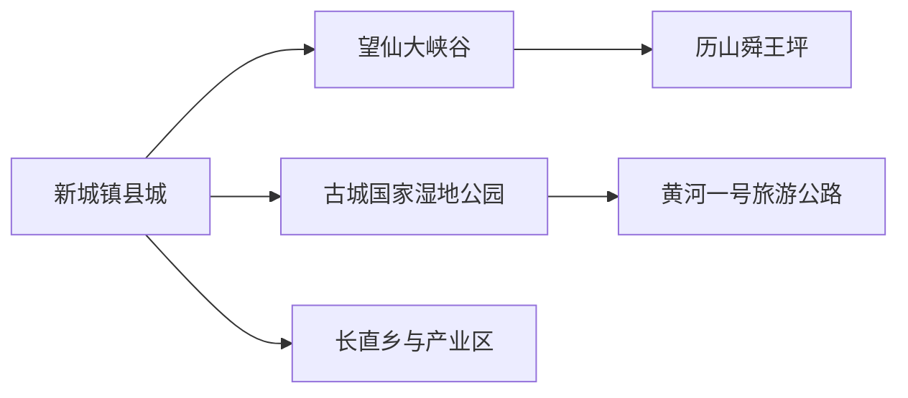
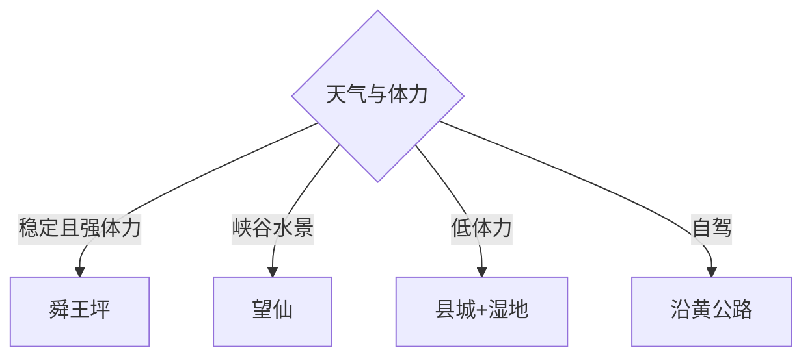

# 垣曲旅行指南

垣曲位于中条山与黄河小浪底库区之间，核心旅行是历山舜王坪、望仙大峡谷和古城湿地。县城承担住宿与补给，山地、峡谷和沿黄线路各需完整一天；先按天气与景区开放选择一个方向，再决定是否换宿。

## 城市速览

| 项目 | 信息 |
|---|---|
| 主线 | 垣曲县城—历山舜王坪—望仙峡谷—古城湿地—黄河一号旅游公路 |
| 停留 | 县城半日；每条山地或沿黄方向另留1天，完整3–4天 |
| 住宿 | 新城镇适合补给；历山景区周边适合早出；古城方向适合沿黄路线 |
| 交通 | 主要依靠公路进入，县城至景区用班车、合规包车或自驾 |
| 风险 | 山区暴雨、落石、冰雪、森林火险、高海拔温差与库区水情 |
| 边界 | 历山保护区核心、原始林、矿山、铜业生产区、水库设施和黄河湿地按管理边界进入 |

## 城市格局与游览区域

固定 **Changzhi / GeoNames 1815463** 的坐标 `35.20889, 111.73861` 和行政代码落在运城市垣曲县长直乡；这里的名称对应“长直”，与山西地级长治市无关。本页以该固定点进入审计，并用垣曲县实体 `Q1196856`、代码 `140827` 确定县域旅行范围。长直乡首先是生活与产业空间，完整旅行结构由县城、历山、望仙和沿黄区域承接。

## 主要景点

| 景点 | 区域 | 类型 | 核心体验 | 用时 | 环境 | 体力 | 研究价值 | 拥挤 | 优先级 |
|---|---|---|---|---:|---|---|---|---|---|
| 历山舜王坪正式景区 | 历山镇 | 高山草甸 | 亚高山草甸、峰顶视野与森林过渡 | 1天 | 室外 | 高 | 很高 | 旺季高 | A |
| 历山皇姑幔开放游线 | 历山景区 | 山地森林 | 山峰、原始林外围与峡谷地貌 | 1天 | 室外 | 高 | 高 | 中 | B |
| 望仙大峡谷 | 历山镇望仙村 | 峡谷景区 | 瀑布潭群、峡谷与后河水库景观 | 1天 | 室外 | 高 | 高 | 旺季高 | A |
| 古城国家湿地公园公开区域 | 古城镇 | 黄河湿地 | 库区湿地、鸟类与沿黄景观 | 半日至1天 | 室外 | 中 | 很高 | 季节高 | A |
| 垣曲县博物馆或县级展陈 | 县城 | 地方文博 | 史前文化、舜文化与移民建城 | 1.5–3小时 | 室内 | 低 | 很高 | 低 | B |
| 黄河一号旅游公路垣曲段 | 历山—古城—王茅—解峪 | 景观公路 | 山水、村镇与黄河库区串联 | 1天以上 | 室外 | 中 | 高 | 活动时高 | B |
| 小浪底库区正式观景点 | 古城方向 | 水利景观 | 库区尺度、移民史与黄河工程 | 2–4小时 | 室外 | 中 | 高 | 中 | B |
| 历山猕猴源正式运营区 | 历山景区 | 生态景区 | 中条山动物与峡谷森林 | 半日至1天 | 室外 | 中高 | 中 | 中 | C |

## 美食与餐饮

县城适合羊肉汤、面食、饸饹、炒琪和晋南家常菜，山区服务点以简餐和农家菜为主。点羊肉与面食时确认份量、汤底、辣椒和小麦过敏；进入山地前自备饮水与应急补给。野生动物与保护植物保持观察距离，食材选择正规来源。

## 经典行程

### 两日基础线
**路线**：县城文博—历山舜王坪—古城湿地或望仙。**逻辑**：先理解县域，再选两种自然景观。**预约锚点**：景区、车辆与住宿。**休息**：县城。**删除条件**：天气不稳时只留县城与公开湿地。

### 舜王坪草甸线
**路线**：正式入口—景区交通—开放草甸步道—原路返程。**逻辑**：把高体力山地完整成日。**预约锚点**：门票、景交和防火。**休息**：游客中心。**删除条件**：雷雨、大风、冰雪或火险时取消。

### 望仙峡谷线
**路线**：望仙入口—开放瀑潭步道—后河水库观景区。**逻辑**：沿水系理解峡谷。**预约锚点**：票务、水情和交通。**休息**：服务区。**删除条件**：强降雨、泄洪或落石风险时取消。

### 古城湿地线
**路线**：古城镇—湿地公园公开区—库区正式观景点。**逻辑**：从湿地看黄河与移民新城。**预约锚点**：开放、观鸟季与车辆。**休息**：古城镇。**删除条件**：大风、浓雾或水情管控时缩短。

### 黄河公路线
**路线**：解峪—王茅—古城—历山开放节点。**逻辑**：按公路串联而非追逐全部景点。**预约锚点**：路况、补给和返程。**休息**：驿站。**删除条件**：施工、冰雪或落石时改县城。

### 自然教育线
**路线**：县城展陈—历山游客中心—短段公开生态步道。**逻辑**：先认识保护规则再观察。**预约锚点**：讲解与研学。**休息**：展馆。**删除条件**：野外管控时只留室内。

### 低体力线
**路线**：县级展陈—车辆到古城湿地近入口—库区观景。**逻辑**：用车辆和短步行替代登山。**预约锚点**：无障碍与落客点。**休息**：每站服务区。**删除条件**：风雨时只留县城。

## 住宿区域

新城镇县城适合餐饮、药品、客运和多方向出发；历山镇或景区周边正规住宿适合清晨进山；古城镇适合湿地与沿黄线路。订房时核对海拔、供暖或空调、夜间餐饮、消防、停车和手机信号，山地返程留足天黑前余量。

## 市内交通

垣曲以公路交通为主，从运城、侯马、济源等方向进入时比较全程时间。县城到历山、望仙和古城距离长，历史班车时刻只作线索，当次向客运与景区核对；包车明确合法运营、等待、山路与返程费用。黄河一号旅游公路不等于所有支路均开放。

## 不同旅行者须知

强体力旅行者选舜王坪或皇姑幔；峡谷兴趣者选望仙；观鸟与地理兴趣者选古城湿地；亲子家庭以文博、游客中心和短步道为主；长者采用县城与库区车辆线。保护区核心、无人支沟、矿山爆破区、铜业园区、水库工程和黄河滩涂保持明确限制。

## 行前核对

- 核对历山各子景区、望仙、古城湿地、县级场馆和景区交通的开放与票务。
- 核对公路施工、班车、暴雨落石、冰雪、防火、库区水情和高山温差。
- 进入自然保护地只使用正式景区与开放步道，野生动物观察保持距离并收好食物。

## 来源与更新记录

| 来源 | 支持内容 | 核验日期 |
|---|---|---|
| [运城市政府：垣曲历山](https://www.yuncheng.gov.cn/doc/2020/07/21/71099.shtml) | 舜王坪、皇姑幔、猕猴源、库区与景区交通 | 2026-09-01 |
| [运城市政府：望仙大峡谷](https://www.yuncheng.gov.cn/doc/2020/07/21/71120.shtml) | 峡谷、后河水库、位置与正式景区范围 | 2026-09-01 |
| [运城市政府：行政区划图与垣曲概况](https://www.yuncheng.gov.cn/doc/2025/02/19/507004.shtml) | 垣曲县、历山保护区、古城湿地与县域身份 | 2026-09-01 |
| [运城市政府：黄河一号旅游公路垣曲段](https://www.yuncheng.gov.cn/doc/2024/05/09/447636.shtml) | 历山、古城、王茅和解峪线路关系 | 2026-09-01 |
| [人民日报：垣曲县长直乡长直村](https://paper.people.com.cn/rmrb/images/2022-07/14/10/rmrb2022071410.pdf) | 固定 Changzhi 名称与长直乡身份消歧 | 2026-09-01 |
| [GeoNames 1815463](https://www.geonames.org/1815463/) | Changzhi 固定人口点及坐标 | 2026-09-01 |
| [Wikidata Q1196856](https://www.wikidata.org/wiki/Q1196856) | 垣曲县实体与跨库标识 | 2026-09-01 |

| 日期 | 更新 |
|---|---|
| 2026-09-01 | 首次完成垣曲旅行研究；纠正固定 Changzhi 为垣曲县长直乡，并按历山、峡谷、湿地和沿黄公路组织。 |
