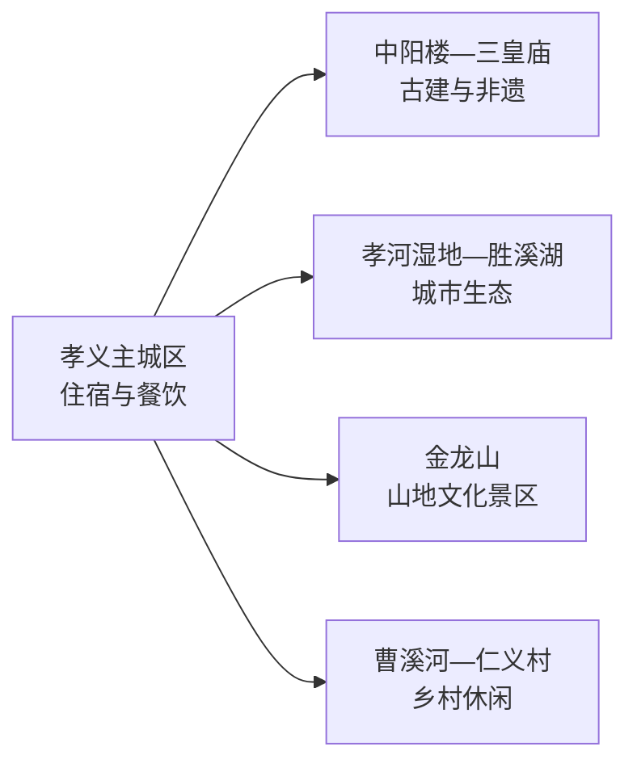
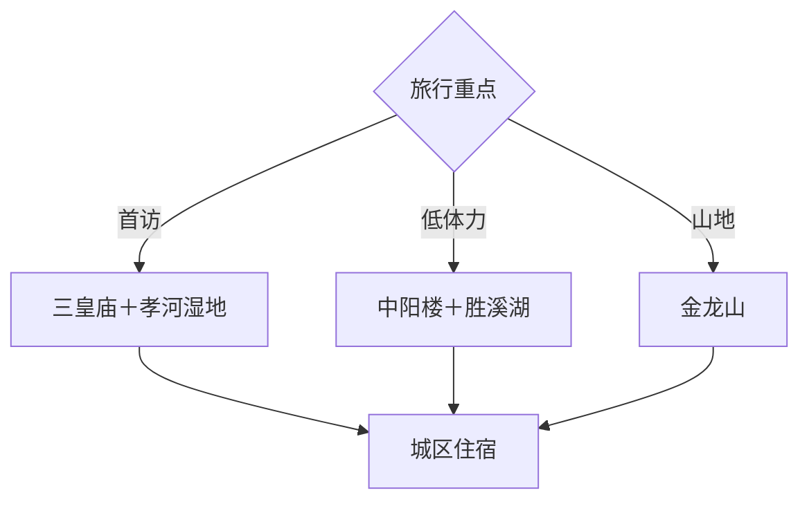

# 孝义旅行指南

孝义位于吕梁山东麓，适合把三皇庙、中阳楼等古建与孝河湿地、胜溪湖、金龙山和皮影木偶非遗串成 2 天。城区是住宿和餐饮基地，河湖公园适合低强度活动，金龙山及外围村镇需要单独接驳；短住优先“古建＋孝河湿地”。

本页绑定孝义同名聚居点 **GeoNames 1789174**。该点未进入项目固定 `cities500` 快照，因此只用于法定县级市覆盖，不改变固定 GeoNames 候选的处理进度。

## 城市速览

| 项目 | 信息 |
|---|---|
| 主线 | 三皇庙—中阳楼—孝河湿地—皮影木偶—金龙山 |
| 停留 | 1 天完成古建与河湖；2 天加入金龙山或乡村休闲 |
| 住宿 | 主城区方便餐饮、公交与夜间补给，河湖周边适合慢游 |
| 交通 | 铁路、公路抵离后，以公交、出租或预约车辆连接分散景点 |
| 季节 | 春秋适合户外；花期和节庆以当期公告为准；冬季可增加文博与非遗内容 |
| 预算 | 公园和城市公共空间成本较低，景区交通、体验活动与讲解形成增量 |

## 城市格局与游览区域

中阳楼与主城生活可安排半日，三皇庙兼具古建与非遗展示线索；孝河湿地、胜溪湖构成城市河湖休闲方向；金龙山与曹溪河一带需要公路接驳。吕梁市离石区、汾阳市和平遥县均是跨城目的地，联程时另算交通和住宿。

## 主要景点

| 景点 | 区域 | 类型 | 核心体验 | 用时 | 环境 | 体力 | 预约风险 | 天气影响 | 优先级 |
|---|---|---|---|---:|---|---|---|---|---|
| 三皇庙景区 | 贾家庄村方向 | 古建与非遗 | 元明清建筑、壁画及皮影木偶展示线索 | 2–3小时 | 混合 | 低中 | 中高 | 中 | A |
| 中阳楼 | 古城片区 | 古建筑 | 城市历史地标、楼阁形制与周边街巷 | 1–1.5小时 | 室外为主 | 低 | 中 | 中 | A |
| 孝河国家湿地公园 | 孝河沿线 | 湿地与公园 | 城市水系、湿地科普和公共休闲 | 2–3小时 | 室外 | 低 | 低 | 高 | A |
| 胜溪湖森林公园 | 城市近郊 | 湖泊与公园 | 湖滨慢行、城市绿地与晨昏休闲 | 2小时 | 室外 | 低 | 低 | 高 | B |
| 金龙山文化旅游景区 | 高阳镇方向 | 山地文化景区 | 山地步道、文化建筑与城市远眺 | 半天 | 室外为主 | 中高 | 节假日中高 | 高 | A |
| 曹溪河生态文化旅游区 | 大孝堡镇方向 | 生态与乡村休闲 | 月季园、亲子活动和当期开放项目 | 2–4小时 | 室外为主 | 低中 | 活动时中 | 高 | B |
| 九州香豆腐文化园 | 乡村线路 | 饮食与产业体验 | 豆腐制作、地方饮食与园区展陈 | 1.5–2.5小时 | 混合 | 低 | 高 | 低 | B |
| 仁义村文旅公开区域 | 杜村乡方向 | 村落与休闲 | 乡村空间、地方文化和当期体验项目 | 2小时 | 混合 | 低中 | 中 | 中 | C |
| 临黄塔 | 大孝堡镇方向 | 古塔 | 古塔形制与乡野历史环境 | 1小时 | 室外 | 低 | 高 | 中 | B |
| 孝义皮影木偶公开展演 | 三皇庙或官方活动场地 | 非遗 | 皮影、木偶与碗碗腔的现场呈现 | 1–2小时 | 室内为主 | 低 | 很高 | 低 | A |

## 美食与餐饮

孝义饮食可从火烧、合楞子、油糕、羊杂割、豆腐和吕梁面食展开。城区适合寻找小份主食；豆腐宴或地方合菜更适合多人共享，预订时确认份量。大豆、羊肉、麸质、辣椒和油盐需求可在点餐时说明，非遗或乡村线路的午餐建议先确认营业。

## 经典行程

### 古建生态一日线
**路线**：中阳楼—三皇庙—午餐—孝河湿地。**逻辑**：上午建立古建与非遗线索，下午转入低强度河湖空间。**预约锚点**：三皇庙开放。**休息**：主城区。**删除条件**：天气欠佳时缩短湿地段。

### 非遗专题线
**路线**：三皇庙—皮影木偶公开展演—豆腐文化体验。**逻辑**：从建筑空间进入表演和饮食技艺。**预约锚点**：演出与园区接待。**休息**：三皇庙周边或城区。**删除条件**：没有当日展演时保留古建和固定展陈。

### 河湖慢游线
**路线**：孝河湿地—午餐—胜溪湖。**逻辑**：用两个公共生态空间观察城市水系。**预约锚点**：无。**休息**：沿线正式服务点。**删除条件**：高温、强风或降雨时只保留一处短段。

### 金龙山半日线
**路线**：城区—金龙山—返城晚餐。**逻辑**：独立安排山地时间，减少跨方向折返。**预约锚点**：景区开放和交通。**休息**：正式服务区。**删除条件**：雷雨、结冰或大风时改城区文化线。

### 雨天文化线
**路线**：三皇庙室内开放单元—非遗展陈—地方餐饮。**逻辑**：压缩户外公园时间。**预约锚点**：场馆和展演。**休息**：城区。**删除条件**：极端天气预警时按属地安排暂停出行。

### 亲子低体力线
**路线**：三皇庙短线—午餐—孝河湿地平缓开放段。**逻辑**：文化与户外相间，随时可缩短。**预约锚点**：儿童活动和推车通行。**休息**：馆区与湿地服务点。**删除条件**：疲劳时只保留三皇庙。

### 两日完整线
**路线**：首日中阳楼—三皇庙—孝河湿地；次日金龙山或曹溪河—豆腐文化园。**逻辑**：城市核心与外围方向分日。**预约锚点**：第二日景区和体验。**休息**：连续住城区。**删除条件**：只有一天时保留首日核心线。

## 住宿区域

主城区适合铁路和公路抵离，也便于晚餐、叫车和雨天调整。孝河周边住宿偏向公园慢游，选择时比较与主城餐饮的距离；金龙山或乡村周边住宿适合已有自驾、明确营业和次日活动的旅行者。

## 市内交通

抵达前通过 12306 和当地交通渠道核对铁路站点及接驳。城区、孝河和胜溪湖可组合公交与短途用车；金龙山、曹溪河、仁义村等外围点适合同方向安排车辆。湿地保护区、河道行洪区、古建修缮区和生产厂区执行明确边界。

## 不同旅行者须知

古建爱好者优先三皇庙和中阳楼，并落实讲解；亲子家庭选择非遗、豆腐体验与湿地短线；低体力旅行者把金龙山替换为胜溪湖；摄影旅行者在公开河湖步道和古建外部安排时段。皮影木偶演出以当期节目为准，文物殿内摄影和湿地生态规则按现场执行。

## 行前核对

- 通过吕梁市、孝义市官方渠道核对三皇庙、中阳楼、金龙山与文旅园区开放。
- 核对皮影、木偶、碗碗腔的演出日期、场地、购票和儿童规则。
- 通过 12306 核对铁路站点，并确认金龙山、曹溪河等外围点返程。
- 河湖和山地日核对降雨、雷电、大风、森林火险与步道状态。

## 来源与更新记录

| 来源 | 支持内容 | 核验日期 |
|---|---|---|
| [吕梁市政府：孝义三皇庙](https://www.lvliang.gov.cn/zjll/mlll/lyjd/xy/200701/t20070130_234007.html) | 三皇庙历史与建筑属性 | 2026-09-04 |
| [吕梁市政府：孝义文旅新闻发布会](https://www.lvliang.gov.cn/szdt/xwfbh/202412/t20241218_1921364.html) | 胜溪湖、孝河湿地、金龙山、三皇庙与非遗 | 2026-09-04 |
| [吕梁市文旅局：孝义主题线路](https://www.lvliang.gov.cn/llxxgk/zfxxgk/xxgkml/gbmwj/swhlyj/fdzdgknr_55454/gggs_55463/202408/t20240802_1886608.html) | 金龙山、曹溪河、湿地、豆腐园和仁义村组合 | 2026-09-04 |
| [GeoNames 1789174](https://www.geonames.org/1789174/) | 孝义同名城市点与坐标 | 2026-09-04 |

