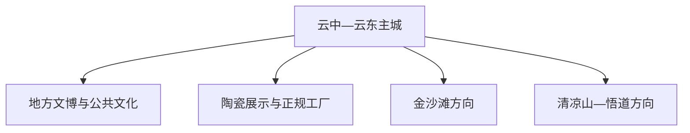
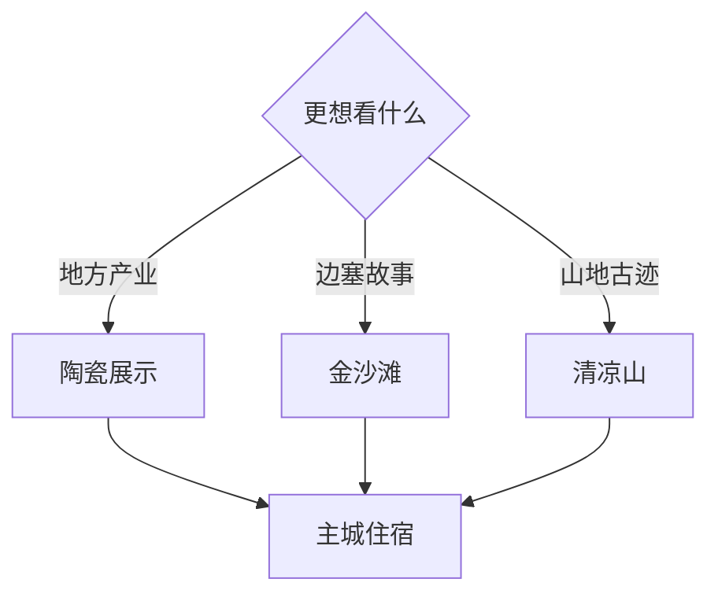

# 怀仁旅行指南

怀仁位于大同与朔州之间，北方日用瓷产业、金沙滩杨家将文化、清凉山古迹与晋北乡村构成鲜明主线。固定快照中的 **Yunzhong / GeoNames 1807671** 对应云中街道一带；主城适合作为住宿基地，金沙滩和清凉山按不同方向安排。

## 城市速览

| 项目 | 信息 |
|---|---|
| 主线 | 城市文博—陶瓷产业—金沙滩—清凉山 |
| 停留 | 主城 1 天；金沙滩或清凉山各另留半日至1天 |
| 住宿 | 云中—云东主城便于交通餐饮，景区住宿适合早晚体验 |
| 交通 | 高铁、公路便捷，远郊依赖公交、约车或自驾 |
| 季节 | 春秋舒适；冬季适合民俗与冰雪，但需关注低温和道路 |
| 预算 | 城区消费平实，远郊车辆与体验项目提高预算 |

## 城市格局与游览区域

主城区承担高铁、住宿、餐饮和陶瓷商贸；金沙滩位于市域东南方向，清凉山及悟道村另成山地线。陶瓷生产体验选择开放展厅、博物馆或有接待安排的企业，窑炉车间、原料堆场和物流作业区执行生产安全要求。

## 主要景点

| 景点 | 区域 | 类型 | 核心体验 | 用时 | 环境 | 体力 | 研究价值 | 拥挤 | 优先级 |
|---|---|---|---|---:|---|---|---|---|---|
| 怀仁地方文博与城市展陈 | 主城区 | 博物馆 | 地方沿革、边塞交通与城市发展 | 2–3小时 | 室内 | 低 | 很高 | 低 | A |
| 金沙滩生态旅游区公开区 | 金沙滩镇方向 | 历史主题景区 | 杨家将叙事、晋北边塞文化与园林 | 半天 | 混合 | 中 | 高 | 节假日中高 | A |
| 怀仁陶瓷展示体验 | 主城及开发区 | 产业与非遗 | 日用瓷工艺、设计、烧造与专业镇 | 半天 | 室内 | 低 | 很高 | 团体时中 | A |
| 清凉山依法开放区 | 何家堡方向 | 山地与古迹 | 山地景观、地方传说与古迹 | 半天至1天 | 室外 | 中高 | 高 | 季节性 | B |
| 悟道村乡村公共空间 | 清凉山方向 | 乡村与民俗 | 晋北村落、农耕与季节活动 | 2–3小时 | 混合 | 低中 | 中 | 节庆中 | B |
| 怀仁旺火等非遗活动 | 主城区 | 非遗与节庆 | 晋北年俗、社区表演与地方认同 | 依活动 | 混合 | 低 | 很高 | 节庆高 | C |
| 壬山或正规冰雪项目 | 市域山地 | 冰雪运动 | 冬季户外与山地视野 | 半天 | 室外 | 中高 | 中 | 周末中高 | C |

## 美食与餐饮

怀仁羊杂、糖干炉、晋北面食和家常炖菜适合在主城区寻找。陶瓷主题旅行可顺带观察餐具设计与地方饮食的结合；一人用餐优先面馆、小吃和按份点菜，羊杂及炖菜提前说明内脏、辣度和份量。

## 经典行程

### 主城一日线
**路线**：地方文博—午餐—陶瓷展厅或正规体验点—城市公共空间。**逻辑**：先理解地方，再进入核心产业。**预约锚点**：展馆和企业接待。**休息**：云中街道。**删除条件**：企业停接时保留公共展陈。

### 金沙滩历史线
**路线**：主城—金沙滩公开景区—镇区午餐—返程。**逻辑**：给杨家将与边塞文化半天以上。**预约锚点**：景区开放与交通。**休息**：游客中心。**删除条件**：大风、冰雪或维护时改主城线。

### 陶瓷产业线
**路线**：陶瓷展陈—工艺体验—正规销售展示。**逻辑**：按设计、制作、成品理解产业链。**预约锚点**：实名接待与体验名额。**休息**：城区商业区。**删除条件**：生产区调整时只看公开展厅。

### 清凉山山地线
**路线**：主城—悟道村—清凉山开放古迹与步道—返程。**逻辑**：把村落与山地文化串联。**预约锚点**：开放范围和车辆。**休息**：村镇服务点。**删除条件**：火险或地质灾害预警时整段顺延。

### 非遗节庆线
**路线**：主城公共文化场馆—官方节庆活动—地方小吃。**逻辑**：以正式日程体验旺火和民俗。**预约锚点**：活动日期与观演区。**休息**：主城。**删除条件**：非活动期改陶瓷主题。

### 亲子低体力线
**路线**：地方展陈—陶瓷体验—主城公园。**逻辑**：室内为主、换乘少。**预约锚点**：儿童体验规则。**休息**：商业区。**删除条件**：孩子疲劳时只保留展陈和公园。

### 两日组合线
**路线**：首日主城与陶瓷；次日金沙滩或清凉山二选一。**逻辑**：把产业与远郊拆日。**预约锚点**：第二日景区与交通。**休息**：连续住主城。**删除条件**：一天行程保留主城陶瓷线。

## 住宿区域

云中—云东片区适合高铁接驳、餐饮和主城游览；远郊正规住宿适合摄影、冰雪或早入景区。订房时核对供暖、消防、早餐、夜间交通和节庆期间退改。

## 市内交通

怀仁东站与公路客运承担不同方向，订票后确认实际到站。主城用公交、出租车和网约车；金沙滩、清凉山与产业接待点提前核对城乡班次、道路状态和返程。冬季自驾准备低温与冰雪路况方案。

## 不同旅行者须知

产业旅行者优先预约陶瓷接待；亲子家庭选择文博、工艺体验和主城公园；长者可把山地线换成金沙滩短线；摄影旅行者关注冬季光线和节庆人流。文物保护区、生产车间、窑炉、矿坑、水库岸线与森林封控区按正式开放边界进入。

## 行前核对

- 核对金沙滩、清凉山、地方展馆和冰雪项目开放状态。
- 核对陶瓷企业接待、体验年龄、拍摄和劳保要求。
- 核对高铁站点、城乡班次、冬季道路与节庆交通组织。
- 核对森林火险、强风、低温和地质灾害预警。

## 来源与更新记录

| 来源 | 支持内容 | 核验日期 |
|---|---|---|
| [山西省政府驻广州办：晋北古建与文旅线路](https://sxszfzgzb.shanxi.gov.cn/zshz/tzdt/202605/t20260506_10115854.shtml) | 怀仁所在晋北文旅区域与线路组织 | 2026-09-03 |
| [怀仁市发展改革局：信用怀仁](https://credit.zghr.gov.cn/) | 现行行政主体、部门与公共服务入口 | 2026-09-03 |
| [GeoNames 1807671](https://www.geonames.org/1807671/) | Yunzhong 固定人口点与怀仁主城位置 | 2026-09-03 |

