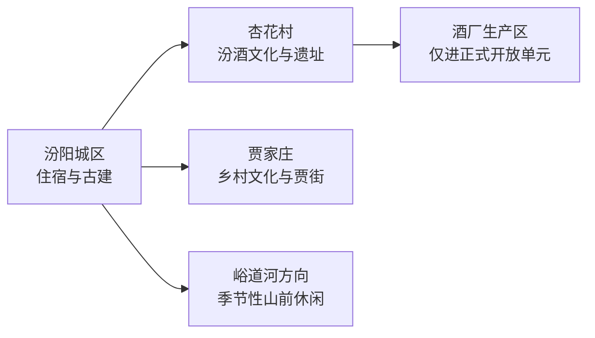
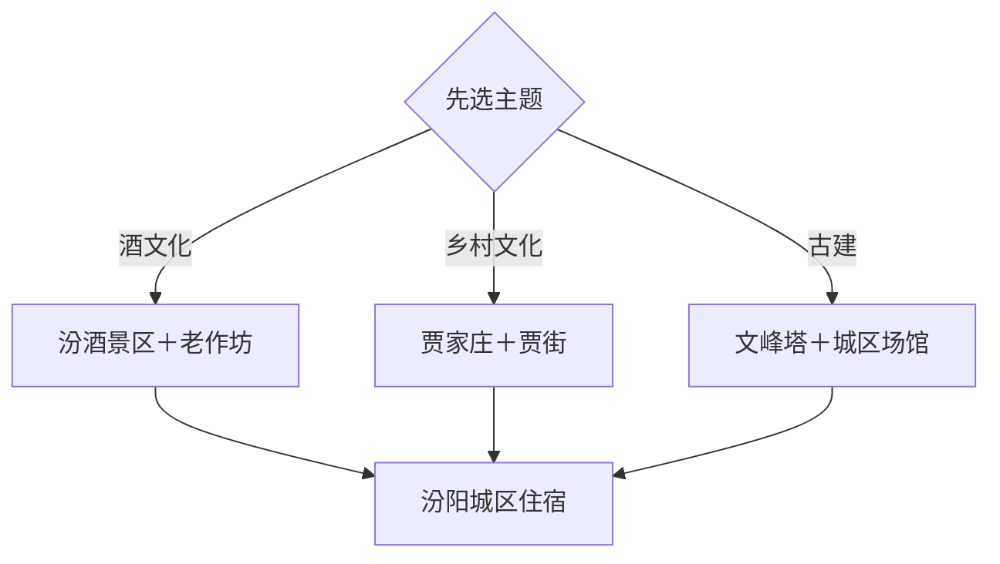

# 汾阳旅行指南

汾阳位于吕梁山东麓，最清晰的旅行结构是“汾酒杏花村＋贾家庄＋城区古建”。杏花村适合理解酿造、考古和酒文化，贾家庄展示乡村发展与当代文旅，文峰塔、太符观等古建则把城市时间线拉回更早时期。2 天可覆盖三条主线，1 天按酒文化或城区—贾家庄二选一。

本页绑定汾阳同名聚居点 **GeoNames 1811116**。该点未进入项目固定 `cities500` 快照，因此只用于法定县级市覆盖，不改变固定 GeoNames 候选进度。

## 城市速览

| 项目 | 信息 |
|---|---|
| 主线 | 杏花村汾酒文化—贾家庄—城区古建—吕梁山前生活 |
| 停留 | 1 天选一条主线；2 天加入城区古建；3 天适合深度酒文化和乡村休闲 |
| 住宿 | 汾阳城区适合综合交通；杏花村适合已预约酒文化体验的旅行者 |
| 交通 | 铁路、公路抵离后，以公交、出租或预约车辆连接城区、杏花村和贾家庄 |
| 季节 | 春秋适合街区和村落；夏季安排午间室内；冬季侧重博物馆、古建与酒文化 |
| 预算 | 城区消费平实，景区门票、讲解、体验和跨片区用车构成增量 |

## 城市格局与游览区域

城区适合文峰塔、公共文博和古建专题；杏花村位于城市北部，是酒文化景区、老作坊遗址与现代生产共同存在的片区；贾家庄在城区东北方向，可用半天至一天体验村庄、展陈和贾街。生产厂区和游客开放区边界明确，预约的酒文化参观不等于进入生产线自由活动。

## 主要景点

| 景点 | 区域 | 类型 | 核心体验 | 用时 | 环境 | 体力 | 预约风险 | 天气影响 | 优先级 |
|---|---|---|---|---:|---|---|---|---|---|
| 杏花村汾酒文化景区 | 杏花村镇 | 酒文化景区 | 汾酒博物馆、酿造历史与正式开放参观线 | 3–4小时 | 室内为主 | 低中 | 高 | 低 | A |
| 杏花村汾酒老作坊 | 杏花村镇 | 工业遗产与文物 | 传统酿造空间、老作坊遗存与酒文化史 | 1–2小时 | 混合 | 低 | 很高 | 中 | A |
| 杏花村遗址公开展示 | 杏花村镇 | 考古遗址 | 酒文化考古线索与遗址保护展示 | 1–2小时 | 混合 | 低中 | 很高 | 中 | A |
| 贾家庄文化生态旅游区 | 贾家庄村 | 乡村与文化景区 | 村庄发展、文化展陈和乡村公共空间 | 3–5小时 | 混合 | 低中 | 节假日中高 | 中 | A |
| 贾街 | 贾家庄片区 | 餐饮与休闲街区 | 山西小吃、夜间休闲和当期活动 | 1.5–3小时 | 混合 | 低 | 节假日中 | 中 | B |
| 文峰塔 | 城区 | 古塔 | 高耸砖塔、城市历史地标与外部观赏 | 1小时 | 室外为主 | 低 | 中 | 中 | A |
| 汾阳城市公共博物馆 | 主城区 | 博物馆 | 地方历史、古建、书画与城市文化线索 | 1.5–2.5小时 | 室内 | 低 | 高 | 低 | B |
| 太符观 | 杏花村镇上庙村方向 | 古建筑 | 金元以来道教建筑、壁画与彩塑线索 | 1–1.5小时 | 混合 | 低中 | 很高 | 中 | B |
| 汾阳关帝庙等依法开放古建 | 主城区 | 古建筑 | 城区庙宇格局、木构与地方信仰 | 1–1.5小时 | 混合 | 低 | 高 | 中 | B |
| 峪道河或上林舍公开文旅区 | 吕梁山前 | 山地与乡村休闲 | 山前生态、季节景观和当期开放项目 | 半天 | 室外 | 中 | 高 | 很高 | C |

## 美食与餐饮

汾阳可从汾州核桃、石头饼、擦尖、莜面、羊杂和杏花村酒文化餐饮切入。城区与贾街适合比较多种小吃；酒文化体验可把品鉴作为可选环节，并预先安排不饮酒的同行者和返程车辆。核桃、麸质、羊肉和酒精需求应在点餐时说明，驾车者采用无酒精方案。

## 经典行程

### 杏花村一日线
**路线**：汾酒文化景区—午餐—老作坊—遗址公开展示。**逻辑**：从博物馆进入生产史和考古证据。**预约锚点**：景区、老作坊和遗址开放。**休息**：杏花村正式服务区。**删除条件**：只获一处预约时保留汾酒文化景区。

### 贾家庄一日线
**路线**：贾家庄文化生态旅游区—村内午餐—贾街。**逻辑**：从乡村发展展陈走向当代休闲空间。**预约锚点**：当期场馆和活动。**休息**：贾街。**删除条件**：活动较少时压缩为半日。

### 城区古建线
**路线**：城市公共博物馆—文峰塔—关帝庙等已确认开放古建。**逻辑**：先看城市史，再辨识地标和建筑。**预约锚点**：场馆与古建开放。**休息**：主城餐饮区。**删除条件**：开放不稳定时保留博物馆和文峰塔外观。

### 太符观专题线
**路线**：城区—太符观—杏花村公共街区—返城。**逻辑**：把古建与杏花村历史环境组合。**预约锚点**：太符观开放和讲解。**休息**：杏花村。**删除条件**：文保修缮时改汾酒文化线。

### 雨天文化线
**路线**：汾酒博物馆—城市公共博物馆—城区餐饮。**逻辑**：以室内展陈连接酒文化与城市史。**预约锚点**：两馆开放。**休息**：馆区和城区。**删除条件**：极端天气预警时按属地安排暂停出行。

### 亲子低体力线
**路线**：汾酒博物馆非品鉴内容—午餐—贾家庄短线。**逻辑**：车辆近达、室内外相间。**预约锚点**：儿童参观规则和生产参观年龄条件。**休息**：景区服务区。**删除条件**：疲劳时只保留一处场馆。

### 两日完整线
**路线**：首日杏花村，次日城区古建—贾家庄—贾街。**逻辑**：酒文化与城市、乡村方向分日。**预约锚点**：首日参观和第二日场馆。**休息**：连续住城区。**删除条件**：只有一天时按兴趣保留杏花村或贾家庄。

## 住宿区域

汾阳城区适合首次到访，餐饮、跨片区叫车和次日调整较方便。杏花村住宿适合已有预约、希望减少早间通勤的酒文化旅行者；贾家庄周边适合夜间活动明确的短住，选择时核对返程、营业日期与隔音。

## 市内交通

铁路抵达时先核对票面站名及其到城区的实际距离。城区、杏花村和贾家庄之间以公路交通为主，同一天安排两个外围片区需预留接驳。酒厂生产区只进入运营方确认的游客通道；饮酒后选择公共交通、出租或代驾，驾驶行程采用无酒精方案。

## 不同旅行者须知

酒文化旅行者优先锁定讲解和参观时段；古建爱好者逐处确认文保开放；亲子家庭把工艺、考古和乡村空间作为重点；低体力旅行者以博物馆、文峰塔外观和贾街短线组合。未成年人、孕期人群和需避免酒精者可完整参加非品鉴内容，具体体验规则由运营方确认。

## 行前核对

- 通过汾阳市、吕梁市和山西文旅渠道核对汾酒景区、老作坊、遗址、贾家庄和古建开放。
- 核对酒厂参观的实名、年龄、着装、摄影与品鉴安排，并落实无酒精返程。
- 通过 12306 核对铁路站点和车次，确认城区—杏花村—贾家庄接驳。
- 山前线路核对降雨、雷电、森林火险、道路与季节性运营。

## 来源与更新记录

| 来源 | 支持内容 | 核验日期 |
|---|---|---|
| [汾阳市政府：杏花村酒文化景区方案](https://www.fenyang.gov.cn/fyszw/zwgk/fzh/202312/t20231227_1827766.shtml) | 景区建设、酒文化资源与片区关系 | 2026-09-04 |
| [吕梁市政府：汾酒文化景区](https://www.lvliang.gov.cn/zjll/mlll/202004/t20200422_1392419.html) | 汾酒博物馆、老作坊与酒文化体验 | 2026-09-04 |
| [吕梁市政府：贾家庄](https://www.lvliang.gov.cn/zjll/mlll/lyjd/fy/200701/t20070130_234006.html) | 贾家庄文化生态与旅游属性 | 2026-09-04 |
| [吕梁市政府：文峰塔](https://www.lvliang.gov.cn/zjll/mlll/202004/t20200422_1392390.html) | 文峰塔历史与城市地标属性 | 2026-09-04 |
| [GeoNames 1811116](https://www.geonames.org/1811116/) | 汾阳同名城市点与坐标 | 2026-09-04 |

