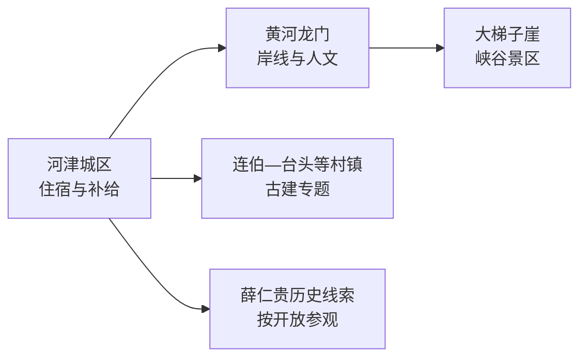
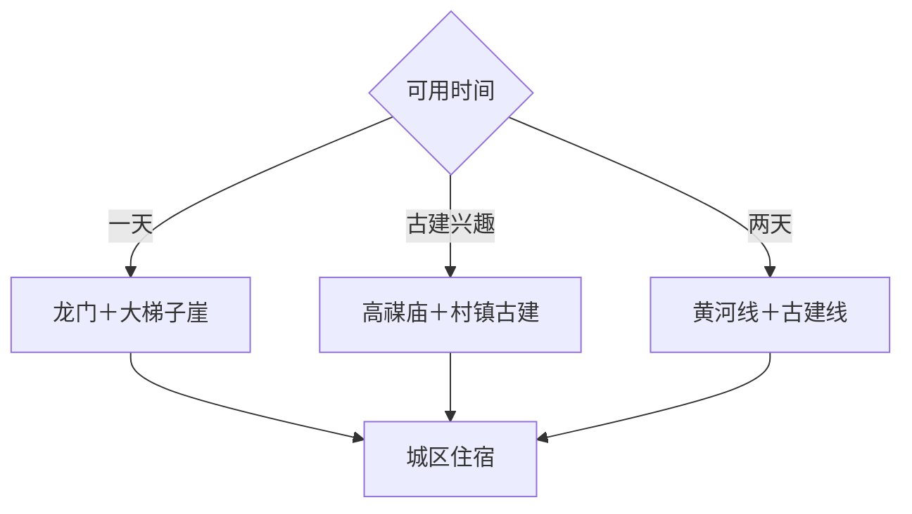

# 河津旅行指南

河津位于晋陕黄河峡谷东岸，旅行重点落在黄河龙门、大梯子崖、古建村落与薛仁贵历史线索。城区承担住宿和补给，黄河岸线与东部村镇分属不同方向；安排 2 天最从容，一天则以龙门—大梯子崖或古建专题二选一。

本页绑定河津同名聚居点 **GeoNames 1808593**。该点位于法定河津市内，但人口字段未进入项目固定 `cities500` 快照，因此页面只计入法定县级市覆盖，不改变固定 GeoNames 进度。

## 城市速览

| 项目 | 信息 |
|---|---|
| 主线 | 黄河龙门—峡谷地貌—河东古建—地方历史 |
| 停留 | 1 天选黄河线；2 天加入古建与城市文博 |
| 住宿 | 河津城区餐饮和交通较集中，黄河方向需提前落实返程 |
| 交通 | 铁路、公路抵达后，以公交、出租或预约车辆前往分散点位 |
| 季节 | 春秋适合岸线步行；夏季核对汛情和高温；冬季留意大风、结冰与日短 |
| 预算 | 日常消费平实，景区交通、讲解与远点用车是主要增量 |

## 城市格局与游览区域

黄河龙门和大梯子崖同属城市西部黄河方向，但各有开放、票务与交通组织；城区到村镇古建点还需另走公路。黄河对岸属于陕西省韩城市行政范围，跨桥联程时按跨省移动安排，不把两岸景点混作一处景区。

## 主要景点

| 景点 | 区域 | 类型 | 核心体验 | 用时 | 环境 | 体力 | 预约风险 | 天气影响 | 优先级 |
|---|---|---|---|---:|---|---|---|---|---|
| 黄河大梯子崖景区 | 下化乡方向 | 峡谷与人文景区 | 黄河峡谷、崖壁栈道与龙门地貌 | 半天 | 室外为主 | 中高 | 节假日高 | 很高 | A |
| 黄河龙门景区 | 龙门村方向 | 黄河文化景区 | 龙门峡谷、黄河桥梁、岸线历史与崖刻 | 2–3小时 | 室外为主 | 中 | 中高 | 很高 | A |
| 龙门公共滨河空间 | 龙门片区 | 河岸与村落 | 公开岸线、村落生活与黄河地理观察 | 1–2小时 | 室外 | 低中 | 低 | 很高 | B |
| 高禖庙 | 连伯村 | 古建筑 | 元明清建筑遗存与祭祀文化 | 1–1.5小时 | 混合 | 低中 | 高 | 中 | A |
| 台头庙 | 樊村镇方向 | 古建筑 | 河东村落寺庙和木构建筑 | 1–1.5小时 | 混合 | 低中 | 高 | 中 | B |
| 玄帝庙等依法开放古建 | 市域村镇 | 古建筑 | 分散古建、碑刻与乡土空间 | 1–2小时 | 混合 | 低中 | 很高 | 中 | B |
| 河津城市公共文化场馆 | 主城区 | 文博展陈 | 地方历史、黄河文化和城市发展线索 | 1.5–2小时 | 室内 | 低 | 高 | 低 | B |
| 薛仁贵故里正式展示点 | 修村方向 | 人物纪念地 | 唐代名将传说、地方记忆与当期展陈 | 1.5–2小时 | 混合 | 低 | 高 | 中 | B |
| 东庄五二六纪念园 | 柴家镇方向 | 红色纪念地 | 地方近现代史与纪念空间 | 1–2小时 | 混合 | 低 | 高 | 中 | C |
| 黄河一号旅游公路公开节点 | 黄河沿线 | 公路景观 | 串联黄河地貌和村落的交通线索 | 半天以上 | 室外 | 低中 | 中 | 很高 | 路线节点 |

## 美食与餐饮

河津可从羊肉泡馍、饸饹、油糕、晋南面食和黄河沿岸家常菜切入。城区适合一人点面或小份早餐，团体可共享羊肉和地方宴席。点餐时确认羊肉汤底、辣度、油盐和面食麸质；黄河鱼类选择以正规餐饮来源为准，也可用本地面食替代。

## 经典行程

### 黄河经典一日线
**路线**：城区—黄河龙门景区—午餐—大梯子崖—城区。**逻辑**：沿同一黄河方向理解人文与峡谷地貌。**预约锚点**：大梯子崖开放和景区交通。**休息**：龙门正式服务区。**删除条件**：水情、大风或高温时保留龙门短线并提早返城。

### 河东古建一日线
**路线**：高禖庙—午餐—台头庙—当日明确开放的一处古建。**逻辑**：按村镇道路串联不同木构和祭祀空间。**预约锚点**：逐处确认开放。**休息**：城区或沿线镇区。**删除条件**：开放不稳定时只保留已确认点位。

### 城市历史半日线
**路线**：城市公共文化场馆—主城生活街区—地方晚餐。**逻辑**：用低交通成本建立河津历史框架。**预约锚点**：公共场馆开放。**休息**：城区商业区。**删除条件**：到达较晚时只保留场馆或晚餐。

### 薛仁贵专题线
**路线**：城市历史展陈—薛仁贵故里正式展示点—修村周边公共空间。**逻辑**：区分历史材料、地方传说与现代纪念。**预约锚点**：展示点开放。**休息**：城区。**删除条件**：场馆关闭时改城市文博线。

### 雨天文博线
**路线**：城市公共文化场馆—古建中已确认开放的室内单元—城区餐饮。**逻辑**：缩短黄河岸线暴露。**预约锚点**：两处开放。**休息**：主城区。**删除条件**：暴雨或地质灾害预警时按属地安排暂停出行。

### 亲子低体力线
**路线**：黄河龙门车辆近达区—午餐—城市文化场馆。**逻辑**：保留黄河认知，控制栈道和台阶。**预约锚点**：场馆儿童规则。**休息**：龙门服务区与城区。**删除条件**：大风、高温或疲劳时转为室内半日。

### 两日完整线
**路线**：首日龙门—大梯子崖，次日高禖庙—城市文博。**逻辑**：把黄河户外与古建室内外分日。**预约锚点**：景区与古建开放。**休息**：连续住城区。**删除条件**：压缩为一天时按兴趣保留一条主线。

## 住宿区域

河津城区适合多数行程，餐饮、铁路和公路接驳更稳定。龙门方向住宿适合明确安排黄河晨昏、并已确认营业与返程的旅行者；跨省前往韩城属于另一段行程，住宿选择需与过桥交通和次日目的地一起判断。

## 市内交通

铁路票面站名决定实际到达点，出发前通过 12306 核对。城区短途可用公交、出租或网约车；龙门、大梯子崖和村镇古建适合同方向包车或自驾。黄河沿线按景区入口、停车和开放岸线活动，河道、桥梁作业区、水利设施及临崖封控段执行明确限制。

## 不同旅行者须知

地理爱好者优先龙门与大梯子崖；古建爱好者先落实逐点开放和讲解；亲子家庭选择车辆近达的黄河观察点与室内展陈；低体力旅行者把栈道线替换为龙门短线。黄河水情、大风和高温直接影响岸线体验，文保修缮区、行洪区、桥梁作业区和未开放崖壁保持明确边界。

## 行前核对

- 通过运城市和河津市官方渠道核对大梯子崖、黄河龙门、文博场馆和古建开放。
- 通过 12306 核对铁路站名、车次，并落实黄河方向末班返程。
- 出发前三日和当天核对黄河水情、降雨、大风、高温及道路管制。
- 逐处确认高禖庙、台头庙、纪念地的预约、讲解和可进入范围。

## 来源与更新记录

| 来源 | 支持内容 | 核验日期 |
|---|---|---|
| [运城市政府：黄河大梯子崖](https://www.yuncheng.gov.cn/doc/2024/10/25/484838.shtml) | 景区等级、黄河峡谷与主要体验 | 2026-09-04 |
| [运城市政府：黄河龙门景区](https://www.yuncheng.gov.cn/doc/2020/07/21/71105.shtml) | 龙门村、湿地、桥梁和崖刻线索 | 2026-09-04 |
| [运城市政府：高禖庙](https://www.yuncheng.gov.cn/doc/2020/07/21/71106.shtml) | 连伯村古建及其文化属性 | 2026-09-04 |
| [GeoNames 1808593](https://www.geonames.org/1808593/) | 河津同名城市点与坐标 | 2026-09-04 |

